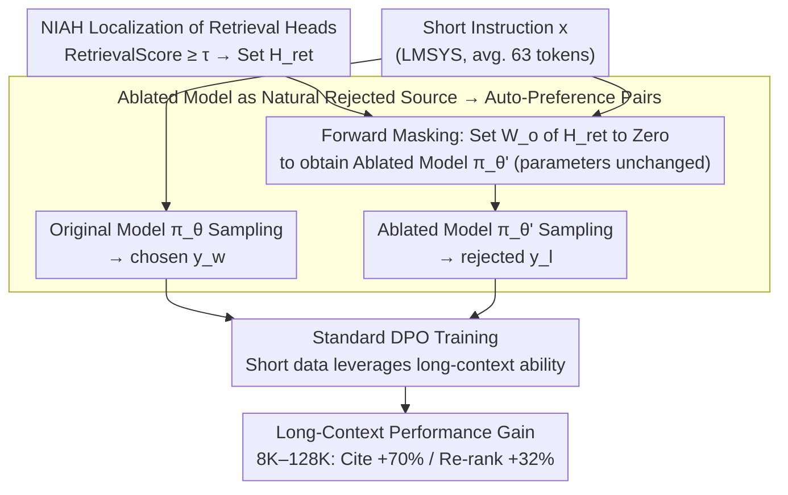

# From Interpretability to Performance: Optimizing Retrieval Heads for Long-Context Language Models

**Conference**: ACL 2026 Findings  
**arXiv**: [2601.11020](https://arxiv.org/abs/2601.11020)  
**Code**: https://github.com/YoumiMa/RetMask  
**Area**: Long Context / Mechanistic Interpretability / Retrieval Head / DPO  
**Keywords**: Retrieval Head, DPO, Long-Context, Mechanistic Interpretability, Head Masking

## TL;DR
RetMask utilizes retrieval heads identified via "mechanistic interpretability" as a source of contrastive signals. By using the output of an ablated model (with retrieval heads masked) as the rejected sample and the original model's output as the chosen sample for DPO training, it achieves consistent improvements across 128K context lengths for Llama-3.1, Qwen3, and Olmo-3 families without requiring LLM judges or human annotation. Notably, it improves generation-with-citation by +70% and re-ranking by +32%.

## Background & Motivation

**Background**: Mechanistic interpretability (MI) has recently identified a series of "functional" attention heads and neurons, such as knowledge neurons (Dai 2022, Meng 2022), language-specific neurons (Tang 2024), and retrieval heads (Wu 2025b). Among them, retrieval heads are responsible for "copying target spans from long contexts to the output" in Needle-In-A-Haystack (NIAH) tasks; disabling them leads to significant performance degradation in long-context tasks.

**Limitations of Prior Work**: MI discoveries have largely remained at the "diagnostic" level—while we know which heads are active, **how to use these findings to improve models** remains an open question. Existing attempts have mostly failed: Gu 2024 introduced significant side effects (damaging general ability) when editing knowledge neurons, and Mondal 2025 found no downstream task gains from intervening in language neurons. This indicates that "identifying a mechanism $\neq$ being able to optimize it."

**Key Challenge**: The existence of retrieval heads has been repeatedly verified (performance drops when they are disabled), but how can this **negative evidence** (importance) be transformed into **positive evidence** (training signal for enhancement)? Traditional fine-tuning of retrieval head parameters often disrupts the model's overall capabilities.

**Goal**: (1) Develop a training method that strengthens retrieval head functions without modifying their parameters; (2) Automatically synthesize supervision signals without relying on LLM judges or human criteria; (3) Demonstrate that mechanistic interpretability can yield actionable performance gains across multiple model families rather than just descriptive findings.

**Key Insight**: The authors observe that DPO requires (chosen, rejected) pairs, and the output of an ablated model (with masked retrieval heads) is **naturally a rejected sample**, as it inevitably degrades in retrieval-heavy tasks. This transforms MI diagnostic signals directly into training signals.

**Core Idea**: Use the output of $\pi_\theta$ as the chosen $y_w$ and the output of $\pi_{\theta'}$ (with masked retrieval heads) as the rejected $y_l$ for standard DPO training on the same instruction $x$. This requires no judges, no humans, and no ground-truth responses from the original dataset.

## Method

### Overall Architecture

The core of RetMask is the seamless integration of "mechanism diagnosis" into "training signals": first, retrieval heads responsible for long-context copying are localized using NIAH tasks, and an ablated model $\pi_{\theta'}$ is created by masking them during the forward pass. For each instruction $x$ from any instruction-tuning data, responses are sampled from both the original model $\pi_\theta$ and the ablated model $\pi_{\theta'}$. The former serves as the chosen $y_w$ and the latter as the rejected $y_l$. Standard DPO is then performed on these automatically synthesized preference pairs to elevate the behavior of "utilizing retrieval heads" as a model preference. This pipeline requires no LLM judge, human annotation, or ground-truth responses.

### Key Designs

**1. Using the Ablated Model as a Natural Rejected Source: Using diagnostic signals as negative samples**

The definition of retrieval heads ensures that $\pi_{\theta'}$ will naturally perform worse than $\pi_\theta$ in retrieval-heavy behaviors—this provides an in-distribution, mechanistically interpretable, and fully automated preference signal. By feeding the same instruction $x$ to both models and pairing the outputs as $(y_w, y_l)$, DPO naturally pushes the model towards "appearing more like the version that utilizes retrieval heads." This bypasses the pain points of existing long-context DPO methods (such as LongReward), which require expensive LLM judges with inherent biases. RetMask replaces evaluation intervention with architectural intervention, providing unbiased signals at zero human cost.

**2. Forward Pass Masking Without Parameter Modification: Restricting intervention to the sampling phase**

When constructing $\pi_{\theta'}$, no parameters are modified; instead, the portion of the attention output projection matrix $\bm{W}_o^h$ corresponding to heads in $\mathcal{H}_{ret}$ is set to zero during the forward pass. This "forward masking" allows $\pi_\theta$ and $\pi_{\theta'}$ to be hosted on the same GPU/process for contrastive sampling without weight surgery. Mask-only intervention is chosen because direct fine-tuning of retrieval heads can damage other functionalities by altering the parameter space. By confining mechanistic intervention to the sampling phase, DPO gradients perform indirect optimization—aiming to make the final output closer to the version with retrieval heads—thereby strengthening retrieval functionality without harming general abilities.

**3. Short-Context Training + Long-Context Evaluation: Leveraging long-range ability with short samples**

The training data averages only 63.62 input tokens and 494.69 output tokens, yet gains are observed at lengths from 8K to 128K. The underlying hypothesis is that retrieval heads are stable structures formed during pre-training; DPO does not need to "re-teach" them what to do but rather elevates the "style of using retrieval heads" as a preference, which generalizes across lengths. Unlike existing long-context post-training methods that require constructing expensive long samples, RetMask boosts long-range capabilities using short samples, consistent with Gao 2025's finding that short-context instruction data is sufficient.

### Loss & Training

- Standard DPO loss: $\mathcal{L}(\pi_\theta) = -\mathbb{E}[\log\sigma(\beta\log\frac{\pi_\theta(y_w|x)}{\pi_{ref}(y_w|x)} - \beta\log\frac{\pi_\theta(y_l|x)}{\pi_{ref}(y_l|x)})]$, with default $\beta$ and the original model as the reference policy.
- Retrieval score detection follows Wu 2025b: $\text{RetrievalScore}(h) = \frac{1}{|\mathcal{T}|}\sum_{(g_h,k)\in\mathcal{T}} \frac{|g_h \cap k|}{|k|}$ (where $g_h$ is the set of tokens retrieved by the head and $k$ is the needle sequence). Heads with score $\ge \tau$ enter $\mathcal{H}_{ret}$.
- Training Data: LMSYS-Chat-1M (294K samples for main experiment), WildChat (ablation), Guru (RL dataset ablation); no overlap with the HELMET evaluation benchmark.
- Retrieval head thresholds: $\tau=0.1$ for Llama-3.1, $\tau=0.05$ for Qwen3 / Olmo-3.
- For Qwen3, reasoning was disabled during retrieval score calculation but enabled during contrastive generation and evaluation.

## Key Experimental Results

### Main Results

Average scores on the HELMET comprehensive long-context benchmark under 8K-128K inputs (Llama-3.1-8B-Instruct):

| Training Strategy | 8K | 16K | 32K | 64K | 128K |
|---------|-----|------|------|------|------|
| Base (no DPO) | 56.03 | 54.14 | 52.42 | 51.65 | 46.40 |
| Smaller-Model (3B) | 56.77 | 55.32 | 53.48 | 52.18 | 47.53 |
| Win-Lose-Pair (judge by Gemma-3-27B) | 56.50 | 54.42 | 52.47 | 51.62 | **46.05 (Drop)** |
| Non-Retrieval-Mask | 56.45 | 55.55 | 53.19 | 52.14 | 47.19 |
| Random-Mask | 56.67 | 55.95 | 53.14 | 52.30 | 47.04 |
| **RetMask (Ours)** | **58.14** | **56.92** | **53.48** | **53.15** | **48.68** |

Per-task performance of Llama-3.1 at 128K:

| Task | Base | RetMask | Relative Gain |
|------|------|---------|---------|
| Recall (NIAH) | 95.13 | 95.44 | +0.3% |
| RAG | 58.58 | 59.71 | +1.9% |
| **Cite (Generation with Citation)** | 3.09 | 5.25 | **+70%** |
| **Re-rank (Paragraph Re-ranking)** | 13.73 | 18.16 | **+32%** |
| ICL | 83.80 | 84.92 | +1.3% |
| LongQA | 42.69 | 43.84 | +2.7% |
| Summ | 27.81 | 33.45 | +20% |

Cross-family validation: Qwen3-8B 128K improved +0.89pp; Olmo-3-Instruct 64K improved +0.59pp; Olmo-3-Think 64K improved +0.47pp (lower gain for reasoning variants).

### Ablation Study

| Configuration | 128K avg | Description |
|------|---------|------|
| RetMask Full (294K samples) | **48.68** | Complete method |
| RetMask∗ (10K subsampled) | 46.89 | Still outperforms LongReward |
| LongReward (Prev. SOTA, 10K samples + LLM judge) | 46.71 | Outperformed at same size |
| Random-Mask (Mask equal number of random heads) | 47.04 | Proves gain is not from mask operation itself |
| Non-Retrieval-Mask (Mask non-retrieval heads) | 47.19 | Proves target must be retrieval heads |
| Win-Lose-Pair (Gemma judge scoring) | 46.05 | **Regression**, proving quality signal $\neq$ retrieval signal |
| Smaller-Model (3B as reject source) | 47.53 | Lower than RetMask by 1.15pp |

General Ability Retention: RetMask performs on par with the base model in mathematics, coding, and general knowledge (see §5.1), with no catastrophic forgetting.

### Key Findings

- **Largest gains in retrieval-heavy tasks (+70% Cite, +32% Re-rank)**: Confirms the functional localization of retrieval heads—tasks requiring "span grabbing" from context benefit most directly.
- **Same masking, different targets $\rightarrow$ completely different effects**: Random-Mask and Non-Retrieval-Mask showed insignificant gains (sometimes worse than baseline), proving the effect stems from retrieval head selection.
- **RetMask > LongReward (Prev. SOTA) even at the same data size**: RetMask leads at 10K vs 10K, indicating mechanistic signals are stronger than LLM judge signals, while being cheaper.
- **Sparsity determines gain magnitude**: Models with sparser retrieval score distributions (where retrieval is concentrated in a few heads) show larger RetMask gains. Qwen3 has a denser distribution, leading to more modest gains.
- **Win-Lose-Pair (quality judge) regression**: Indicates "higher quality" preference signals are meaningless or even negative for long-context tasks compared to structural mechanistic signals.
- **Short data $\rightarrow$ Long gains**: Training samples < 600 tokens yield gains at 8K-128K, proving retrieval heads are stable pre-trained structures requiring only "preference activation."

## Highlights & Insights

- **Paradigm shift from "Diagnosis" to "Treatment"**: This is the first work in the MI community to use diagnostic signals directly as training signals with verified success across multiple model families and benchmarks.
- **"Using ablated self as negative" is a simple yet powerful design**: Unlike traditional contrastive learning using human labels or separate models, this proves the "functionally castrated version" of the same model is the cleanest negative source—sharing the same distribution and style, with the only difference being retrieval capability.
- **Sparsity as a transferability indicator**: Attributing RetMask's effectiveness to retrieval score sparsity provides a clear prior for future mechanistic interventions.
- **Practicality of short-training for long-gains**: Improving 128K context by 2.28pp using short LMSYS samples means RetMask can be integrated into any continual pre-training pipeline as a low-cost module.

## Limitations & Future Work

- **Authors' Acknowledgement**: (1) Smaller gains in Olmo-3-Think, possibly due to inaccurate head detection in reasoning models; (2) Modest gains in Qwen3 due to dense distributions; (3) Threshold $\tau$ requires pilot tuning and is not universal.
- **Hidden Issues**: (1) Lack of analysis on whether retrieval head internal structures change post-DPO; (2) Cite/Re-rank gains are relative; absolute values at 128K remain low; (3) Only tested on short dialogue datasets, ceiling on long-context training sets remains unknown.
- **Future Directions**: (1) Linking RetMask with continual pre-training; (2) Testing "ablated self as negative" for knowledge or safety heads; (3) Redesigning detection for reasoning models.

## Related Work & Insights

- **vs LongReward (Zhang 2025a)**: LongReward uses LLM judges; RetMask uses architectural ablation, which is simpler and empirically stronger at the same scale.
- **vs Knowledge Editing (Meng 2022, Gu 2024)**: Editing modifies parameters directly and has side effects; RetMask optimizes indirectly via DPO, preserving general ability.
- **vs Retrieval Head Original Work (Wu 2025b)**: Wu only provided diagnosis; RetMask converts this into an actionable training signal.

## Rating
- **Novelty**: ⭐⭐⭐⭐⭐ Crossing the gap between MI and training via "ablated self" DPO is a first.
- **Experimental Thoroughness**: ⭐⭐⭐⭐ Verified across 3 families, multiple lengths, and tasks.
- **Writing Quality**: ⭐⭐⭐⭐ Clear diagrams and per-task analysis.
- **Value**: ⭐⭐⭐⭐⭐ A low-cost, high-gain post-training module for long-context pipelines.

<!-- RELATED:START -->

## Related Papers

- [\[ACL 2026\] Retrieval Heads are Dynamic](retrieval_heads_are_dynamic.md)
- [\[NeurIPS 2025\] A Controllable Examination for Long-Context Language Models](../../NeurIPS2025/interpretability/a_controllable_examination_for_longcontext_language_models.md)
- [\[ACL 2026\] Preference Heads in Large Language Models: A Mechanistic Framework for Interpretable Personalization](preference_heads_in_large_language_models_a_mechanistic_framework_for_interpreta.md)
- [\[ACL 2026\] Towards Intrinsic Interpretability of Large Language Models: A Survey of Design Principles and Architectures](towards_intrinsic_interpretability_of_large_language_modelsa_survey_of_design_pr.md)
- [\[ACL 2026\] Interpretability from the Ground Up](interpretability_from_the_ground_up_stakeholder-centric_design_of_automated_scor.md)

<!-- RELATED:END -->
