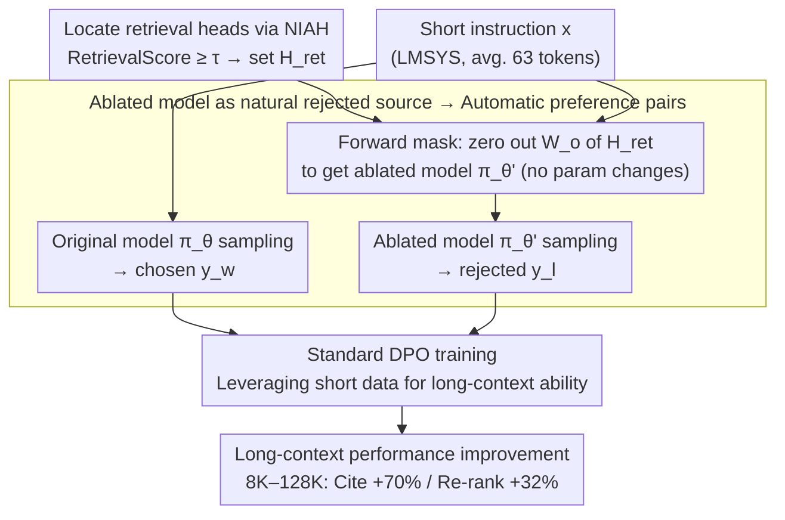

# From Interpretability to Performance: Optimizing Retrieval Heads for Long-Context Language Models

**Conference**: ACL 2026 Findings  
**arXiv**: [2601.11020](https://arxiv.org/abs/2601.11020)  
**Code**: https://github.com/YoumiMa/RetMask  
**Area**: Long-Context / Mechanistic Interpretability / Retrieval Head / DPO  
**Keywords**: Retrieval Head, DPO, Long-Context, Mechanistic Interpretability, Head Masking

## TL;DR
RetMask utilizes retrieval heads identified through mechanistic interpretability as contrastive signal sources. By using the output of an ablated model (with retrieval heads masked) as the rejected sample and the original model's output as the chosen sample, it performs DPO training without requiring LLM judges or human labels. It consistently improves performance across Llama-3.1, Qwen3, and Olmo-3 model families at 128K context length, specifically achieving +70% in generation-with-citation and +32% in re-ranking tasks.

## Background & Motivation

**Background**: In recent years, mechanistic interpretability (MI) has identified a series of "functionalized" attention heads and neurons, such as knowledge neurons (Dai 2022, Meng 2022), language-specific neurons (Tang 2024), and retrieval heads (Wu 2025b). Among these, retrieval heads are responsible for copying target spans from the long context to the output in Needle-In-A-Haystack (NIAH) tasks; disabling them leads to significant performance drops in long-context tasks.

**Limitations of Prior Work**: Findings in MI have largely remained at the "diagnostic" level—researchers know which heads are active, but **how to use these findings to improve models** remains an open question. Existing attempts have mostly failed: Gu 2024 edited knowledge neurons but introduced significant side effects (damaging general ability), and Mondal 2025's interventions on language neurons yielded no gains for downstream tasks. This suggests that "identifying a mechanism $\neq$ being able to optimize the mechanism."

**Key Challenge**: While the existence of retrieval heads has been repeatedly verified (disabling them causes performance drops), how can this **negative evidence** (their importance) be converted into **positive evidence** (optimizing them to make the model stronger)? Traditional approaches involve direct fine-tuning of retrieval head parameters, which often compromises the model's overall capabilities.

**Goal**: (1) Develop a training method that reinforces retrieval head functions without modifying their parameters; (2) automatically synthesize supervision signals without relying on LLM judges or human criteria; (3) demonstrate that mechanistic interpretability can produce actionable performance gains across multiple model families rather than just descriptive findings.

**Key Insight**: The authors observed that DPO requires (chosen, rejected) pairs, and the output of an ablated model (with retrieval heads masked) **naturally serves as a rejected sample**, as it inevitably degrades on retrieval-heavy tasks. This transforms the diagnostic signal of MI directly into a training signal.

**Core Idea**: Use the output of $\pi_\theta$ as the chosen $y_w$ and the output of $\pi_{\theta'}$ (masking retrieval heads) as the rejected $y_l$. Standard DPO is then run on the same instruction $x$, requiring no external judges, humans, or ground-truth responses from the original dataset.

## Method

### Overall Architecture

The core of RetMask is the seamless connection of "mechanism diagnosis" into "training signals." First, retrieval heads responsible for long-context copying are located via NIAH tasks, and an ablated version of the model $\pi_{\theta'}$ is created by masking these heads during the forward pass. Then, for any instruction $x$ from instruction-tuning data, responses are sampled from both the original model $\pi_\theta$ and the ablated model $\pi_{\theta'}$. The former is naturally stronger and acts as the chosen $y_w$, while the latter is naturally degraded and acts as the rejected $y_l$. Finally, standard DPO is performed using these automatically synthesized preference pairs to elevate the behavior of utilizing retrieval heads into a model preference. The entire pipeline requires no LLM judge, human labeling, or original ground-truth responses.

### Key Designs

**1. Using the ablated model as a natural rejected source: Turning diagnostic signals directly into negative samples**

The definition of retrieval heads ensures that $\pi_{\theta'}$ (after masking them) will necessarily perform worse than $\pi_\theta$ in retrieval-heavy behaviors. This provides an in-distribution, mechanistically interpretable, and fully automatic preference signal. By feeding the same instruction $x$ to both models, the output of $\pi_{\theta'}$ becomes $y_l$ and the output of $\pi_\theta$ becomes $y_w$. DPO then naturally shifts the model toward the version that "uses national retrieval heads." This avoids the pain points of existing long-context DPO methods (e.g., LongReward), which require expensive LLM judges with inherent biases. RetMask replaces evaluation intervention with architectural intervention, resulting in unbiased signals at zero human cost. This moves the MI community from "diagnosis" to self-supervised training.

**2. Forward masking without parameter modification: Restricting intervention to the sampling phase**

To construct $\pi_{\theta'}$, parameters are not modified; instead, the portion of the attention output projection matrix $\bm{W}_o^h$ corresponding to heads in $\mathcal{H}_{ret}$ is zeroed out during the forward pass. This "forward mask" avoids weight surgery or reloading models, allowing both $\pi_\theta$ and $\pi_{\theta'}$ to be hosted on the same GPU for contrastive sampling. The decision to use mask-only intervention is based on the fact that direct fine-tuning of retrieval heads can alter the parameter space and damage other functions (a side effect seen in Gu 2024's knowledge editing). By locking the mechanistic intervention to the sampling stage, DPO gradients perform indirect optimization—aiming not to "increase retrieval head values" but to "make final outputs closer to the version with retrieval heads intact," thus strengthening retrieval without harming general capabilities.

**3. Short-context training + Long-context evaluation: Leveraging short samples for long-range ability**

The training data averages only 63.62 input tokens and 494.69 output tokens, yet the gains are reflected in lengths from 8K to 128K. The underlying assumption is that retrieval heads are stable structures formed during pre-training. DPO does not need to re-teach the model "what to do" on long sequences; it only needs to elevate the "style of using retrieval heads" as a preference, which generalizes across lengths. Compared to existing long-context post-training methods like LongReward, which require constructing expensive long samples, RetMask leverages short samples to boost long-range ability. This aligns with Gao 2025's conclusion that "short-context instruction data is sufficient," offering significant engineering relief.

### Loss & Training

- Standard DPO loss: $\mathcal{L}(\pi_\theta) = -\mathbb{E}[\log\sigma(\beta\log\frac{\pi_\theta(y_w|x)}{\pi_{ref}(y_w|x)} - \beta\log\frac{\pi_\theta(y_l|x)}{\pi_{ref}(y_l|x)})]$, with $\beta$ at default values and the reference policy set as the original model.
- Retrieval score detection follows Wu 2025b: For each head $h$, the score is calculated as $\text{RetrievalScore}(h) = \frac{1}{|\mathcal{T}|}\sum_{(g_h,k)\in\mathcal{T}} \frac{|g_h \cap k|}{|k|}$ (where $g_h$ is the set of tokens retrieved by the head and $k$ is the needle sequence). Heads with score $\ge \tau$ enter $\mathcal{H}_{ret}$.
- Training data: LMSYS-Chat-1M (294K samples for main experiment), WildChat (ablation), Guru (RL dataset ablation); zero overlap with the HELMET evaluation benchmark.
- Retrieval head thresholds: $\tau=0.1$ for Llama-3.1, $\tau=0.05$ for Qwen3 / Olmo-3 (determined via pilot studies).
- For Qwen3, reasoning is disabled during retrieval score calculation and enabled during contrastive generation and evaluation.

## Key Experimental Results

### Main Results

Average scores on the HELMET comprehensive long-context benchmark under 8K-128K inputs (Llama-3.1-8B-Instruct):

| Training Strategy | 8K | 16K | 32K | 64K | 128K |
|---------|-----|------|------|------|------|
| Base (no DPO) | 56.03 | 54.14 | 52.42 | 51.65 | 46.40 |
| Smaller-Model (3B) | 56.77 | 55.32 | 53.48 | 52.18 | 47.53 |
| Win-Lose-Pair (judge by Gemma-3-27B) | 56.50 | 54.42 | 52.47 | 51.62 | **46.05 (Drop)** |
| Non-Retrieval-Mask | 56.45 | 55.55 | 53.19 | 52.14 | 47.19 |
| Random-Mask | 56.67 | 55.95 | 53.14 | 52.30 | 47.04 |
| **RetMask (Ours)** | **58.14** | **56.92** | **53.48** | **53.15** | **48.68** |

Per-task performance of Llama-3.1 at 128K:

| Task | Base | RetMask | Gain (Relative) |
|------|------|---------|---------|
| Recall (NIAH) | 95.13 | 95.44 | +0.3% |
| RAG | 58.58 | 59.71 | +1.9% |
| **Cite (Gen w/ Citation)** | 3.09 | 5.25 | **+70%** |
| **Re-rank (Paragraph Re-ranking)** | 13.73 | 18.16 | **+32%** |
| ICL | 83.80 | 84.92 | +1.3% |
| LongQA | 42.69 | 43.84 | +2.7% |
| Summ | 27.81 | 33.45 | +20% |

Cross-family validation: Qwen3-8B 128K increased by +0.89pp; Olmo-3-Instruct 64K increased by +0.59pp; Olmo-3-Think 64K increased by +0.47pp (smaller gain for reasoning variant).

### Ablation Study

| Configuration | 128K avg | Description |
|------|---------|------|
| RetMask Full (294K samples) | **48.68** | Full methodology |
| RetMask∗ (10K subsampled to match LongReward) | 46.89 | Still outperforms LongReward |
| LongReward (Prev. SOTA, 10K samples + LLM judge) | 46.71 | Outperformed under same size |
| Random-Mask (Randomly mask same # of heads) | 47.04 | Confirms effect isn't from the mask operation itself |
| Non-Retrieval-Mask (Mask non-retrieval heads) | 47.19 | Confirms targets must be retrieval heads |
| Win-Lose-Pair (Gemma judge scoring) | 46.05 | **Regression**, proves quality signal $\neq$ retrieval signal |
| Smaller-Model (Using 3B as rejected source) | 47.53 | 1.15pp weaker than RetMask |

General ability retention: RetMask remains on par with the base model in mathematics, coding, and general knowledge (see §5.1 in original text), with no catastrophic forgetting.

### Key Findings

- **Largest gains in retrieval-heavy tasks (+70% Cite, +32% Re-rank)**: This validates the functional positioning of retrieval heads—tasks requiring the "extraction of spans from context" benefit most directly from their reinforcement.
- **Different targets for same mask operation $\rightarrow$ entirely different results**: Random-Mask and Non-Retrieval-Mask show insignificant gains (sometimes worse than baseline), proving the success lies in retrieval head selection.
- **RetMask > LongReward (Prev. SOTA DPO) even at equal data size**: RetMask leads at 10K vs 10K, showing mechanistic signals are stronger than LLM judge signals, with lower cost.
- **Sparsity determines gain magnitude**: The authors observed that models with sparser retrieval score distributions (few heads handling most retrieval) see larger gains with RetMask. Qwen3's distribution is denser, leading to more modest gains compared to Llama-3.1 or Olmo-3.
- **Win-Lose-Pair (quality judge) causes regression**: "Better quality" preference signals are meaningless or even negative for long-context tasks; structural and mechanistic signals are essential.
- **Short training data $\rightarrow$ long-context gains**: With training samples averaging < 600 tokens, gains appear across 8K-128K, proving retrieval heads are stable pre-trained structures where DPO "activates preference" rather than "teaching new skills."

## Highlights & Insights

- **Paradigm shift from "Diagnosis" to "Treatment"**: This is the first work in the MI circle to use diagnostic signals directly as training signals with success across multiple model families and benchmarks. Unlike previous failures in knowledge editing, this work succeeds through DPO's indirect optimization, providing a template for MI $\rightarrow$ actionable gains.
- **"Using ablated self as negative" is a simple yet powerful design**: Traditional contrastive learning uses human-labeled negatives or external models. This work proves the "functionally ablated version of the same model" is the cleanest negative source, sharing the same data distribution, style, and tokenizer, with the only difference being retrieval capability.
- **Sparsity as a transferability indicator**: By attributing RetMask's varying effectiveness to the sparsity of retrieval scores, the authors provide a clear prior for future research: check the concentration of relevant heads before attempting mechanistic intervention.
- **Practicality of short-training/long-gains**: Using 294K short LMSYS dialogue samples (avg. 63 in / 495 out) to gain 2.28pp at 128K context means RetMask can be cost-effectively added to any continual pre-training pipeline.

## Limitations & Future Work

- **Author Acknowledgments**: (1) Olmo-3-Think sees smaller gains than Olmo-3-Instruct, possibly because retrieval head detection is less accurate in reasoning models; (2) Qwen3's gains are modest due to dense distributions; (3) The threshold $\tau$ requires pilot tuning and is not universal across models.
- **Hidden Issues**: (1) No analysis of whether retrieval head internal structures change after DPO; (2) Cite/Re-rank gains are large relatively, but absolute values (3.09 $\rightarrow$ 5.25) remain very low; (3) No validation on dedicated long-context training sets (e.g., LongAlign); (4) No report on the sensitivity of results to the number of retrieval heads $|\mathcal{H}_{ret}|$.
- **Improvement Ideas**: (1) Link RetMask and continual pre-training for joint ablation; (2) apply the same "ablated self as negative" DPO logic to knowledge neurons or safety heads; (3) re-design retrieval head detection for reasoning models using reason-then-answer protocols; (4) dynamic masking during training as the model evolves.

## Related Work & Insights

- **vs LongReward (Zhang 2025a)**: LongReward uses LLM judges + human criteria; RetMask uses architectural ablation, which is simpler, judge-free, and empirically stronger at the same data size.
- **vs Knowledge Editing (Meng 2022, Gu 2024)**: Knowledge editing modifies parameters directly and has side effects; RetMask modifies the forward pass and optimizes indirectly via DPO, preserving general abilities.
- **vs Original Retrieval Head Work (Wu 2025b)**: Wu et al. performed only diagnosis; RetMask is the first to transform it into an actionable training signal.
- **vs Continual Pre-train (Llama-3.1 / Qwen3 / Olmo-3 long-context recipes)**: RetMask is **complementary** to continual pre-training and can be applied as a post-training boost.

## Rating
- Novelty: ⭐⭐⭐⭐⭐ The transition from MI to DPO via functional ablation is a successful cross-disciplinary leap.
- Experimental Thoroughness: ⭐⭐⭐⭐ 3 model families × 5 lengths × 7 tasks × 4 baselines, with cross-alignment objective validation.
- Writing Quality: ⭐⭐⭐⭐ Figures 1 and 2 clarify the ideas intuitively; task tables are clear.
- Value: ⭐⭐⭐⭐⭐ Provides a low-cost, high-gain post-training module for long-context pipelines, immediately applicable in industry.

<!-- RELATED:START -->

## Related Papers

- [\[ACL 2026\] Retrieval Heads are Dynamic](retrieval_heads_are_dynamic.md)
- [\[NeurIPS 2025\] A Controllable Examination for Long-Context Language Models](../../NeurIPS2025/interpretability/a_controllable_examination_for_longcontext_language_models.md)
- [\[ACL 2026\] Preference Heads in Large Language Models: A Mechanistic Framework for Interpretable Personalization](preference_heads_in_large_language_models_a_mechanistic_framework_for_interpreta.md)
- [\[ACL 2026\] Towards Intrinsic Interpretability of Large Language Models: A Survey of Design Principles and Architectures](towards_intrinsic_interpretability_of_large_language_modelsa_survey_of_design_pr.md)
- [\[ACL 2026\] Tracing Relational Knowledge Recall in Large Language Models](tracing_relational_knowledge_recall_in_large_language_models.md)

<!-- RELATED:END -->
