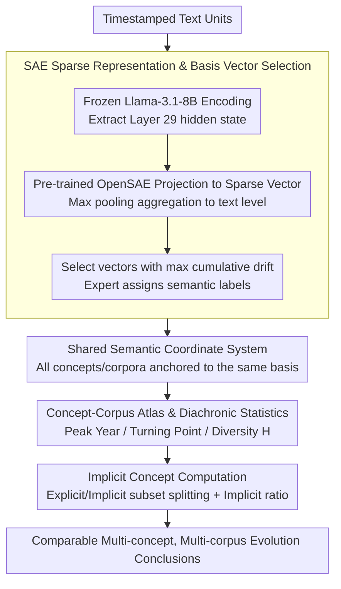

# HistLens: Mapping Idea Change across Concepts and Corpora

**Conference**: ACL 2026  
**arXiv**: [2604.11749](https://arxiv.org/abs/2604.11749)  
**Code**: [https://github.com/LeoJ-xy/HistLens](https://github.com/LeoJ-xy/HistLens)  
**Area**: Digital Humanities / Interpretability  
**Keywords**: Conceptual history analysis, Sparse Autoencoders, Diachronic semantic change, Cross-corpus comparison, Implicit concept computation

## TL;DR
The HistLens framework is proposed to decompose conceptual representations into interpretable semantic basis vectors using Sparse Autoencoders (SAE). It tracks the diachronic evolution trajectories of multiple concepts and corpora within a shared coordinate system and supports implicit concept computation, providing quantifiable and comparable analytical tools for digital humanities and conceptual history research.

## Background & Motivation

**Background**: Computational diachronic semantics and discourse analysis have made significant progress in recent years, including lexical semantic change detection, topic evolution modeling, and stance/framing analysis. However, integrating these methods into a scalable, comparable, and interpretable research paradigm for conceptual semantic evolution remains challenging.

**Limitations of Prior Work**: (1) Insufficient scalability and comparability—much work focuses on a single concept or corpus, making it difficult to compare analysis results across different concepts and sources or answer core questions such as whether multiple concepts co-evolve; (2) Insufficient characterization of implicit concepts—existing methods rely on keywords and surface co-occurrence patterns, failing to capture concepts expressed through stable discourse patterns without explicit mention, which leads to conceptual changes being misinterpreted as mere lexical substitutions.

**Key Challenge**: Research on conceptual evolution needs to balance interpretability, comparability, and the capture of implicit expressions, which existing computational methods cannot satisfy simultaneously.

**Goal**: Construct a unified conceptual history analysis framework for multiple concepts and corpora based on an interpretable sparse feature space.

**Key Insight**: Utilize Sparse Autoencoders to decompose the hidden representations of LLMs into interpretable semantic basis vectors. Conceptual queries are redefined as the tracking of activation dynamics of these basis vectors, allowing different concepts to be anchored in the same coordinate system for natural comparability.

**Core Idea**: Conceptual evolution is modeled as the reorganization of interpretable basis vector activations in a shared SAE semantic space—concepts do not simply disappear or appear; rather, their internal semantic components are re-weighted under historical pressure.

## Method

### Overall Architecture

HistLens is an analysis pipeline that is entirely frozen and involves no training: the input consists of timestamped text units, which are first encoded by a frozen LLM and then projected into a sparse, interpretable semantic feature space via a pre-trained SAE. All concepts are anchored in the same basis vector coordinate system, making them naturally comparable. On this shared space, the framework unfolds diachronic analysis layer by layer—first building an atlas and calculating navigation statistics for each (concept, corpus) pair, then performing semantic decomposition for single concepts, synergistic comparison between multiple concepts, and contrastive analysis across corpora. Finally, it quantifies and separates explicit lexical expressions from implicit discourse practices. Conceptual evolution is redefined here as the reorganization of basis vector activation shares rather than the appearance or disappearance of words.

### Key Designs

**1. SAE Sparse Representation & Basis Vector Selection: Decomposing dense representations into comparable semantic coordinate systems**

Dense neural representations suffer from polysemy superposition, making direct conceptual history comparisons difficult. HistLens uses a frozen Llama-3.1-8B-Instruct to encode each sentence, takes the hidden state from the 29th layer of the residual stream, projects it into a sparse vector $\mathbf{z}_{i,j} = f_{\text{SAE}}(\mathbf{h}_{i,j})$ via pre-trained OpenSAE, and aggregates it to the text level using max pooling. To identify the axes that truly change among tens of thousands of sparse features, the framework calculates the cumulative drift $D_k = \sum_{s=2}^{S} |\mu_{k,s} - \mu_{k,s-1}|$ for each basis vector and selects those with the largest drift. Finally, human experts assign semantic labels based on high-activation texts. SAE alleviates polysemy in dense representations and ensures that all concepts and corpora share the same basis vectors, establishing cross-concept and cross-corpus comparison on a unified coordinate system.

**2. Concept-Corpus Atlases & Diachronic Statistics: Replacing subjective case selection with quantitative anchors**

Traditional conceptual history research relies on the subjective selection of cases, making replication difficult. HistLens slices the corpus by year and calculates three reproducible statistics for each (concept, corpus) pair: Peak Year (the year of maximum concept activation), Turning Point (the year of greatest change between adjacent slices, including signed intensity $I$), and Diversity $H$ (the normalized entropy of basis vector contribution shares). These three metrics form a compact navigation signal, automatically locating key time nodes and cases worthy of in-depth study, transforming the analysis entry point from manual decision-making to systematic screening.

**3. Implicit Concept Computation: Quantifying concepts that are "not explicitly stated but expressed"**

Many concepts in conceptual history are expressed through stable discourse strategies rather than standardized terminology. Focusing solely on keywords can lead to misinterpreting conceptual change as lexical substitution and introduces source selection bias. HistLens splits the high-activation text set $\mathcal{I}_{c,r}$ for each concept into explicit and implicit subsets $\mathcal{I}_{c,r}^{\text{Imp}}$ based on whether they contain standard vocabulary. It then calculates the implicit realization ratio $\bar{r}_{c,r} = \sum_{i \in \mathcal{I}^{\text{Imp}}} m_i^{(c)} / \sum_{i \in \mathcal{I}} m_i^{(c)}$, where $m_i^{(c)}$ is the activation of text $i$ on the basis vectors related to concept $c$. A higher $\bar{r}$ indicates that the concept relies more on implicit discourse patterns than explicit vocabulary, providing a quantifiable detection method for source selection bias and conceptual misinterpretation.

### Main Results
Analysis of four concepts—"Individual," "Society," "State," and "World"—in the corpora of two modern Chinese periodicals, *New Youth* and *The Guide*:

| Concept | Corpus | Implicit Ratio $\bar{r}$ | Diversity $H$ | Peak Year | Turning Point (Year, $I$) |
|---------|--------|-------------------------|---------------|-----------|---------------------------|
| Individual | New Youth | 0.920 | 0.741 | 1920 | (1918, +0.226) |
| State | New Youth | 0.921 | 0.743 | 1924 | (1918, +0.116) |
| Society | New Youth | 0.595 | 0.368 | 1922 | (1918, -0.213) |
| World | New Youth | 0.900 | 0.683 | 1926 | (1918, +0.230) |
| Individual | The Guide | 0.963 | 0.763 | 1923 | (1923, +0.067) |

### Ablation Study

| Configuration | Description |
|---------------|-------------|
| Layer 29 (Main) | Layer used for primary results |
| Layer 06/14/22 | Cross-layer robustness analysis showing consistent patterns |

### Key Findings
- The "Individual" concept is not a semantically homogeneous object but can be decomposed into three independently evolving semantic threads: "Action Agency," "Individualistic Discourse," and "Property/Economic Individuality."
- The four concepts in *New Youth* shared the strongest turning point in 1918 ($|I|=0.116-0.230$), while the turning points in *The Guide* were delayed until 1923-1926 with weaker intensity.
- The proportion of implicit conceptual practice is generally high (0.595-0.963), indicating that concepts are largely expressed through discourse patterns of non-standard vocabulary.
- Cross-corpus comparison reveals that the "World" concept shares a semantic framework of revolution/class struggle in both corpora, but emphasizes intellectual debate in *New Youth* and organizational mobilization in *The Guide*.

## Highlights & Insights
- Redefining conceptual evolution as the "activation reorganization of interpretable semantic components" is a profound insight—concepts do not simply appear or disappear; their internal components are re-weighted under historical pressure.
- The SAE space provides a natural infrastructure for comparability, allowing cross-concept and cross-corpus comparisons without retraining concept-specific spaces, which holds significant methodological value.
- Implicit concept computation provides a systematic detection method for source selection bias and misinterpretation of conceptual change.

## Limitations & Future Work
- The semantic labeling of SAE basis vectors depends on human expert interpretation, introducing subjectivity.
- Only modern Chinese periodical corpora were validated; the generalizability to other languages and eras remains to be tested.
- Ranking by basis vector drift might overlook important but slowly changing semantic components.
- Future work could explore extending the framework to compare concepts across longer time spans and multilingual corpora.

## Related Work & Insights
- **vs Dynamic Topic Models (DTM)**: DTM learns topic-level evolution but does not provide interpretable semantic decomposition; HistLens provides finer-grained analysis at the basis vector level.
- **vs Word Embedding Temporal Comparison**: Traditional methods suffer from anisotropy and robustness issues, whereas SAE sparse features are more stable.
- **vs Semantic Differential Keyword Methods**: Those methods focus on lexical-level "semantic battlegrounds," while HistLens captures implicit conceptual expressions.

## Rating
- Novelty: ⭐⭐⭐⭐⭐ Using SAE for conceptual history analysis is a brand-new direction; implicit concept computation is original.
- Experimental Thoroughness: ⭐⭐⭐⭐ Detailed multi-concept and multi-corpus analysis, though limited to one language and era.
- Writing Quality: ⭐⭐⭐⭐⭐ Excellent integration of computational methods and humanistic interpretation.
- Value: ⭐⭐⭐⭐⭐ Provides important methodological infrastructure for digital humanities.
- Overall: ⭐⭐⭐⭐⭐ A model of interdisciplinary fusion, deeply integrating computation and the humanities.

<!-- RELATED:START -->

## Related Papers

- [\[ACL 2026\] IDEA: An Interpretable and Editable Decision-Making Framework for LLMs via Verbal-to-Numeric Calibration](idea_an_interpretable_and_editable_decision-making_framework_for_llms_via_verbal.md)
- [\[ACL 2026\] Follow the Flow: On Information Flow Across Textual Tokens in Text-to-Image Models](follow_the_flow_on_information_flow_across_textual_tokens_in_text-to-image_model.md)
- [\[ICLR 2026\] Concepts' Information Bottleneck Models](../../ICLR2026/interpretability/concepts_information_bottleneck_models.md)
- [\[AAAI 2026\] LLM Circuit Analyses Are Consistent Across Training and Scale](../../AAAI2026/interpretability/llm_circuit_analyses_consistent_across_training_and_scale.md)
- [\[ICLR 2026\] Evolution of Concepts in Language Model Pre-Training](../../ICLR2026/interpretability/evolution_of_concepts_in_language_model_pre-training.md)

<!-- RELATED:END -->
