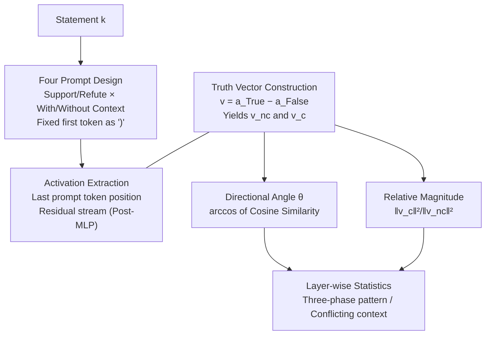

# How Context Shapes Truth: Geometric Transformations of Statement-level Truth Representations in LLMs

**Conference**: ACL2026  
**arXiv**: [2601.06599](https://arxiv.org/abs/2601.06599)  
**Code**: Available (provided in paper footnotes)  
**Area**: Interpretability / Representation Geometry  
**Keywords**: Truth Vector, Residual Stream, Context, Directional Change, Relative Magnitude

## TL;DR
This paper characterizes the geometric evolution of internal truth representations in LLMs when context is introduced. By measuring the **directional angle $\theta$** and **relative magnitude** of truth vectors under context-present vs. context-absent conditions across 4 models and multiple datasets, the study identifies a three-phase pattern: "near-orthogonal in early layers → rapid convergence in middle layers → stabilization or further increase in late layers." Context generally amplifies truth-falsity separability, and context conflicting with parametric knowledge induces greater geometric shifts than aligned context.

## Background & Motivation
**Background**: Substantial work has found that LLMs encode the veracity of statements as a linear direction within the residual stream activation space (truth direction). Linear classifiers (probes) can reliably distinguish true from false statements, suggesting a clear geometric structure for "truth." Representative works include CCS (unsupervised truth direction discovery), mass-mean probes, ITI (intervention along truth directions to enhance honesty), and representing truth as a 2D subspace to solve negation generalization.

**Limitations of Prior Work**: Existing studies primarily examine truth geometry in **static, context-free** settings or test the cross-setting transferability of probes. However, LLMs in deployment almost always operate with context—In-Context Learning (ICL) and Retrieval-Augmented Generation (RAG) improve outputs by inserting context into prompts. **No prior study has investigated how the geometric structure of truth representations itself transforms when context is introduced.** Bao et al. (2025) tested probe transferability but not the intrinsic geometric change of the truth vector.

**Key Challenge**: Context clearly alters the internal representation of a statement's veracity, but does this change occur in **direction** (redirecting the "meaning" of truth) or in **magnitude** (amplifying or compressing separability)? These mechanisms differ and offer distinct implications for designing RAG/ICL systems—reliance on magnitude amplification suggests a different narrative than reliance on directional redirection.

**Goal**: Decomposition into measurable sub-questions: (1) How does the directional change $\theta$ evolve across layers? (2) Is the relative magnitude of truth-falsity separation amplified or compressed? (3) Do models distinguish relevant vs. irrelevant context via direction or magnitude? (4) Does context conflicting with parametric knowledge cause larger geometric shifts?

**Key Insight**: The authors adopt the logic of "characterizing behavior via the direction and magnitude of contrast vectors" from activation steering research, but rather than modifying behavior, they **observe** the geometric drift of truth vectors induced by context.

**Core Idea**: Utilize a pair of geometric metrics—the directional angle $\theta$ and relative magnitude $\frac{\|v_c\|^2}{\|v_{nc}\|^2}$—to characterize the transformation of truth representations layer-by-layer, providing the first geometric characterization of context processing in LLMs.

## Method

### Overall Architecture
The method is a purely analytical/probing pipeline without training. For each statement, four prompts are constructed (Support/Refute × With/Without Context) to generate completions. Residual stream activations (post-MLP) are extracted at the last token position of the prompt during the generation of the first token. The "truth vector" is calculated as the difference between true and false activations. Geometric drift is analyzed by comparing the truth vector with context $v_c$ against the vector without context $v_{nc}$ across layers.

### Key Designs

**1. Four-Prompt Task Design: Isolating Context as a Controlled Variable**

To cleanly measure geometric changes, the authors construct four prompts for each statement: instructing the model to **support** and **refute** the statement, each in **context-present** and **context-absent** versions. Models follow a `[Selected Choice]` format where the first generated token is forced to be ")", ensuring fair comparison at the same position. Truth labels map "Support True/Refute False" to True activations and vice versa. This ensures the geometric difference between $v_c$ and $v_{nc}$ is attributable solely to the context.

**2. Truth Vector Construction: Locating the Truth Direction**

Following the prior that truth is a linear direction, the truth vector is defined as the difference between True and False activations in the same layer. Activations are extracted at the **prompt's final token position during the first output token generation**. This position aggregates input information via causal attention without interference from subsequent tokens. Formally, for layer $l$ and statement $k$:

$$v_k^{(l)} = a_{k,\text{True}}^{(l)} - a_{k,\text{False}}^{(l)}$$

Vectors are split into $v_{k,nc}^{(l)}$ and $v_{k,c}^{(l)}$ for geometric comparison.

**3. Directional Angle θ: Capturing Redirection**

$\theta$ measures the directional divergence between vectors with and without context. A large $\theta$ suggests context fundamentally changes the "meaning" of the truth direction. For layer $l$:

$$\theta_k^{(l)} = \arccos\left(\frac{v_{k,c}^{(l)} \cdot v_{k,nc}^{(l)}}{\|v_{k,c}^{(l)}\|\,\|v_{k,nc}^{(l)}\|}\right)$$

The observed pattern is three-phased: near-orthogonal in early layers, sharp convergence in middle layers, and stabilization or divergence in late layers. $\theta$ never reaches zero, indicating models maintain distinguishable representations for context-present vs. context-absent states.

**4. Relative Magnitude: Capturing Separability Amplification**

Directional changes do not account for separability. The relative magnitude uses the context-absent $L_2$ distance as a baseline to see if context increases or decreases this distance:

$$rm_{k,tc\text{-}fc}^{(l)} = \frac{\|v_{k,c}^{(l)}\|^2}{\|v_{k,nc}^{(l)}\|^2}$$

Values $>1$ indicate context **amplifies** truth-falsity separation. A peak typically appears in middle layers. A key insight: **Large models primarily distinguish context relevance via direction ($\theta$), while small models rely more on magnitude.**

### Mechanism: Distinguishing Relevant vs. Irrelevant Context
By pairing a statement with relevant context, random "word salad," or scrambled irrelevant context, the authors found that in LLaMA, relevant context (e.g., Politifact) induces significant $\theta$ shifts (11.81–13.88°). Specifically, `ConflictQA-Counter` (conflicting with parametric knowledge) causes a $\theta$ shift of 22.38°, far exceeding the 2.03° shift for `ConflictQA-Parametric`. Models internally "recognize" context relevance or conflict through the magnitude of geometric drift.

## Key Experimental Results

### Case Study / Experimental Setup
- **Models**: 4 instruction-tuned models across 3B–12B scales: LLaMA-3.1-8B-Instruct, Mistral-Nemo-12B-Instruct, Qwen3-4B-Instruct, SmolLM3-3B.
- **Datasets**: Druid (Borderlines/Politifact/ScienceFeedback), MF2, ConflictQA (Parametric/Counter), LegalBench. Covers fact-checking, summaries, and legal texts.

### Main Results: Three-Phase Pattern of Directional Change

| Phenomenon | Phase-1 (Early) | Phase-2 (Middle) | Phase-3 (Late) |
|------------|-----------------|------------------|----------------|
| $\theta$ Behavior | Near-orthogonal (High) | Rapid descent to minimum | Stable or rising |
| LLaMA/Mistral | — | Drops from L9, min at L15 | Generally stable |
| Qwen/SmolLM | Longer Phase-1 (until L14-16) | Later minimum (L20-25) | Dataset dependent |

**Key Findings**: (1) All models exhibit the three-phase pattern; $\theta$ never reaches zero. (2) Larger models compress early processing into fewer layers (until L9). (3) Conflicting context (`ConflictQA-Counter`) causes $\theta$ to continue rising in late layers, higher than Parametric context, reflecting competition between memory and context.

### Relative Magnitude (Final Layer)

| Dataset | LLaMA | Mistral | Qwen | SmolLM |
|---------|-------|---------|------|--------|
| Borderlines | 1.18* | 1.08* | 1.13* | 1.11* |
| ConflictQA-Counter | 1.20* | 0.98 | 0.98 | 1.26* |
| ConflictQA-Param | 1.34* | 1.02 | 1.06* | 1.16* |
| CL-Company | 1.15* | 1.18* | 1.06* | 1.00 |

(* indicates Wilcoxon significance p < 0.05)

### Key Findings
- **Context amplifies separation**: Relative magnitude is mostly $>1$, peaking in middle layers.
- **Scale-dependent channels**: Large models use $\theta$ (direction) to differentiate context relevance; small models utilize magnitude.
- **Conflict = Greater Drift**: Conflicting context causes larger and more persistent geometric shifts than aligned context.
- **Geometry vs. Probability**: Internal geometric drift does not always map linearly to changes in output token probabilities.
- **Causal Efficacy**: Intervention experiments (steering) confirm that truth vectors remain causally effective in the presence of context.

## Highlights & Insights
- **Decomposition into orthogonal metrics**: Analyzing direction vs. magnitude is more precise than broad "representation change" claims.
- **Consistency with layer roles**: The three-phase pattern aligns with existing knowledge (early = input processing, middle = semantics, late = prediction), providing a structural description of truth geometry.
- **Scaling Laws of Geometry**: Insights into how intervention strategies might need to differ based on model size (direction-based for large, magnitude-based for small).
- **Conflict Drift**: Late-layer divergence for conflicting context provides geometric evidence for the "memory-head vs. context-head" competition.

## Limitations & Future Work
- Analysis is limited to residual streams (post-MLP) at a single position; truth might reside in other sub-layers or token positions.
- Truth is assumed to be a linear vector; if it is a 2D subspace, single-vector metrics may lose information.
- Findings are largely observational; the link between geometric drift and behavioral change (output probability) requires more causal mapping.
- The model scale is limited (3B–12B). The "direction vs. magnitude" scaling hypothesis requires verification on ultra-large models (70B+).

## Related Work & Insights
- **vs. CCS / ITI**: These utilize context-free truth directions; this work adds a dynamic perspective on how context transforms these directions.
- **vs. Bao et al. (2025)**: While they test probe transfer, this work directly measures the underlying geometric transformation.
- **vs. Knowledge Conflict Detection**: This work provides complementary evidence from the perspective of representation drift, showing how conflict causes greater geometric divergence.

## Rating
- Novelty: ⭐⭐⭐⭐⭐ (Systematic decomposition into direction/magnitude for context-induced changes is novel.)
- Experimental Thoroughness: ⭐⭐⭐⭐ (Solid across multiple models/datasets with statistical significance; could benefit from larger models.)
- Writing Quality: ⭐⭐⭐⭐ (Clear definitions and intuitive three-phase narrative.)
- Value: ⭐⭐⭐⭐ (Practical implications for RAG/ICL and context-aware interpretability.)

<!-- RELATED:START -->

## Related Papers

- [\[ACL 2025\] Probing the Geometry of Truth: Consistency and Generalization of Truth Directions](../../ACL2025/interpretability/probing_the_geometry_of_truth_consistency_and_generalization_of_truth_directions.md)
- [\[NeurIPS 2025\] Emergence of Linear Truth Encodings in Language Models](../../NeurIPS2025/interpretability/emergence_of_linear_truth_encodings_in_language_models.md)
- [\[ACL 2026\] Jacobian Scopes: Token-Level Causal Attributions in LLMs](jacobian_scopes_token-level_causal_attributions_in_llms.md)
- [\[NeurIPS 2025\] How Intrinsic Motivation Shapes Learned Representations in Decision Transformers: A Cognitive Interpretability Analysis](../../NeurIPS2025/interpretability/toward_explainable_offline_rl_analyzing_representations_in_intrinsically_motivat.md)
- [\[ICLR 2026\] How Stable is the Next Token? A Geometric View of LLM Prediction Stability](../../ICLR2026/interpretability/how_stable_is_the_next_token_a_geometric_view_of_llm_prediction_stability.md)

<!-- RELATED:END -->
