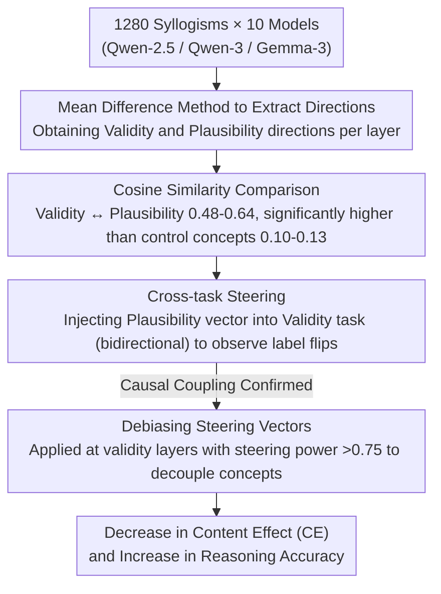

# How Language Models Conflate Logical Validity with Plausibility: A Representational Analysis of Content Effects

**Conference**: ACL 2026 Findings  
**arXiv**: [2510.06700](https://arxiv.org/abs/2510.06700)  
**Code**: [https://github.com/leobertolazzi/content-effect-interpretability](https://github.com/leobertolazzi/content-effect-interpretability)  
**Area**: Social Computing  
**Keywords**: Content Effects, Logical Validity, Plausibility, Linear Representation, Steering Vectors

## TL;DR
Representational analysis reveals that "logical validity" and "plausibility" are highly aligned in the latent space of LLMs, causing the model to conflate the two concepts (content effect). Constructing debiasing steering vectors effectively decouples these concepts, reducing content effects while improving reasoning accuracy.

## Background & Motivation

**Background**: Humans exhibit "content effects" in logical tasks like syllogistic reasoning—the plausibility of semantic content influences judgments of logical validity (e.g., an invalid argument with a plausible conclusion is often misjudged as valid). This phenomenon in humans is explained by dual-process theory (fast intuitive system vs. slow analytical system). Recent studies show LLMs exhibit similar content effects.

**Limitations of Prior Work**: While the behavioral manifestations of content effects in LLMs have been well-documented, the underlying mechanisms remain unclear. Existing research focuses on behavioral observations and lacks in-depth analysis of internal representations.

**Key Challenge**: Logical validity depends on argument structure rather than content, but LLMs may entangle these two theoretically independent concepts within their representation space.

**Goal**: (1) Verify if LLMs exhibit content effects; (2) Analyze how validity and plausibility are encoded in internal representations; (3) Investigate whether representation-level entanglement predicts behavioral content effects; (4) Design interventions to decouple these concepts.

**Key Insight**: Based on the Linear Representation Hypothesis—where high-level concepts are linearly encoded in LLM latent spaces—the study examines whether the linear directions of validity and plausibility are highly similar.

**Core Idea**: The root of content effects in LLMs is the entanglement and alignment of the validity direction and the plausibility direction in the representational geometry, which can be decoupled by constructing debiasing steering vectors.

## Method

### Overall Architecture
This study addresses a mechanistic question: Is the "content effect" in LLMs (being biased by conclusion plausibility) a behavioral fluke or a structural entanglement in representational geometry? The authors tested 10 models (Qwen-2.5, Qwen-3, Gemma-3 series) on 1280 syllogisms. They used the Mean Difference method to compress "validity" and "plausibility" into linear directions in the latent space and compared their similarity. Cross-task steering experiments were then used to test causal coupling. Finally, debiasing steering vectors were constructed to decouple the concepts.

### Key Designs

**1. Extracting Concept Directions via Mean Difference: Compressing Binary Concepts into a Linear Direction**

To analyze entanglement, "validity" and "plausibility" must be located as comparable objects in the representation space. For each layer $l$, the authors calculate the difference between the average activations at the last token position for samples predicted as positive (e.g., "valid") and negative (e.g., "invalid"): $v_{\text{concept}}^l = \mu_{\text{positive}}^l - \mu_{\text{negative}}^l$. A crucial detail is grouping by the model's own predicted labels rather than ground truth to capture how the model "internally" encodes the concept. This approach aligns with the Linear Representation Hypothesis and allows for direct cosine similarity calculations.

**2. Cross-task Steering: Using One Concept's Direction to Induce Another's Judgment to Verify Causality**

High cosine similarity only suggests correlation, not that plausibility actually drives validity judgments. Thus, the authors injected the steering vector $v_{\text{plausibility}}^l$ into the logical validity classification task (and vice versa), using the label flip rate as a measure of steering power. Injections were always adversarial to the model's original prediction—adding the vector if the prediction was negative, and subtracting it if positive—to ensure observed flips originated from the direction itself. If the plausibility vector consistently flips validity judgments, it confirms causal coupling.

**3. Debiasing Steering Vectors: Decoupling Entanglement to Reduce Bias and Improve Accuracy**

If entanglement is the root of content effects, decoupling should simultaneously reduce bias and improve reasoning. The authors applied debiasing vectors at "validity layers" where steering power exceeded $0.75$. Bias was measured using the content effect metric $\text{CE} = \tfrac{1}{2}(\Delta_{v^+} + \Delta_{v^-})$, where $\Delta_{v^+}$ measures the accuracy advantage of valid arguments over invalid ones when the conclusion is plausible. $\text{CE}=0$ indicates judgment is independent of plausibility, while $\text{CE}=1$ suggests judgment is entirely driven by plausibility.

## Key Experimental Results

### Main Results
Behavioral Content Effects:

| Model | Setting | $D_{v^+,p^+}$ Acc | $D_{v^-,p^+}$ Acc | $D_{v^+,p^-}$ Acc | CE |
|------|------|---------------------|---------------------|---------------------|-----|
| Qwen2.5-32B | 0-shot | 100.00 | 67.50 | 60.92 | 0.348 |
| Qwen2.5-32B | CoT | 98.67 | 86.64 | 93.10 | 0.096 |
| Qwen3-14B | 0-shot | 97.33 | 90.83 | 60.92 | 0.213 |
| Qwen3-14B | CoT | 95.31 | 99.10 | 92.50 | 0.014 |

### Representational Analysis

| Concept Pair | Mean Cosine Similarity | Description |
|--------|--------------|------|
| Validity - Plausibility | 0.48-0.64 | Highly Aligned |
| Validity - Harmlessness | 0.10-0.13 | Low Similarity (Control) |
| Validity - Hypernymy | -0.12 to -0.17 | Low Similarity (Control) |

### Key Findings
- All tested models exhibit content effects; Chain-of-Thought (CoT) prompting significantly reduces CE (from 0.213-0.348 to 0.014-0.096).
- Cosine similarity between validity and plausibility vectors (0.48-0.64) is much higher than control concepts (0.10-0.13), confirming specific entanglement.
- Cross-task steering succeeded: plausibility vectors effectively flip validity judgments and vice versa.
- The degree of validity-plausibility alignment positively correlates with behavioral CE intensity.
- Debiasing vectors simultaneously decrease CE and increase accuracy, proving decoupling is effective.
- While CoT reduces behavioral CE, representation-level alignment does not change significantly (p=0.625).

## Highlights & Insights
- Provides the first representational explanation for content effects in LLMs—it is a structural issue of representational geometry rather than a transient behavioral "bug."
- The finding that CoT reduces behavioral CE without changing representation alignment is striking; CoT likely "bypasses" rather than "resolves" the entanglement during the reasoning process.
- The debiasing steering vector demonstrates a complete loop from representational analysis to practical intervention.

## Limitations & Future Work
- Validation was limited to syllogistic reasoning; mechanisms for other forms (conditional, probabilistic) may differ.
- The dataset size (1280 syllogisms) is relatively small; while it covers all 64 types, semantic variation is limited.
- The effectiveness of debiasing vectors depends on layer selection, requiring a validation set to determine optimal layers.
- Future work could explore if non-linearly encoded concepts exhibit similar entanglement.

## Related Work & Insights
- **vs. Lampinen et al.**: They documented behavioral content effects; this work reveals the underlying representational mechanism.
- **vs. Marks & Tegmark (Truth Directions)**: They found truth is linearly encoded; this work further finds that validity directions are entangled with plausibility.
- **vs. Arditi et al. (Refusal Directions)**: Uses similar methodology but applied to different concepts; this work's innovation lies in analyzing interaction between two concepts.

## Rating
- Novelty: ⭐⭐⭐⭐⭐ First representational geometry explanation of content effects.
- Experimental Thoroughness: ⭐⭐⭐⭐ 10 models, control experiments, and causal validation, though limited to one dataset.
- Writing Quality: ⭐⭐⭐⭐⭐ Clear RQ-driven structure with progressive analysis.
- Value: ⭐⭐⭐⭐⭐ Important implications for understanding and improving LLM logical reasoning.

<!-- RELATED:START -->

## Related Papers

- [\[ACL 2026\] Knowledge Vector of Logical Reasoning in Large Language Models](knowledge_vector_of_logical_reasoning_in_large_language_models.md)
- [\[ICML 2026\] How Language Models Process Negation](../../ICML2026/interpretability/how_language_models_process_negation.md)
- [\[ACL 2026\] Fine-Grained Analysis of Shared Syntactic Mechanisms in Language Models](fine-grained_analysis_of_shared_syntactic_mechanisms_in_language_models.md)
- [\[ICML 2026\] A Behavioural and Representational Evaluation of Goal-Directedness in Language Model Agents](../../ICML2026/interpretability/a_behavioural_and_representational_evaluation_of_goal-directedness_in_language_m.md)
- [\[ICML 2026\] Query Circuits: Explaining How Language Models Answer User Prompts](../../ICML2026/interpretability/query_circuits_explaining_how_language_models_answer_user_prompts.md)

<!-- RELATED:END -->
