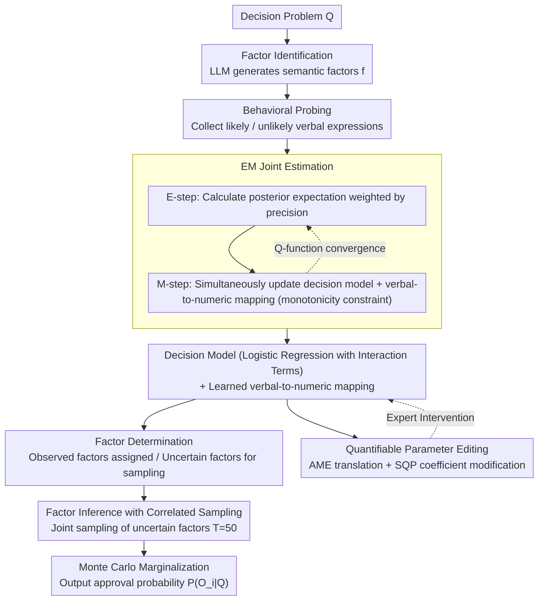

# IDEA: An Interpretable and Editable Decision-Making Framework for LLMs via Verbal-to-Numeric Calibration

**Conference**: ACL 2026  
**arXiv**: [2604.12573](https://arxiv.org/abs/2604.12573)  
**Code**: [https://github.com/leonbig/IDEA](https://github.com/leonbig/IDEA)  
**Area**: Interpretability / LLM Decision Making  
**Keywords**: Interpretable Decision Making, Verbal Probability Calibration, EM Algorithm, Parameter Editing, Human-AI Collaboration

## TL;DR

The IDEA framework is proposed to extract decision-making knowledge from LLMs into interpretable parameterized models over semantic factors. By jointly learning verbal-to-numeric mappings and decision parameters via an EM algorithm, it achieves calibratable, editable, and interpretable LLM decision-making. Testing across five datasets, IDEA (78.6%) using Qwen-3-32B outperforms DeepSeek R1 (68.1%) and GPT-5.2 (77.9%).

## Background & Motivation

**Background**: LLMs are increasingly deployed in automated decision-making scenarios. However, their application in high-risk sectors like financial investment and loan approval remains constrained by a fundamental "trust deficit"—stakeholders cannot reliably verify, audit, or intervene in the decision process.

**Limitations of Prior Work**: Existing methods fall short in three dimensions: (1) probability estimates from LLMs are often overconfident and poorly calibrated; (2) generated explanations tend to be post-hoc rationalizations that do not reflect internal reasoning; (3) there is a lack of quantitative frameworks to precisely integrate expert knowledge into decisions, as prompts alone cannot guarantee compliant behavior. For instance, ranking and scoring may yield inconsistent orders for the same options, and instructions to exclude certain factors often fail to stop their influence on predictions.

**Key Challenge**: A fundamental "internal-external misalignment" exists between the internal computations and external outputs of LLMs. Logit-based methods conflate next-token confidence with decision uncertainty and remain "black boxes." DeLLMa relies on LLMs to output precise numerical values, which they struggle with. BIRD assumes factor independence and uses fixed verbal-to-numeric mappings, losing calibration accuracy and natural correlations between factors.

**Goal**: Build a decision framework that simultaneously satisfies three properties: calibrated probability estimation, semantic interpretability, and quantitative human-AI collaboration (precisely editable parameters).

**Key Insight**: Two critical observations are made: (i) while LLMs cannot reliably produce precise numerical probabilities, they can generate decision-related factors from broad knowledge; (ii) LLMs are more consistent in producing verbal probability expressions (e.g., "likely," "unlikely") than precise numbers, as such phrases are far more prevalent in training corpora.

**Core Idea**: Instead of making the internal reasoning of LLMs transparent, their knowledge is extracted into an inherently transparent form—an interpretable parameterized model in semantic factor space—using an EM algorithm to jointly learn the verbal-to-numeric mapping and decision parameters.

## Method

### Overall Architecture

The premise of IDEA is that rather than forcing LLMs to explain internal reasoning (often post-hoc), it is better to extract their decision knowledge into a transparent form. The target probability $P(O_i|Q)$ is decoupled into two separable components: the decision model $P(O_i|\mathbf{f})$ (how factor configurations map to outcomes) and factor inference $P(\mathbf{f}|C)$ (inferring factor values from conditions). The pipeline consists of an offline stage (factor identification → behavioral probing → EM joint estimation) and an online stage (factor determination → joint sampling → marginalization), with an added intervention interface for experts to modify parameters directly.

### Key Designs

**1. EM Joint Estimation: Simultaneously learning verbal mappings and decision parameters**

The core dilemma is a "chicken-and-egg" problem: training a decision model requires numerical labels, but determining numerical values for verbal expressions like "likely" requires a decision model. IDEA breaks this loop with EM: the E-step calculates posterior expectations for latent probabilities (fusing model predictions with current verbal mappings), while the M-step updates both decision parameters and verbal mappings (with monotonicity constraints ensuring "likely" values exceed "unlikely"). The decision model utilizes logistic regression with interaction terms to quantify factor contributions. Compared to BIRD's fixed mappings from psychological literature (which causes a 6.8% F1 drop), joint learning adapts to specific tasks and the LLM's unique linguistic style.

**2. Factor Inference with Correlated Sampling: Preserving natural correlations during marginalization**

In real-world decisions, some factors remain unobserved. IDEA splits factors into observed and uncertain sets. For uncertain factors, the LLM performs conditional sampling of $T=50$ joint configurations (using high temperature for diversity). Monte Carlo methods then average the decision probabilities across these configurations, providing an unbiased estimate with a standard error of $O(1/\sqrt{T})$. Crucially, "joint" sampling is used rather than independent factor sampling; BIRD's assumption of independence misrepresents factors like "high income" and "stable employment," leading to distorted results.

**3. Quantifiable Parameter Editing: Precise expert modification of factor weights**

Prompt-level interventions are highly unreliable; even when told to "exclude credit history," the factor often implicitly affects predictions (ERR only 0.06–0.43). IDEA pushes intervention to the parameter layer. It uses Average Marginal Effect (AME) to translate log-odds coefficients into intuitive probability space changes. Experts can perform structural edits (adding/removing factors) or quantitative edits (using Sequential Quadratic Programming to solve constrained optimizations, minimizing perturbations to other factors while satisfying importance ratios). For example, to exclude credit history, the coefficient is set to zero, shifting the approval probability from $21.6\%$ to exactly $52.3\%$, achieving perfect factor exclusion (ERR=1.00) with zero relative error.

### Mechanism: A Complete Example of Loan Approval

Taking a case from German Credit through online inference: the model first identifies semantic factors like "income level," "employment stability," and "credit history." Observed factors are assigned values, while uncertain ones (e.g., employment stability) involve joint sampling of $T=50$ sets. Verbal expressions for each factor are mapped to numbers via EM-learned scales and fed into the logistic regression model with interaction terms. If an auditor decides credit history should not be considered, the coefficient is zeroed, and the probability cleanly shifts from $21.6\%$ to $52.3\%$. Every step is readable, auditable, and editable.

### Loss & Training

The M-step updates decision parameters using a composite loss: MSE reconstruction loss + ranking consistency hinge loss (ensuring "likely" > "unlikely") + Elastic Net regularization for interaction terms (L1 for sparsity, L2 for stability). Verbal mappings are initialized with psychological literature values and iterated until the Q-function change is less than $10^{-4}$.

## Key Experimental Results

### Main Results

Binary decision accuracy (F1 score) was evaluated across five datasets (Complex: BIGDATA22 stock prediction, German Credit; Reasoning: COMMON2SENSE, PLASMA, TODAY):

| Model | Method | Avg. F1 (5 sets) | Macro F1 (3-class Ranking) |
|------|------|----------------|------------------|
| Qwen-3-32B | IDEA | **78.6%** | **0.693** |
| Qwen-3-32B | CoT | 67.7% | 0.339 |
| Qwen-3-32B | BIRD | 71.4% | 0.521 |
| GPT-5.2 | CoT | 77.9% | 0.402 |
| DeepSeek R1 | CoT | 68.1% | 0.286 |
| Qwen-3-8B | IDEA | 73.2% | 0.697 |
| Qwen-3-4B | IDEA | 71.6% | 0.504 |

### Ablation Study

| Config (Qwen-3-32B) | Avg. F1 | Ranking Macro F1 | Description |
|-------------------|---------|--------------|------|
| IDEA (Full) | 78.6% | 0.693 | Full model |
| w/o EM | 71.8% (-6.8%) | 0.632 | Fixed verbal mapping |
| w/o Inter | 71.0% (-7.6%) | 0.644 | Removed interaction terms |
| w/o MC | 71.8% (-6.8%) | 0.617 | Deterministic factor assignment |

### Key Findings
- Each of the three modules contributes roughly 6-8%, indicating that EM calibration, interaction terms, and correlated sampling are all indispensable.
- IDEA achieves perfect factor exclusion (ERR=1.00) and zero calibration error, whereas prompt-based methods reach a maximum ERR of only 0.43.
- IDEA significantly outperforms direct prompting even on smaller models (Qwen-3-4B), suggesting the framework is not overly sensitive to model scale.
- The advantage of IDEA is most pronounced in ranking tasks, particularly in identifying "equivalent" categories.

## Highlights & Insights
- **Leveraging Verbal Probability Consistency**: The framework cleverly exploits the fact that LLMs are more consistent with "likely/unlikely" phrases than precise numbers, transforming unreliable numerical outputs into reliable ordinal signals.
- **Mathematical Guarantees for Editing**: By using AME and constrained optimization, IDEA achieves precise, predictable, and reversible behavioral interventions. This is the first framework to provide mathematical guarantees for LLM decision editing.
- **Elegance of Decoupled Design**: Separating decision-making into factor inference and a decision model utilizes the LLM's knowledge breadth (factor generation) while avoiding its numerical unreliability, effectively "playing to strengths and avoiding weaknesses."

## Limitations & Future Work
- Currently limited to binary decisions and binary factors; extending to multi-class decisions and continuous factors requires more complex parameterization.
- The assumption of factor completeness may be hard to satisfy in open-domain decisions; omitting key factors systematically degrades performance.
- EM only guarantees convergence to a local optimum; sensitivity to initialization has not been fully discussed.
- The behavioral probing phase requires many LLM queries (up to 256 configurations), which may be costly for API-sensitive scenarios.

## Related Work & Insights
- **vs BIRD**: BIRD assumes factor independence and uses fixed mappings. IDEA outperforms it across the board through EM joint learning and correlated sampling, with an average F1 gain of ~7%.
- **vs DeLLMa**: DeLLMa relies on LLMs to output numerical utilities directly; IDEA bypasses this unreliability via verbal probability intermediaries.
- **vs Concept Bottleneck Models**: CBMs require task-specific training and assume concept independence. IDEA provides similar interpretability but adds support for parameter editing.

## Rating
- Novelty: ⭐⭐⭐⭐⭐ Unifies verbal probability calibration, EM joint learning, and parameter editing into a novel and practical framework.
- Experimental Thoroughness: ⭐⭐⭐⭐ Five datasets and three model scales with full ablation, though verification on larger models and more decision domains is needed.
- Writing Quality: ⭐⭐⭐⭐⭐ Clear motivation derived from the trust deficit, with rigorous formalization.
- Value: ⭐⭐⭐⭐ Provides a practical interpretable and editable solution for LLM decision-making in high-risk fields.

<!-- RELATED:START -->

## Related Papers

- [\[NeurIPS 2025\] ValuePilot: A Two-Phase Framework for Value-Driven Decision-Making](../../NeurIPS2025/interpretability/valuepilot_a_two-phase_framework_for_value-driven_decision-making.md)
- [\[ACL 2026\] HistLens: Mapping Idea Change across Concepts and Corpora](histlens_mapping_idea_change_across_concepts_and_corpora.md)
- [\[ICLR 2026\] Towards Cognitively-Faithful Decision-Making Models to Improve AI Alignment](../../ICLR2026/interpretability/towards_cognitively-faithful_decision-making_models_to_improve_ai_alignment.md)
- [\[ACL 2026\] Preference Heads in Large Language Models: A Mechanistic Framework for Interpretable Personalization](preference_heads_in_large_language_models_a_mechanistic_framework_for_interpreta.md)
- [\[ACL 2026\] FineSteer: A Unified Framework for Fine-Grained Inference-Time Steering in Large Language Models](finesteer_a_unified_framework_for_fine-grained_inference-time_steering_in_large_.md)

<!-- RELATED:END -->
