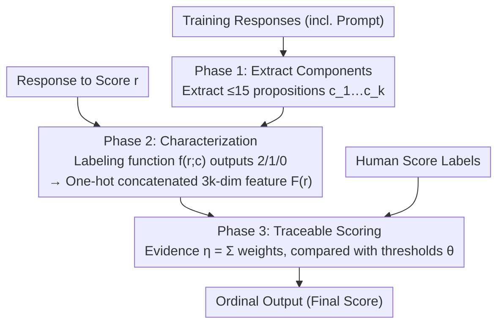

# Interpretability from the Ground Up

**Conference**: ACL 2026 Findings  
**arXiv**: [2511.17069](https://arxiv.org/abs/2511.17069)  
**Code**: [GitHub](https://github.com/yunsungkim0908/analyticscore)  
**Area**: Interpretability / Educational Assessment  
**Keywords**: Interpretable Automated Scoring, Educational Assessment, FGTI Principles, Analytic Scoring, Stakeholder-centered Design

## TL;DR

This work derives four principles—FGTI (Faithful, Grounded, Traceable, Interchangeable)—from the requirements of educational assessment stakeholders. It develops the AnalyticScore three-stage framework to achieve interpretable automated scoring, trailing non-interpretable SOTA by only 0.06 in average QWK on the ASAP-SAS dataset.

## Background & Motivation

**Background**: AI automated scoring is increasingly required for large-scale, low-cost evaluation of student open-ended responses. However, educational assessment demands high transparency and interpretability, and no widely accepted "interpretable automated scoring" solution currently exists for real-world high-stakes examinations.

**Limitations of Prior Work**: Dominant "interpretable" approaches are often indefensible. Directly prompting LLMs to "explain the score" produces text that is unfaithful; Chain-of-Thought (CoT) is not a true reflection of the model’s internal computation, is highly sensitive to prompt/input variations, and often results in self-contradictory judgments. Meanwhile, post-hoc explanations like feature importance, attribution heatmaps, and confidence scores are neither grounded in readable features nor allow humans to trace or intervene in the scoring logic.

**Key Challenge**: Scoring is inherently an evidentiary reasoning process where stakeholders need to inspect—and potentially intervene in—each step. Existing interpretability methods are either unfaithful or fail to decompose the process into clear sub-steps that humans can reliably execute.

**Goal**: Starting from the actual needs of assessment stakeholders, this paper proposes a set of interpretability principles and provides a deployable reference framework as a baseline for future research.

**Key Insight**: Grounded in decades of educational assessment literature, the authors first define the interpretability needs and benefits for various stakeholder groups, then distill principles and design the framework, rather than developing technology first and appending explanations later.

**Core Idea**: The authors propose the Faithful, Grounded, Traceable, and Interchangeable (FGTI) principles and demonstrate via the three-stage AnalyticScore framework that these principles can be achieved simultaneously while maintaining scoring accuracy near non-interpretable SOTA.

## Method

### Overall Architecture

The paper derives the FGTI principles—Faithful (explanations reflect actual computation), Grounded (features are human-readable and anchored to the response/rubric), Traceable (scoring logic is decomposed into clear reasoning steps), and Interchangeable (each step's output can be overridden by a human)—from stakeholder needs. AnalyticScore implements these by decomposing "short-answer scoring" into three serial stages: extracting analysis components, characterizing the response based on these components, and calculating the final score using a traceable model. Notably, the first two stages use only response text without human labels; labels are only used in the third stage to train the scoring model.

### Key Designs

**1. Phase 1: Extract Analysis Components (Grounded and Editable Propositions)**

To satisfy the "Grounded" principle, AnalyticScore avoids unreadable features like sentence embeddings. Instead, it extracts a set of analysis components (propositions) from the training set: $[c_1, \dots, c_k] = \text{Extract}(r_1, \dots, r_m)$. While the extraction method is flexible, the paper uses LLM prompting and limits the number of components per prompt to $\le 15$ to prevent feature explosion and maintain "Interchangeability." This step fits naturally into standard assessment workflows, where generated components serve as candidate rubrics for expert review.

**2. Phase 2: Characterization (3-point Labeling as Readable Binary Features)**

Once components are defined, each response $r$ is evaluated per component. The labeling function $f(r;c)$ outputs three levels: $2$ (fully addressed), $1$ (partially addressed), and $0$ (not addressed), providing human-understandable semantics (Satisfying "Grounded" and "Traceable"). $f$ is implemented via CoT prompting, but the "thinking" process is explicitly discarded, keeping only the label. Self-consistency decoding is used to aggregate multiple judgments to handle ambiguity. The result is a $3k$-dimensional binary feature vector $F(r) = \text{OneHot}(f(r;c_1)) \, \| \cdots \| \, \text{OneHot}(f(r;c_k))$. To reduce the linear cost of calling proprietary LLMs, a small open-source model (Llama-3.1-8B + QLoRA) is distilled using 10k $(r,c)$ pairs labeled by o4-mini.

**3. Phase 3: Traceable Scoring (Ordinal Logistic Regression with Readable Weights)**

Human score labels $(r_1, s_1), \dots, (r_n, s_n)$ are only used at this final stage. Given that scores are ordered categories, the authors employ an Immediate-Threshold variant of ordinal logistic regression. An "evidence value" is calculated by summing weights corresponding to Phase 2 features: $\eta = \sum_{i=1}^{k} w_{i,f(r,c_i)}$. $\eta$ is then compared against learned thresholds $\theta_j$; if $\theta_j \le \eta < \theta_{j+1}$, ordinal category $j$ is assigned. This logic is fully transparent—the contribution of each component is visible, and humans can directly take over or modify any weight (Satisfying "Traceable" and "Interchangeable").

### A Complete Example: Scoring "Pandas and Koalas"

Consider the prompt: "Explain the similarities between pandas and koalas and how they differ from pythons." Phase 1 extracts propositions like "both are mammals," "both are endemic species," and "pythons are cold-blooded" ($\le 15$). Phase 2 evaluates a student's response: if they mention "mammals" clearly, score $2$; if "endemic" is vaguely mentioned, score $1$; if "cold-blooded" is missing, score $0$. These are concatenated into a $3k$-dim binary vector. Phase 3 sums these features using learned weights to get $\eta$, providing a final grade based on thresholds. If an expert deems the weight of "cold-blooded" too high, they can modify it directly without retraining.

## Key Experimental Results

### Main Results

Scoring accuracy (QWK) was evaluated on 10 prompts from the ASAP-SAS dataset, comparing AnalyticScore's characterization consistency against human labels:

| Dimension | AnalyticScore | Description |
|-----------|---------------|-------------|
| Scoring Accuracy (QWK) | Avg. only 0.06 lower than non-interpretable SOTA | Across 10 prompts; outperforms most non-interpretable methods |
| Characterization Alignment (QWK) | 0.90 / 0.72 / 0.81 | Highly consistent with human labels across three evaluation dimensions |

### Key Findings

- A minimal accuracy cost (avg. 0.06 QWK) enables fully traceable and intervenable scoring logic, debunking the assumption that interpretability necessitates significant performance loss.
- High alignment (0.90/0.72/0.81 QWK) between AnalyticScore's characterization and human labels indicates that the extracted components accurately capture the evidence used by humans.
- The three-stage decoupling confirms that humans can intervene at any step, validating the FGTI principles on real-world datasets.

## Highlights & Insights

- Reverses the "interpretability" stack by defining stakeholder needs first, distilled into the FGTI principles, providing verifiable criteria rather than vague claims.
- Demonstrates via a simple "Components + Labeling + Ordinal Regression" pipeline that fully transparent models can challenge black-box SOTA benchmarks.
- Transforms interpretability into "intervenability," where every weight and feature can be manually adjusted by domain experts.

## Limitations & Future Work

- Validated only on short-answer scoring (ASAP-SAS); applicability to complex forms like essays or mathematical derivations remains to be tested.
- Analysis components currently rely on initial LLM extraction; the quality and quantity limit ($\le 15$) of components acts as an accuracy ceiling.
- Ordinal logistic regression is a linear model and may be limited when scoring rubrics involve strong non-linear interactions between components.

## Related Work & Insights

- **vs Prompted LLM Explanations**: CoT-style explanations are unfaithful to internal computation and sensitive to input. AnalyticScore replaces post-hoc text with a structured, traceable model.
- **vs Feature Importance / Attribution**: These post-hoc methods are often not grounded in readable features and offer no path for human intervention. AnalyticScore ensures every sub-procedure is human-readable and replaceable.

## Rating

- Novelty: ⭐⭐⭐⭐ Innovative framework combining existing techniques strategically.
- Experimental Thoroughness: ⭐⭐⭐⭐ Comprehensive evaluation.
- Writing Quality: ⭐⭐⭐⭐ Clear structure.
- Value: ⭐⭐⭐⭐ Significant practical contribution to the field.

<!-- RELATED:START -->

## Related Papers

- [\[ACL 2026\] Letting Tutor Personas Speak Up for LLMs: Learning Steering Vectors from Dialogue via Preference Optimization](letting_tutor_personas_speak_up_for_llms_learning_steering_vectors_from_dialogue.md)
- [\[ACL 2026\] Revitalizing Black-Box Interpretability: Actionable Interpretability for LLMs via Proxy Models](revitalizing_black-box_interpretability_actionable_interpretability_for_llms_via.md)
- [\[ICML 2026\] How Few-Shot Examples Add Up: A Causal Decomposition of Function Vectors in In-Context Learning](../../ICML2026/interpretability/how_few-shot_examples_add_up_a_causal_decomposition_of_function_vectors_in_in-co.md)
- [\[ICML 2026\] Interpretability Can Be Actionable](../../ICML2026/interpretability/interpretability_can_be_actionable.md)
- [\[ACL 2026\] From Interpretability to Performance: Optimizing Retrieval Heads for Long-Context Language Models](from_interpretability_to_performance_optimizing_retrieval_heads_for_long-context.md)

<!-- RELATED:END -->
