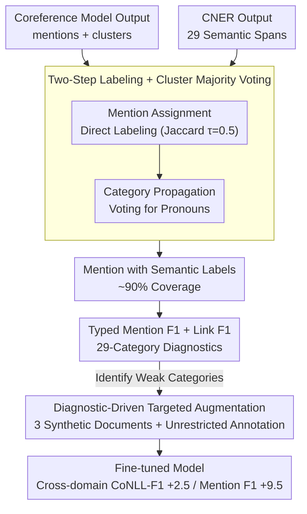

# Interpretable Coreference Resolution Evaluation Using Explicit Semantics

**Conference**: ACL 2026  
**arXiv**: [2605.10627](https://arxiv.org/abs/2605.10627)  
**Code**: https://github.com/SapienzaNLP/cner-coref (Available)  
**Area**: Interpretability / Coreference Resolution / Evaluation / Data Augmentation  
**Keywords**: Coreference Resolution, CNER, Semantic Evaluation, Typed F1, Targeted Data Augmentation

## TL;DR
This paper employs Concept and Named Entity Recognition (CNER) to map 29 fine-grained semantic labels onto coreference resolution outputs via "mention + cluster-level majority voting." It derives category-stratified Mention F1 and Link F1 diagnostic metrics to identify systematic failures. These diagnostics then guide targeted data augmentation—using only 3 synthetic documents—raising the CoNLL-F1 of a LitBank-trained model on OntoNotes/PreCo by +2.5/+2.8 and Mention F1 by approximately +9.5.

## Background & Motivation

**Background**: Since the 1990s, the standard evaluation for coreference resolution has been the "triad" of MUC, $B^3$, and CEAF$_{\phi 4}$, averaged into the CoNLL-F1. These metrics require strict mention boundaries and pairwise link matching. Currently, joint encoder-decoder models like Maverick have achieved SOTA performance on OntoNotes.

**Limitations of Prior Work**: (i) A single aggregate score masks failure modes at the category level—a model might excel at person chains but fail completely on events or objects, which CoNLL-F1 cannot reveal. (ii) Cross-domain performance drops are difficult to attribute to boundary differences, annotation standards, or genuine linguistic deficits. (iii) Existing semantic evaluations (Agarwal et al. 2019) use standard 4-category NER labels (PER/ORG/LOC/MISC), yielding only ~50% coverage and insufficient granularity.

**Key Challenge**: A significant portion of mentions in coreference resolution are nominal concepts (e.g., "president," "city," "whale"). Traditional NER cannot label these, only providing tags for named entities. This results in "semantic coreference evaluation" lacking the coverage and granularity needed to locate core issues.

**Goal**: (1) Assign dense, fine-grained semantic labels to coreference clusters; (2) calculate typed F1 metrics stratified by semantic category; (3) guide low-cost data augmentation to validate diagnostic findings.

**Key Insight**: By utilizing CNER (Martinelli et al. 2024), which labels both named entities and nominal concepts across 29 categories, coverage is increased from the 22-52% of traditional NER to ~90%. A "cluster-level majority voting" mechanism is then used to propagate labels from anchors to mentions like pronouns that cannot be labeled directly.

**Core Idea**: Without modifying the coreference model, a CNER semantic layer is overlaid onto the coreference output. Mentions and CNER spans are aligned via token-level Jaccard overlap, and labels are propagated within clusters via majority voting, transforming coreference evaluation into a "category-stratified diagnostic interface."

## Method

### Overall Architecture

Input: Mention set $\mathcal{M} = \{m_1, ..., m_n\}$ and cluster set $\mathcal{G}$ predicted by a coreference model for document $D$, alongside CNER-predicted spans $\mathcal{C} = \{c_1, ..., c_k\}$ where each $c_j$ has a label $L(c_j) \in \mathcal{T}$ (comprising 29 categories like PERSON / LOCATION / EVENT / RELATION / SUPERNATURAL / PLANT / DISEASE, etc.). Two intermediate steps follow: (1) Mention Assignment uses Jaccard overlap to pair mention $m_i$ with the most overlapping CNER span $\hat{c}_j$, assigning the label if overlap exceeds $\tau=0.5$. (2) Category Propagation determines a cluster label $S(G) = \arg\max_{t \in \mathcal{T}} |\{m_G \in G : L(m_G) = t\}|$ via majority voting, then propagates $S(G)$ to all unlabeled mentions (including pronouns). Output: Every mention receives a CNER label, enabling the calculation of typed Mention F1 and Link F1.

### Key Designs

**1. Two-Step Labeling + Cluster Majority Voting: Including Pronouns in Semantic Diagnostics**

Traditional NER-based evaluation labels only 22.8% of mentions in PreCo; pronouns and vague references remain unlabeled, preventing per-class analysis. This work first uses an overlap function $\Omega(m_i, c_j) = |\text{span}(m_i) \cap \text{span}(c_j)| / |\text{span}(m_i) \cup \text{span}(c_j)|$ to measure token-level Jaccard overlap between mentions and CNER spans, selecting $\hat{c}_j = \arg\max \Omega$ for each mention (leaving it empty if overlap < 0.5). While direct labeling covers 37.5–71.4% of mentions, the constraint that mentions in the same cluster share semantic types allows majority voting to propagate labels to remaining slots (including pure pronouns). Ties are broken using the label with the highest average $\Omega$. This raises coverage to ~90%, with the remainder being pure pronoun clusters without nominal anchors.

**2. Typed Mention F1 + Link F1: Decoupling Recognition and Linking Capabilities**

CoNLL-F1 merges errors from boundaries, links, and clustering into a single number. This method splits evaluation into two independent dimensions: Mention F1 calculates the precision and recall of mention extraction for a specific category $t$ without considering clustering errors. Link F1, given gold mentions, evaluates whether mention pairs $(m_1^G, m_2^G)$ within the same cluster are correctly linked, specifically characterizing clustering quality decoupled from mention detection. Reporting these across 29 categories allows for precise pinpointing of issues, such as a model linking PERSON well but failing to even extract mentions for EVENT.

**3. Diagnostic-Driven Targeted Augmentation: Prescribing Data Solutions**

Traditional evaluation identifies problems but offers no intervention. This work translates diagnostic conclusions (e.g., "LitBank model crashes on PLANT/EVENT/MEDIA") into an augmentation recipe. GPT-5.1 generates 3 fictional narratives (~2000 words each) in LitBank style, intentionally embedding mentions of weak CNER categories. These are human-annotated under two protocols: "Restricted" (labeling only the original 6 LitBank categories) and "Unrestricted" (covering all nominal and pronoun mentions). These are merged into the training set to produce "augmented" and "augmented-NR" models. The small scale (3 documents) is used to prove that if these targeted additions lead to significant recovery in typed F1, the diagnostics are actionable.

### Loss & Training

The coreference models are not modified. Three official Maverick (multi-expert version) checkpoints are used (trained on OntoNotes, LitBank, and PreCo). The CNER semantic layer uses an official CNER checkpoint for inference. For augmentation, the LitBank-augmented model is fine-tuned following the original Maverick process on the original LitBank set plus the 3 synthetic documents.

## Key Experimental Results

### Main Results (Macro Mention/Link F1 for Maverick Variants across 3 Datasets)

| Model | OntoNotes M-F1 | LitBank M-F1 | PreCo M-F1 | OntoNotes L-F1 | LitBank L-F1 | PreCo L-F1 |
|-------|----------------|--------------|------------|----------------|--------------|------------|
| maverick-mes-ontonotes | **0.85** | 0.48 | 0.40 | **0.77** | 0.53 | 0.57 |
| maverick-mes-litbank | 0.40 | **0.78** | 0.31 | 0.43 | 0.53 | 0.47 |
| maverick-mes-preco | 0.53 | 0.35 | **0.93** | 0.47 | 0.46 | **0.82** |

All models perform strongly in-domain, but the LitBank-trained model shows significantly lower macro Mention F1 cross-domain. Per-class Mention F1 reveals the LitBank model ranks lowest for nearly all non-PER categories. Link F1 results calculated with gold mentions confirm that person-centric bias exists in the clustering logic itself, not just in mention detection. Coverage for CNER vs. NER (Post-labeling + Propagation): OntoNotes 90% vs 52.8%, LitBank 90% vs 29.6%, PreCo 90% vs 22.8%.

### Ablation Study (LitBank Training + 3 Synthetic Documents, Cross-domain)

| Model | PreCo CoNLL-F1 | OntoNotes CoNLL-F1 | Avg CoNLL-F1 | Avg Link F1 | Avg Mention F1 |
|-------|----------------|---------------------|--------------|-------------|-----------------|
| maverick-mes-litbank | 45.5 | 51.7 | 48.6 | 29.89 | 30.58 |
| augmented (Restricted) | 44.7 | 51.9 | 48.3 | 30.67 | 28.01 |
| **augmented-NR (Unrestricted)** | **49.7** | **52.5** | **51.1** | **32.02** | **37.49** |
| Gain (NR vs Restricted) | +5.0 | +0.6 | +2.8 | +1.35 | **+9.49** |

### Key Findings

- LitBank's person-centric annotation (83.1% PER) causes significant overfitting: the model systematically fails on almost all non-PER categories cross-domain, a fact hidden by CoNLL-F1.
- The gap between NER and CNER is structural—NER only labels 22-53% of mentions, often collapsing many types into a "MISC" black box. CNER exposes specific failure modes for types like GROUP, MEDIA, or SUPERNATURAL.
- The Unrestricted augmentation improved CoNLL-F1 by +2.5 and Mention F1 by +9.5, while "Restricted" annotation (only LitBank's 6 categories) performed worse, showing the problem lies in annotation scope, not data volume.
- Semantic bias infects both mention extraction and clustering links; these mechanisms are coupled in their failure.

## Highlights & Insights

- Using "Concept + NER" to include nominal concepts is a simple yet powerful improvement, raising coverage from 22% to 90%. It demonstrates that evaluation bottlenecks are often tool-related.
- Cluster-level majority voting is a highly transferable trick applicable to any task involving clusters where some mentions can be independently labeled.
- The "Diagnostic → 3 Synthetic Docs → +9.5 M-F1" loop elevates evaluation from "scoring" to "engineering guidance." Actionability should be a requirement for future NLP evaluation papers.
- The contrast between Restricted and Unrestricted results provides a valuable lesson: annotation standards, not just data scale, are critical for cross-domain robustness.

## Limitations & Future Work

- CNER cluster-level label precision is 90% ($F1=88\%$); about 10-12% label noise propagates to Typed F1.
- ~10% of mentions remain unlabeled (mostly pure pronoun clusters); weak supervision could be used to train specialized classifiers for these.
- The framework is currently validated only for English, as it depends on multi-lingual CNER models.
- Data augmentation was a small-scale PoC; industrial-scale augmentation and quality control remain to be established.

## Related Work & Insights

- **vs. Agarwal et al. 2019 (NER-based evaluation)**: They also use semantic categories but are limited to 4 NER classes and <53% coverage. This work scales to 29 categories and 90% coverage.
- **vs. Kummerfeld & Klein 2013 (error analysis toolkit)**: That toolkit focuses on *error modes*, while this work focuses on *semantic categories*; they are complementary.
- **vs. Porada et al. 2024 (annotation guideline analysis)**: This paper provides an actionable solution (Unrestricted augmentation) to the cross-domain gaps they identified as being caused by annotation differences.

## Rating
- Novelty: ⭐⭐⭐⭐ Utilizing CNER for coreference is a first; the two-step propagation is elegant.
- Experimental Thoroughness: ⭐⭐⭐⭐ Extensive cross-dataset testing, manual validation, and counterfactual augmentation experiments.
- Writing Quality: ⭐⭐⭐⭐⭐ Extremely clear argumentation and effective use of figures to support claims.
- Value: ⭐⭐⭐⭐⭐ Offers a methodological blueprint for "actionable evaluation" in NLP.

<!-- RELATED:START -->

## Related Papers

- [\[ICML 2026\] LLMs Lean on Priors, Not Programming Language Semantics](../../ICML2026/interpretability/llms_lean_on_priors_not_programming_language_semantics.md)
- [\[ACL 2025\] CLEME2.0: Towards Interpretable Evaluation by Disentangling Edits for Grammatical Error Correction](../../ACL2025/interpretability/cleme2_gec_evaluation.md)
- [\[ACL 2026\] Constructing Interpretable Features from Compositional Neuron Groups](constructing_interpretable_features_from_compositional_neuron_groups.md)
- [\[AAAI 2026\] CrossCheck-Bench: Diagnosing Compositional Failures in Multimodal Conflict Resolution](../../AAAI2026/interpretability/crosscheck-bench_diagnosing_compositional_failures_in_multim.md)
- [\[ACL 2026\] Interpretable Traces, Unexpected Outcomes: Investigating the Disconnect in Trace-Based Knowledge Distillation](interpretable_traces_unexpected_outcomes_investigating_the_disconnect_in_trace-b.md)

<!-- RELATED:END -->
