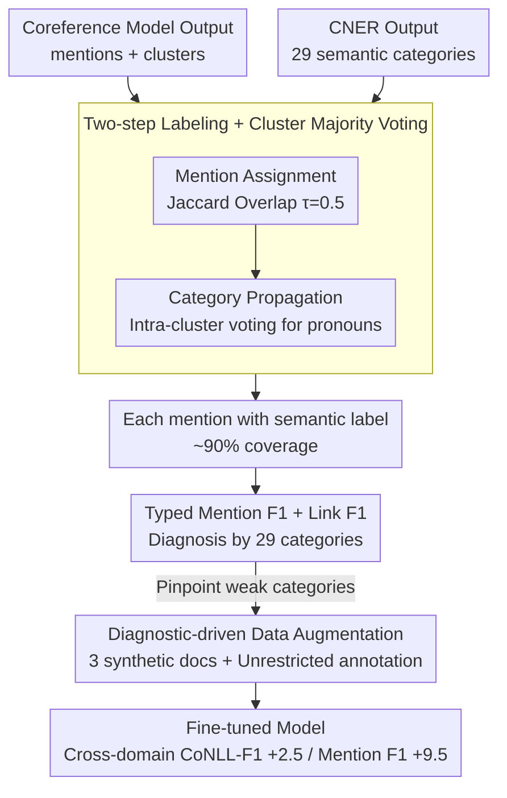

# Interpretable Coreference Resolution Evaluation Using Explicit Semantics

**Conference**: ACL 2026  
**arXiv**: [2605.10627](https://arxiv.org/abs/2605.10627)  
**Code**: https://github.com/SapienzaNLP/cner-coref (Available)  
**Area**: Interpretability / Coreference Resolution / Evaluation / Data Augmentation  
**Keywords**: Coreference Resolution, CNER, Semantic Evaluation, Typed F1, Targeted Data Augmentation

## TL;DR
This paper utilizes Concept and Named Entity Recognition (CNER) to map 29 fine-grained semantic labels onto coreference resolution outputs via a "mention + cluster-level majority voting" mechanism. This yields diagnostic Typed Mention F1 and Link F1 metrics, identifying systematic failure modes across semantic categories. These diagnostics guide targeted data augmentation using only three synthetic documents, improving the CoNLL-F1 of a LitBank-trained model on OntoNotes/PreCo by +2.5/+2.8 and Mention F1 by approximately +9.5.

## Background & Motivation

**Background**: Since the 1990s, the mainstream evaluation of coreference resolution has relied on the MUC, $B^3$, and CEAF$_{\phi 4}$ metrics and their average, CoNLL-F1. These require strict mention boundaries and pairwise link matching. Encoder-decoder joint models, such as Maverick, have achieved SOTA results on OntoNotes.

**Limitations of Prior Work**: (i) A single aggregated score masks category-level failure modes—a model might excel at person chains but fail completely on event or object chains, which is invisible via CoNLL-F1; (ii) Performance drops during cross-domain evaluation, yet it is unclear whether this is due to boundary differences, annotation standards, or genuine linguistic deficits; (iii) Existing semantic evaluations (Agarwal et al. 2019) use standard NER with only 4 categories (PER/ORG/LOC/MISC), achieving only ~50% coverage with coarse granularity.

**Key Challenge**: A significant portion of mentions in coreference resolution are nominal concepts (e.g., *president*, *city*, *whale*), which traditional NER fails to label. Consequently, semantic evaluations of coreference resolution suffer from insufficient coverage and granularity to pinpoint real issues.

**Goal**: (1) Assign dense, fine-grained semantic labels to coreference clusters; (2) Calculate Typed F1 metrics stratified by these semantic categories; (3) Validate the feasibility of using diagnostic results to guide low-cost data augmentation.

**Key Insight**: By employing CNER (Martinelli et al. 2024), which labels both named entities and nominal concepts across 29 categories, coverage increases from NER's 22-52% to ~90%. A "cluster-level majority voting" mechanism is then used to propagate labels to mentions that cannot be directly labeled, such as pronouns.

**Core Idea**: While keeping the coreference model unchanged, a CNER semantic layer is overlaid on the coreference output. Mentions and CNER spans are aligned using token-level Jaccard overlap, followed by cluster-level majority voting to propagate labels, transforming coreference evaluation into a "category-stratified diagnostic interface."

## Method

### Overall Architecture

Input: Mention set $\mathcal{M} = \{m_1, ..., m_n\}$ and cluster set $\mathcal{G}$ predicted by a coreference model for document $D$, along with labeled spans $\mathcal{C} = \{c_1, ..., c_k\}$ from CNER, where each $c_j$ has a label $L(c_j) \in \mathcal{T}$ (with $|\mathcal{T}|=29$). Process: (1) Mention Assignment aligns mention $m_i$ to the CNER span $\hat{c}_j$ with maximum Jaccard overlap; labels are assigned if overlap $> \tau=0.5$. (2) Category Propagation determines $S(G) = \arg\max_{t \in \mathcal{T}} |\{m_G \in G : L(m_G) = t\}|$ via majority voting within each cluster $G$, propagating $S(G)$ to all unlabeled mentions (including pronouns). Output: Each mention carries a CNER label, enabling stratified Typed Mention F1 / Link F1 calculations.

### Key Designs

**1. Two-step Labeling + Cluster Majority Voting: Bringing Pronouns into Semantic Diagnosis**

Traditional NER-based evaluation labels only 22.8% of mentions in PreCo, leaving pronouns and vague references unlabeled and preventing per-class analysis. This method first uses an overlap function $\Omega(m_i, c_j) = |\text{span}(m_i) \cap \text{span}(c_j)| / |\text{span}(m_i) \cup \text{span}(c_j)|$ to measure token-level Jaccard overlap between mentions and CNER spans. The overlap $\hat{c}_j = \arg\max \Omega$ is selected, leaving mentions with overlap $< 0.5$ empty. This direct assignment covers 37.5–71.4% of mentions. Leveraging the constraint that mentions in the same cluster must share the same semantic type, majority voting propagates labels to remaining positions (including pure pronouns), with ties broken by the highest average $\Omega$. This increases coverage to ~90%, with the remainder being pure pronoun clusters lacking nominal anchors.

**2. Typed Mention F1 + Link F1: Decoupling Identification and Linking Abilities**

CoNLL-F1 merges boundary, linking, and clustering errors into a single number. This paper separates evaluation into two independent dimensions: Mention F1 calculates extraction precision and recall for a specific category $t$ without considering cluster correctness; Link F1, given gold mentions, evaluates whether mention pairs $(m_1^G, m_2^G)$ within the same cluster are correctly linked, isolating the quality of the clustering structure. Stratifying these by 29 semantic categories allows for precise diagnostics, such as "the model links PER well but fails to detect EVENT mentions."

**3. Diagnostic-driven Targeted Data Augmentation: Turning Evaluation into a Prescription**

Traditional evaluation identifies problems without suggesting interventions. This paper translates diagnostic conclusions (e.g., "the LitBank model collapses on PLANT/EVENT/MEDIA categories") into an augmentation recipe: using GPT-5.1 to generate 3 fictional narratives (~2000 words each) in the style of LitBank, intentionally including weak CNER categories. These are human-annotated under two standards: Restricted (original 6 LitBank categories) and Unrestricted (all nominal and pronoun mentions). These are merged into the training set to produce "augmented" and "augmented-NR" models. Using only 3 documents demonstrates that if such minimal data improves the targeted weak categories, the diagnosis is highly actionable.

### Loss & Training

The coreference model remains unchanged, utilizing three official Maverick (mes multi-expert) checkpoints (trained on OntoNotes / LitBank / PreCo). The CNER semantic layer is inferred directly using the official CNER checkpoint. For augmentation, the LitBank-augmented model is fine-tuned following the original Maverick process on the LitBank training set plus 3 synthetic documents. Mention/Link F1 are calculated using standard precision/recall harmonic means.

## Key Experimental Results

### Main Results (Macro Mention/Link F1 for Maverick variants across 3 datasets)

| Model | OntoNotes M-F1 | LitBank M-F1 | PreCo M-F1 | OntoNotes L-F1 | LitBank L-F1 | PreCo L-F1 |
|-------|----------------|--------------|------------|----------------|--------------|------------|
| maverick-mes-ontonotes | **0.85** | 0.48 | 0.40 | **0.77** | 0.53 | 0.57 |
| maverick-mes-litbank | 0.40 | **0.78** | 0.31 | 0.43 | 0.53 | 0.47 |
| maverick-mes-preco | 0.53 | 0.35 | **0.93** | 0.47 | 0.46 | **0.82** |

All models perform strongly in-domain, but the LitBank model shows significantly lower cross-domain macro Mention F1. Per-class Mention F1 indicates the LitBank model ranks lowest for nearly all non-PER categories. Link F1 using gold mentions remains worst for LitBank training, confirming that clustering logic carries a person-centric bias. CNER coverage vs. NER (Post-labeling + Post-propagation): OntoNotes 90% vs 52.8%, LitBank 90% vs 29.6%, PreCo 90% vs 22.8%.

### Ablation Study (LitBank training + 3 synthetic docs, cross-domain)

| Model | PreCo CoNLL-F1 | OntoNotes CoNLL-F1 | Avg CoNLL-F1 | Avg Link F1 | Avg Mention F1 |
|-------|----------------|---------------------|--------------|-------------|-----------------|
| maverick-mes-litbank | 45.5 | 51.7 | 48.6 | 29.89 | 30.58 |
| augmented (Restricted) | 44.7 | 51.9 | 48.3 | 30.67 | 28.01 |
| **augmented-NR (Unrestricted)** | **49.7** | **52.5** | **51.1** | **32.02** | **37.49** |
| Gain (NR vs Restricted) | +5.0 | +0.6 | +2.8 | +1.35 | **+9.49** |

### Key Findings

- LitBank's person-centric annotation (83.1% PER) causes model over-fitting: the model systematically collapses on non-PER categories cross-domain, a fact hidden by CoNLL-F1.
- The gap between NER and CNER is structural—NER only labels 22-53%, grouping many classes into a "MISC" black box. CNER sub-classes reveal independent failure modes for GROUP, MEDIA, and SUPERNATURAL.
- Augmented-NR improved average CoNLL-F1 by +2.5 and Mention F1 by +9.5, whereas Restricted annotation performed worse (-2.6 Mention F1), proving that the issue is the breadth of annotation standards rather than data volume.
- Semantic bias pollutes both mention extraction and cluster linking; these mechanisms are coupled in their failure.

## Highlights & Insights

- Incorporating nominal concepts via CNER is a simple yet powerful improvement, boosting coverage from 22% to 90% and categories from 4 to 29, demonstrating how tool upgrades can resolve evaluation bottlenecks.
- Cluster-level majority voting is a highly transferable trick for any task involving entity/event clustering where only some mentions are easily labeled (e.g., entity linking, dialogue role tracking).
- The transition from diagnosis to synthetic data to measurable gains (+9.5 Mention F1) demonstrates "evaluation actionability," shifting evaluation from mere scoring to engineering guidance.
- The comparison between Restricted and Unrestricted annotations refutes the naive assumption that "any augmentation helps," highlighting that annotation standards are often more critical than data scale.

## Limitations & Future Work

- CNER cluster-level label precision is 90% (F1 88%), meaning ~10% label noise persists in typed F1 metrics.
- ~10% of mentions (mostly pure pronoun clusters) remain unlabeled; the authors suggest using weak supervision for a lightweight classifier in the future.
- The framework is validated only for English; expansion depends on multilingual CNER models.
- Data augmentation was a small-scale PoC; industrial-grade augmentation and quality control are not yet established.
- Comparison with LLM-based coreference (e.g., zero-shot GPT-4) was not included, though the framework could accommodate it.

## Related Work & Insights

- **vs Agarwal et al. 2019**: They also used semantic categories for stratified evaluation but were limited by NER (4 categories, <53% coverage). This work scales significantly in both coverage and granularity.
- **vs Kummerfeld & Klein 2013**: They focused on clustering error types (e.g., span mismatch); this work focuses on semantic entity types. The two are complementary.
- **vs Porada et al. 2024**: They argued cross-domain gaps stem from annotation standards. This work provides an actionable solution via Typed F1 and Unrestricted augmentation.

## Rating
- Novelty: ⭐⭐⭐⭐ First use of CNER for coreference evaluation; simple and elegant propagation.
- Experimental Thoroughness: ⭐⭐⭐⭐ Complete evidence chain across 3 datasets, 3 models, and counterfactual augmentation experiments.
- Writing Quality: ⭐⭐⭐⭐⭐ Extremely clear argumentation and effective visualizations.
- Value: ⭐⭐⭐⭐⭐ High methodological value for the broader NLP community and direct utility for coreference resolution researchers.

<!-- RELATED:START -->

## Related Papers

- [\[ICML 2026\] LLMs Lean on Priors, Not Programming Language Semantics](../../ICML2026/interpretability/llms_lean_on_priors_not_programming_language_semantics.md)
- [\[ACL 2025\] CLEME2.0: Towards Interpretable Evaluation by Disentangling Edits for Grammatical Error Correction](../../ACL2025/interpretability/cleme2_gec_evaluation.md)
- [\[AAAI 2026\] CrossCheck-Bench: Diagnosing Compositional Failures in Multimodal Conflict Resolution](../../AAAI2026/interpretability/crosscheck-bench_diagnosing_compositional_failures_in_multim.md)
- [\[ACL 2026\] Constructing Interpretable Features from Compositional Neuron Groups](constructing_interpretable_features_from_compositional_neuron_groups.md)
- [\[CVPR 2025\] Scaling Vision Pre-Training to 4K Resolution](../../CVPR2025/interpretability/scaling_vision_pre-training_to_4k_resolution.md)

<!-- RELATED:END -->
