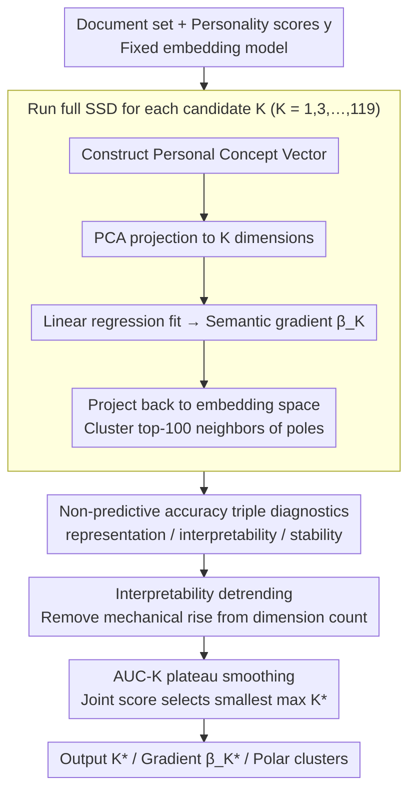

# Interpretable Semantic Gradients in SSD: A PCA Sweep Approach and a Case Study on AI Discourse

**Conference**: ACL 2026  
**arXiv**: [2603.13038](https://arxiv.org/abs/2603.13038)  
**Code**: TBA  
**Area**: Interpretability / Psycholinguistics / Embedding Analysis  
**Keywords**: Supervised Semantic Differential, PCA Sweep, Semantic Gradients, Narcissism, Researcher Degrees of Freedom

## TL;DR
This paper proposes a PCA sweep procedure for Supervised Semantic Differential (SSD)—a method that estimates semantic gradients of text embeddings using individual difference variables. The procedure jointly utilizes interpretability and stability diagnostics (rather than predictive accuracy) to select the PCA dimension $K$. In a case study involving 349 AI-themed essays and narcissism questionnaires, the sweep-selected $K=15$ yielded a stable semantic gradient of "optimistic collaboration vs. distrustful mockery" related to Admiration, whereas a counterfactual $K=120$ resulted in chaotic and uninterpretable clusters.

## Background & Motivation

**Background**: The Semantic Differential paradigm in psychology has a 70-year tradition of using polar adjectives (e.g., warm/cold) to measure the connotative meaning of concepts. Modern distributed semantics transfers this idea to word vector spaces. Supervised Semantic Differential (SSD, Plisiecki et al. 2025) combines both by pooling each author’s text into a Personal Concept Vector (PCV) and performing linear regression against personality scores. The normalized regression coefficients are treated as "semantic gradients," which are then analyzed by clustering neighbors of the positive and negative poles to estimate how personality differences modulate relational meaning in language.

**Limitations of Prior Work**: A critical unresolved degree of freedom in the SSD workflow is the application of PCA before regression; the choice of $K$ (the number of principal components to retain) has remained arbitrary and dependent on researcher aesthetics. This falls into the "undisclosed analytical flexibility" trap warned by Simmons et al. (2011), creating backdoors for false-positive conclusions and undermining the credibility of gradient interpretations.

**Key Challenge**: A $K$ that is too low loses essential semantic structure, while a $K$ that is too high captures noise dimensions in small corpora, biasing the regression direction. The conventional approach of selecting $K$ via predictive accuracy conflicts with SSD’s goals—the $K$ that predicts best is not necessarily the most semantically coherent.

**Goal**: (1) Propose a $K$-selection procedure independent of predictive accuracy, specifically designed for interpretability-focused methods; (2) Validate this procedure in a real-world psychological case study to demonstrate its ability to provide interpretable and falsifiable semantic gradients.

**Key Insight**: View $K$ selection as a joint optimization of two properties: "stability of semantic structure" and "interpretability of clustering." An optimal $K$ should yield coherent semantic clusters while ensuring the gradient direction remains nearly unchanged under neighboring $K$ values.

**Core Idea**: Scan $K \in \{1,3,...,119\}$ and run the full SSD for each $K$. Record "detrended interpretability" (interpretability after removing the trend of log-variance explained) and "unit change" (stability, measured by the cosine distance between gradients of adjacent $K$). Apply local smoothing to both metrics and calculate a joint score to identify the smallest $K$ at the maximum plateau.

## Method

### Overall Architecture

Input: A collection of documents $\{d_i\}$ paired with continuous outcomes $y_i$ (personality scores), a fixed embedding model, and an optional lexicon. Mechanism: (1) For each candidate $K$, apply identical preprocessing to construct Personal Concept Vectors $\mathbf{x}_i \in \mathbb{R}^D$, project via PCA to $\tilde{\mathbf{x}}_i \in \mathbb{R}^K$, and fit $y_i = \alpha + \boldsymbol{\beta}^\top \tilde{\mathbf{x}}_i + \epsilon_i$ where the normalized coefficients yield the gradient $\hat{\boldsymbol{\beta}}_K$; (2) Project back to the original space, cluster the top-100 neighbors of the positive and negative poles, and select the number of clusters $k \in [2,5]$ via silhouette scores; (3) Compute three diagnostics: representation (cumulative variance explained), interpretability (cluster coherence + cosine alignment of cluster centroids with the gradient, weighted by cluster size), and stability ($\Delta_K = 1 - \cos(\hat{\boldsymbol{\beta}}_K, \hat{\boldsymbol{\beta}}_{K-1})$); (4) Detrend interpretability against log-variance explained, compute z-scores, apply local AUC-K smoothing for interpretability and stability, and finally select the smallest $K$ with the highest joint score. Output: The selected $K^*$, the corresponding gradient $\hat{\boldsymbol{\beta}}_{K^*}$, and the polar clusters.

### Key Designs

**1. "Anti-predictive accuracy" $K$ selection based on triple diagnostics: Aligning hyperparameters with interpretation**

SSD is an interpretative method, yet using $R^2$ or $F$-statistics to select $K$ biases results toward high dimensions where overfitted regressions yield the highest scores. This paper compute all diagnostics **after** the regression and intentionally avoids dependency on goodness-of-fit: representation tracks cumulative variance, interpretability measures cluster coherence and centroid-gradient alignment, and stability measures the cosine difference $\Delta_K$ between adjacent gradients. This rewards "consistent semantic structure" rather than "better fit to personality scores."

The necessity of this criterion is confirmed by the counterfactual: $K=120$ yields a higher $R^2$ (0.234) than the sweep-selected $K=15$ (0.19), but the former's semantic clusters completely disintegrate. Selecting hyperparameters by predictive accuracy would lead directly into noise dimensions—the very trap interpretative methods like SSD must avoid.

**2. Detrending design for interpretability: Stripping the mechanical rise of "dim-driven clustering"**

Raw interpretability scores are monotonically inflated by $K$—as dimensions increase, neighbors within clusters naturally appear tighter. This mechanical rise masks genuine transition points, making it impossible to identify where the signal degrades. This method calculates its aggregated interpretability score for each $K$ and performs regression detrending using log(cumulative variance explained). The z-scored residuals are then used as the final metric.

The resulting "detrended interpretability" measures "signal beyond natural dimensional growth," effectively normalizing the metric to a fair baseline. Only after stripping this artificial upward trend can the plateau sought by AUC-K smoothing truly emerge.

**3. Plateau-sensitive smoothing (AUC-K): Rewarding stable regions over isolated peaks**

Even after detrending, the interpretability curve remains volatile at low $K$, where single-point peaks are often noise. The method applies a local average over a radius-3 neighborhood around $K$ to produce AUC-K values for both interpretability and stability. After z-score normalization, it calculates a joint score: $\text{joint\_score}_K = \frac{1}{2}(\text{interp\_auck}_K + \text{stab\_auck}_K)$. The final $K^*$ is chosen as $\min \arg\max_K \text{joint\_score}_K$.

Smoothing identifies plateaus where "the entire region is good," rather than chasing fleeting local peaks. The "min-of-max" rule favors the lowest dimension among tied regions, adhering to the principle of parsimony. This upgrades hyperparameter selection from aesthetic visual inspection to an automated procedure with explicit criteria.

### Loss & Training

A simple linear regression $y_i = \alpha + \boldsymbol{\beta}^\top \tilde{\mathbf{x}}_i + \epsilon_i$ is trained using standard OLS, refitted for each candidate $K$. Embeddings use Dolma 300-d GloVe with SIF weighting ($a=10^{-3}$) and removal of the top principal component. Clustering uses silhouette scores to determine $k \in [2,5]$. The computational cost of the sweep is proportional to $|K| \times$ the duration of a single SSD run, which remains inexpensive on desktop-grade hardware.

## Key Experimental Results

### Main Results (349 AI-themed essays + Narcissism NARQ, regression after sweep-selected $K$)

| Trait | Selected $K$ | $R^2_{\text{adj}}$ | $F$ | $p$ | $r$ | $\|\hat{\boldsymbol{\beta}}\|$ |
|-------|--------------|-------------------|-----|-----|-----|--------------------------------|
| Admiration (ADM) | **15** | **0.19** | 6.32 | $<10^{-10}$ | 0.47 | 5.58 |
| Rivalry (RIV) | 23 | 0.03 | 1.43 | 0.095 | 0.30 | 5.38 |

ADM sweep diagnostics: The interpretability curve rises sharply at low $K$ and peaks at $K=15$ (explaining 50% of PCV variance), where the stability curve also forms a plateau. The positive and negative poles of ADM were qualitatively clustered into four themes:

| Pole | Cluster Size | Theme (Top Words + Excerpts) |
|------|--------------|------------------------------|
| + | 14 | Cultivation & enrichment: cultivate, rediscover, rejuvenated — "AI's potential is boundless..." |
| + | 86 | Innovation & collaboration: innovation, partnership, empower — "AI is transforming our world..." |
| − | 56 | Deception & threat: misleading, dishonest, unfair — "woke, evasive..." |
| − | 44 | Ridicule & contempt: ridiculous, absurd, laughable — "the stupid programmers..." |

### Ablation Study (Counterfactual $K=120$ High-Dim Approach)

| Configuration | $R^2_{\text{adj}}$ | $p$ | Semantic Coherence |
|---------------|---------------------|-----|-------------------|
| Sweep $K=15$ | 0.19 | $<10^{-10}$ | 4 clearly themed clusters |
| Counterfactual $K=120$ | **0.234** (Higher) | $2.17 \times 10^{-5}$ | Scattered clusters (geopolitics, brands, animals, gardening) |

$K=120$ achieved a higher $R^2$ but returned clusters like "inclusive, asean, maldives, rolex, brics" or "birds, rabbits, squirrels," which were irrelevant to the AI topic. This proves that high-dimensional PCA forces noise dimensions into the gradient direction, causing interpretability to collapse as the score rises.

### Key Findings

- "High $R^2 \neq$ Good Semantics" was confirmed: $K=120$ had an $R^2$ $0.04$ higher than $K=15$, yet its clusters were uninterpretable. This serves as a warning against selecting hyperparameters based solely on predictive accuracy in mixed-method research.
- The sweep-selected $K=15$ coincided with the 50% variance explain point, where interpretability peaks and stability plateaus aligned—strong evidence that the sweep procedure is capturing meaningful structure.
- The semantic polarity of "optimistic collaboration vs. distrustful mockery" for ADM aligns with psychological theory (Admiration as an agentic, status-seeking trait prone to positive identifying narratives), demonstrating that SSD + sweep can produce publishable psychological findings.
- For RIV, the sweep selected $K=23$ but identified that the regression was not significant ($p=0.095$). This shows the procedure does not manufacture significance but rather identifies when the method fails to find a signal.
- The entire workflow was successfully run on a sample of 349, proving its lightweight nature and accessibility for the psychological research community.

## Highlights & Insights

- The methodological reminder to "align diagnostics with evaluation goals" is profound. Since SSD is interpretative, hyperparameter selection should be based on interpretability/stability rather than predictive power. This principle can be generalized to any mixed-method task (topic modeling, explanatory PCA, clustering).
- The "detrending" and "AUC-K plateau smoothing" tricks solve the issues of mechanical metric rise and local noise peaks, and could be applied to any hyperparameter scanning scenario.
- The counterfactual $K=120$ experiment is highly instructional; by proactively providing a "better-looking $R^2$" counter-example, the authors prove their advantage lies in structure rather than raw numbers.
- Linking psychological individual differences (Narcissistic Admiration) directly to linguistic embedding gradients, and providing qualitative extreme texts, provides a model for quantitative socio-psychological research in the embedding era.

## Limitations & Future Work

- The case study is limited to 349 short texts, a single language (English), one platform (Prolific), and one topic (AI), limiting claims of generalizability. The authors acknowledge that the sweep only resolves the $K$ degree of freedom, while embedding model choice and word window sizes remain unprincipled.
- The use of "full-text PCVs" rather than lexicon-based PCVs was justified by the topic-specific prompt, yet it might blur fine-grained semantics.
- Psychological interpretations remain correlational without intervention; the "optimistic narrative preference" in ADM might also reflect LLM sycophancy bias combined with user rewriting (Perez et al. 2022).
- The robustness of the sweep procedure on very small corpora ($N < 200$) was not verified, and the counterfactual behavior of high-dim PCA was only tested at one point ($K=120$).

## Related Work & Insights

- **vs. Plisiecki et al. 2025 (Original SSD)**: This work extends the chain by upgrading $K$ selection from researcher intuition to principled scanning.
- **vs. Mimno et al. 2011 (Topic Coherence)**: While they use coherence to evaluate topic models, this paper grafts similar logic onto the "interpretability" of regression gradients.
- **vs. Garg et al. 2018 / Kozlowski et al. 2019 (Embedding Bias)**: These studies use embedding directions to study social norms; this paper uses "gradient direction + individual differences" for fine-grained personality linguistics.
- **vs. Simmons et al. 2011 (False-positive psychology)**: This is a tool-level response to the call for reducing undisclosed analytical flexibility in the SSD workflow.

## Rating
- Novelty: ⭐⭐⭐ Components (PCA sweep, coherence, stability) are not new individually, but their combination for SSD is a first.
- Experimental Thoroughness: ⭐⭐⭐ Only one case study and one counterfactual; small scale, but sufficient as a methodological PoC.
- Writing Quality: ⭐⭐⭐⭐ Motivation and method descriptions are clear, formulas are concise, and the boundary between method and case study is honestly discussed.
- Value: ⭐⭐⭐⭐ An immediately usable tool for SSD users and a methodological model for "embedding space + psychological variables" research, though slightly narrowed by its specialized audience.

<!-- RELATED:START -->

## Related Papers

- [\[ACL 2026\] Understanding or Memorizing? A Case Study of German Definite Articles in Language Models](understanding_or_memorizing_a_case_study_of_german_definite_articles_in_language.md)
- [\[ICML 2025\] Do Sparse Autoencoders Generalize? A Case Study of Answerability](../../ICML2025/interpretability/do_sparse_autoencoders_generalize_a_case_study_of_answerability.md)
- [\[ACL 2026\] A Structured Clustering Approach for Inducing Media Narratives](a_structured_clustering_approach_for_inducing_media_narratives.md)
- [\[ACL 2026\] Rhetorical Questions in LLM Representations: A Linear Probing Study](rhetorical_questions_in_llm_representations_a_linear_probing_study.md)
- [\[ACL 2026\] NOSE: Neural Olfactory-Semantic Embedding with Tri-Modal Orthogonal Contrastive Learning](nose_neural_olfactory-semantic_embedding_with_tri-modal_orthogonal_contrastive_l.md)

<!-- RELATED:END -->
