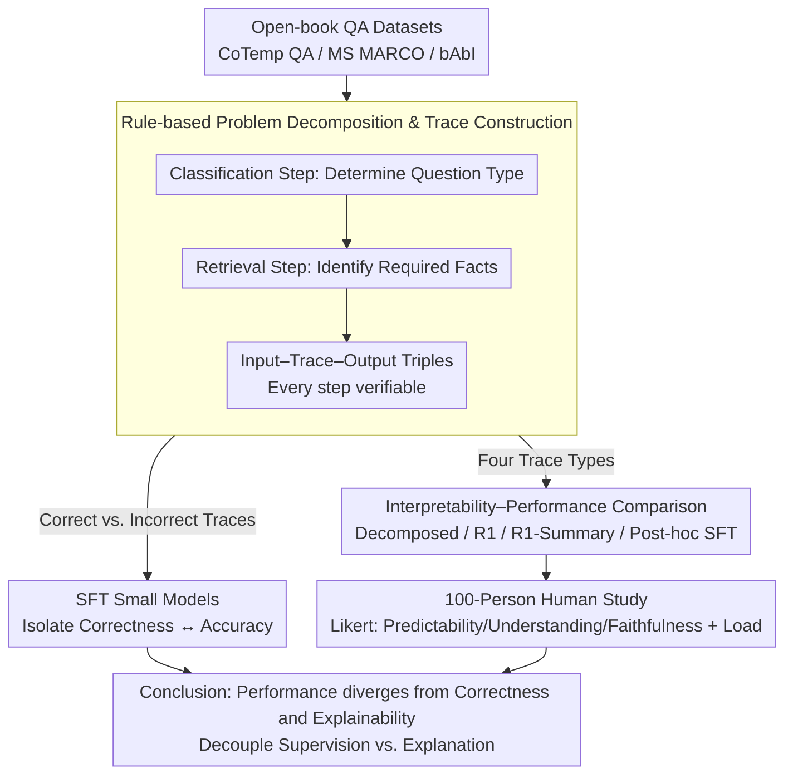

# Interpretable Traces, Unexpected Outcomes: Investigating the Disconnect in Trace-Based Knowledge Distillation

**Conference**: ACL 2026  
**arXiv**: [2505.13792](https://arxiv.org/abs/2505.13792)  
**Code**: Yes (GitHub)  
**Area**: Explainability / Knowledge Distillation  
**Keywords**: CoT reasoning chains, knowledge distillation, semantic correctness, explainability, reasoning chain faithfulness

## TL;DR
By constructing a verifiable intermediate reasoning chain dataset using a rule-based problem decomposition method, this work reveals that the semantic correctness of CoT reasoning chains is unreliably correlated with final answer accuracy (correct chains lead to correct answers only 28% of the time). Furthermore, the most interpretable reasoning chains are not the most performance-enhancing—lengthy R1 chains perform best but are rated as the least interpretable by users.

## Background & Motivation

**Background**: Reasoning LLMs (e.g., DeepSeek R1) enhance performance by generating Chain-of-Thought (CoT) reasoning chains. These traces serve as inference-time guidance and are also used as supervision signals for knowledge distillation (KD) to improve smaller models.

**Limitations of Prior Work**: A common but untested implicit assumption is that CoT reasoning chains are both semantically correct at inference time and interpretable to end users. However, SFT training objectives do not require reasoning chains to be semantically correct or interpretable, only that the final answer be correct. The lengthy and unstructured nature of reasoning chains makes verifying their effectiveness and explainability extremely difficult.

**Key Challenge**: Reasoning chains are assigned dual roles: (1) as training/inference signals for LLMs to improve performance, and (2) as explainability tools to clarify reasoning processes to users—but these two goals may be fundamentally contradictory.

**Goal**: Independently evaluate (1) whether the semantic correctness of CoT chains correlates with task performance, and (2) whether the interpretability of CoT chains correlates with task performance.

**Key Insight**: Utilize a rule-based problem decomposition method (classification step + information retrieval step) to construct SFT datasets with verifiable intermediate reasoning chains, allowing correctness and answer accuracy to be evaluated independently.

**Core Idea**: Demonstrate through verifiable experimental design that researchers should decouple "model supervision objectives" from "user-oriented reasoning chain design"—the two should not be conflated.

## Method

### Overall Architecture

This study addresses an assumed but unverified question: whether the roles of CoT reasoning chains as performance-boosting supervision signals and user-facing explanation tools are in conflict. To this end, the authors use rule-based problem decomposition to generate "independently verifiable at every step" intermediate reasoning chains on open-book QA (CoTemp QA, MS MARCO, Facebook bAbI). They construct multiple SFT data suites (correct chains / incorrect chains) to train small models, decoupling "semantic correctness of the chain" from "final answer accuracy." Additionally, a 100-person human explainability study is conducted to compare "the best-performing chains" with "the chains users find most interpretable."

### Key Designs

**1. Rule-based Problem Decomposition and Trace Construction: Enabling binary verification of intermediate steps**

CoT reasoning chains generated by LLMs are often noisy and lack deterministic truth values, making correctness evaluation dependent on probabilistic scoring. This work adopts a rule-based two-step decomposition: first, a classification step to determine the question type (e.g., temporal relation type); second, an information retrieval step to target the textual facts required for the answer. This constructs Input–Trace–Output triples where every step of the Trace can be independently compared against ground truth, yielding binary labels.

This verifiable framework allows precise control over experimental variables: SFT w/ Correct Traces uses correct classifications + correct facts, while SFT w/ Incorrect Traces intentionally uses incorrect classifications + incorrect facts while keeping the final answer correct. The difference lies solely in the semantic correctness of the intermediate chain, allowing the performance impact of semantic correctness to be cleanly isolated.

**2. Interpretability–Performance Comparison: Exposing the trade-offs**

If explainability and performance could be optimized simultaneously, the most interpretable chains should yield the best performance. If they conflict, "training signals" and "user explanations" must be decoupled. Four source traces were used for SFT to measure performance and interpretability on the same task: (1) rule-based decomposed correct chains, (2) lengthy raw traces from DeepSeek R1, (3) GPT-4o-mini summaries of R1 traces, and (4) GPT-4o-mini post-hoc explanations of R1 traces.

These four types cover the spectrum from "short, structured, and human-readable" to "long, unstructured, and machine-friendly." Comparing them reveals whether performance and explainability curves align—the study concludes they do not.

**3. 100-Person Human Explainability Study: Benchmarking "Interpretability"**

While model performance is measured by automated metrics, explainability remains a subjective human judgment. 100 participants were recruited via Prolific (25 per group) to rate the four trace types using Likert scales across predictability, understandability, and faithfulness, while also measuring cognitive load.

This design converts "explainability" from a researcher's claim into quantifiable user perception. It reveals the core contrast: R1 traces achieve optimal performance but are rated least interpretable with the highest cognitive load, while the most interpretable decomposed traces perform the worst.

### Training Strategy
SFT was performed using Llama-3.2-1B-Instruct and Qwen3-1.7B. For explainability experiments, Qwen3-8B and Llama-3.1-8B were additionally utilized.

## Key Experimental Results

### Main Results
Results on the CoTemp QA dataset:

| Model + Setup | Final Answer Accuracy | Classification Step Accuracy | IR Step Accuracy |
|----------|-------------|-------------|------------|
| Qwen3-1.7B SFT-Vanilla | 60.33% | — | — |
| Qwen3-1.7B SFT-Correct Traces | 52.88% | 47.06% | 78.99% |
| Qwen3-1.7B SFT-Incorrect Traces | **63.88%** | 20.36% | 56.92% |
| Llama SFT-Vanilla | 44.65% | — | — |
| Llama SFT-Correct Traces | 39.55% | 39.09% | 79.40% |
| Llama SFT-Incorrect Traces | **45.58%** | 18.80% | 73.62% |

### Explainability Evaluation

| Trace Type | Explainability Score (1-5) | Cognitive Load (1-5) | Model Performance |
|-----------|-----------------|-------------|---------|
| R1 Traces | 3.39 (Lowest) | 4.59 (Highest) | **Best** |
| R1 Summary | Medium | Medium | Medium |
| Post-hoc Explanation | Medium-High | Medium-Low | Medium |
| Decomposed Traces | **Highest** | **Lowest** | Lowest |

### Key Findings
- Correct reasoning chains lead to correct final answers only 28% of the time—semantic correctness is unreliably correlated with answer accuracy.
- Models trained on incorrect reasoning chains actually performed better (63.88% vs 52.88%), suggesting reasoning traces do not function as semantic guides for LLMs.
- R1 traces provide optimal performance but have the worst explainability (3.39/5) and highest cognitive load (4.59/5)—a fundamental trade-off exists.
- The most interpretable decomposed traces yield the worst performance—the goals of explainability and performance are in conflict.

## Highlights & Insights
- The finding that "semantically correct traces do not necessarily improve performance" fundamentally challenges current CoT distillation practices—traces may act more as "token density regulators" than "reasoning path guides."
- The recommendation to "decouple model supervision objectives from user explainability" has significant practical implications; systems should generate two distinct sets of traces.
- Rule-based problem decomposition enables independent verification of trace correctness, an experimental methodology that possesses broad generalization value.

## Limitations & Future Work
- Validated only in the QA domain; conclusions in mathematical reasoning or code generation may differ.
- Rule-based decomposition is limited to problems that can be structured, restricting generalizability.
- The human study included only 100 participants (25 per group), limiting statistical power.
- Future work should explore mechanistic explanations for why incorrect reasoning chains can still enhance performance.

## Related Work & Insights
- **vs Magister et al. (CoT Distillation)**: While they assume CoT chains provide valuable reasoning signals, this work questions that assumption.
- **vs Barez et al. (Uninterpretability of Traces)**: While they argue traces are uninterpretable to users, this work quantifies the trade-off between explainability and performance.
- **vs Kambhampati et al. (R1 Trace Analysis)**: While they note R1 traces are lengthy and unstructured, this work provides systematic experimental evidence.

## Rating
- Novelty: ⭐⭐⭐⭐⭐ Challenges core assumptions of CoT distillation with unexpected and critical findings.
- Experimental Thoroughness: ⭐⭐⭐⭐ Three datasets, four trace types, and a human study, though the scale is relatively limited.
- Writing Quality: ⭐⭐⭐⭐ Logical argumentation is clear, though some result tables could be more intuitive.
- Value: ⭐⭐⭐⭐⭐ Provides crucial directional guidance for CoT distillation and explainability research.

<!-- RELATED:START -->

## Related Papers

- [\[ACL 2026\] Through a Compressed Lens: Investigating The Impact of Quantization on Factual Knowledge Recall](through_a_compressed_lens_investigating_the_impact_of_quantization_on_factual_kn.md)
- [\[ACL 2026\] Experiments or Outcomes? Probing Scientific Feasibility in Large Language Models](experiments_or_outcomes_probing_scientific_feasibility_in_large_language_models.md)
- [\[ACL 2026\] Investigating More Explainable and Partition-Free Compositionality Estimation for LLMs: A Rule-Generation Perspective](investigating_more_explainable_and_partition-free_compositionality_estimation_fo.md)
- [\[ACL 2026\] Knowledge Vector of Logical Reasoning in Large Language Models](knowledge_vector_of_logical_reasoning_in_large_language_models.md)
- [\[ACL 2026\] MINED: Probing and Updating with Multimodal Time-Sensitive Knowledge for Large Multimodal Models](mined_probing_and_updating_with_multimodal_time-sensitive_knowledge_for_large_mu.md)

<!-- RELATED:END -->
