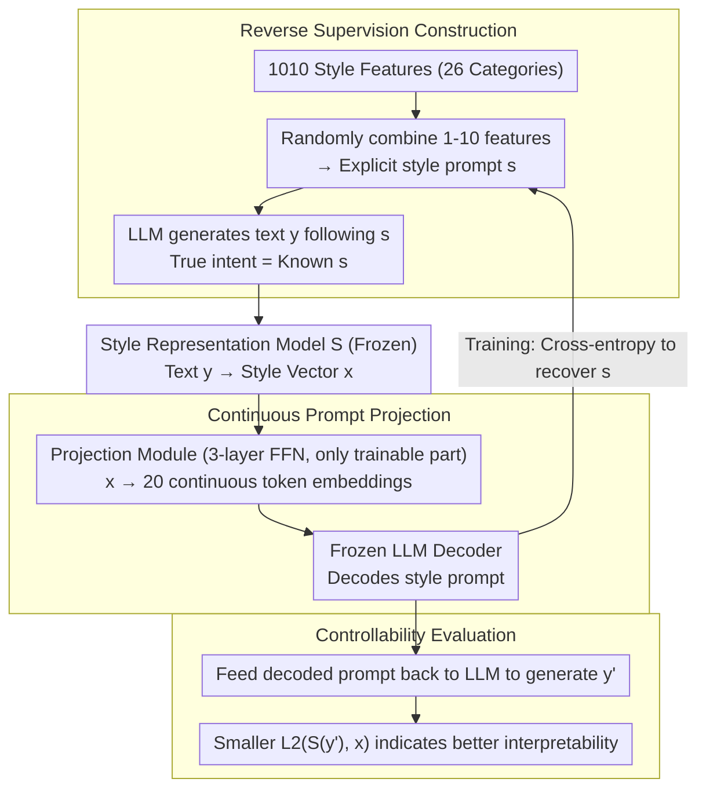

# Interpreting Style Representations via Style-Eliciting Prompts

**Conference**: ACL2026 Findings  
**arXiv**: [2606.05716](https://arxiv.org/abs/2606.05716)  
**Code**: https://github.com/junghwanjkim/style-decoding  
**Area**: Interpretability / Style Control  
**Keywords**: Style representation, style prompts, interpretable representation, text style control, synthetic supervision  

## TL;DR
This paper decodes difficult-to-interpret text style vectors into style-eliciting prompts that can directly drive LLM writing. Using "controllability" as the interpretability standard, the method outperforms baselines that directly prompt LLMs to describe target text styles in tasks such as style recovery, synthetic text style control, and imitation of human text styles.

## Background & Motivation
**Background**: Style representation models can map text into a vector space representing writing styles, used for tasks like authorship verification, style comparison, and style transfer. These vectors are typically trained via contrastive learning and capture multi-layered style signals including vocabulary, syntax, tone, and rhetoric.

**Limitations of Prior Work**: Style vectors are effective but opaque. Existing interpretation methods often let LLMs read a text segment and generate a natural language style description. However, such descriptions are susceptible to LLM priors and hallucinations, and they are often purely explanatory texts that may not reliably reproduce the target style.

**Key Challenge**: A good style interpretation should not only "sound right" but also be "functional." If a description cannot guide an LLM to generate text in the same style, its value for interpreting the style representation is limited.

**Goal**: The authors aim to convert latent style representations into natural language style prompts. These prompts should be human-readable and serve as control instructions for LLMs to generate new text with similar styles.

**Key Insight**: The authors construct supervised data in reverse: they first design explicit style prompts, then let LLMs generate text based on these prompts. Since the "true stylistic intent" of the generated text is known, a decoder can be trained to recover the original style prompt from the text's style vector.

**Core Idea**: Train a style decoder using synthetic prompt-text pairs to transform the interpretation problem into prompt recovery, using post-generation style distance to verify if the interpretation is truly actionable.

## Method
The problem studied is: given a vector $x$ from style representation model $S$, learn a decoder $D$ that outputs a natural language style prompt $s$, such that new text $y$ generated by an LLM under prompt $s$ has a style vector $S(y)$ close to the original $x$. Since searching the discrete prompt space is infeasible, the authors use synthetic supervision to recover known prompts from synthetic text style vectors.

### Overall Architecture
Data construction involves three steps. First, the authors use GPT-4o to generate and manually clean 1,010 specific style features across 26 categories, such as sentence structure, tone, formality, descriptive density, and abstraction level. Second, 300,000 real QA pairs are sampled from Reddit, StackExchange, and Yahoo Answers, with human answers reserved for later human style evaluation. Finally, 1 to 10 random style features are combined into style prompts, and stylized responses are generated using Phi-4, Qwen2.5-14B, and OLMo-2-13B, resulting in 1.8M LLM responses and 434,535 unique style prompts.

The model consists of a frozen style representation model, a trainable projection module, and a frozen LLM decoder. The style representation model uses Mistral-Nemo-Instruct-2407, trained via contrastive learning on author-labeled data. The projection module is a three-layer feedforward network that projects the style vector into 20 continuous token embeddings. These embeddings are input to Ministral-8B-Instruct alongside natural language instructions to generate style prompts like "The author uses ...".

### Key Designs

**1. Reverse Supervision Construction: Generating text from prompts, not guessing descriptions from text**

The trickiest part of style interpretation is the lack of ground truth—the stylistic intent behind real text is implicit. Having an LLM describe it directly introduces the model's own priors and hallucinations. The authors reverse the causal direction: first, they combine specific style features into an explicit prompt $s$, then generate text $y$. Thus, the "true intent" of $y$ is known as $s$. The decoder $D$ is trained to recover $s$ from the style vector $x=S(y)$, turning interpretation into a prompt recovery task with clear supervision. This is the key to the method—it replaces unverifiable "descriptions" with comparable prompt labels.

**2. Continuous Prompt for Style Vector Integration**

Style representations are dense continuous vectors, while LLMs generate discrete text. To bridge them without expensive fine-tuning of the LLM, the authors train a lightweight projection layer: a three-layer feedforward network maps the style vector into 20 continuous token embeddings. These serve as a continuous prefix for a frozen Ministral-8B-Instruct. Only the MLP projection module is trainable, preserving the LLM's generation quality while connecting the vector and text spaces.

**3. Evaluating Interpretability via Control Performance**

A style description is of limited value if it cannot reproduce the target style when guided by an LLM. Therefore, in addition to traditional prompt recovery metrics (ROUGE-1, LaBSE, LLM-as-judge), the authors include an "actionability" test: the decoded prompt is fed back into an LLM to generate a new response $y'$, and the $L2$ distance between $S(y')$ and the original target $x$ is calculated. A smaller distance indicates the interpretation truly drives the generation, linking interpretation and control via a single metric.

### Loss & Training
The training objective is token-level cross-entropy to match the decoded $\tilde{s}=D(S(x))$ with the ground-truth style prompt $s$. Data is split 8:1:1 for training, validation, and testing. The decoder is trained for 5 epochs with a learning rate of 5e-5 and batch size 32, selecting the best checkpoint via validation loss. Training uses PyTorch-Lightning, HuggingFace Transformers, AdamW, and the WSD learning rate schedule, taking approximately 16 hours on 2 A100 GPUs.

## Key Experimental Results

### Main Results
| Scenario | Method | Ours Embedding L2↓ | LUAR L2↓ | StyleDistance L2↓ |
|------|------|-------------------|----------|-------------------|
| LLM-generated style control | Decoder (Ours) | 26.07 | 6.01 | 6.82 |
| LLM-generated style control | LLM Custom | 35.39 | 9.10 | 8.24 |
| LLM-generated style control | Wang et al. 2025 | 73.21 | 8.26 | 8.41 |
| LLM-generated style control | Jangra et al. 2025 | 100.10 | 8.90 | 9.85 |
| LLM-generated style control | Bhandarkar et al. 2024 | 102.89 | 9.02 | 11.87 |
| LLM-generated style control | TinyStyler | 49.97 | 11.40 | 10.82 |
| Human text style steering | Decoder (Ours) | 27.73 | 6.33 | 7.47 |
| Human text style steering | LLM Custom | 37.54 | 9.39 | 9.79 |
| Human text style steering | Bhandarkar et al. 2024 | 35.53 | 9.31 | 8.94 |
| Human text style steering | TinyStyler | 54.69 | 11.77 | 14.38 |

Lower L2 distance indicates closer stylistic proximity. Ours achieves the lowest distance across style embeddings used in training and unseen ones like LUAR and StyleDistance, suggesting no overfitting to a specific representation space.

### Ablation Study
| Component/Data | Value or Setting | Description |
|-----------|------------|------|
| Style features | 1,010 | Covering 26 style categories |
| QA questions | 300,000 | From Reddit, StackExchange, Yahoo Answers |
| Synthetic responses | 1.8M | Generated by Phi-4, Qwen2.5-14B, OLMo-2-13B |
| Unique prompts | 434,535 | Each combining 1-10 style features |
| Human responses | 300K | Used for real human writing style steering |
| Projection output | 20 token embeddings | Interfaces style vector to frozen LLM |
| Decoder LLM | Ministral-8B-Instruct | Main body frozen, only projection trained |

### Key Findings
- In prompt recovery, Ours provides Gains of 76.0%, 21.7%, and 42.8% in ROUGE-1, LaBSE, and LLM-as-judge over baselines.
- In style control, Ours yields L2 improvements of 12.9% on LLM-generated references and 26.1% on human-written references.
- LLM-based description baselines performed worse than random prompts in recovery, showing that describing style after reading text is not equivalent to recovering the intent that drove it.
- t-SNE visualizations show style prompts forming distinct clusters, with semantically similar styles grouped together, supporting the premise that style representations contain decodable information.

## Highlights & Insights
- Linking interpretability to controllability is highly insightful. A style prompt is an interface for generation, not just a label for humans.
- Synthetic supervision is clever: while real text lacks explicit style labels, synthetic text generated from prompts provides clear, fine-grained, and compositional supervision.
- Evaluation across multiple style representations (including unseen LUAR and StyleDistance) mitigates concerns about embedding-specific results.

## Limitations & Future Work
- The method is primarily focused on English. Cross-lingual generalization cannot be assumed due to differences in linguistic dimensions and model quality.
- The domain is limited to online QA. Generalization to novels, official documents, academic writing, or news requires further evaluation.
- Synthetic data relies on LLMs' ability to follow prompts. If LLMs handle nuanced features inconsistently, the decoder might learn LLM biases rather than universal human style characteristics.
- The current output is prompt-level; how specific words or syntax are encoded in the style vector remains an area for future attribution or disentanglement research.

## Related Work & Insights
- **vs LLM style description**: Direct prompting for descriptions is prone to content and model bias; Ours decodes from the style vector with ground-truth supervision, making interpretations closer to the representation.
- **vs style transfer**: Style transfer requires content preservation; Ours focuses on interpreting and reproducing style without content constraints, making it more suitable for analyzing latent representations.
- **vs prompt discovery**: Prompt discovery usually targets specific outputs; Ours targets specific writing styles and uses synthetic supervision rather than RL-based search.

## Rating
- Novelty: ⭐⭐⭐⭐⭐ Using style-eliciting prompts for interpretability and verifying them via control is a brilliant setup.
- Experimental Thoroughness: ⭐⭐⭐⭐☆ Covers three tasks, multiple baselines, and human evaluation, though cross-lingual/cross-genre tests are missing.
- Writing Quality: ⭐⭐⭐⭐☆ Motivation, data, and architecture are clear; some figure values require checking appendix tables.
- Value: ⭐⭐⭐⭐☆ Highly relevant for interpretable style modeling, personalized writing assistants, persona simulation, and controlled generation.

<!-- RELATED:START -->

## Related Papers

- [\[ACL 2026\] Style over Story: Measuring LLM Narrative Preferences via Structured Selection](style_over_story_measuring_llm_narrative_preferences_via_structured_selection.md)
- [\[ACL 2026\] Rhetorical Questions in LLM Representations: A Linear Probing Study](rhetorical_questions_in_llm_representations_a_linear_probing_study.md)
- [\[ICML 2026\] Query Circuits: Explaining How Language Models Answer User Prompts](../../ICML2026/interpretability/query_circuits_explaining_how_language_models_answer_user_prompts.md)
- [\[CVPR 2026\] Learning complete and explainable visual representations from itemized text supervision](../../CVPR2026/interpretability/learning_complete_and_explainable_visual_representations_from_itemized_text_supe.md)
- [\[ACL 2026\] AdaptiveK: Complexity-Driven Sparse Autoencoders for Interpretable Language Model Representations](adaptivek_complexity-driven_sparse_autoencoders_for_interpretable_language_model.md)

<!-- RELATED:END -->
