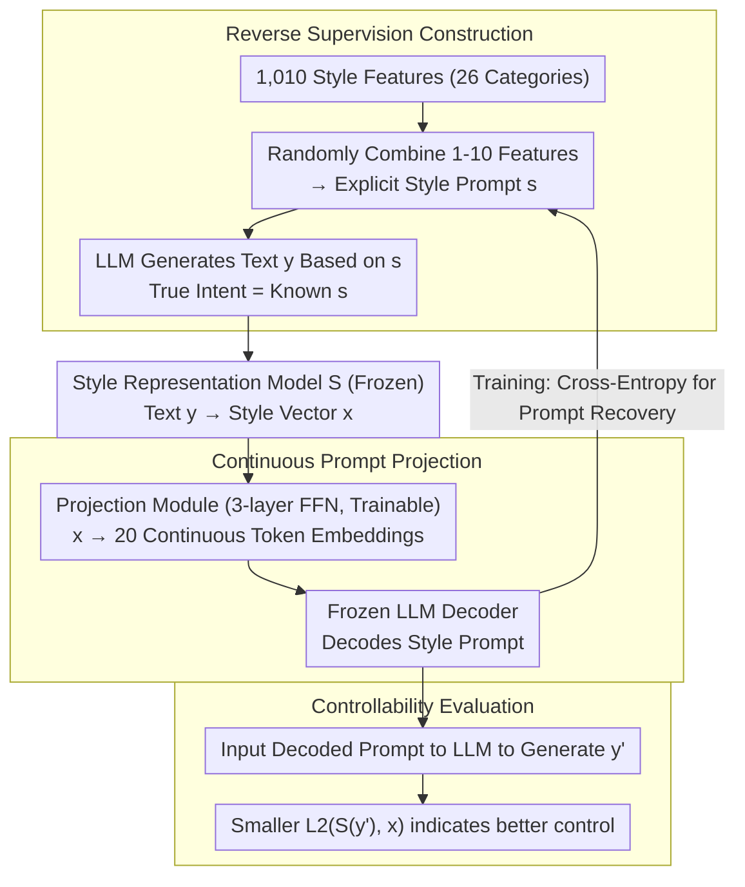

# Interpreting Style Representations via Style-Eliciting Prompts

**Conference**: ACL2026 Findings  
**arXiv**: [2606.05716](https://arxiv.org/abs/2606.05716)  
**Code**: https://github.com/junghwanjkim/style-decoding  
**Area**: Interpretability / Style Control  
**Keywords**: Style Representation, Style Prompts, Interpretable Representation, Text Style Control, Synthetic Supervision  

## TL;DR
This paper decodes difficult-to-interpret text style vectors into style-eliciting prompts that can directly drive LLM writing. Using "controllability" as an interpretability criterion, the method outperforms baselines that rely on direct LLM descriptions of target styles in tasks involving style recovery, synthetic text style control, and human text style imitation.

## Background & Motivation
**Background**: Style representation models have already demonstrated the ability to map text into vector spaces representing writing styles, which are used for tasks such as authorship verification, style comparison, and style transfer. These vectors are typically trained via contrastive learning and can capture multi-layered stylistic signals, including vocabulary, syntax, tone, and rhetoric.

**Limitations of Prior Work**: Style vectors are effective but opaque. Existing interpretation methods often prompt an LLM to read a piece of text and generate a natural language style description. However, such descriptions are susceptible to LLM priors and hallucinations. Furthermore, these explanations are often purely descriptive and do not necessarily allow for the stable reproduction of the target style.

**Key Challenge**: A good style interpretation should not only "sound accurate" but also be "executable." If a description cannot guide an LLM to generate text with the same style, its value in explaining the style representation is limited.

**Goal**: The authors aim to transform latent style representations into natural language style prompts. These prompts should be human-readable and serve as control instructions to prompt an LLM to generate new text with a similar style.

**Key Insight**: The paper constructs supervision in reverse: first, explicit style prompts are designed, and an LLM is used to generate text based on these prompts. Since the "true stylistic intent" of the generated text is known, a decoder can be trained to recover the original style prompt from the style vector of the text.

**Core Idea**: Use synthetic prompt-text pairs to supervisedly train a style decoder, transforming the interpretation problem into prompt recovery and using the resulting stylistic distance of generated text to verify if the interpretation is truly actionable.

## Method
The research problem is defined as follows: given a vector $x$ produced by a style representation model $S$, learn a decoder $D$ that outputs a natural language style prompt $s$, such that an LLM generating new text $y$ under that prompt results in a style vector $S(y)$ close to the original $x$. Since searching the discrete prompt space directly is infeasible, the authors construct synthetic supervision to refocus the task on recovering known prompts from the style vectors of synthetic text.

### Overall Architecture
Data construction involves three steps. First, the authors use GPT-4o to generate and manually clean 1,010 specific style features across 26 categories, such as sentence structure, tone, formality, descriptive density, and abstraction level. Second, 300,000 real QA pairs are sampled from Reddit, StackExchange, and Yahoo Answers, preserving human answers for subsequent human style evaluation. Finally, 1 to 10 style features from different categories are randomly combined to form style prompts, which are used by Phi-4, Qwen2.5-14B, and OLMo-2-13B to generate stylized responses, resulting in 1.8M LLM responses and 434,535 unique style prompts.

The model consists of a frozen style representation model, a trainable projection module, and a frozen LLM decoder. The style representation model uses Mistral-Nemo-Instruct-2407, trained via contrastive learning on author-labeled data. The projection module is a three-layer feedforward network that projects the style vector into 20 continuous token embeddings. These embeddings are fed along with natural language instructions into Ministral-8B-Instruct to generate style prompts in the format "The author uses...".

### Key Designs

**1. Reverse Supervision Construction: Generating Text from Prompts Rather than Guessing Descriptions**

The most difficult aspect of style interpretation is the lack of ground truth—the stylistic intent behind real text is implicit. Directly asking an LLM to describe style often introduces the model's own priors and hallucinations. The authors reverse the causal direction: they randomly combine 1 to 10 style features into an explicit style prompt $s$, then have an LLM generate text $y$ following it. Thus, the "true intent" of $y$ is known as $s$. Training the decoder $D$ to recover $s$ from the style vector $x=S(y)$ turns interpretation into a prompt recovery task with clear supervision. This is the core of the methodology—replacing unverifiable "descriptions" with comparable prompt labels.

**2. Continuous Prompts Connecting Style Vectors to Frozen LLMs**

Style representations are dense continuous vectors, while LLMs produce discrete text. Fine-tuning the LLM itself is costly and may degrade its linguistic capabilities. Instead, the authors train a lightweight projection layer: a three-layer feedforward network maps the style vector into 20 continuous token embeddings. These serve as a continuous prefix for natural language instructions fed into a frozen Ministral-8B-Instruct, which then generates the style prompt. Only the MLP projection module is trainable, while both the style model and the LLM remain frozen, preserving generation quality while bridging the vector and text spaces with minimal parameters.

**3. Evaluating Interpretation via Control Effect Rather than Text Similarity**

Even if a style description sounds accurate, it has limited interpretational value if it cannot guide an LLM to reproduce the target style. Therefore, in addition to traditional prompt recovery metrics (ROUGE-1, LaBSE, LLM-as-judge), the authors include an "actionability" test: the decoded prompt is fed back into an LLM to generate a new response $y'$, and the $L2$ distance between $S(y')$ and the original target $x$ is calculated in the style representation space. A smaller distance indicates the interpretation truly drives generation. This ties "interpretation" and "control" to the same metric.

### Loss & Training
The training objective is token-level cross-entropy, ensuring the generated $\tilde{s}=D(S(x))$ matches the ground-truth style prompt $s$. Data is split 8:1:1 into training, validation, and test sets. The decoder is trained for 5 epochs with a learning rate of 5e-5 and a batch size of 32. The best checkpoint is selected based on validation loss. All results in Section 6/7 use the 180K LLM response test set; Section 8 uses 60K human responses. Training utilized PyTorch-Lightning, HuggingFace Transformers, AdamW, and a WSD learning rate schedule, taking approximately 16 hours on 2 A100 GPUs.

## Key Experimental Results

### Main Results

| Scenario | Method | Our Embedding $L2 \downarrow$ | LUAR $L2 \downarrow$ | StyleDistance $L2 \downarrow$ |
|------|------|-------------------|----------|-------------------|
| LLM Generated Style Control | Decoder (Ours) | 26.07 | 6.01 | 6.82 |
| LLM Generated Style Control | LLM Custom | 35.39 | 9.10 | 8.24 |
| LLM Generated Style Control | Wang et al. 2025 | 73.21 | 8.26 | 8.41 |
| LLM Generated Style Control | Jangra et al. 2025 | 100.10 | 8.90 | 9.85 |
| LLM Generated Style Control | Bhandarkar et al. 2024 | 102.89 | 9.02 | 11.87 |
| LLM Generated Style Control | TinyStyler | 49.97 | 11.40 | 10.82 |
| Human Style Steering | Decoder (Ours) | 27.73 | 6.33 | 7.47 |
| Human Style Steering | LLM Custom | 37.54 | 9.39 | 9.79 |
| Human Style Steering | Bhandarkar et al. 2024 | 35.53 | 9.31 | 8.94 |
| Human Style Steering | TinyStyler | 54.69 | 11.77 | 14.38 |

Lower $L2$ distance indicates that the generated text style is closer to the target. Whether using the style embedding from training or held-out representations like LUAR and StyleDistance, the proposed decoder achieves the lowest distance, indicating it does not merely overfit a single representation space.

### Ablation Study

| Component/Data | Value or Setting | Description |
|-----------|------------|------|
| Style Features | 1,010 | Covering 26 style categories |
| QA Questions | 300,000 | From Reddit, StackExchange, Yahoo Answers |
| Synthetic Responses | 1.8M | Generated by Phi-4, Qwen2.5-14B, OLMo-2-13B |
| Unique Prompts | 434,535 | Each combining 1-10 style features |
| Human Responses | 300K | Used for real human writing style steering evaluation |
| Projection Output | 20 token embeddings | Interfaces style vector with frozen LLM |
| Decoder LLM | Ministral-8B-Instruct | Frozen backbone, only projection layer trained |

### Key Findings
- In the prompt recovery task, the proposed method achieves improvements of 76.0%, 21.7%, and 42.8% over baselines in ROUGE-1, LaBSE, and LLM-as-judge, respectively.
- For style control, the method achieves a 12.9% $L2$ improvement on LLM-generated references and a 26.1% improvement on human-written references relative to baselines.
- LLM-based style description baselines perform worse than a random prompt baseline in prompt recovery, suggesting that "describing style from text" is not equivalent to recovering the actual stylistic intent that drove the text.
- t-SNE visualizations show that different style prompts form distinct clusters, and semantically similar styles are closer in representation space, supporting the premise that style representations contain decodable stylistic information.

## Highlights & Insights
- Connecting interpretability with controllability is highly insightful. A style prompt is not just a human-readable label; it is a control interface for generating text.
- The use of synthetic supervision is clever: while it is difficult to identify ground-truth style labels for real text, using prompts to generate text provides clear, fine-grained, and compositional supervision signals.
- The evaluation uses multiple style representations, including LUAR and StyleDistance (which were not used in training), mitigating concerns that the method only works for a specific embedding space.

## Limitations & Future Work
- The method is primarily focused on English. Differences in stylistic dimensions, syntactic expressions, and model quality across languages mean cross-lingual generalization cannot be assumed.
- The data domain is limited to online QA. Further evaluation is needed to see if the model generalizes to novels, formal documents, academic writing, news, or legal texts.
- Synthetic data relies on the LLM's ability to follow prompts. If an LLM inconsistently executes certain subtle stylistic features, the decoder may learn LLM stylistic biases rather than universal human writing styles.
- The current decoder outputs prompt-level interpretations. Finer-grained attribution or disentanglement—showing how specific words or syntax are encoded in the style vector—remains a direction for future work.

## Related Work & Insights
- **vs LLM style description**: Prompting LLMs to describe text is prone to content and model bias; this paper decodes from a style vector with ground-truth supervision, making the interpretation more faithful to the representation.
- **vs style transfer**: Style transfer usually requires content preservation while changing style; this method focuses on interpreting and reproducing style without strict content constraints, making it better for analyzing style representations.
- **vs prompt discovery**: Traditional prompt discovery seeks prompts for specific outputs or behaviors; here, prompt discovery aims to induce specific writing styles via synthetic supervision rather than RL search.

## Rating
- Novelty: ⭐⭐⭐⭐⭐ Using style-eliciting prompts to interpret style vectors and validating via control effects is a well-defined and elegant approach.
- Experimental Thoroughness: ⭐⭐⭐⭐☆ Covers three tasks, multiple baselines, various style representations, and human text. Lacks cross-lingual and cross-genre testing.
- Writing Quality: ⭐⭐⭐⭐☆ Motivation, data construction, and model structures are clearly explained. Some numerical data in figures requires checking tables in the appendix.
- Value: ⭐⭐⭐⭐☆ Directly informs interpretable style modeling, personalized writing assistants, persona simulation, and controllable generation.

<!-- RELATED:START -->

## Related Papers

- [\[ACL 2026\] Style over Story: Measuring LLM Narrative Preferences via Structured Selection](style_over_story_measuring_llm_narrative_preferences_via_structured_selection.md)
- [\[ACL 2026\] Rhetorical Questions in LLM Representations: A Linear Probing Study](rhetorical_questions_in_llm_representations_a_linear_probing_study.md)
- [\[ICML 2026\] Query Circuits: Explaining How Language Models Answer User Prompts](../../ICML2026/interpretability/query_circuits_explaining_how_language_models_answer_user_prompts.md)
- [\[ACL 2026\] AdaptiveK: Complexity-Driven Sparse Autoencoders for Interpretable Language Model Representations](adaptivek_complexity-driven_sparse_autoencoders_for_interpretable_language_model.md)
- [\[ACL 2026\] Crosscoding Through Time: Tracking Emergence & Consolidation Of Linguistic Representations Throughout LLM Pretraining](crosscoding_through_time_tracking_emergence_consolidation_of_linguistic_represen.md)

<!-- RELATED:END -->
