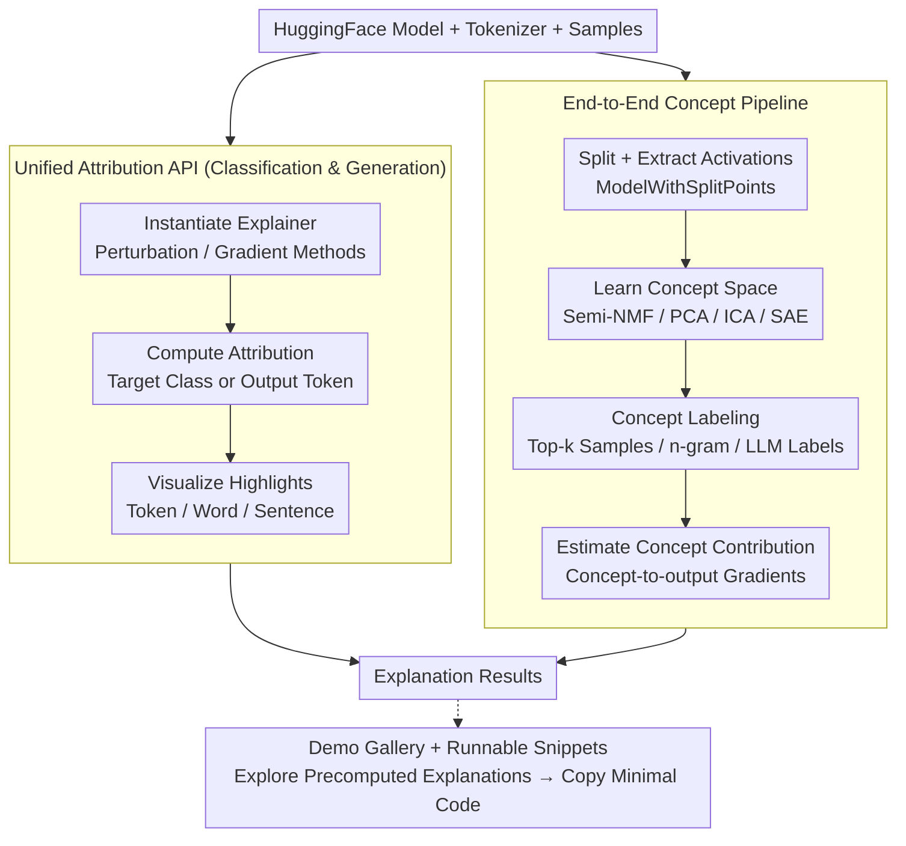

# Interpreto: An Explainability Library for Transformers

**Conference**: ACL2026  
**arXiv**: [2512.09730](https://arxiv.org/abs/2512.09730)  
**Code**: https://github.com/FOR-sight-ai/interpreto  
**Area**: Interpretability / Tool Library  
**Keywords**: Transformer interpretability, attribution, concept-based explanation, HuggingFace, mechanistic interpretability  

## TL;DR
Interpreto is an open-source Python library for HuggingFace language models that unifies token/word/sentence attribution and activation-level concept explanations into a single API, offering demos, tutorials, metrics, and end-to-end concept explanation pipelines.

## Background & Motivation
**Background**: Transformer language models are widely deployed for classification and generation, necessitating explanation tools for debugging, bias analysis, safety auditing, and documentation. Existing tools are generally divided into attribution libraries and mechanistic/concept interpretability libraries.

**Limitations of Prior Work**: Many libraries cover only one family of explanations, a single task type, or one stage of the pipeline. For instance, some libraries excel at token attribution but do not support generative models; others can train SAEs or concept models but lack a full workflow from activation extraction and concept learning to interpretation and importance scoring. Integrating these fragmented tools is costly for standard HuggingFace users.

**Key Challenge**: While interpretability methods are proliferating, practitioners require installable, reproducible, and comparable engineering tools capable of running complete workflows. Fragmentation hinders the adoption of these methods and makes benchmarking between different explanation results difficult.

**Goal**: The authors aim to provide a unified library allowing users to explain both classification and generation models using the same interface, switching between attribution and concept-based explanations while providing visualizations, metrics, tutorials, a demo gallery, and extensible interfaces for custom methods.

**Key Insight**: Interpreto is designed directly around the HuggingFace ecosystem. The attributions module provides common perturbation and gradient methods, while the concepts module wraps `nnsight` for model splitting and strings together activation extraction, concept learning, interpretation, and importance estimation.

**Core Idea**: Organize sets of explanation methods into executable engineering pipelines rather than isolated algorithms, specifically integrating the multiple stages of unsupervised concept discovery into a single library.

## Method
Interpreto consists of two main modules: `interpreto.attributions` and `interpreto.concepts`. The former explains the contribution of input features to predictions, while the latter learns higher-level concepts from intermediate activations and analyzes their influence on the output. The library covers classification and generation tasks, providing notebook visualizations, a demo website, metrics, and minimal runnable snippets.

### Overall Architecture
The attribution pipeline typically involves three steps: instantiating the explainer with a HuggingFace model/tokenizer and samples; computing attribution for a specific classification target or output token; and visualizing highlights at the token, word, or sentence level. For example, LIME explains a BERT emotion classifier by showing how "thrilled" drives the joy category, while Occlusion explains specific output tokens of Qwen3-0.6B via input-output attribution matrices.

The concept pipeline consists of four steps. First, wrap the HuggingFace model with `ModelWithSplitPoints` to extract activations at specified split points. Second, learn the concept space using Semi-NMF, PCA, ICA, or SAE. Third, assign human-readable labels using top-k activating examples, n-grams, or LLM labels. Fourth, estimate concept contributions via concept-to-output gradients or concept×gradients.

### Key Designs

**1. Unified attribution API covering both classification and generation**

The readability of NLP attribution depends on granularity and task objectives, yet existing libraries often serve only one task—those good at token attribution often lack generative support, and vice versa. Interpreto uses the same explainer class for `SequenceClassification` and `CausalLM`. Perturbation methods include KernelSHAP, LIME, Occlusion, and Sobol; gradient methods include GradientSHAP, Integrated Gradients, Saliency, SmoothGrad, SquareGrad, and VarGrad. It allows combinations of three output spaces (logits/softmax/log-softmax) and three granularities (token/word/sentence).

**2. End-to-end concept-based pipeline unifying four dispersed stages**

The primary engineering pain point of concept explanation is not the complexity of individual algorithms but their fragmentation across research tools. Interpreto integrates four steps into one workflow: `ModelWithSplitPoints` for extraction; learning concept spaces via Semi-NMF, PCA, ICA, or SAE (supporting neurons-as-concepts and sparse autoencoders); human-readable labeling via top-k examples or LLM labels; and importance scoring via gradients.

**3. Demo gallery with runnable snippets to lower the entry barrier**

Interpreto’s demo website covers 3 classifiers and 3 generative models. Users can select tasks, models, and methods to browse precomputed explanations before copying minimal runnable code snippets for local use. This "explore in browser, then implement in code" path minimizes the cost of trying new explanation methods.

### Loss & Training
As a system/tool paper, no new training losses are proposed. The library depends on the computational processes of existing explanation methods. Attribution methods are divided into perturbation, inference/gradients, and aggregation stages. The concept pipeline follows activation extraction, model fitting, interpretation, and importance scoring. It supports Python 3.10 to 3.13, `torch >= 2.0`, `transformers >= 4.22`, and `nnsight >= 0.5.1`.

## Key Experimental Results

### Main Results
| Capability | Interpreto | Captum | Ferret | Inseq | SHAP |
|------|------------|--------|--------|-------|------|
| Sequence classification | ✓ | ✓ | ✓ | ✗ | ✓ |
| Text generation | ✓ | ✓ | ✗ | ✓ | ✓ |
| Faithfulness metrics | ✓ | ✓ | ✓ | ✗ | ✗ |
| Simple visualization | ✓ | ✗ | ✗ | ✗ | ✓ |
| Granularity control | ✓ | ✗ | ✗ | ✗ | ✗ |

In the comparison of attribution libraries, Interpreto is the only one supporting classification, generation, faithfulness metrics, simple visualization, and granularity control simultaneously.

### Ablation Study
| Dimension | Interpreto Support | Details |
|------|--------------------|----------|
| Attribution methods | 10 types | 4 perturbation-based, 6 gradient-based |
| Attribution metrics | 2 types | Insertion, Deletion |
| Concept-learning options | 15 types | neurons, KMeans/PCA/SVD/ICA/NMF/Semi-NMF/Convex NMF, various SAEs |
| Concept interpretation | 3 categories | top-k tokens, top-k activating examples/words/n-grams, LLM labels |
| Concept metrics | 7 types | Including MSE, FID, sparsity, stability, ConSim, etc. |
| Tested architectures | 15+ | Albert, BART, BERT, DistilBERT, Electra, Roberta, T5, GPT2, GPT-Neo, GPT-J, CodeGen, Falcon, Llama3, Mistral, Starcoder, Qwen3 |

### Key Findings
- In the comparison of concept-based libraries, Interpreto covers model splitting, concept learning, interpretation, contributions, metrics, pip packaging, and documentation; many existing libraries cover only one or two stages.
- The demo gallery covers 6 models: DistilBERT/IMDB, BERT/emotion, and RoBERTa/AG-News classifiers, alongside GPT-2, Qwen3-0.6B, and Llama 3.1 8B generative models.
- Regarding runtime costs, attribution typically requires 10-100 forward passes or 5-20 gradient computations (seconds range). The concept pipeline takes minutes for small experiments on an RTX 3080, while large SAEs may take hours.
- A generation concepts example using Qwen3-0.6B on 100 AG-News samples (extracting activations, training Semi-NMF, and labeling with GPT-4.1-nano) runs within 3 minutes on an RTX 3080 10GB.

## Highlights & Insights
- The contribution lies not in inventing new algorithms but in unifying dispersed algorithms into a single executable interface. Such engineering integration significantly reduces the cost of reproduction and comparison in interpretability research.
- Interpreto’s handling of generation attribution is practical: since every output token is a target, showing a full matrix is unreadable; allowing users to select an output token to view input contributions aligns better with analysis workflows.
- The end-to-end encapsulation of the concept pipeline is particularly valuable. Many practitioners struggle with the gap between model splitting, activation collection, and importance calculation; Interpreto bridges these steps.

## Limitations & Future Work
- The authors emphasize that no "single universal explanation method" exists. Users must still compare multiple methods and validate reliability through counterfactual checks and ablations.
- The meaning of attribution scores is method-dependent. Highlighting results in LIME vs. Integrated Gradients may represent different mechanisms and should not be treated as simple causal explanations.
- LLM-based concept labels are sensitive to prompts and may be overly broad, repetitive, or non-actionable. Identifying whether an uninterpretable concept stems from the model, the concept space fitting, or the labeler remains difficult.
- The library currently focuses on HuggingFace text models, excluding circuit-level MI, data attribution, and feature visualization. Future plans include supervised concepts, more metrics, and extensions to ViT and multimodal Transformers.

## Related Work & Insights
- **vs Captum / SHAP / Ferret / Inseq**: These libraries have individual strengths but are often incomplete regarding task coverage, metrics, or granularity control. Interpreto unifies attribution for classification and generation.
- **vs TransformerLens / NNsight / SAELens / Neuronpedia**: These tools are geared toward research or specific pipeline stages. Interpreto leverages their underlying capabilities to serve a more complete HuggingFace workflow.
- **vs Standalone Notebooks**: By releasing a demo website, documentation, and a pip package, Interpreto is better suited as an entry point for practitioners for debugging and teaching.

## Rating
- Novelty: ⭐⭐⭐☆☆ Limited algorithmic novelty, but significant contribution in system integration and concept pipeline encapsulation.
- Experimental Thoroughness: ⭐⭐⭐⭐☆ Functional coverage, library comparisons, and cost analysis are comprehensive for a system paper; lacks large-scale user studies.
- Writing Quality: ⭐⭐⭐⭐☆ Clear structure with direct table comparisons and specific code examples.
- Value: ⭐⭐⭐⭐☆ Highly practical for debugging in the HuggingFace ecosystem, especially for comparing attribution and concept explanations in the same project.

<!-- RELATED:START -->

## Related Papers

- [\[ICLR 2026\] Bridging Explainability and Embeddings: BEE Aware of Spuriousness](../../ICLR2026/interpretability/bridging_explainability_and_embeddings_bee_aware_of_spuriousness.md)
- [\[ICML 2026\] Cognitive Fatigue in Autoregressive Transformers: Formalization and Measurement](../../ICML2026/interpretability/cognitive_fatigue_in_autoregressive_transformers_formalization_and_measurement.md)
- [\[ACL 2025\] Normalized AOPC: Fixing Misleading Faithfulness Metrics for Feature Attribution Explainability](../../ACL2025/interpretability/normalized_aopc_faithfulness_metrics.md)
- [\[CVPR 2026\] Inside-Out: Measuring Generalization in Vision Transformers Through Inner Workings](../../CVPR2026/interpretability/inside-out_measuring_generalization_in_vision_transformers_through_inner_working.md)
- [\[NeurIPS 2025\] nnterp: A Standardized Interface for Mechanistic Interpretability of Transformers](../../NeurIPS2025/interpretability/nnterp_a_standardized_interface_for_mechanistic_interpretability_of_transformers.md)

<!-- RELATED:END -->
