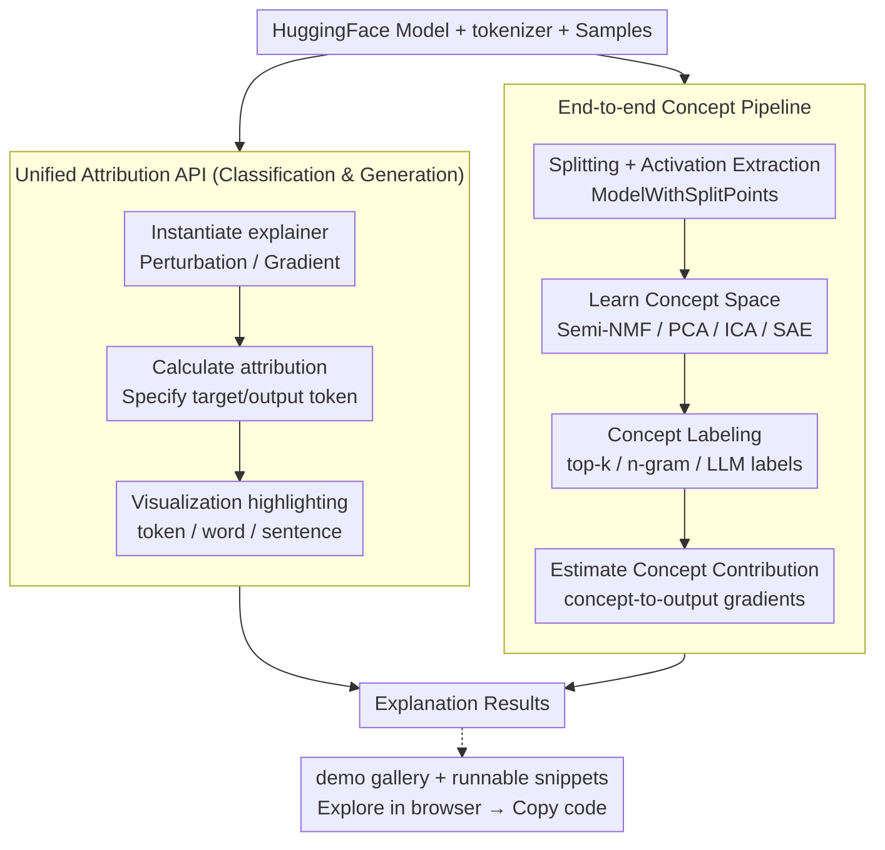

# Interpreto: An Explainability Library for Transformers

**Conference**: ACL2026  
**arXiv**: [2512.09730](https://arxiv.org/abs/2512.09730)  
**Code**: https://github.com/FOR-sight-ai/interpreto  
**Area**: Interpretability / Tooling  
**Keywords**: Transformer interpretability, attribution, concept-based explanation, HuggingFace, mechanistic interpretability  

## TL;DR
Interpreto is an open-source Python interpretability library for HuggingFace language models that unifies token/word/sentence attribution with activation-level concept explanations under a single API, offering demos, tutorials, metrics, and end-to-end concept explanation pipelines.

## Background & Motivation
**Background**: Transformer language models are widely deployed for classification and generation, necessitating explanation tools for debugging, bias analysis, security auditing, and documentation. Existing tools are generally divided into attribution libraries and mechanistic/concept interpretability libraries.

**Limitations of Prior Work**: Many libraries cover only one family of explanations, a single task type, or one stage of the pipeline. For instance, some excel at token attribution but do not support generative models; others can train SAEs or concept models but lack a complete flow from activation extraction and concept learning to concept interpretation and contribution scoring. For typical HuggingFace users, stitching these tools together is costly.

**Key Challenge**: While interpretability methods are proliferating, practitioners need installable, reproducible, and comparable engineering tools capable of running entire workflows. Tool fragmentation hinders method adoption and makes benchmarking different results difficult.

**Goal**: The authors aim to provide a unified library allowing users to explain both classification and generative models using a consistent interface, switching between attribution and concept-based explanations while providing visualizations, metrics, tutorials, a demo gallery, and extensible interfaces for custom methods.

**Key Insight**: Interpreto is designed directly around the HuggingFace ecosystem. The `attributions` module provides common perturbation and gradient methods, while the `concepts` module wraps `nnsight` for model splitting and streamlines activation extraction, concept learning, interpretation, and concept importance estimation.

**Core Idea**: Organizing a "collection of explanation methods" into executable engineering pipelines rather than implementing isolated algorithms, specifically packaging multiple stages of unsupervised concept discovery into a single library.

## Method
The Interpreto system consists of two primary modules: `interpreto.attributions` and `interpreto.concepts`. The former explains the contribution of input features to predictions, while the latter learns higher-level concepts from intermediate activations and analyzes their influence on the output. The library covers classification and generation tasks, providing notebook visualizations, a demo website, metrics, and minimal runnable snippets.

### Overall Architecture
The attribution pipeline typically involves three steps: instantiating an explainer with a HuggingFace model/tokenizer and samples; calculating attribution for a specified classification target or output token; and finally visualizing highlighted tokens, words, or sentences. For classification, LIME might explain a BERT emotion classifier showing "thrilled" driving the joy class; for generation, Occlusion can explain a specific output token from Qwen3-0.6B via an input-output attribution matrix slice.

The concept pipeline consists of four steps. First, `ModelWithSplitPoints` wraps the HuggingFace model, specifies split points, and extracts activations. Second, concept space is learned using Semi-NMF, PCA, ICA, or SAEs. Third, human-readable labels are assigned via top-k activating examples, tokens/ngrams, or LLM labels. Fourth, concept contributions are estimated via concept-to-output gradients or concept-gradient products.

### Key Designs

**1. Unified attribution API covering both classification and generation**
The readability of NLP attribution depends on granularity and task objectives, yet existing libraries often serve only one task. Interpreto uses the same explainer class to handle `SequenceClassification` and `CausalLM`. Perturbation methods include KernelSHAP, LIME, Occlusion, and Sobol; gradient methods include GradientSHAP, Integrated Gradients, Saliency, SmoothGrad, SquareGrad, and VarGrad. Users can toggle between three output spaces (logits/softmax/log-softmax) and three granularities (token/word/sentence) within a single interface.

**2. End-to-end concept-based pipeline unifying four disparate stages**
The primary engineering pain point of concept explanations is that steps are often scattered across research tools. Interpreto integrates these into one workflow: `ModelWithSplitPoints` for activation collection, concept space learning (supporting neurons-as-concepts, dictionary learning, and sparse autoencoders), interpretation via top-k examples or LLM labeling, and contribution scoring. This seamless "split, learn, interpret, score" flow represents the core value of the library.

**3. Demo gallery with runnable snippets to lower the barrier to entry**
To help users understand and reproduce results, the demo website covers 3 classifiers and 3 generative models. Users can explore precomputed explanations in the browser by selecting tasks, models, and methods, then copy the corresponding minimal runnable code snippets to their local environment.

### Loss & Training
As a system/tool paper, no new training losses are proposed. The library relies on the computational procedures of existing explanation methods. Attribution methods are divided into perturbation, inference/gradients, and aggregation phases. Concept methods follow activation extraction, concept model fitting, interpretation, and importance scoring. Requirements: Python 3.10-3.13, `torch >= 2.0`, `transformers >= 4.22`, `nnsight >= 0.5.1`.

## Key Experimental Results

### Main Results

| Capability | Interpreto | Captum | Ferret | Inseq | SHAP |
|------|------------|--------|--------|-------|------|
| Sequence classification | ✓ | ✓ | ✓ | ✗ | ✓ |
| Text generation | ✓ | ✓ | ✗ | ✓ | ✓ |
| Faithfulness metrics | ✓ | ✓ | ✓ | ✗ | ✗ |
| Simple visualization | ✓ | ✗ | ✗ | ✗ | ✓ |
| Granularity control | ✓ | ✗ | ✗ | ✗ | ✗ |

In the attribution library comparison, Interpreto is the only library listed that simultaneously supports classification, generation, faithfulness metrics, simple visualization, and granularity control.

### Ablation Study

| Dimension | Interpreto Support | Details |
|------|--------------------|----------|
| Attribution methods | 10 types | 4 perturbation-based, 6 gradient-based |
| Attribution metrics | 2 types | Insertion, Deletion |
| Concept-learning options | 15 types | neurons, KMeans/PCA/SVD/ICA/NMF/Semi-NMF, various SAEs |
| Concept interpretation | 3 categories | top-k tokens, top-k activating examples/words/n-grams, LLM labels |
| Concept metrics | 7 types | Including MSE, FID, sparsity, stability, ConSim, etc. |
| Tested architectures | 15+ | Albert, BART, BERT, T5, GPT2, Llama3, Qwen3, etc. |

### Key Findings
- In concept-based library comparisons, Interpreto covers model splitting, concept learning, interpretation, contributions, metrics, pip package, and documentation; many existing libraries lack coverage for several of these stages.
- The demo gallery covers 6 models across DistilBERT, BERT, RoBERTa (classifiers), and GPT-2, Qwen3, Llama 3.1 (generative).
- In terms of runtime, attribution generally requires 10-100 forward passes or 5-20 gradient computations (seconds); the concept pipeline for small experiments is on the order of minutes on an RTX 3080.

## Highlights & Insights
- The contribution lies not in "inventing a new algorithm" but in unifying fragmented algorithms into a single executable interface, significantly reducing the cost of reproduction and comparison in research.
- The handling of generation attribution is practical: since every output token is a prediction target, showing the full matrix is unreadable. Allowing users to select a specific output token to view input contributions aligns better with analysis workflows.
- The end-to-end packaging of the concept pipeline is particularly valuable. Many practitioners struggle with the logistics of model splitting and activation harvesting when using methods like SAEs or NMF; Interpreto automates these steps.

## Limitations & Future Work
- The authors emphasize that no "single universal explanation method" exists. Users must still compare multiple methods and use counterfactual checks and ablations to verify reliability.
- The meaning of attribution scores depends on the method; identical highlights in LIME vs. Integrated Gradients may represent different mechanisms and should not be treated as simple causal explanations.
- LLM-based concept labels are sensitive to prompts and may be overly broad or repetitive. Identifying whether an uninterpretable concept arises from the model itself, a failure in concept space learning, or a failure in the labeling tool remains difficult.
- The library currently focuses on text-based Transformers, excluding circuit-level MI, data attribution, and feature visualization. Plans include adding supervised concepts, more metrics, and extending support to ViTs and multimodal models.

## Related Work & Insights
- **vs Captum / SHAP / Ferret / Inseq**: These libraries have specific strengths but are often incomplete regarding task coverage, metrics, or granularity control; Interpreto's advantage is unifying attribution for both classification and generation.
- **vs TransformerLens / NNsight / SAELens / Neuronpedia**: These tools are geared more toward research or specific pipeline segments; Interpreto leverages their core capabilities but targets the complete HuggingFace workflow.

## Rating
- Novelty: ⭐⭐⭐☆☆ Limited algorithmic novelty, but system integration and concept pipeline encapsulation provide clear contributions.
- Experimental Thoroughness: ⭐⭐⭐⭐☆ As a demo/system paper, functional coverage, library comparisons, and cost analysis are comprehensive; lacks large-scale user studies.
- Writing Quality: ⭐⭐⭐⭐☆ Clear structure, direct comparisons, and concrete code examples.
- Value: ⭐⭐⭐⭐☆ Highly practical for interpretability debugging in the HuggingFace ecosystem, particularly for comparing attribution and concept explanations in the same project.

<!-- RELATED:START -->

## Related Papers

- [\[ICLR 2026\] Bridging Explainability and Embeddings: BEE Aware of Spuriousness](../../ICLR2026/interpretability/bridging_explainability_and_embeddings_bee_aware_of_spuriousness.md)
- [\[ICML 2026\] Cognitive Fatigue in Autoregressive Transformers: Formalization and Measurement](../../ICML2026/interpretability/cognitive_fatigue_in_autoregressive_transformers_formalization_and_measurement.md)
- [\[ACL 2025\] Normalized AOPC: Fixing Misleading Faithfulness Metrics for Feature Attribution Explainability](../../ACL2025/interpretability/normalized_aopc_faithfulness_metrics.md)
- [\[CVPR 2026\] Inside-Out: Measuring Generalization in Vision Transformers Through Inner Workings](../../CVPR2026/interpretability/inside-out_measuring_generalization_in_vision_transformers_through_inner_working.md)
- [\[NeurIPS 2025\] nnterp: A Standardized Interface for Mechanistic Interpretability of Transformers](../../NeurIPS2025/interpretability/nnterp_a_standardized_interface_for_mechanistic_interpretability_of_transformers.md)

<!-- RELATED:END -->
