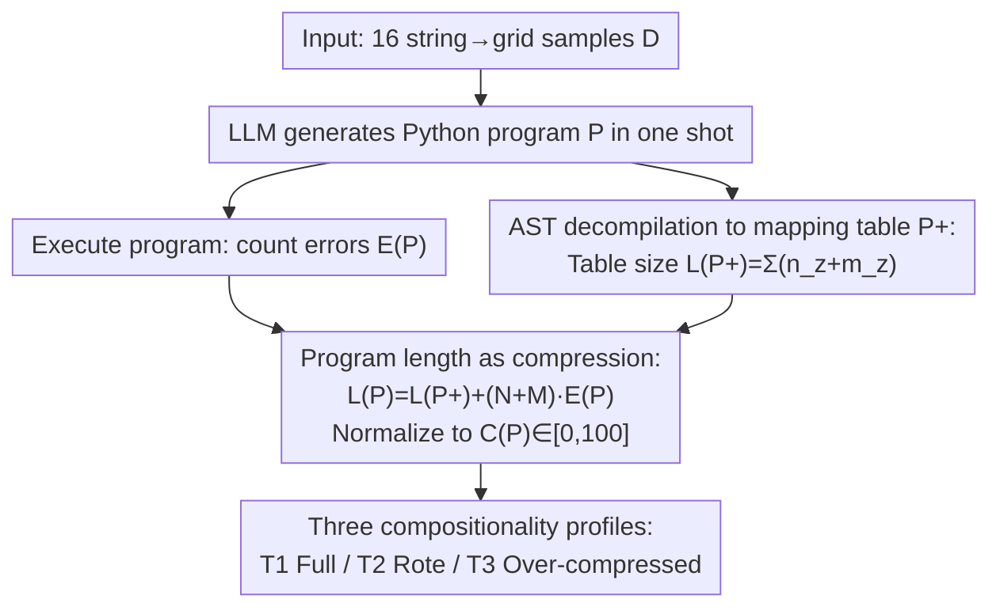

# Investigating More Explainable and Partition-Free Compositionality Estimation for LLMs: A Rule-Generation Perspective

**Conference**: ACL 2026  
**arXiv**: [2604.27340](https://arxiv.org/abs/2604.27340)  
**Code**: https://github.com/xzy-xzy/RGP (Available)  
**Area**: Interpretability / Compositionality Evaluation / LLM Benchmarking  
**Keywords**: Compositional Generalization, Kolmogorov Complexity, Rule Generation, Program Length, LLM Evaluation

## TL;DR
The paper moves beyond the traditional paradigm of "constructing test sets for compositional generalization testing." Instead, it requires LLMs to generate a Python program as a mapping rule for an entire dataset. By using $\mathcal{C}(\text{P})$ based on the upper bound of Kolmogorov complexity, the "program compactness + accuracy" is converted into a compositionality score of 0–100. This shifts the focus from "checking output correctness" to "measuring rule compression," bypassing data contamination from pre-training while providing an explainable, introspective evaluation.

## Background & Motivation
**Background**: The standard approach for studying LLM compositionality involves "compositional generalization tests"—splitting training/test sets such that test combinations do not appear in training, then comparing accuracy.

**Limitations of Prior Work**: (L1) This paradigm only considers the final output, losing insight into the model's internal understanding of compositionality itself, thus lacking interpretability. (L2) Current LLMs have already "seen" the vast majority of supposedly unseen combinations in massive pre-training corpora; "compositional leakage" undermines the foundation of these evaluations. In other words, the "unseen" assumption for test sets has largely failed for large-scale pre-trained models.

**Key Challenge**: To truly measure whether a model has abstracted compositional laws, one must avoid the black-box approach of "guessing unseen combinations." However, LLMs are pre-trained giants, making it nearly impossible to construct clean train-test splits.

**Goal**: (1) Capture the model's internal understanding of compositional rules directly. (2) Completely remove reliance on train-test splits to avoid leakage. (3) Provide a comparable, automated scalar metric consistent with human intuition.

**Key Insight**: According to the complexity theory of Elmoznino 2025, compositionality can be defined as $\mathcal{K}(D_Y)/\mathcal{K}(D_Y|D_X)$—the degree to which the input can "compress" the output. While Kolmogorov complexity is uncomputable, it can be upper-bounded, and the length of a program generated by the LLM serves as a natural upper bound.

**Core Idea**: After observing the full dataset, the LLM writes a Python program to reproduce the mapping. The "number of component values used in the program" is mapped to a unified format $\mathrm{P}^+$ to calculate the "mapping table size." Combined with an accuracy penalty, this results in $L(\mathrm{P})$, which is normalized to $\mathcal{C}(\mathrm{P})\in[0,100]$. A higher score indicates the LLM more successfully compressed the data using compositionality.

## Method

### Overall Architecture
The task is intentionally designed to be simple: string-to-grid—where a 4-character input string outputs a $4\times 4$ grid, and each character position determines a fixed set of 4 grid points. The dataset $D$ consists of only $d=16$ samples $D=\{(x_i,y_i)\}$. The authors provide all samples to the LLM at once and request a Python program $\mathrm{P}$ to reproduce the mapping. The evaluation pipeline executes the program to count errors, "decompiles" it via static analysis into a unified mapping table, and finally converts the "table size" and "error count" into a 0–100 compositionality score $\mathcal{C}(\mathrm{P})$. Higher scores indicate successful compression via compositional rules rather than rote memorization of the 16 samples.

### Key Designs

**1. Program Length as Compression: Quantifying Compositionality via Kolmogorov Upper Bounds**

Theoretically, compositionality is equivalent to the degree of "compressing output with input," i.e., smaller $\mathcal{K}(D_Y|D_X)$ implies higher compositionality. Since Kolmogorov complexity is uncomputable, the authors use the length of the LLM-generated program as a natural upper bound, counting "component value occurrences" as the metric. Specifically, the program is statically parsed into a mapping table $\mathrm{P}^+$ with size $L(\mathrm{P}^+)=\sum_z(n_z+m_z)$, where $n_z$ is the length of input components and $m_z$ is the length of output components. If a model abstracts compositional rules (e.g., modeling 4 positions × 2 values = 8 atomic mappings), the theoretical minimum $L(\mathrm{P}^+)=U(N+M)=40$. If it ignores compositionality and enumerates all 16 samples, $L(\mathrm{P}^+)=d(N+M)=320$.

Accuracy is integrated into the same metric: executing the program yields error count $E(\mathrm{P})=\sum_i[\mathrm{P}(x_i)\ne y_i]$. Each error is treated as a requirement to add a full mapping, resulting in $L(\mathrm{P})=L(\mathrm{P}^+)+(N+M)\cdot E(\mathrm{P})$ (where $N=4, M=16$), normalized as:

$$\mathcal{C}(\mathrm{P})=100\cdot\frac{L_z-\mathrm{Clip}(L(\mathrm{P}),L_z,L_s)}{L_z-L_s},\quad L_s=40\ (\text{Full Composition}),\ L_z=320\ (\text{Zero Composition}).$$

Normalizing to $\mathrm{P}^+$ before counting length removes variations in naming, comments, and formatting, ensuring fairness across different LLM coding styles.

**2. AST-based Program to Mapping Table Decompilation: Unifying Python Variations**

LLMs use diverse styles (dicts, if-else, list comprehensions). To avoid bias, the authors use Python AST to automatically extract three types of compositional sources: (a) Explicit dict key→value pairs; (b) Co-occurring values in assignments or literals; (c) Implicit conditional combinations in nested if/elif/else paths. The system maintains forward propagation of "variable → involved input values" and handles "else" branches through "if/elif complement" virtual values. Duplicate combinations are counted only once. This AST-based set propagation maps most styles to the $\mathrm{P}^+$ table for stable calculation of $\sum n_z$ and $\sum m_z$.

**3. Three Compositionality Profiles (T1/T2/T3): Two-Dimensional Diagnosis**

A single scalar score might conflate "conservative rote learning" with "aggressive failed compression." Thus, the authors cross-reference compression degree $L(\mathrm{P}^+)$ and compression loss $E(\mathrm{P})$ to identify three patterns: T1 (low $L(\mathrm{P}^+)$ + low $E(\mathrm{P})$) represents full compositionality; T2 (high $L(\mathrm{P}^+)$ + low $E(\mathrm{P})$) represents "rote learning" where accuracy is achieved through enumeration; T3 (low $L(\mathrm{P}^+)$ + high $E(\mathrm{P})$) represents "over-compression" where a short but incorrect algorithm is generated. Both T2 and T3 yield low $\mathcal{C}$ scores but indicate opposite causes, helping diagnose whether a model needs better compression or better error correction.

### Loss & Training
The entire method is training-free. It is an external evaluation protocol for pre-trained LLMs. "Compositionality" is derived from program generation via a single prompt and automated scoring by the parser.

## Key Experimental Results

### Main Results
Evaluation of 11 LLMs across 4 rule settings (30 sampled functions each), average $\mathcal{C}(\mathrm{P})$:

| Model | Horizontal | Block | Vertical | Random |
|---|---|---|---|---|
| o3-mini | **95.69** | **57.07** | 27.31 | 0.67 |
| Gemini-1.5 Pro | 92.92 | 42.96 | **30.39** | **10.00** |
| o1-mini | 94.49 | 19.38 | 4.29 | 0.00 |
| DeepSeek-R1 | 89.80 | 7.62 | 0.00 | 0.00 |
| Claude-3.7 | 84.67 | 47.57 | 14.71 | 3.52 |
| QwQ-Plus | 44.00 | 2.86 | 23.31 | 0.00 |
| DeepSeek-V3 (Non-reasoning) | 42.87 | 0.00 | 0.00 | 3.33 |
| Qwen-Max (Non-reasoning) | 46.67 | 0.48 | 0.00 | 0.00 |
| GPT-4o (Non-reasoning) | 0.00 | 0.00 | 0.00 | 0.00 |
| Gemini-2.0 | 7.77 | 0.43 | 0.67 | 3.71 |
| Claude-3.5 | 6.69 | 0.00 | 0.00 | 0.00 |

Overall order: Horizontal > Block > Vertical > Random. This suggests compositionality capture depends on whether components are contiguous in linear text. Non-reasoning models failed almost entirely on Random (except GPT-4o, which even failed on Horizontal).

### Ablation Study (Robustness Tests)

| Model | RI(H) $\mathcal{C}$ (vs Base Horizontal) | SC(H+R) $\mathcal{C}$ (vs Mean of two) |
|---|---|---|
| DeepSeek-R1 | 26.54 (−63.26) | 27.43 (−17.47) |
| o3-mini | 73.20 (−22.49) | **78.79 (+30.61)** |
| Gemini-1.5 Pro | 76.58 (−16.33) | 38.98 (−12.48) |
| Claude-3.7 | **79.04** (−5.63) | 66.39 (+22.30) |
| QwQ-Plus | 0.00 (−44.00) | 4.00 (−18.00) |
| Qwen-Max | 1.38 (−45.29) | 6.67 (−16.67) |
| GPT-4o | 0.00 (0) | 0.00 (0) |

RI(H) = Randomizing index mapping (e.g., instead of pos $i$ to row $i$). Most reasoning models saw a sharp drop in $\mathcal{C}$ under RI, showing reliance on spatial order rather than true input-output decoupling. SC under "Setting Combination" showed o3-mini and Claude-3.7 performing better than the mean, suggesting they can independently apply "divide and conquer" to heterogeneous components.

### Key Findings
- **Reasoning Models > Non-reasoning Models, but only on intuitive settings**: Reasoning models score 84–96 on Horizontal but drop to nearly 0 on Random, proving their advantage lies in spatial intuition rather than pure "compositional logic."
- **Sequential Correspondence $\ne$ Compositional Understanding**: Randomizing the index mapping caused 5/6 reasoning models to crash (DeepSeek-R1 −63, QwQ −44), showing their high scores relied on "shortcuts" like $i$-th row corresponding to $i$-th character.
- **Independent Component Capture as a Differentiator**: Under Setting Combination (SC), Claude-3.7 and o3-mini outperformed the mean. Data shows they successfully modeled the H portion while enumerating the R portion, exhibiting the closest behavior to "true compositionality."
- **Rule View $\ne$ Result View**: Comparing with traditional accuracy $\mathcal{A}$, models can achieve 100% result accuracy on Horizontal while having only 30% $\mathcal{C}(\mathrm{P})$. This confirms that "getting the result right" does not imply "understanding the rule."

## Highlights & Insights
- **From Black-box to White-box Evaluation**: Forcing LLMs to externalize "rules they believe in" into executable programs is a paradigm shift. One can now read the rules and qualitatively distinguish failure modes.
- **Engineering Kolmogorov Complexity**: While $\mathcal{K}$ is uncomputable, the authors use the unified "mapping table $\mathrm{P}^+$" to make program lengths comparable across diverse LLM outputs.
- **Explainability of Two-Dimensional Diagnosis**: The T1/T2/T3 split informs whether a model is "correctly compressing," "afraid to compress," or "erroneously compressing," providing clearer direction for model improvement compared to a single accuracy score.
- **Addressing LLM-era Pain Points**: By being partition-free, the work acknowledges that "unseen test sets" are largely a myth in the age of massive pre-training data.

## Limitations & Future Work
- **Task Simplicity**: The authors admit tasks must be simple (like string-to-grid) to ensure code generation is successful; scaling to SCAN/COGS might be hindered by programming ability.
- **AST Heuristics**: Program-to-table decompilation relies on heuristic rules; new coding styles might fall outside current coverage.
- **Spatial Biases**: The dependence on "spatial intuition" (Horizontal vs Random difference > 60) suggests the tasks might be proxies for spatial reasoning rather than pure compositionality.
- **Future Directions**: Extending tasks to algebraic or semantic parsing while designing LLM-graded natural language compression metrics.

## Related Work & Insights
- **vs SCAN/COGS**: Traditional paradigms rely on splits; this work addresses their failure in the pre-training era via a partition-free approach.
- **vs Elmoznino 2025**: This is the first engineering implementation of that theory for LLM evaluation, grounding uncomputable complexity in "unified mapping table length."
- **vs Internal Mechanism Studies**: While others study neurons/activations, this work focuses on externalized "programs," which is model-agnostic and easier to implement.

## Rating
- Novelty: ⭐⭐⭐⭐⭐ "Using code generation to replace task answering" is a genuine paradigm shift for evaluation.
- Experimental Thoroughness: ⭐⭐⭐⭐ 11 models across complex settings and robustness tests; however, task complexity remains limited.
- Writing Quality: ⭐⭐⭐⭐ Clear definitions and intuitive profiles.
- Value: ⭐⭐⭐⭐ Significant methodological contribution, revealing that reasoning models rely heavily on spatial shortcuts.

<!-- RELATED:START -->

## Related Papers

- [\[AAAI 2026\] Explainable Melanoma Diagnosis with Contrastive Learning and LLM-based Report Generation](../../AAAI2026/interpretability/explainable_melanoma_diagnosis_with_contrastive_learning_and_llm-based_report_ge.md)
- [\[ACL 2026\] Interpretable Traces, Unexpected Outcomes: Investigating the Disconnect in Trace-Based Knowledge Distillation](interpretable_traces_unexpected_outcomes_investigating_the_disconnect_in_trace-b.md)
- [\[ACL 2026\] Through a Compressed Lens: Investigating The Impact of Quantization on Factual Knowledge Recall](through_a_compressed_lens_investigating_the_impact_of_quantization_on_factual_kn.md)
- [\[ACL 2026\] Evian: Towards Explainable Visual Instruction-tuning Data Auditing](evian_towards_explainable_visual_instruction-tuning_data_auditing.md)
- [\[ICLR 2026\] GAVEL: Towards Rule-Based Safety through Activation Monitoring](../../ICLR2026/interpretability/gavel_towards_rule-based_safety_through_activation_monitoring.md)

<!-- RELATED:END -->
