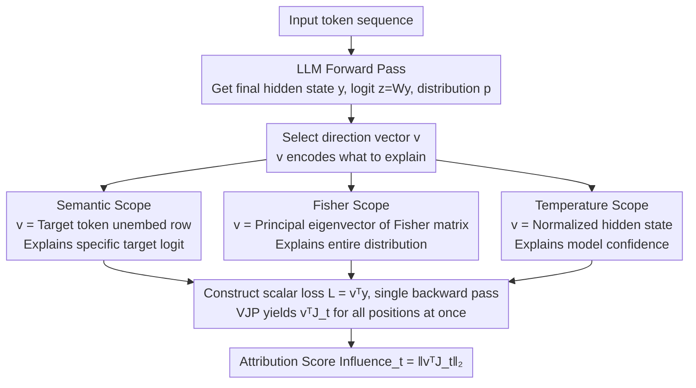

# Jacobian Scopes: Token-Level Causal Attributions in LLMs

**Conference**: ACL 2026  
**arXiv**: [2601.16407](https://arxiv.org/abs/2601.16407)  
**Code**: https://huggingface.co/spaces/Typony/JacobianScopes (Online demo)  
**Area**: Interpretability / Causal Attribution / LLM Internal Mechanisms  
**Keywords**: Jacobian, vector-Jacobian product, Fisher Information, Effective Temperature, Token Attribution

## TL;DR
The authors propose Jacobian Scopes—a unified framework that uses the "projection of the Jacobian from input token embeddings to the final hidden state onto a specific vector" as the token attribution strength. It features three scopes (Semantic / Fisher / Temperature) to explain how specific target logits, the entire predictive distribution, and model confidence are driven by input tokens. It requires only one backward pass and matches Input×Gradient while significantly outperforming Integrated Gradients on the AOPC metric.

## Background & Motivation
**Background**: Mainstream paths for LLM interpretability include attention visualization, activation patching, circuit tracing, or Sparse Autoencoders (SAE / Gemma Scope). Gradient-based attribution methods include Integrated Gradients, Input × Gradient, and SmoothGrad. These methods each have their own objective functions and geometric assumptions, lacking a unified framework to define "exactly what is being explained."

**Limitations of Prior Work**: (1) Gradient attribution methods often conflate "how a specific logit is formed" with "how the entire predictive distribution is formed," showing weak explanatory power for tasks with non-unique predictions like translation. (2) IG-type methods require multi-step integration (K forward + backward passes), incurring high costs. (3) Attention visualization only explains structural information and is far removed from the causal chain of the final prediction. (4) Almost no mainstream attribution can explain "model confidence (temperature)," a dimension critical for ICL time-series forecasting.

**Key Challenge**: Attribution methods require an **explicit explanandum**—is it the logit, the shape of the distribution, or the width of the distribution? Different objects correspond to different geometric directions $\bm{v}$, yet existing works either hardcode it as a logit (IG) or use heuristics (attention), lacking a unified primitive where "specifying a direction allows calculating attribution."

**Goal**: To construct a mathematically clear, computationally single-backward, and geometrically interpretable attribution primitive, and provide three typical explanatory objects (Semantic / Distribution / Temperature) under this primitive, where each corresponds to an easily computable direction vector $\bm{v}$.

**Key Insight**: Observed that all questions of "how input token $\bm{x}_t$ affects an output property" can be written as $\|\bm{v}^\intercal \bm{J}_t\|_2$, where $\bm{J}_t := \partial \bm{y} / \partial \bm{x}_t$ is the Jacobian from input to the final hidden state, and $\bm{v}$ is the "direction" of interest. This compresses the entire family of attribution problems into the design choice of "picking a $\bm{v}$."

**Core Idea**: Use the vector-Jacobian product (VJP) $\bm{v}^\intercal \bm{J}_t$ as a unified token attribution primitive. By selecting different $\bm{v}$ (unembed row / Fisher principal eigenvector / normalized hidden state), three Scopes are derived: Semantic, Fisher, and Temperature. These cover logits, the full distribution, and confidence, respectively, each requiring only one backward pass.

## Method

### Overall Architecture
Model the LLM as a function $f:\bm{X}_{1:T}\mapsto\bm{y}\in\mathbb{R}^{d_{\text{model}}}$, outputting the final post-LN hidden state $\bm{y}$, followed by $\bm{z}=\bm{W}\bm{y}$ and $\bm{p}=\mathrm{softmax}(\bm{z})$ to obtain logits and the predictive distribution. For each input position $t$, the input-to-output Jacobian is defined as $\bm{J}_t=\partial\bm{y}/\partial\bm{x}_t\in\mathbb{R}^{d_{\text{model}}\times d_{\text{model}}}$, but computing it directly requires $d_{\text{model}}$ backward passes. The core observation is that any "how input affects output property" question can be formulated as $\|\bm{v}^\intercal\bm{J}_t\|_2$, where the direction vector $\bm{v}$ encodes "what you want to explain." By constructing a scalar loss $\mathcal{L}=\bm{v}^\intercal\bm{y}$ and performing one backward pass, the vector-Jacobian product yields all $\bm{v}^\intercal\bm{J}_t$ simultaneously. The geometric meaning of the unified attribution score $\mathrm{Influence}_t:=\|\bm{v}^\intercal\bm{J}_t\|_2$ is the "maximum displacement in direction $\bm{v}$ caused by an $\varepsilon$-norm perturbation on $\bm{x}_t$." By simply changing $\bm{v}$, the pipeline derives Semantic, Fisher, and Temperature Scopes.

### Key Designs

**1. Semantic Scope: Using unembed rows to explain specific target token logits**

When there is a specific target word in mind, such as "why the model predicted 'truthful' over others," the logit of that word is the natural explanatory object. This scope sets $\bm{v}=\bm{w}_{\text{target}}$ (the corresponding row in the unembed matrix), making the scalar loss $\mathcal{L}_{\text{semantic}}=\bm{w}_{\text{target}}^\intercal\bm{y}=z_{\text{target}}$ exactly the target logit. The attribution score is $\mathrm{Influence}_t^{\text{Sem}}=\|\bm{w}_{\text{target}}^\intercal\bm{J}_t\|_2$. While Input × Gradient and IG implicitly do this, Semantic Scope explicitly frames it as a VJP case, highlighting that the "target direction is the unembed row." It is ideal for "single target word" scenarios, such as tracing LLaMA's semantic inversion from "deceive" → "truthful" or revealing implicit political biases.

**2. Fisher Scope: Using principal directions of information geometry to explain the entire distribution**

In tasks like translation, predictions are non-unique—multiple synonyms may be correct. Focusing on a single logit loses semantic cluster information. Fisher Scope instead uses the Fisher Information Matrix $\bm{F}=\bm{W}^\intercal(\mathrm{diag}(\bm{p})-\bm{p}\bm{p}^\intercal)\bm{W}$, which is the local metric of the KL divergence at that point. By performing eigen-decomposition $\bm{F}=\bm{U}\bm{\Lambda}\bm{U}^\intercal$, the principal Fisher direction $\bm{u}_1$ corresponding to the largest eigenvalue is chosen as $\bm{v}$. The attribution score is $\mathrm{Influence}_t^{\text{Fisher}}=\|\bm{u}_1^\intercal\bm{J}_t\|_2$, which theoretically approximates the total mutual information between $\bm{p}$ and $\bm{x}_t$ at rank-1. This identifies the most sensitive direction in the output space. Experiments demonstrate that LLaMA performs "word-level alignment + phrase-level cross-token reasoning" in IWSLT.

**3. Temperature Scope: Using the hidden state direction to explain model confidence**

For ICL numerical prediction (e.g., time-series), the core question is "how certain the model is," i.e., what controls the width of the Gaussian-like peak in the predictive distribution. This dimension was not directly explained by previous methods. Temperature Scope decomposes the hidden state into magnitude and direction $\bm{y}=\|\bm{y}\|_2\,\hat{\bm{y}}$, so $\bm{z}=\beta_{\text{eff}}\hat{\bm{z}}$, where $\beta_{\text{eff}}=\|\bm{y}\|_2$ is the effective inverse temperature. The authors prove in the appendix that $\beta_{\text{eff}}^{-1}$ is proportional to the variance when the softmax output is approximately Gaussian. Setting $\bm{v}=\hat{\bm{y}}$ yields the score $\mathrm{Influence}_t^{\text{Temp}}=\|\hat{\bm{y}}^\intercal\bm{J}_t\|_2$. This explains "which part of the history the model copies to determine uncertainty" and validates the context parroting hypothesis—LLaMA tends to perform nearest-neighbor search in delayed embedding space for chaotic systems like Lorenz while attending only to recent tokens for systems like Brownian motion.

### Loss & Training
This is a purely post-hoc analysis method involving no training, requiring only one backward pass after selecting $\bm{v}$. The scalar losses for the three Scopes are:

| Scope | $\bm{v}$ | Loss $\mathcal{L}$ |
|-------|---------|-------------------|
| Semantic | $\bm{w}_{\text{target}}$ | $z_{\text{target}}$ |
| Fisher | $\bm{u}_1$ (FIM principal eigenvector) | $\bm{u}_1^\intercal \bm{y}$ |
| Temperature | $\hat{\bm{y}}$ | $\beta_{\text{eff}} = \|\bm{y}\|_2$ |

Implementation details: Parameter gradients are disabled; the single backward pass accumulates only on input embeddings. The time cost is comparable to one backward pass (0.027s vs. 0.069s forward for the Example in Fig.3 on an RTX A4000).

## Key Experimental Results

### Main Results: AOPC Attribution Quality Comparison (LLaMA-3.2 3B)
AOPC (Area Over Perturbation Curve): The drop in target token log-prob after zeroing out the top-k% highest attribution tokens (more negative = more accurate).

| Method | LAMBADA | IWSLT2017 DE→EN |
|--------|---------|-----------------|
| Random | $-0.23 \pm 0.01$ | $-0.19 \pm 0.01$ |
| Integrated Gradients | $-0.67 \pm 0.01$ | $-0.58 \pm 0.01$ |
| Input × Gradient | $-1.12 \pm 0.01$ | $-0.77 \pm 0.01$ |
| **Semantic Scope (Ours)** | $-1.16 \pm 0.01$ | $-0.78 \pm 0.01$ |
| **Temperature Scope (Ours)** | $\bm{-1.17 \pm 0.01}$ | $-0.76 \pm 0.01$ |
| **Fisher Scope (Ours)** | $\bm{-1.17 \pm 0.01}$ | $\bm{-0.80 \pm 0.01}$ |

### Ablation Study: Cross-Model Scale + Relative Advantages of Scopes

| Evaluation Scenario | Semantic | Fisher | Temperature | Key Observations |
|---------|----------|--------|------------|---------|
| Semantic/Bias Visualization | ✅ Best | – | – | Target is clear; Semantic gives precise tokens. |
| Translation (Non-unique) | Blurry | ✅ Best | – | Fisher captures word + phrase-level alignment. |
| Time-series ICL (Lorenz) | – | – | ✅ Best | Temperature reveals "history-match" patterns. |
| Time-series ICL (Brownian) | – | – | ✅ Best | Temperature reveals "forgetting early context." |
| LLaMA-3.2 1B / 3B / Qwen2.5 1.5B / 7B | Beats IG | Beats IG | Beats IG | Robust across model scales and series. |

### Key Findings
- **Scopes are complementary and non-interchangeable**: In ICL numerical tasks, Semantic/Fisher Scopes provide blurry attributions, while Temperature Scope accurately identifies "which segment the model is copying" (detailed in A.5).
- **VJP single backward is sufficient**: Attribution overhead is of the same magnitude as one backward pass, significantly faster than IG's K-step integration, while achieving better AOPC.
- **first-order sensitivity $\approx$ counterfactual relevance**: AOPC is a real intervention metric (zeroing tokens to see log-prob drop), while the Jacobian is a first-order local linearization. Their alignment suggests linear approximation at the token level is sufficient for causal importance.
- **Temperature Scope validates context parroting**: For chaotic systems like Lorenz with repeating motifs, LLaMA indeed performs "nearest-neighbor copying" in delayed-embedding space, providing direct attribution evidence for the hypothesis by Zhang & Gilpin (2025).
- **Attention sink interference**: In Brownian experiments, high attribution for early tokens partly stems from the attention sink phenomenon, a caveat discussed in A.7.

## Highlights & Insights
- **VJP-as-attribution-primitive**: Framing the choice of direction $\bm{v}$ as the fundamental design of attribution creates an elegant, extensible framework. Any new explanatory object (e.g., an SAE feature or a specific circuit) can be immediately attributed by defining $\bm{v}$ without reinventing the method.
- **Information Geometry Perspective of Fisher Scope**: Using FIM's principal direction to answer "which input changes the distribution most" is the first work to explicitly link distributional geometry to token attribution, transferable to RLHF reward model explanation and bias analysis.
- **Temperature Scope for ICL Mechanisms**: Providing the first "input attribution for model confidence" and translating the question of "why LLMs can/cannot learn dynamical systems in-context" into "which part of the context the model copies," moving ICL explanation from pattern discovery to mechanistic causality.
- **Minimalist implementation + Interactive demo**: Single backward pass + HuggingFace Spaces demo allows researchers to immediately visualize their own prompts, offering high reusability.

## Limitations & Future Work
- **First-order Linearity**: Jacobians only capture first-order causal relationships near input embeddings; they lacks explanatory power for multi-layer non-linear causal chains (which activation patching/circuit tracing can capture).
- **Architectural Blindness**: The method views the LLM as an input-output function, thus cannot explain "which layer or attention head was responsible," only partially addressing mechanistic interpretability needs.
- **Backward Pass Requirement**: Requires a backward pass compared to forward-only methods (SAE, attention), though the overhead is acceptable ($\approx$ 1 backward).
- **Architectural Artifacts**: Architectural artifacts like attention sinks can pollute attributions, as seen in the Brownian experiment; corrections combined with architectural knowledge may be needed.
- **Future Directions**: Exploring higher-order spectral structures of Jacobian/FIM (using top-$k$ directions); integrating with SAEs for "feature-level Scopes"; and extending to multi-token joint attribution.

## Related Work & Insights
- **vs. Integrated Gradients (Sundararajan 2017)**: IG integrates along an interpolation path to satisfy axioms but requires K steps; Jacobian Scope is local/first-order but single-pass and achieves better AOPC, suggesting "satisfying axioms $\neq$ better empirical accuracy."
- **vs. Input × Gradient (Shrikumar 2017)**: This can be viewed as a strict generalization—I×G is a specific case where $\bm{v}$ is the input direction. This work allows arbitrary $\bm{v}$ for broader explanatory power.
- **vs. Activation Patching / Circuit Tracing (Heimersheim 2024; Ameisen 2025)**: Those are interventionist methods revealing circuits; this is an observational method for token-level causality—complementary rather than replacement.
- **vs. SAE / Gemma Scope (Lieberum 2024)**: SAE explains "what a feature is," while this explains "which tokens activated the feature." They can be combined.
- **vs. Context Parroting (Zhang & Gilpin 2025)**: Temperature Scope provides the first direct attribution evidence for their hypothesis.

## Rating
- Novelty: ⭐⭐⭐⭐ VJP as a unified primitive + two new Scopes (Fisher / Temperature) is a beautiful geometric reconstruction; however, the basic idea of gradient attribution is not entirely new.
- Experimental Thoroughness: ⭐⭐⭐⭐ AOPC across LAMBADA/IWSLT, 4 model scales, and 3 task case studies provides broad coverage, though lacks validation on very large models (70B+).
- Writing Quality: ⭐⭐⭐⭐⭐ Formulas, geometric interpretations, and case figures flow seamlessly; the appendix provides solid theoretical proofs.
- Value: ⭐⭐⭐⭐ Provides plug-and-play tools, an online demo, and a unified framework, offering long-term reference value for the interpretability community, especially opening new avenues for ICL mechanism research via Temperature Scope.

<!-- RELATED:START -->

## Related Papers

- [\[ACL 2026\] METER: Evaluating Multi-Level Contextual Causal Reasoning in Large Language Models](meter_evaluating_multi-level_contextual_causal_reasoning_in_large_language_model.md)
- [\[NeurIPS 2025\] Learning to Focus: Causal Attention Distillation via Gradient-Guided Token Pruning](../../NeurIPS2025/interpretability/learning_to_focus_causal_attention_distillation_via_gradient-guided_token_prunin.md)
- [\[ICML 2026\] Towards Long-Horizon Interpretability: Efficient and Faithful Multi-Token Attribution for Reasoning LLMs](../../ICML2026/interpretability/towards_long-horizon_interpretability_efficient_and_faithful_multi-token_attribu.md)
- [\[ACL 2026\] Flattery in Motion: Benchmarking and Analyzing Sycophancy in Video-LLMs](flattery_in_motion_benchmarking_and_analyzing_sycophancy_in_video-llms.md)
- [\[ICML 2025\] Towards Attributions of Input Variables in a Coalition](../../ICML2025/interpretability/towards_attributions_of_input_variables_in_a_coalition.md)

<!-- RELATED:END -->
