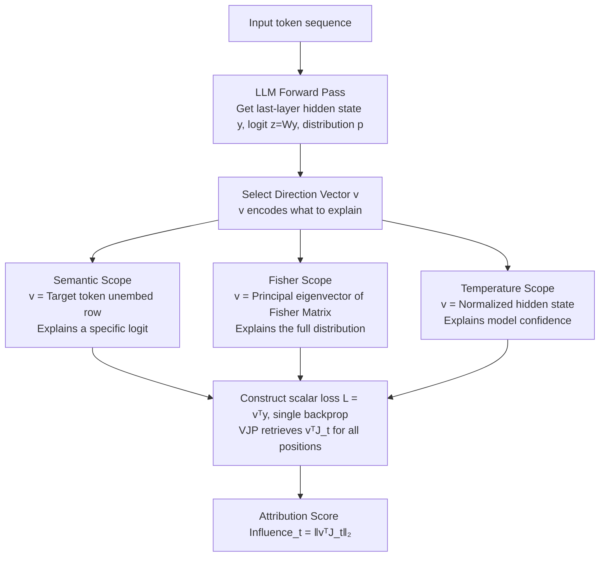

# Jacobian Scopes: Token-Level Causal Attributions in LLMs

**Conference**: ACL 2026  
**arXiv**: [2601.16407](https://arxiv.org/abs/2601.16407)  
**Code**: https://huggingface.co/spaces/Typony/JacobianScopes (online demo)  
**Area**: Interpretability / Causal Attribution / LLM Internal Mechanisms  
**Keywords**: Jacobian, vector-Jacobian product, Fisher Information, Effective Temperature, token attribution

## TL;DR
The authors propose Jacobian Scopes—a unified framework that uses the "projection of the Jacobian from input token embeddings to the last-layer hidden state onto a specific vector" as token attribution strength. Accompanied by three scopes (Semantic / Fisher / Temperature) to explain how a "target logit / entire prediction distribution / model confidence" is driven by various input tokens, it requires only one backpropagation. On AOPC metrics, it matches Input×Gradient and significantly outperforms Integrated Gradients.

## Background & Motivation
**Background**: The mainstream paths for LLM interpretability include attention visualization, activation patching, circuit tracing, or Sparse Autoencoders (SAE / Gemma Scope); gradient-based attributions include Integrated Gradients (IG), Input × Gradient, SmoothGrad, etc. These methods have their own objective functions and geometric assumptions, lacking a unified framework to answer "what exactly is being explained."

**Limitations of Prior Work**: (1) Gradient attribution methods conflate "how a specific logit originates" with "how the entire prediction distribution originates," offering weak explanatory power for non-unique prediction tasks like translation. (2) IG-based methods require multi-step integration (K forward + backward passes), which is computationally expensive. (3) Attention visualization only explains structural information and is too distant from the final predictive causal chain. (4) Almost no mainstream attribution can explain "model confidence (temperature)," a dimension particularly critical for ICL time-series forecasting.

**Key Challenge**: Attribution methods require an **explicit explanandum**—is it the logit, the shape of the distribution, or the width of the distribution? Different objects correspond to different geometric directions $\bm{v}$, but existing work either hard-codes this to the logit (IG) or uses heuristics (attention), lacking a unified primitive where "specifying a direction allows for attribution calculation."

**Goal**: To construct a mathematically clear, single-backprop, and geometrically interpretable attribution primitive, and to provide three typical explanatory objects (Semantic / Distribution / Confidence) under this primitive, each corresponding to an easily calculated direction vector $\bm{v}$.

**Key Insight**: It is observed that all questions regarding "how input token $\bm{x}_t$ affects a certain output property" can be written as $\|\bm{v}^\intercal \bm{J}_t\|_2$, where $\bm{J}_t := \partial \bm{y} / \partial \bm{x}_t$ is the Jacobian from the input to the last-layer hidden state, and $\bm{v}$ is the "direction" being queried. This compresses the entire family of attribution problems into the design choice of "picking a $\bm{v}$."

**Core Idea**: Use the vector-Jacobian product (VJP) $\bm{v}^\intercal \bm{J}_t$ as a unified token attribution primitive. By selecting different $\bm{v}$ (unembed rows / principal eigenvector of Fisher / normalized hidden state), three Scopes—Semantic, Fisher, and Temperature—are derived. These cover explainability for logits, the full distribution, and confidence, with each requiring only one backpropagation pass.

## Method

### Overall Architecture
Consider the LLM as a function $f:\bm{X}_{1:T}\mapsto\bm{y}\in\mathbb{R}^{d_{\text{model}}}$, outputting the last-layer post-LN hidden state $\bm{y}$, followed by $\bm{z}=\bm{W}\bm{y}$ and $\bm{p}=\mathrm{softmax}(\bm{z})$ to obtain the logit and prediction distribution. For each input position $t$, the input-to-output Jacobian can be defined as $\bm{J}_t=\partial\bm{y}/\partial\bm{x}_t\in\mathbb{R}^{d_{\text{model}}\times d_{\text{model}}}$, but calculating it directly requires $d_{\text{model}}$ backpropagation passes. The core observation of this paper is: any question about "how an input token affects an output property" can be formulated as $\|\bm{v}^\intercal\bm{J}_t\|_2$, where the direction vector $\bm{v}$ encodes "what you want to explain." Consequently, by constructing a scalar loss $\mathcal{L}=\bm{v}^\intercal\bm{y}$ and performing one backprop, the vector-Jacobian product can yield $\bm{v}^\intercal\bm{J}_t$ for all positions at once. The geometric meaning of the unified attribution score $\mathrm{Influence}_t:=\|\bm{v}^\intercal\bm{J}_t\|_2$ is the "maximum displacement caused in the $\bm{v}$ direction by an $\varepsilon$-norm perturbation on $\bm{x}_t$." The entire pipeline simply requires switching $\bm{v}$ to derive the Semantic, Fisher, and Temperature Scopes for logits, the distribution, and confidence, respectively.

### Key Designs

**1. Semantic Scope: Explaining a specific target token logit via unembed rows**

When there is a specific target word in mind, such as "why the model predicted 'truthful' over others," the natural explanatory object is the logit of that word. This paper sets $\bm{v}=\bm{w}_{\text{target}}$ (the row in the unembed matrix corresponding to the target token). Here, the scalar loss $\mathcal{L}_{\text{semantic}}=\bm{w}_{\text{target}}^\intercal\bm{y}=z_{\text{target}}$ is exactly the logit of the target token, and the attribution score is $\mathrm{Influence}_t^{\text{Sem}}=\|\bm{w}_{\text{target}}^\intercal\bm{J}_t\|_2$. Input × Gradient and IG implicitly perform this; Semantic Scope's value lies in explicitly defining it as a special case of VJP, clarifying that the "target direction is the unembed row," making it ideal for scenarios with a single target word, such as excavating the "deceive" → "truthful" semantic reversal chain in LLaMA or revealing implicit biases like "Columbia → liberal."

**2. Fisher Scope: Explaining the full prediction distribution via information geometry**

In tasks like translation, predictions are not unique—multiple synonyms may be correct. Focusing on a single logit loses semantic cluster information regarding which family of tokens the distribution favors. Fisher Scope instead uses the Fisher Information Matrix (FIM) $\bm{F}=\bm{W}^\intercal(\mathrm{diag}(\bm{p})-\bm{p}\bm{p}^\intercal)\bm{W}$, which is the local metric of KL divergence at that point. By performing eigen-decomposition $\bm{F}=\bm{U}\bm{\Lambda}\bm{U}^\intercal$ and taking the principal Fisher direction $\bm{u}_1$ corresponding to the largest eigenvalue as $\bm{v}$, the attribution score becomes $\mathrm{Influence}_t^{\text{Fisher}}=\|\bm{u}_1^\intercal\bm{J}_t\|_2$. It can be theoretically proven that this is a rank-1 approximation of the total mutual information between $\bm{p}$ and $\bm{x}_t$. This allows it to automatically find the most sensitive direction in the output space. Experiments clearly show LLaMA performing "token-level alignment + phrase-level cross-token reasoning" on IWSLT.

**3. Temperature Scope: Explaining model confidence via hidden state direction**

A core issue in ICL numerical prediction (e.g., time series) is "how certain the model is," i.e., what controls the width of the Gaussian-like peak in the prediction distribution. This dimension has not been directly explained by previous attribution methods. Temperature Scope decomposes the hidden state into magnitude and direction $\bm{y}=\|\bm{y}\|_2\,\hat{\bm{y}}$, resulting in $\bm{z}=\beta_{\text{eff}}\hat{\bm{z}}$, where $\beta_{\text{eff}}=\|\bm{y}\|_2$ is the effective inverse temperature. The authors prove in the appendix that when the softmax output approximates a Gaussian, $\beta_{\text{eff}}^{-1}$ is proportional to the variance. Setting $\bm{v}=\hat{\bm{y}}$ yields the attribution score $\mathrm{Influence}_t^{\text{Temp}}=\|\hat{\bm{y}}^\intercal\bm{J}_t\|_2$. This explains "which segment of history the model copies to determine its next step of uncertainty" and directly validates the context parroting hypothesis—LLaMA tends to perform nearest-neighbor search in the delay-embedding space to copy historical segments for chaotic systems with periodic motifs (like Lorenz), while only looking at the last few tokens for systems without motifs (like Brownian).

### Loss & Training
This is a purely post-hoc analysis method and does not involve model training. It requires only one backpropagation after selecting $\bm{v}$. The scalar losses for the three Scopes are as follows:

| Scope | $\bm{v}$ | Loss $\mathcal{L}$ |
|-------|---------|-------------------|
| Semantic | $\bm{w}_{\text{target}}$ | $z_{\text{target}}$ |
| Fisher | $\bm{u}_1$ (FIM principal eigenvector) | $\bm{u}_1^\intercal \bm{y}$ |
| Temperature | $\hat{\bm{y}}$ | $\beta_{\text{eff}} = \|\bm{y}\|_2$ |

Implementation details: Parameter gradients are entirely disabled, and the single backpropagation accumulates only on input embeddings. Thus, the time for one attribution is equivalent to one backward pass (e.g., 0.027s in Fig. 3 on an RTX A4000, compared to 0.069s for the forward pass).

## Key Experimental Results

### Main Results: AOPC Attribution Quality Comparison (LLaMA-3.2 3B)
AOPC (Area Over Perturbation Curve): The drop in target token log-prob after zeroing out the top-k% highest attribution tokens (more negative = more accurate attribution).

| Method | LAMBADA | IWSLT2017 DE→EN |
|--------|---------|-----------------|
| Random | $-0.23 \pm 0.01$ | $-0.19 \pm 0.01$ |
| Integrated Gradients | $-0.67 \pm 0.01$ | $-0.58 \pm 0.01$ |
| Input × Gradient | $-1.12 \pm 0.01$ | $-0.77 \pm 0.01$ |
| **Semantic Scope (Ours)** | $-1.16 \pm 0.01$ | $-0.78 \pm 0.01$ |
| **Temperature Scope (Ours)** | $\bm{-1.17 \pm 0.01}$ | $-0.76 \pm 0.01$ |
| **Fisher Scope (Ours)** | $\bm{-1.17 \pm 0.01}$ | $\bm{-0.80 \pm 0.01}$ |

### Ablation Study: Cross-model Scale + Relative Scope Advantages

| Evaluation Scenario | Semantic | Fisher | Temperature | Key Observation |
|---------|----------|--------|------------|---------|
| Semantic/Bias Visualization | ✅ Best | – | – | Target word is clear; Semantic provides precise tokens. |
| Translation (Non-unique) | Blurry | ✅ Best | – | Fisher captures token + phrase-level cross-source alignment. |
| Time-series ICL (Lorenz) | – | – | ✅ Best | Temperature reveals "history-match" attention patterns. |
| Time-series ICL (Brownian) | – | – | ✅ Best | Temperature reveals "forgetting early context" behavior. |
| LLaMA-3.2 1B / 3B / Qwen2.5 1.5B / 7B | All > IG | All > IG | All > IG | Robust across model scales/series. |

### Key Findings
- **The three Scopes are complementary and non-interchangeable**: In ICL numerical prediction tasks, Semantic and Fisher Scopes provide blurry attributions, while only Temperature Scope accurately identifies "which segment the model is copying" (detailed in A.5).
- **Single-backprop VJP is sufficient**: Attribution overhead is of the same order as a single backward pass, making it over K times faster than IG's K-step integration, while achieving better AOPC.
- **First-order sensitivity ≈ counterfactual relevance**: AOPC is a real intervention metric checking probability drops after zeroing tokens, while the Jacobian is an first-order term of local linearization. Their alignment shows that linear approximation at the token level is sufficient for characterizing causal importance in LLMs.
- **Temperature Scope validates the context parroting hypothesis**: LLaMA indeed performs "nearest-neighbor copying" in the delayed-embedding space for chaotic systems like Lorenz, providing direct attribution evidence for the "context parroting" hypothesis by Zhang & Gilpin (2025).
- **Attention sink interference**: High attribution of early tokens in Brownian experiments partially stems from the attention sink phenomenon, discussed as a caveat in A.7.

## Highlights & Insights
- **VJP-as-attribution-primitive**: Treating the choice of a direction $\bm{v}$ as the fundamental design choice for attribution provides an elegant and extensible unified framework. Any future explanatory object (e.g., an SAE feature or a specific circuit) only needs a defined $\bm{v}$ to obtain instant attribution without reinventing the method.
- **Fisher Scope's information geometry perspective**: Using the FIM's principal eigenvector to answer "which input changes the distribution the most" is the first work to explicitly link distribution geometry to token attribution, which is transferable to RLHF reward model explanation and bias analysis.
- **Temperature Scope explaining ICL mechanisms**: This provides the first "input attribution for model confidence" and translates the question of "why LLMs can/cannot learn dynamical systems in-context" into "which segment in the context the model is copying," advancing ICL interpretability from "pattern discovery" to "causal mechanism."
- **Minimalist implementation + interactive demo**: Single backpropagation + HuggingFace Spaces online demo allows researchers to apply visualization to their own prompts immediately, offering high reproducibility.

## Limitations & Future Work
- **First-order linearity**: The Jacobian only captures first-order causal relationships near input embeddings, lacking explanatory power for non-linear causal chains across multiple layers (of the type activation patching or circuit tracing can capture).
- **Architectural blindness**: The method views input-output relationships without entering the internal Transformer structure, thus unable to specify "which layer or attention head was responsible," satisfying only half the needs of the mechanistic interpretability community.
- **Dependency on backpropagation**: Requires an extra backward pass compared to forward-only methods (like SAE features or attention), though the 1x backprop overhead is acceptable.
- **Pollution by architectural artifacts**: High scores for early tokens in Brownian experiments due to attention sinks is one example where architectural knowledge is needed for calibration.
- **Future Directions**: Higher-order spectral structures of the Jacobian and FIM (using the top-$k$ eigenvectors instead of just $\bm{u}_1$) could derive more Scopes; integration with SAE features could yield "feature-level Scopes"; extension to joint multi-token attribution.

## Related Work & Insights
- **vs. Integrated Gradients (Sundararajan 2017)**: IG integrates along an interpolation path to satisfy axioms but requires K forward/backward steps; Jacobian Scope is local/first-order but faster and yields better AOPC, suggesting "satisfying axioms ≠ better empirical accuracy."
- **vs. Input × Gradient (Shrikumar 2017)**: This work is a strict generalization—I×G is a special case where $\bm{v}$ is the input direction; this work allows arbitrary $\bm{v}$ for broader explanatory power.
- **vs. activation patching / circuit tracing (Heimersheim 2024; Ameisen 2025)**: Those are explicit intervention methods revealing circuits; this is an observational method explaining token-level causality—complementary, not alternative.
- **vs. SAE / Gemma Scope (Lieberum 2024)**: SAEs explain "what a feature is"; this work explains "which tokens activated the feature." They can be used in combination.
- **vs. context parroting (Zhang & Gilpin 2025)**: Temperature Scope provides the first direct attribution evidence for their hypothesis.

## Rating
- Novelty: ⭐⭐⭐⭐ VJP as a unified attribution primitive + Fisher/Temperature Scopes represent an elegant geometric restructuring; though the basic idea of gradient-based attribution is not entirely new.
- Experimental Thoroughness: ⭐⭐⭐⭐ Broad coverage with AOPC across LAMBADA/IWSLT and 4 model scales + 3 task case studies; lacks verification on larger-scale (70B+) models.
- Writing Quality: ⭐⭐⭐⭐⭐ Formulas, geometric explanations, and case diagrams are seamlessly integrated. The appendix provides solid theoretical proofs, making it a "read and use" paper.
- Value: ⭐⭐⭐⭐ Provides plug-and-play tools, an online demo, and a unified framework. It has long-term significance for the LLM interpretability community, especially Temperature Scope for ICL mechanism research.

<!-- RELATED:START -->

## Related Papers

- [\[ACL 2026\] METER: Evaluating Multi-Level Contextual Causal Reasoning in Large Language Models](meter_evaluating_multi-level_contextual_causal_reasoning_in_large_language_model.md)
- [\[ICLR 2026\] Hessian-Enhanced Token Attribution (HETA): Interpreting Autoregressive LLMs](../../ICLR2026/interpretability/hessian-enhanced_token_attribution_heta_interpreting_autoregressive_llms.md)
- [\[ICML 2026\] Towards Long-Horizon Interpretability: Efficient and Faithful Multi-Token Attribution for Reasoning LLMs](../../ICML2026/interpretability/towards_long-horizon_interpretability_efficient_and_faithful_multi-token_attribu.md)
- [\[ACL 2026\] How Context Shapes Truth: Geometric Transformations of Statement-level Truth Representations in LLMs](how_context_shapes_truth_geometric_transformations_of_statement-level_truth_repr.md)
- [\[NeurIPS 2025\] Learning to Focus: Causal Attention Distillation via Gradient-Guided Token Pruning](../../NeurIPS2025/interpretability/learning_to_focus_causal_attention_distillation_via_gradient-guided_token_prunin.md)

<!-- RELATED:END -->
