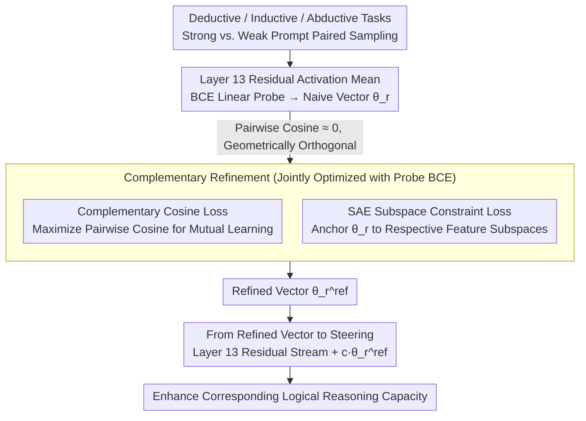

# Knowledge Vector of Logical Reasoning in Large Language Models

**Conference**: ACL 2026  
**arXiv**: [2604.23877](https://arxiv.org/abs/2604.23877)  
**Code**: https://github.com/lei-nlp-lab/knowledge_vector_acl_2026  
**Area**: Interpretability / Logical Reasoning / Activation Steering  
**Keywords**: Knowledge Vector, Logical Reasoning, Sparse Autoencoder, Complementary Subspace, Activation Steering

## TL;DR
The authors demonstrate that the capacities for deductive, inductive, and abductive reasoning within LLMs can be linearly represented as three nearly orthogonal "knowledge vectors." They propose a complementary refinement framework based on SAE subspace constraints, allowing these vectors to share commonalities while preserving unique characteristics, thereby stably enhancing performance across all three reasoning types under steering settings.

## Background & Motivation

**Background**: Knowledge vectors and activation steering have been shown to linearly represent high-level concepts like truthfulness and instruction following in LLMs, enabling behavioral control by adding these vectors to the residual stream. However, prior work has focused almost exclusively on specific behaviors (e.g., truthfulness, backtracking), while the systematic linear representation of "general logical reasoning capacity" remains unexplored.

**Limitations of Prior Work**: Classical logic categorizes reasoning into deduction, induction, and abduction, but how LLMs internally represent these—and whether they are independent or collaborative—remains a black box. Without precise localization, controllable intervention is impossible, and the internal mechanisms of Chain-of-Thought (CoT) cannot be fully explained.

**Key Challenge**: By extracting naive vectors for each reasoning type using contrastive probes, the authors found that the three vectors exhibit pairwise cosine similarities near zero—meaning LLMs represent these reasoning types in nearly orthogonal subspaces. This contradicts cognitive science, where these reasoning types share underlying cognitive operations (e.g., newly induced premises are immediately used in deduction). Thus, "geometric independence" is likely a byproduct of suboptimal representation rather than an optimal state.

**Goal**: (1) Verify if the three types of logical reasoning satisfy the linear representation hypothesis; (2) Design a mechanism to ensure vectors share commonalities while maintaining independence, verified through steering performance; (3) Perform mechanistic interpretability analysis on internal circuits using SAEs and activation patching before and after refinement.

**Key Insight**: Sparse Autoencoders (SAEs) can decompose the LLM residual stream into sparse, interpretable features. By filtering the most discriminative SAE features for each reasoning type and performing QR orthogonalization on their decoder directions, a set of basis vectors for the reasoning "fingerprint" subspace is obtained. Optimizing for both "complementary attraction" and "subspace retention" allows reasoning vectors to learn from each other without overlapping excessively.

**Core Idea**: Use a complementary cosine loss to "pull" the three reasoning vectors closer, combined with an SAE subspace projection loss to "anchor" them back to their respective feature structures, creating complementary reasoning vectors that possess both shared and unique properties.

## Method

### Overall Architecture
The method consists of two stages. The first stage extracts naive knowledge vectors: for deductive, inductive, and abductive tasks, paired sampling of "strong vs. weak prompts" is used, retaining only samples where the strong prompt succeeds and the weak prompt fails. Residual activations at layer $l$ during the generation of these samples are averaged to obtain positive activations $\bar a^+$ and negative activations $\bar a^-$. A BCE linear probe $p_r=\sigma(\theta_r^\top x+b_r)$ is trained on these activations, where the probe weights $\theta_r$ serve as the "knowledge vector" (layer 13 is selected for Llama-3.1-8B-it and Gemma-2-9B-it). The second stage involves complementary refinement: complementary cosine loss and SAE subspace constraint loss are added to the probe's BCE loss for joint optimization, yielding refined vectors $\theta_r^{\text{ref}}$. During inference, these are added to the residual stream at layer 13 for steering. The core tension lies in the fact that naive vectors are nearly orthogonal, while refinement aims to make them share commonalities where appropriate.

### Key Designs

**1. Complementary Cosine Loss: Pulling vector directions closer to force mutual learning**

The authors observed that naive vectors extracted via contrastive probes have pairwise cosine similarities near zero, indicating that the LLM places different reasoning types in orthogonal subspaces. Since cognitive science suggests these processes are interdependent, the "geometric independence" is treated as a representation deficiency. Thus, they minimize the negative sum of pairwise cosine similarities for $r\neq s$:

$$\mathcal{L}_{\text{com}}=-\sum_{r\neq s}\frac{\theta_r^\top\theta_s}{\|\theta_r\|\,\|\theta_s\|},$$

This pulls the vectors together. To prevent them from collapsing into a single direction and losing specificity, this loss must be paired with the subspace constraint.

**2. SAE Subspace Constraint Loss: "Pinning" each vector to its specific feature subspace**

To maintain identity while sharing knowledge, residual activations are fed into a pretrained SAE (Llama Scope / Gemma Scope) to obtain sparse codes $z$. For each latent $j$, the mean activation ratio $\rho_r(j)=\mu_r^+(j)/(\mu_r^-(j)+\varepsilon)$ is calculated. Latents above the $\alpha=0.9$ quantile are selected, and the Top-$K=3000$ by activation magnitude form the feature set $\mathcal{F}_r$. Their corresponding SAE decoder directions $V_r$ are processed via QR orthogonalization to obtain an orthogonal basis $U_r$. The loss punishes the component of $\theta_r$ that falls outside this subspace:

$$\mathcal{L}_{\text{sub}}^{(r)}=\|(I-U_rU_r^\top)\theta_r\|_2^2.$$

This SAE subspace serves as the "fingerprint" of the reasoning type. As long as $\theta_r$ remains within this subspace, it can rotate to absorb knowledge from other reasoning types without losing its identity—a more semantically homogeneous regularization than hard dimension freezing or L2 regularization.

**3. From Refined Vector to Steering: Amplifying specific reasoning via directional addition**

After refinement, $c \cdot \theta_r^{\text{ref}}$ is added to the residual stream at layer 13 for each new token generated after the prompt. The three losses and the probe BCE are jointly optimized:

$$\mathcal{L}=\sum_r\mathcal{L}_{\text{probe}}^{(r)}+\lambda_{\text{com}}\mathcal{L}_{\text{com}}+\lambda_{\text{sub}}\sum_r\mathcal{L}_{\text{sub}}^{(r)},\quad \lambda_{\text{com}}=0.1,\ \lambda_{\text{sub}}=0.01.$$

Refined vectors achieve higher peak performance with smaller steering coefficients, indicating they capture cleaner, more aligned reasoning directions.

### Loss & Training
The total objective is defined as above. Optimization uses Adam with lr=$10^{-3}$ and batch size 16. The SAE subspace filtering uses threshold $\tau=0.9$, $K=3000$, and $\varepsilon=10^{-6}$. The three reasoning types share a joint training loop. Interventions are applied at layer 13 for Llama-3.1-8B-it and Gemma-2-9B-it. The same paradigm is directly transferred to GPT-OSS-20B.

## Key Experimental Results

### Main Results
Three datasets correspond to three reasoning types: JustLogic (Deductive, acc), DEER (Inductive, METEOR), and ART (Abductive, acc). Results for Llama-3.1-8B-it under Greedy decoding:

| Reasoning Type | Dataset | Unsteered | Mono Steering | Complementary | Gain vs Unsteered |
|----------------|---------|-----------|---------------|---------------|-------------------|
| Deductive      | JustLogic| 48.95     | 55.22         | **56.46**     | +7.51             |
| Inductive      | DEER    | 26.36     | 27.13         | **27.55**     | +1.19             |
| Abductive      | ART     | 32.27     | 39.19         | **40.95**     | +8.68             |

On Gemma-2-9B-it, deductive performance improved from 56.86 → 59.05 and abductive from 54.67 → 58.20. On GPT-OSS-20B (MoE), abductive performance increased from 45.09 → 50.50, proving architectural independence. In Sampling@5, the trend holds: complementary steering consistently outperforms mono steering. On GSM8K (transfer task), deductive vector steering improved performance from 76.26 → 79.37, suggesting the vectors capture more than just dataset bias.

### Ablation Study
Ablation on Llama-3.1-8B-it (relative Δ):

| Configuration | Deductive | Inductive | Abductive | Note |
|---------------|-----------|-----------|-----------|------|
| Full (Comp. + Subspace) | 56.46 | 27.55 | 40.95 | Full method |
| w/o Comp. Enhancement | −2.81 | −0.46 | −3.33 | Degrades to mono; significant drops in deduction/abduction |
| w/o SAE Subspace | −4.58 | −0.29 | −2.09 | Unconstrained complementary loss causes collapse |

### Key Findings
- Both losses are essential: removing the complementary loss yields mono performance; removing the subspace constraint is worse (deductive −4.58 vs −2.81), indicating that "unrestrained complementarity" collapses vectors, which is more damaging than failing to share knowledge.
- After refinement, the SAE feature co-activation similarity between deduction and induction increased from 0.600 → 0.655, while abduction similarity decreased (0.474 → 0.425). This aligns with the cognitive view that deduction/induction are evidence-based while abduction is hypothesis-based.
- Activation patching shows core attention heads (e.g., layer 31 head 14) remain highly active, proving refinement does not disrupt existing circuits. New active heads emerge (e.g., layer 17 head 24 for deduction), and overall activations become more concentrated and sparse.
- Text span analysis: Deductive vectors amplify causal connectives like "therefore/since," inductive vectors favor quantifiers and "statistical pattern" phrases, and abductive vectors amplify hypothesis-selection terms like "more plausible/likely."

## Highlights & Insights
- "Geometric similarity near zero ≠ optimal representation" is a counter-intuitive premise. While most steering work assumes independence is ideal, this paper treats it as a pathology.
- Using the SAE subspace as a "soft anchor" is a clever engineering choice. It avoids the rigidity of freezing dimensions while providing a semantically homogeneous subspace for rotation.
- the "complementary + subspace" dual design is applicable to other "shared yet specialized" scenarios like multi-task LoRA or multi-modal heads.
- While absolute performance gains are modest (max +8), the value lies in providing a controllable and analyzable handle for reasoning.

## Limitations & Future Work
- The study covers only three classical reasoning types; analogical/counterfactual reasoning and planning were not tested.
- The complementary loss is purely pairwise cosine maximization; there is a potential risk of "centralized collapse" when $|\mathcal{P}| > 3$.
- Interventions are limited to a single layer (13/14); multi-layer or dynamic steering might yield better results.
- Steering coefficients still require manual grid search; automated learnable intensities would be more practical.
- Evaluation is primarily in-domain; broader OOD generalization remains to be tested.

## Related Work & Insights
- **vs. Rimsky et al. 2024 (CAA)**: CAA uses simple difference vectors for steering; this work upgrades them to subspace-constrained complementary vectors, which are more robust and support multi-task coexistence.
- **vs. Venhoff et al. 2025**: They focus on steering specific patterns like backtracking; this work raises the granularity to "general logical categories."
- **vs. Wang et al. 2025a (Adaptive Activation Steering)**: That work focuses on adaptive truthfulness; the two methods are orthogonal and could be combined.
- **vs. Cai et al. 2025**: They analyze the behavioral interdependence of deduction/induction; this work provides geometric evidence and controllable intervention mechanisms at the representation level.

## Rating
- Novelty: ⭐⭐⭐⭐ Using "orthogonal reasoning vectors" as a starting point and SAE subspaces for orthogonalization is a novel and natural combination.
- Experimental Thoroughness: ⭐⭐⭐⭐ Coverage of three models, two decoding methods, GSM8K transfer, and mechanistic analyses is extensive.
- Writing Quality: ⭐⭐⭐⭐ Clear motivation and execution; Figure 2 is particularly helpful.
- Value: ⭐⭐⭐⭐ Provides a paradigm for controllable reasoning representations, relevant for both mechanistic interpretability and multi-property steering.

<!-- RELATED:START -->

## Related Papers

- [\[ACL 2026\] Tracing Relational Knowledge Recall in Large Language Models](tracing_relational_knowledge_recall_in_large_language_models.md)
- [\[ACL 2026\] METER: Evaluating Multi-Level Contextual Causal Reasoning in Large Language Models](meter_evaluating_multi-level_contextual_causal_reasoning_in_large_language_model.md)
- [\[ACL 2026\] MINED: Probing and Updating with Multimodal Time-Sensitive Knowledge for Large Multimodal Models](mined_probing_and_updating_with_multimodal_time-sensitive_knowledge_for_large_mu.md)
- [\[ACL 2026\] Compositional Steering of Large Language Models with Steering Tokens](compositional_steering_of_large_language_models_with_steering_tokens.md)
- [\[ICML 2026\] Towards Atoms of Large Language Models](../../ICML2026/interpretability/towards_atoms_of_large_language_models.md)

<!-- RELATED:END -->
