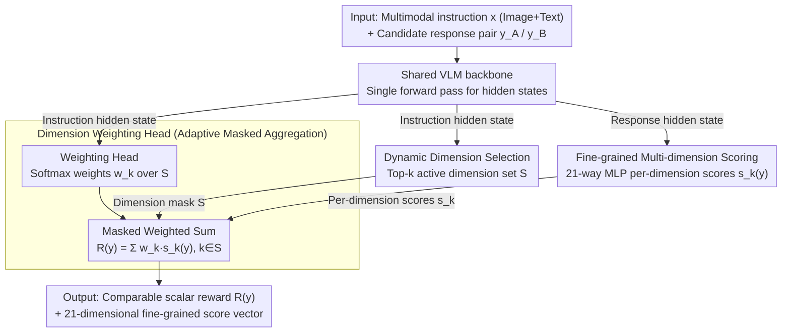

# Learning What Matters: Dynamic Dimension Selection and Aggregation for Interpretable Vision-Language Reward Modeling

**Conference**: ACL 2026  
**arXiv**: [2604.05445](https://arxiv.org/abs/2604.05445)  
**Code**: To be confirmed  
**Area**: Interpretability / Multimodal Reward Modeling / RLHF  
**Keywords**: Vision-Language Reward Models, multi-dimensional evaluation, dynamic gating, DPO alignment, interpretability

## TL;DR
VL-MDR upgrades the "single-scalar black-box" discriminative vision-language reward model into a three-headed architecture consisting of "dynamic dimension selection + per-dimension scoring + adaptive weighting." Combined with a 321k dataset featuring 21-dimensional fine-grained preference annotations, it outperforms existing open-source RMs on VL-RewardBench and generates higher-quality DPO preference pairs to mitigate VLM hallucinations.

## Background & Motivation
**Background**: Multimodal reward models (RM) are critical infrastructure for LVLM alignment. Currently, there are two main approaches: Generative RMs (e.g., LLaVA-Critic), which let the model write natural language reviews and then score, offering interpretability but being slow and prone to positional bias; and Discriminative RMs (e.g., Skywork-VL), which directly regress to a scalar score, offering high throughput but remaining complete black boxes.

**Limitations of Prior Work**: Discriminative RMs compress orthogonal dimensions such as "image fidelity, spatial reasoning, style, and safety" into a single scalar, making it impossible to distinguish whether a response "misinterpreted the image (perception failure)" or "interpreted the image correctly but reasoned incorrectly (reasoning failure)." This coarse-grained feedback prevents downstream RLHF/DPO from knowing which specific error types to optimize.

**Key Challenge**: Interpretability requires outputting multiple signals across dimensions, while efficiency requires a single forward pass without generating long text—these two are irreconcilable on the traditional "scalar vs. text review" axis. Furthermore, the demand for "dimensions" in multimodal tasks is query-dependent: solving geometry problems does not require a "style" dimension, and viewing art does not require a "code reasoning" dimension; fixed weights cannot adapt to these variations.

**Goal**: (1) Design a reward model that mimics human reviewers by "first identifying which capability dimensions the task requires, then scoring each dimension specifically, and finally performing aggregated weighting"; (2) Ensure the entire process completes within a **single forward pass** to maintain the efficiency of discriminative RMs; (3) Provide large-scale preference data to support this fine-grained supervision.

**Key Insight**: The authors observe that multimodal evaluation is naturally "hierarchical + condition-dependent"—the evaluation criteria should be determined solely by the instruction (image + question), while the scoring should be determined by the response. This **Query-Response Decoupling** is the theoretical foundation for designing the dynamic gating architecture.

**Core Idea**: Use the instruction side to predict "which dimensions are relevant + how much weight each dimension carries," use the response side to score each dimension independently, and then perform a masked weighted sum to obtain an interpretable scalar reward in a single forward pass.

## Method

### Overall Architecture
VL-MDR attaches three lightweight heads to a shared pretrained VLM backbone, reformulating the traditional discriminative RM "single scalar regression" into an interpretable pipeline of "identify dimensions, score per dimension, and adaptive weighting." Given a multimodal instruction $x$ (image + text) and a pair of candidate responses $(y_A, y_B)$, the model follows two paths in a **single forward pass**: hidden states from the instruction side are fed into the Dimension Prediction Head and Dimension Weighting Head—the former selects the active dimension set $\mathcal{S}$ from a taxonomy of $K=21$ dimensions via Top-$k$, and the latter outputs normalized weights over $\mathcal{S}$. Hidden states from the response side are fed into the Scoring Head to independently score each candidate for every dimension $s_k(y)$. Finally, a weighted sum $R(y) = \sum_{k \in \mathcal{S}} w_k \cdot s_k(y)$ is performed over the masked dimensions, providing both a scalar reward for preference comparison and a 21-dimensional fine-grained score vector. The design follows the **Query-Response Decoupling** principle: evaluation criteria depend only on the instruction, while evaluation results depend on the response.

### Key Designs

**1. Visual-Aware Dynamic Dimension Selection (Dimension Prediction Head): Identifying relevant capabilities first**

Evaluating every sample with all 21 dimensions introduces significant noise—forcing a "geometric reasoning" score on an art image causes irrelevant dimension gradients to contaminate relevant ones. This head predicts the relevance probability for each dimension $\hat{z}_k = \sigma(f_{\text{dim}}(h_x))_k$ based on instruction $x$, then selects the active dimension set $\mathcal{S}$ via Top-$k$. Essentially, it models "what to evaluate" as a multi-label classification problem, supervised by gold labels $z_k$ from the 21-dimension taxonomy. It resembles MoE routing, but instead of routing "which expert's forward path," it routes "which scoring dimensions enter aggregation"—the forward path remains unchanged, but interpretability is internalized into the structure via masking, eliminating computational redundancy and aligning the reward decomposition with human intuition.

**2. Fine-grained Multi-dimension Scoring (Scoring Head): Using sparse supervision to anchor dimension heads**

This head uses a 21-way parallel lightweight MLP to read response hidden states, outputting a per-dimension preference score $s_k(y)$ for response $y$. However, only scores within $\mathcal{S}$ participate in the final aggregation; others are masked. The key is sparse supervision: using labels $\mathbf{p} \in \{1,0,-1\}^K$, a Bradley-Terry preference loss is applied only on dimensions where $z_k=1$: $\mathcal{L}_{\text{pref}} = -\log \sigma\big(s_k(y_A) - s_k(y_B)\big) \cdot \mathbb{1}[p_k = 1]$. This avoids meaningless signals like "scoring geometry on an art image," allowing each dimension head to learn only on truly relevant samples, bypassing the classic conflict of irrelevant tasks in multi-task learning.

**3. Adaptive Masked Aggregation (Dimension Weighting Head): Context-dependent weights derived solely from instructions**

Dimension importance varies drastically across tasks—"numerical calculation" should dominate in math problems, while "harm detection" should have veto power in safety scenarios. Fixed or global weights fail to capture this conditional dependency. This head outputs softmax weights $w_k = \mathrm{softmax}_{\mathcal{S}}(f_w(h_x))_k$ over the selected dimensions to fuse sparse scores into the final scalar $R(y) = \sum_{k \in \mathcal{S}} w_k s_k(y)$. Crucially, weights depend only on the instruction and are decoupled from the response, ensuring $y_A$ and $y_B$ are compared using the same weights for a given query, preventing "cheating" by temporarily altering weights to boost a score.

### Loss & Training
The total loss is optimized through three combined components:

- **Dimension Relevance Loss**: 21-dimensional BCE, $\mathcal{L}_{\text{dim}} = \mathrm{BCE}(\hat{\mathbf{z}}, \mathbf{z})$
- **Fine-grained Preference Loss**: Masked Bradley-Terry, $\mathcal{L}_{\text{fine}} = \sum_k \mathbb{1}[z_k=1] \cdot \mathrm{BT}(s_k(y_A), s_k(y_B), p_k)$
- **Overall Preference Loss**: Applied to the final aggregated scalar, $\mathcal{L}_{\text{overall}} = \mathrm{BT}(R(y_A), R(y_B), o)$

The data comprises 321k preference pairs: curated from 7 public VLM preference datasets (VLFeedback, RLAIF-V, SPA-VL, VisionArena, WildVision, RLHF-V, MM-RLHF, totaling 414.2k). They were filtered using three strong VLM judges (Qwen3-VL-235B, GLM-4.5V, InternVL3-78B) for multi-model fine-grained overall-consistency, retaining 77.6%. Each sample is annotated with Top-3 relevant dimensions (totaling ~964k labels), covering 7 core capabilities × 3 sub-dimensions = 21 dimensions.

## Key Experimental Results

### Main Results
The model was compared against open-source RMs on VL-RewardBench and two other multimodal RM benchmarks. Downstream LVLMs were trained using DPO with VL-MDR generated preference pairs to evaluate hallucination mitigation.

| Setting | Benchmark | Key Metric | VL-MDR | Prev. SOTA | Trend |
|------|----------|----------|--------|---------------|------|
| RM Direct Eval | VL-RewardBench | Overall Acc | Sig. Lead | Skywork-VL / LLaVA-Critic | Better than discrim. + better than gen. |
| RM Direct Eval | Multimodal RM Bench | Category Avg | Stable Lead | Balanced across categories | No performance drop in 7 capabilities |
| DPO Alignment | Hallucination Suite | Halluc. Rate↓ / Reliability↑ | Sig. better w/ VL-MDR pairs | w/ original pairs | Validates downstream value of fine-grained signals |
| Efficiency | Inference Latency | Single Forward | ≈ Discrim. RM | Much faster than Gen. RM | Maintains discriminative throughput |

### Ablation Study

| Configuration | Metric Trend | Description |
|------|--------------|------|
| Full VL-MDR | Best | 3 heads + Top-k selection + adaptive weights |
| w/o Dynamic Selection (using all 21) | Sig. Decrease | Irrelevant dimensions introduce noise; proves visual-aware gating is necessary |
| w/o Adaptive Weighting (Uniform) | Sig. Decrease | Validates weights must change dynamically with instruction |
| w/o Fine-grained Loss (Overall only) | Decrease | Degenerates to traditional discriminative RM; loses fine-grained signal |
| w/o Multi-model Consistency Filter | Sig. Decrease | High noise in training data; data quality is a prerequisite for fine-grained supervision |

### Key Findings
- The **fine-grained preference loss** contributes the most: without it, the model reverts to traditional discriminative RM levels, proving "per-dimension supervision" is the root cause of interpretability gains, not just the multi-head structure.
- **Dynamic Top-$k$ selection** outperforms "all 21-dimension weighting": setting irrelevant dimension weights to 0 is more reliable than letting the model learn to suppress them (avoids noise gradient contamination).
- Using VL-MDR preference pairs for **DPO** significantly reduces hallucination rates compared to original pairs: fine-grained scores can pinpoint pairs that are "markedly inferior in the hallucination dimension," which is much less noisy than "overall preference."
- The Top-3 distribution for dimension selection aligns highly with human annotations, proving the dimension head learns meaningful "task type recognition" capabilities, which can independently serve as a multimodal task classifier.

## Highlights & Insights
- **Query-Response Decoupling is a true structural innovation**: explicitly encoding "criteria from instruction / results from response" into the architecture prevents weight-score gaming and is far more robust than simple multi-dimensional scoring.
- **Sparse Masked Preference Loss $\mathbb{1}[z_k=1] \cdot \mathrm{BT}$ is a critical engineering detail**: avoiding supervision on irrelevant dimensions solves the classic "task interference" problem in multi-task learning; this approach is transferable to any multi-head RM.
- **Engineering value of the 21-dimensional hierarchical taxonomy**: 7 times finer than a basic "quality, fluency, relevance" tri-classification, yet more controllable than fully open labels; it is a labeling system tailor-made for interpretable RMs.
- **Triple-model consistency filtering is essential for fine-grained data**: fine-grained annotations from a single LLM judge are extremely noisy. The triple filter (Top-3 consistency + overall preference consistency + GT consistency) reduced the data from 414k to 321k but achieved a leap in quality.

## Limitations & Future Work
- **The 21-dimension taxonomy is handcrafted and vision-centric**: extending to code, audio, or video requires redesigning the taxonomy; no automated dimension expansion was proposed.
- **Fixed $k$ for Top-$k$ selection**: the number of relevant dimensions should be adaptive (e.g., $k=1$ for simple math vs. $k=5$ for complex reasoning); a fixed $k$ introduces bias.
- **Dependency on three 70B+ judges for filtering**: high reproduction costs and the judges' own biases (e.g., GPT-style sensitivity to "politeness") may propagate into the "preferences" learned by VL-MDR.
- **Lack of benchmarking against strongest closed-source RMs (e.g., GPT-4V-as-Judge)**: leading among open-source RMs does not equate to approaching the human judgment ceiling.
- **Future Work**: Converting the dimension head into learnable prototypes (similar to MoE routing) to support open dimension sets; changing the weight head to attention-based pooling for adaptive $k$; exploring VL-MDR based process rewards (step-wise scoring) for multimodal GRPO.

## Related Work & Insights
- **vs. LLaVA-Critic (Generative RM)**: It provides interpretability via natural language reviews, but suffers from high latency and positional bias. VL-MDR achieves "equivalent interpretability" through structured multi-heads while maintaining throughput—interpretability can stem from architecture rather than natural language.
- **vs. Skywork-VL (Discriminative RM)**: It outputs a black-box scalar and cannot localize error types. VL-MDR adds a "dimension decomposition" layer, allowing it to inform the RLHF trainer that "the chosen is better than the rejected because hallucinations decreased by 30%, not because reasoning improved"—opening the path for fine-grained alignment.
- **vs. MoE Router**: Similar logic (input-dependent subset selection), but MoE selects different experts for different forward paths, while VL-MDR selects a "scoring dimension subset" for aggregation; the path is unchanged, making it a lightweight "structured interpretable MoE" alternative.

## Rating
- Novelty: ⭐⭐⭐⭐ Query-Response Decoupling + Dynamic Dimension Selection are clean structural innovations.
- Experimental Thoroughness: ⭐⭐⭐⭐ 3 RM benchmarks + downstream DPO + comprehensive ablations, though lacks comparison with top-tier closed-source judges.
- Writing Quality: ⭐⭐⭐⭐ Clear problem definition and intuitive three-stage diagrams.
- Value: ⭐⭐⭐⭐ Interpretable RMs are a high-demand need for VLM alignment; the 321k dataset and 21-dimension taxonomy have long-term utility.

<!-- RELATED:START -->

## Related Papers

- [\[ICML 2026\] IdEst: Assessing Self-Supervised Learning Representations via Intrinsic Dimension](../../ICML2026/interpretability/idest_assessing_self-supervised_learning_representations_via_intrinsic_dimension.md)
- [\[ICML 2025\] What Makes an Ensemble (Un)interpretable?](../../ICML2025/interpretability/what_makes_an_ensemble_un_interpretable.md)
- [\[ACL 2026\] Retrieval Heads are Dynamic](retrieval_heads_are_dynamic.md)
- [\[ACL 2026\] AdaptiveK: Complexity-Driven Sparse Autoencoders for Interpretable Language Model Representations](adaptivek_complexity-driven_sparse_autoencoders_for_interpretable_language_model.md)
- [\[NeurIPS 2025\] Rectifying Shortcut Behaviors in Preference-based Reward Learning](../../NeurIPS2025/interpretability/rectifying_shortcut_behaviors_in_preference-based_reward_learning.md)

<!-- RELATED:END -->
