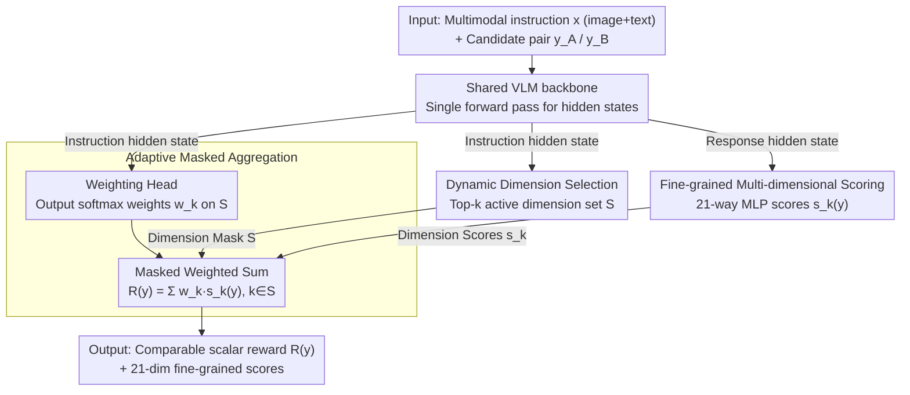

# Learning What Matters: Dynamic Dimension Selection and Aggregation for Interpretable Vision-Language Reward Modeling

**Conference**: ACL 2026  
**arXiv**: [2604.05445](https://arxiv.org/abs/2604.05445)  
**Code**: TBD  
**Area**: Interpretability / Multimodal Reward Models / RLHF  
**Keywords**: Vision-Language Reward Models, Multi-dimensional Evaluation, Dynamic Gating, DPO Alignment, Interpretability

## TL;DR
VL-MDR upgrades the "single-scalar black-box" discriminative vision-language reward model into a three-headed architecture featuring "dynamic dimension selection + per-dimension scoring + adaptive weighting." Supported by a 321k-sample dataset with 21-dimensional fine-grained preference annotations, it outperforms existing open-source RMs on VL-RewardBench and generates higher-quality DPO preference pairs to mitigate VLM hallucinations.

## Background & Motivation
**Background**: Multimodal Reward Models (RM) are critical infrastructure for LVLM alignment. Existing approaches generally fall into two categories: Generative RMs (e.g., LLaVA-Critic), which let models generate natural language critiques before scoring (interpretable but slow and prone to positional bias), and Discriminative RMs (e.g., Skywork-VL), which directly regress a scalar score (high throughput but entirely black-box).

**Limitations of Prior Work**: Discriminative RMs compress orthogonal dimensions such as "image fidelity, spatial reasoning, style, and safety" into a single scalar. This prevents distinguishing whether a response "misinterpreted the image (perception failure)" or "perceived it correctly but reasoned poorly (reasoning failure)." Such coarse-grained feedback leaves downstream RLHF/DPO unaware of which error types to prioritize for optimization.

**Key Challenge**: Interpretability requires multi-dimensional outputs, while efficiency demands single-forward passes without long-text generation—two goals that are irreconcilable along the traditional "scalar vs. text critique" axis. Furthermore, multi-modal tasks have query-dependent "dimension" requirements: geometric problems do not need "style quality," and artistic images do not require "code reasoning." Fixed weights cannot adapt to these nuances.

**Goal**: (1) Design a reward model that mimics human reviewers by "first identifying required dimensions, then scoring each, and finally aggregating them with weights"; (2) Ensure the entire process occurs in a **single forward pass** to maintain discriminative RM efficiency; (3) Provide large-scale preference data to support this fine-grained supervision.

**Key Insight**: The authors observe that multimodal evaluation is naturally "hierarchical and conditionally dependent"—evaluation criteria should be determined solely by the instruction (image + text), while scoring should be determined by the response. This Query-Response Decoupling serves as the theoretical foundation for the dynamic gating architecture.

**Core Idea**: Use the instruction side to predict "which dimensions are relevant and their respective weights," while the response side independently scores each dimension. These are then combined via masked weighted summation to obtain an interpretable scalar reward in a single forward pass.

## Method

### Overall Architecture
VL-MDR attaches three lightweight heads to a shared pre-trained VLM backbone, transforming the traditional discriminative RM's "single scalar regression" into an interpretable pipeline of "dimension identification, per-dimension scoring, and adaptive weighting." Given a multimodal instruction $x$ (image + text) and a pair of candidate responses $(y_A, y_B)$, the model follows two paths in a **single forward pass**: the instruction hidden state is fed into the Dimension Prediction Head and Dimension Weighting Head. The former selects a set of active dimensions $\mathcal{S}$ from a $K=21$ taxonomy via Top-$k$, and the latter outputs normalized weights for $\mathcal{S}$. Simultaneously, the response hidden state is fed into the Scoring Head, which independently calculates scores $s_k(y)$ for each dimension. Finally, the masked weighted sum $R(y) = \sum_{k \in \mathcal{S}} w_k \cdot s_k(y)$ provides a comparable scalar reward alongside a 21-dimensional fine-grained score vector. This design follows the **Query-Response Decoupling** principle: evaluation criteria depend only on the instruction, whereas evaluation results depend on the response.

### Key Designs

**1. Vision-Aware Dynamic Dimension Selection: Deciding "What to Evaluate"**

Evaluating every sample across all 21 dimensions introduces noise—calculating a "geometric reasoning" score for an art piece contaminates relevant gradients with irrelevant noise. This head predicts relevance probabilities $\hat{z}_k = \sigma(f_{\text{dim}}(h_x))_k$ based on instruction $x$, selecting the active set $\mathcal{S}$ via Top-$k$. This frames "what to evaluate" as a multi-label classification problem, supervised by gold labels $z_k$. While it resembles MoE routing, it routes "which scoring dimensions enter aggregation" rather than "which expert path to take." This internalizes interpretability into the structure, reducing redundancy while ensuring the reward decomposition aligns with human intuition.

**2. Fine-grained Multi-dimensional Scoring: Sparse Supervision for Specialization**

This head utilizes a 21-way parallel lightweight MLP to process response hidden states, outputting a preference score $s_k(y)$ for each dimension. However, only scores within $\mathcal{S}$ participate in the final aggregation. Crucially, training uses sparse supervision: based on labels $\mathbf{p} \in \{1,0,-1\}^K$, the Bradley-Terry preference loss $\mathcal{L}_{\text{pref}} = -\log \sigma\big(s_k(y_A) - s_k(y_B)\big) \cdot \mathbb{1}[p_k = 1]$ is applied only where $z_k=1$. This prevents meaningless signals (e.g., scoring geometry for art) and ensures each dimension head specializes only on relevant samples, bypassing the interference issues common in multi-task learning.

**3. Adaptive Masked Aggregation: Query-Dependent Weighting**

Dimension importance varies significantly by task—"numerical calculation" dominates math problems, while "harm detection" should have veto power in safety scenarios. This head outputs softmax weights $w_k = \mathrm{softmax}_{\mathcal{S}}(f_w(h_x))_k$ over the selected dimensions to fuse scores into the final scalar $R(y) = \sum_{k \in \mathcal{S}} w_k s_k(y)$. By making weights dependent strictly on the instruction and decoupled from the response, the model ensures $y_A$ and $y_B$ are compared using identical criteria for a given query, eliminating the possibility of "cheating" by adjusting weights to favor specific responses.

### Loss & Training
The total loss optimizes three components jointly:

- **Dimension Relevance Loss**: 21-dimensional BCE, $\mathcal{L}_{\text{dim}} = \mathrm{BCE}(\hat{\mathbf{z}}, \mathbf{z})$
- **Fine-grained Preference Loss**: Masked Bradley-Terry, $\mathcal{L}_{\text{fine}} = \sum_k \mathbb{1}[z_k=1] \cdot \mathrm{BT}(s_k(y_A), s_k(y_B), p_k)$
- **Overall Preference Loss**: Applied to the final aggregated scalar, $\mathcal{L}_{\text{overall}} = \mathrm{BT}(R(y_A), R(y_B), o)$

The data comprises 321k preference pairs derived from 7 public VLM datasets (VLFeedback, RLAIF-V, SPA-VL, VisionArena, WildVision, RLHF-V, MM-RLHF; total 414.2k). Three powerful VLM judges (Qwen3-VL-235B, GLM-4.5V, InternVL3-78B) were used for multi-model fine-grained overall-consistency filtering (retained 77.6%). Each sample is labeled with Top-3 relevant dimensions (collectively covering 7 core capabilities $\times$ 3 sub-dimensions = 21 dimensions).

## Key Experimental Results

### Main Results
Evaluation was conducted against open-source RMs on VL-RewardBench and two other multimodal RM benchmarks. Downstream LVLMs were also trained using VL-MDR generated preference pairs via DPO to assess hallucination mitigation.

| Setting | Benchmark | Key Metric | VL-MDR | Prev. SOTA | Trend |
|------|----------|----------|--------|---------------|------|
| Direct RM Eval | VL-RewardBench | Overall Accuracy | Significantly Leads | Skywork-VL / LLaVA-Critic | Outperforms both discr. & gen. |
| Direct RM Eval | Avg. Multimodal RM Bench | Category Avg | Consistently Leads | Balanced categories | No regression across 7 capabilities |
| DPO Alignment | Hallucination Suite | Hallucination Rate↓ / Reliability↑ | Superior with VL-MDR pairs | Original pairs | Validates value of fine-grained signals |
| Efficiency | Latency | Single Forward Pass | $\approx$ Disc. RM | Much faster than Gen. RM | Maintains discr. throughput |

### Ablation Study

| Configuration | Key Metric Trend | Description |
|------|--------------|------|
| Full VL-MDR | Best | Three heads + Top-$k$ selection + adaptive weights |
| w/o Dynamic Selection (use all 21) | Significant drop | Irrelevant dimensions introduce noise; proves vision-aware gating necessity |
| w/o Adaptive Weighting (uniform) | Significant drop | Verifies weights must vary dynamically with instruction |
| w/o Fine-grained Loss (overall only) | Drop | Degenerates to traditional disc. RM; loses fine-grained signal |
| w/o Multi-model Consistency Filter | Drop | Training data noise increases; quality is prerequisite for fine-grained supervision |

### Key Findings
- Among the three losses, the **fine-grained preference loss** provides the largest contribution. Removing it reverts the model to traditional discriminative RM levels, proving that "per-dimension supervision," rather than simple multi-head structure, is the root of interpretability gains.
- **Dynamic Top-$k$ selection** outperforms weighting all 21 dimensions. This suggests that forcing irrelevant weights to zero is more reliable than letting the model learn to suppress them, as it avoids noisy gradient contamination.
- **DPO** using VL-MDR preference pairs significantly reduces hallucination rates compared to original pairs. Fine-grained scores identify pairs that are "clearly inferior in the hallucination dimension," which is much less noisy than "overall preference."
- The dimension selection distribution aligns closely with human labeling, proving the dimension head learns meaningful "task type recognition" and can function independently as a multimodal task classifier.

## Highlights & Insights
- **Query-Response Decoupling is a structural innovation**: Explicitly encoding "criteria determined by instruction / results determined by response" into the architecture prevents weights and scores from gaming each other, making it more robust than simple multi-dimension RMs.
- **Sparse Masked Preference Loss $\mathbb{1}[z_k=1] \cdot \mathrm{BT}$ is a critical detail**: Avoiding supervision on irrelevant dimensions solves the common interference problem in multi-task learning. This approach is transferable to any multi-head RM.
- **Engineering value of the 21-dim hierarchical taxonomy (7 cores $\times$ 3 sub-dims)**: It is 7x more granular than basic "quality, fluency, relevance" classifications while remaining more controllable than open-label sets.
- **Multi-model consistency filtering is essential**: Fine-grained labels from a single LLM judge are extremely noisy. The triple filter (Top-3 consistency + overall preference consistency + ground truth consistency) reduced 414k to 321k samples but yielded a leap in quality.

## Limitations & Future Work
- **The 21-dim taxonomy is hand-crafted and vision-biased**: Adapting to code, audio, or video requires redesign; the paper does not propose an automated dimension expansion scheme.
- **Top-$k$'s $k$ is a hard hyperparameter**: Relevant dimensions should ideally be adaptive (e.g., $k=1$ for simple math, $k=5$ for complex reasoning). Fixed $k$ introduces bias.
- **Data filtering relies on three 70B+ judges**: The reproduction cost is extremely high, and the judges' biases (e.g., GPT-style sensitivity to "politeness") may propagate to VL-MDR.
- **Benchmark gap with closed-source SOTA**: Being lead among open-source RMs does not necessarily mean approaching the upper limit of human judgment (e.g., GPT-4V-as-judge).
- **Future Work**: Transforming the dimension head into learnable prototypes (MoE-like) for open dimension sets; using attention-based pooling for adaptive $k$; exploring VL-MDR for process rewards (step-wise scoring) in multimodal GRPO.

## Related Work & Insights
- **vs. LLaVA-Critic (Generative RM)**: While it provides interpretability via text critiques, it suffers from latency and bias. VL-MDR achieves "equivalent interpretability" via structured heads while maintaining discriminative throughput—proving interpretability can be architectural.
- **vs. Skywork-VL (Discriminative RM)**: Skywork is a black box. VL-MDR adds a "dimension decomposition" layer, allowing RLHF trainers to identify that "chosen is better than rejected because hallucinations decreased by 30%," rather than just being "better."
- **vs. MoE Router**: VL-MDR routes "scoring dimension subsets" for aggregation rather than routing different experts for forward passes. It serves as a lightweight "structurally interpretable MoE."
- **vs. RLAIF-V/MM-RLHF datasets**: These provide global preferences. VL-MDR builds upon them with 21-dimensional labels and consistency filtering, upgrading preference data from "chosen vs. rejected" to "chosen vs. rejected on specific dimensions."

## Rating
- Novelty: ⭐⭐⭐⭐ Query-Response Decoupling + Dynamic Dimension Selection are elegant structural innovations.
- Experimental Thoroughness: ⭐⭐⭐⭐ 3 RM benchmarks + DPO downstream + full ablation, though lacks closed-source GPT-4V judge comparison.
- Writing Quality: ⭐⭐⭐⭐ Clear problem definition and intuitive diagrams; notation is precise.
- Value: ⭐⭐⭐⭐ Interpretable RMs are essential for VLM alignment; the 321k dataset and 21-dim taxonomy have high reuse value.

<!-- RELATED:START -->

## Related Papers

- [\[ICML 2026\] IdEst: Assessing Self-Supervised Learning Representations via Intrinsic Dimension](../../ICML2026/interpretability/idest_assessing_self-supervised_learning_representations_via_intrinsic_dimension.md)
- [\[ICML 2025\] What Makes an Ensemble (Un)interpretable?](../../ICML2025/interpretability/what_makes_an_ensemble_un_interpretable.md)
- [\[ACL 2026\] Retrieval Heads are Dynamic](retrieval_heads_are_dynamic.md)
- [\[ACL 2026\] AdaptiveK: Complexity-Driven Sparse Autoencoders for Interpretable Language Model Representations](adaptivek_complexity-driven_sparse_autoencoders_for_interpretable_language_model.md)
- [\[NeurIPS 2025\] Rectifying Shortcut Behaviors in Preference-based Reward Learning](../../NeurIPS2025/interpretability/rectifying_shortcut_behaviors_in_preference-based_reward_learning.md)

<!-- RELATED:END -->
