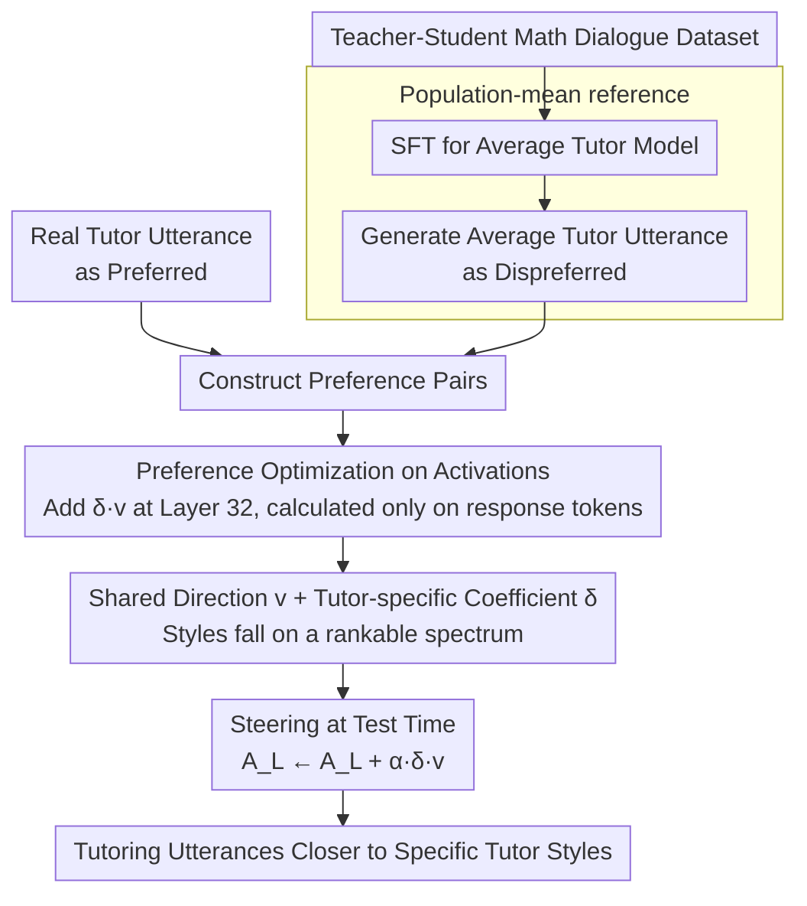

# Letting Tutor Personas Speak Up for LLMs: Learning Steering Vectors from Dialogue via Preference Optimization

**Conference**: ACL2026  
**arXiv**: [2602.07639](https://arxiv.org/abs/2602.07639)  
**Code**: No dedicated public code link found in cache  
**Area**: Interpretable Control / Educational Intelligence  
**Keywords**: steering vector, tutor persona, preference optimization, activation steering, LLM tutoring  

## TL;DR
This paper learns a shared steering direction and tutor-specific scaling factors from real teacher-student dialogues, enabling LLMs to generate tutoring utterances closer to specific human tutor styles without explicit persona prompts.

## Background & Motivation
**Background**: LLMs are widely used in educational tutoring systems. Common practices involve using prompts to define pedagogical rules or employing SFT/RL to learn an "average expert tutor" strategy that prioritizes scaffolding and Socratic questioning while avoiding direct answers.

**Limitations of Prior Work**: Real tutors do not follow a monolith strategy. Different tutors make different trade-offs between scaffolding, direct instruction, feedback intensity, emotional support, and student autonomy. Learning only an average strategy erases these stylistic differences and makes it difficult to study how different tutor styles affect student engagement.

**Key Challenge**: If a persona is explicitly described using text prompts, the control signal relies on manual labels and descriptive words. If only SFT is used, the model can only approximate the aggregate average behavior. The paper aims to extract implicit personas directly from real dialogues and apply them controllably in the activation space.

**Goal**: To learn an activation-space direction capable of shifting model output from a population-mean tutor utterance toward a specific tutor's utterance, allowing different tutors to express stylistic intensity via different scaling factors.

**Key Insight**: The authors first SFT an LLM to generate average tutor utterances. These SFT-generated utterances are treated as dispreferred responses, while real tutor utterances are treated as preferred responses to learn steering vectors via preference optimization.

**Core Idea**: Instead of explicit persona descriptions, preference pairs (real tutor utterance > average tutor utterance) are used to learn a shared direction $v$ and tutor-specific $\delta_i$ on the last-layer activations.

## Method
The method in this paper treats preference learning, similar to DPO/BiPO, and applies it to activation steering. However, the control target is the pedagogical style variance between real tutors rather than political stance or safety attributes. It represents Arctic persona as different intensities along the same shared direction.

### Overall Architecture
Given a tutor-student dialogue dataset $\mathcal{D}$, each dialogue consists of a math problem, student turns, and tutor turns. The system first trains an LLM via SFT to generate reasonable tutor responses based on the problem and history. This SFT model is regarded as the population-mean tutor and is used to generate an average tutor utterance $\bar{t}_{j,k}$ for each context.

Next, for the same context, the real tutor utterance $t^i_{j,k}$ serves as the preferred response, and the SFT-generated $\bar{t}_{j,k}$ serves as the dispreferred response. The model adds $\delta_i v$ to the activations $A_L(\cdot)$ at a specific layer and optimizes a preference loss to make the steered model more likely to generate real tutor utterances and less likely to generate average ones. During testing, a global strength $\alpha$ is applied via $A_L(\cdot)\leftarrow A_L(\cdot)+\alpha\delta_i v$ to control the steering intensity.

### Key Designs

**1. Population-mean reference: Defining the departure and target points**

Without a reference point, preference learning might fail to distinguish between learning "how to tutor" and "how this tutor differs from others," causing individual styles to be submerged by general tutoring ability. The authors first SFT Llama-3.1-8B-Instruct to generate general tutor responses, treating it as a population-mean tutor. This model generates an average utterance $\bar{t}_{j,k}$ for every context, which is fixed as the dispreferred sample in preference pairs. With this "average behavior" anchor, the learned direction is strictly constrained to the "real tutor's offset relative to the average" rather than general tutoring capability.

**2. Preference optimization applied directly to activations**

A real tutor's persona is reflected in tone, dialogue acts, and scaffolding intensity. Token-wise SFT only approximates surface text and fails to capture the direction of "being more like a specific tutor." The authors adapt DPO/BiPO-style preference learning to activation steering: by adding $\delta_i v$ to a specific layer's activation and optimizing the preference loss, they increase the log-likelihood ratio of real tutor utterances relative to the unsteered model while decreasing it for average utterances. Likelihoods are calculated only on response tokens. During testing, steering strength is adjusted via:

$$A_L(\cdot)\leftarrow A_L(\cdot)+\alpha\delta_i v$$

This target directly optimizes the steered activations to favor the real tutor, which is closer to the essence of persona control than surface string matching.

**3. Shared direction with tutor-specific coefficients: Turning style into a rankable spectrum**

Learning independent steering vectors for every tutor would explode sample requirements and interpretability costs, resulting in a set of unrelated vectors. Instead, the authors learn a single shared steering vector $v$, where each tutor $i$ holds only a positive scaling coefficient $\delta_i$. To eliminate scale uncertainty, $\delta_i$ is parameterized through $u_i$ and normalized:

$$\delta_i=\frac{\exp(u_i)}{\frac{1}{I}\sum_m\exp(u_m)}$$

This constrains all tutor coefficients to a common scale. Style differences naturally emerge as a rankable continuous spectrum—tutors with low $\delta_i$ emphasize rapport and scaffolding, while those with high $\delta_i$ focus more on task-oriented guidance. This representation is both low-dimensional and interpretable.

### Loss & Training
Experiments use the Question-Anchored-Tutoring-Dialogues-2k dataset, containing 21 unique tutors, split 80/10/10 at the dialogue level. Tutors average 74.19 dialogues in training, 8.90 in validation, and 10.10 in testing; average turns are approximately 12.

The base model is Llama-3.1-8B-Instruct. SFT uses LoRA with a learning rate of $5\times10^{-5}$, 33 epochs, $r=32$, and $\alpha=64$. The steering vector $v$ and $u_i$ are optimized on the validation set with $\beta=1.0$ and a learning rate of 0.01, applied at transformer layer 32. Generation uses temperature 1.0 and top-p 0.95. Final validation loss is 0.543 with $T=17$. Learned $u_i$ have a mean of 0.053 and a standard deviation of 0.106. Training utilized a single NVIDIA A40 48GB.

## Key Experimental Results

### Main Results
The main table compares unsteered population-mean utterances $\bar{t}_j$ and steered utterances $\hat{t}_j$ against real tutor utterances across dialogue stages. R is ROUGE-L, B is BLEU, C is SentenceBERT cosine similarity, and W is the LLM judge win rate.

| Stage | Count | Method | R | B | C | W |
|-------|-------|--------|---|---|---|---|
| early | 326 | $\bar{t}_j$ | 0.285 | 0.070 | 0.392 | - |
| early | 326 | $\hat{t}_j$ | 0.206 | 0.041 | 0.321 | 0.571 |
| mid | 1971 | $\bar{t}_j$ | 0.165 | 0.019 | 0.385 | - |
| mid | 1971 | $\hat{t}_j$ | 0.157 | 0.018 | 0.426 | 0.587 |
| late | 326 | $\bar{t}_j$ | 0.157 | 0.025 | 0.330 | - |
| late | 326 | $\hat{t}_j$ | 0.121 | 0.017 | 0.349 | 0.564 |

The mid stage is most critical: this is the core of math problem-solving. Steering improves cosine similarity from 0.385 to 0.426, with the LLM judge preferring steered output 58.7% of the time. ROUGE-L and BLEU see slight decreases or remain stable, suggesting changes occur in semantic/discourse strategy rather than verbatim overlap.

### Ablation Study

| Global Strength α | R | B | C | W | Description |
|------------|---|---|---|---|------|
| 0.0, unsteered | 0.179 | 0.026 | 0.379 | - | Population-mean baseline |
| 0.3 | 0.181 | 0.027 | 0.400 | 0.536 | Mild steering |
| 0.5 | 0.187 | 0.028 | 0.407 | 0.539 | Balance point used for qualitative analysis |
| 0.7 | 0.176 | 0.026 | 0.404 | 0.562 | Stronger style, lexical scores start dropping |
| 1.0 | 0.159 | 0.021 | 0.403 | 0.582 | Preferred by judge, but lexical similarity drops significantly |

### Key Findings
- Steering improves semantic similarity in mid/late stages but shows a decline in the early stage. The authors suggest that early greetings/encouragement are naturally more generic, and forcing persona there leads to over-stylization.
- $\alpha=0.5$ provides the best balance between semantic alignment and lexical similarity.
- Learned $\delta_i$ exhibit an interpretable spectrum: low $\delta_i$ tutors value rapport and scaffolding; middle values prioritize brief diagnosis and correction; high values lean toward low-engagement, task-completion guidance.
- Case studies show that steered outputs better replicate tutor dialogue acts, such as affirming before explaining, providing brief corrections, or directly pushing to the next step.

## Highlights & Insights
- The biggest highlight is that the persona is not derived from manual labels but learned from real dialogue preference pairs. This transforms "tutor style" into a learnable latent control signal.
- The population-mean reference is crucial. It reframes the task from "generating good tutoring" to "deviating from average tutoring toward a specific tutor," capturing individual differences more accurately.
- The shared direction plus tutor coefficient design is highly interpretable, allowing multiple tutors to be ordered along a stylistic continuum rather than resulting in a set of incomparable vectors.
- Results suggest that lexical metrics may underestimate persona control. Decreases in ROUGE/BLEU alongside increases in semantic similarity and judge preference indicate that style alignment does not equal literal copying.

## Limitations & Future Work
- Evaluation was limited to a single math dialogue dataset; generalizability to other subjects, age groups, platforms, or open tutoring scenarios remains unclear.
- The baseline primarily consists of SFT-like methods, lacking comparison against explicit persona prompting, persona adapters, or more advanced RL tutoring methods.
- No human evaluation was conducted; results rely on automated metrics and LLM judges. Educational outcomes like student learning gains or engagement were not directly measured.
- The current work learns only one shared direction. Future work could use low-rank subspaces or multiple directions to disentangle attributes like emotional support, correction style, and scaffolding intensity.

## Related Work & Insights
- **vs prompt-based persona control**: Prompts require manual descriptions and have limited granularity; this work learns implicit personas directly.
- **vs SFT tutoring policy**: SFT learns average behaviors and erases individuality; steering vectors provide controllable offsets from that average.
- **vs BiPO / DPO steering**: While BiPO learns controllable directions via preference optimization, this work adapts it for tutor-specific coefficients and shared directions.
- **Inspiration**: Similar methods could be applied to medical consultations, customer service, or psychological support—fields requiring consistent individual communication styles without sacrificing task accuracy.

## Rating
- Novelty: ⭐⭐⭐⭐☆ Combines activation steering and tutor personas naturally, especially the learning of implicit styles from real dialogue.
- Experimental Thoroughness: ⭐⭐⭐☆☆ Includes quantitative, intensity, and case studies, but the dataset and baseline range are narrow, and human evaluation is missing.
- Writing Quality: ⭐⭐⭐⭐☆ Clear methodology; examples help clarify the semantics of $\delta_i$.
- Value: ⭐⭐⭐⭐☆ Highly insightful for controllable educational LLMs and persona steering, needing only validation of real-world educational impact.

<!-- RELATED:START -->

- **BiPO (2024)**: Binary Preference Optimization for controllable LLM generation.
- **Activation Steering (2023)**: Controlling LLMs by adding vectors to internal representations.

<!-- RELATED:END -->

## Related Papers

- [\[ICML 2026\] How Few-Shot Examples Add Up: A Causal Decomposition of Function Vectors in In-Context Learning](../../ICML2026/interpretability/how_few-shot_examples_add_up_a_causal_decomposition_of_function_vectors_in_in-co.md)
- [\[ACL 2026\] Interpretability from the Ground Up](interpretability_from_the_ground_up_stakeholder-centric_design_of_automated_scor.md)
- [\[ICLR 2026\] Behavior Learning (BL): Learning Hierarchical Optimization Structures from Data](../../ICLR2026/interpretability/behavior_learning_bl_learning_hierarchical_optimization_structures_from_data.md)
- [\[ACL 2026\] Preference Heads in Large Language Models: A Mechanistic Framework for Interpretable Personalization](preference_heads_in_large_language_models_a_mechanistic_framework_for_interpreta.md)
- [\[ACL 2026\] Compositional Steering of Large Language Models with Steering Tokens](compositional_steering_of_large_language_models_with_steering_tokens.md)

<!-- RELATED:END -->
