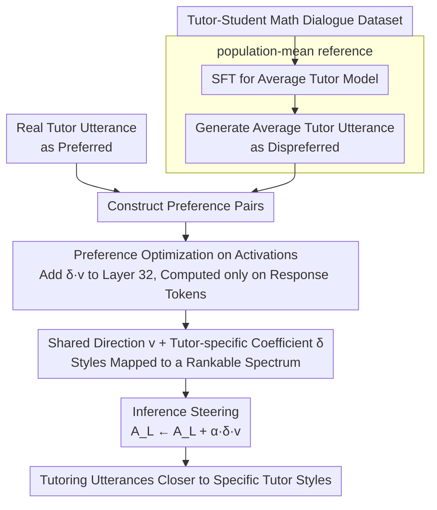

# Letting Tutor Personas Speak Up for LLMs: Learning Steering Vectors from Dialogue via Preference Optimization

**Conference**: ACL2026  
**arXiv**: [2602.07639](https://arxiv.org/abs/2602.07639)  
**Code**: No dedicated public code link found in the current cache  
**Area**: Explainable Control / AI in Education  
**Keywords**: steering vector, tutor persona, preference optimization, activation steering, LLM tutoring  

## TL;DR
This paper learns a shared steering direction and tutor-specific scaling coefficients from real tutor-student dialogues, enabling LLMs to generate tutoring utterances that closely align with specific human tutor styles without the need for explicit persona prompts.

## Background & Motivation
**Background**: LLMs have been widely deployed in educational tutoring systems. Common practices involve using prompts to define pedagogical guidelines or employing SFT/RL to learn an "average expert tutor" strategy, which encourages the model to avoid giving answers directly, use Socratic questioning, and provide guidance.

**Limitations of Prior Work**: Real-world tutors do not follow a single monolith strategy. Different tutors make various trade-offs between scaffolding, direct explanation, feedback intensity, emotional support, and student autonomy. Learning only an average strategy flattens these stylistic differences and makes it difficult to study how different tutoring styles affect student engagement.

**Key Challenge**: If a persona is explicitly described using text prompts, the control signal relies on manual labels and descriptive terms. If only SFT is utilized, the model can only approximate the collective average behavior. The paper aims to extract latent personas from real dialogues and apply them controllably in the activation space.

**Goal**: To learn an activation-space direction that can steer the model output from a population-mean tutor utterance toward a specific tutor's utterance, while allowing different tutors to express their stylistic intensity through varying scaling coefficients.

**Key Insight**: The authors first SFT the LLM to generate average tutoring utterances. These SFT-generated utterances are then treated as dispreferred responses, while the real tutor utterances serve as preferred responses, allowing the learning of steering vectors via preference optimization.

**Core Idea**: Instead of explicit persona descriptions, the model uses preference pairs where "real tutor utterance is better than the average tutor utterance" to learn a shared direction $v$ and tutor-specific $\delta_i$ on the final layer activations.

## Method
The method in this paper resembles applying preference learning from DPO/BiPO to activation steering, but the control objective is the pedagogical style difference between real tutors rather than political stance or safety attributes. It represents each tutor's persona as varying intensities along the same shared direction.

### Overall Architecture
Given a tutor-student dialogue dataset $\mathcal{D}$, each dialogue consists of a math problem, student turns, and tutor turns. The system first trains an LLM using SFT to generate reasonable tutor responses based on the problem and dialogue history. This SFT model is considered the population-mean tutor and is used to generate an average tutor utterance $\bar{t}_{j,k}$ for each dialogue context.

Subsequently, for the same context, the real tutor utterance $t^i_{j,k}$ is the preferred response, and the SFT-generated $\bar{t}_{j,k}$ is the dispreferred response. The model adds $\delta_i v$ to the activation $A_L(\cdot)$ at a specific layer and optimizes a preference loss so that the steered model is more likely to generate the real tutor utterance and less likely to generate the average one. During inference, a global intensity $\alpha$ is applied via $A_L(\cdot)\leftarrow A_L(\cdot)+\alpha\delta_i v$ to control the steering strength.

### Key Designs

**1. Population-mean reference: Defining the starting point and steering target**

Without a reference point, the model in preference learning cannot distinguish whether it is learning "how to tutor" or "how this tutor differs from others," causing individual styles to be buried under general tutoring capabilities. The authors first SFT Llama-3.1-8B-Instruct to generate general tutor responses based on context, treating it as a population-mean tutor. This model generates an average tutor utterance $\bar{t}_{j,k}$ for every context, which is fixed as the dispreferred sample in the preference pair. With this "average behavior" anchor, the learned direction is strictly constrained to the "offset of the real tutor relative to the average tutor" rather than general tutoring competence.

**2. Preference optimization applied directly to activations**

A real tutor's persona is reflected across multiple levels: tone, dialogue acts, and scaffolding intensity. Token-by-token SFT can only approximate surface text and fails to capture the direction of "looking more like a specific tutor." The authors adapt DPO/BiPO-style preference learning to activation steering: by adding $\delta_i v$ to a specific activation layer and optimizing preference loss, the log-likelihood ratio of the real tutor utterance increases relative to the unsteered model, while the ratio for the average tutor utterance decreases (calculating likelihood only on response tokens). During testing, a global intensity $\alpha$ is used to adjust the steering strength via:

$$A_L(\cdot)\leftarrow A_L(\cdot)+\alpha\delta_i v$$

This preference objective directly optimizes "steered activations to bias towards the real tutor," which is closer to the essence of persona control than surface string matching.

**3. Shared direction with tutor-specific coefficients: Turning style into a rankable spectrum**

Learning an independent steering vector for every tutor would lead to explosive data requirements and high interpretation costs, making it impossible to compare unrelated vectors. Instead, the authors learn a single shared steering vector $v$, where each tutor $i$ holds only a positive scaling coefficient $\delta_i$. To eliminate scale uncertainty, $\delta_i$ is not learned directly but parameterized via $u_i$ and normalized:

$$\delta_i=\frac{\exp(u_i)}{\frac{1}{I}\sum_m\exp(u_m)}$$

This ensures all tutor coefficients are constrained to a common scale. Style differences naturally emerge as a rankable continuous spectrum—tutors with low $\delta_i$ focus more on rapport and scaffolding, while those with high $\delta_i$ lean toward task-oriented guidance. This representation is both low-dimensional and interpretable.

### Loss & Training
Experiments use the Question-Anchored-Tutoring-Dialogues-2k dataset, containing 21 unique tutors, with an 80/10/10 split at the dialogue level for each tutor. On average, each tutor has 74.19 dialogues in the training set, 8.90 in the validation set, and 10.10 in the test set; mean turns are 11.75, 12.06, and 12.25 respectively.

The base model is Llama-3.1-8B-Instruct. SFT uses LoRA with a learning rate of $5\times10^{-5}$, 33 epochs, rank $r=32$, and LoRA scaling $\alpha=64$. When learning the steering vector, $v$ and $u_i$ are optimized on the validation set with $\beta=1.0$, learning rate 0.01, and steering applied at transformer layer 32. Generation uses temperature 1.0 and top-p 0.95. The final validation loss is 0.543 at $T=17$, with learned $u_i$ mean of 0.053 and standard deviation of 0.106. All training and evaluation were performed on a single NVIDIA A40 48GB.

## Key Experimental Results

### Main Results
The main table compares unsteered population-mean utterances $\bar{t}_j$ and steered utterances $\hat{t}_j$ against real tutor utterances by dialogue stage. R is ROUGE-L, B is BLEU, C is SentenceBERT cosine similarity, and W is the LLM judge win rate.

| Stage | Count | Method | R | B | C | W |
|-------|-------|--------|---|---|---|---|
| early | 326   | $\bar{t}_j$ | 0.285 | 0.070 | 0.392 | - |
| early | 326   | $\hat{t}_j$ | 0.206 | 0.041 | 0.321 | 0.571 |
| mid   | 1971  | $\bar{t}_j$ | 0.165 | 0.019 | 0.385 | - |
| mid   | 1971  | $\hat{t}_j$ | 0.157 | 0.018 | 0.426 | 0.587 |
| late  | 326   | $\bar{t}_j$ | 0.157 | 0.025 | 0.330 | - |
| late  | 326   | $\hat{t}_j$ | 0.121 | 0.017 | 0.349 | 0.564 |

The mid stage is the most critical as it represents the core problem-solving process. Steering increases cosine similarity from 0.385 to 0.426, with the LLM judge preferring the steered output in 58.7% of cases. ROUGE-L drops slightly (0.165 to 0.157) and BLEU remains stable (0.019 to 0.018), suggesting changes are primarily in semantic strategy rather than verbatim overlap.

### Ablation Study
| Global Intensity α | R | B | C | W | Note |
|-------------------|---|---|---|---|------|
| 0.0, unsteered | 0.179 | 0.026 | 0.379 | - | population-mean baseline |
| 0.3 | 0.181 | 0.027 | 0.400 | 0.536 | Mild steering |
| 0.5 | 0.187 | 0.028 | 0.407 | 0.539 | Balance point used for qualitative analysis |
| 0.7 | 0.176 | 0.026 | 0.404 | 0.562 | Stronger style, lexical similarity starts to drop |
| 1.0 | 0.159 | 0.021 | 0.403 | 0.582 | Judge prefers it more, but high lexical drop |

### Key Findings
- Steering improves semantic similarity in the mid/late stages but decreases it in the early stage. The authors explain that opening greetings and encouragement are inherently more generic, and forcing a persona can lead to over-stylization.
- $\alpha=0.5$ provides the best balance between semantic alignment and lexical similarity, and is thus used for case studies.
- Learned $\delta_i$ reveals an interpretable spectrum: low $\delta_i$ tutors emphasize rapport and scaffolding, middle values focus on brief diagnosis and correction, and high values represent low-investment, task-completion guidance.
- Case studies show steered outputs better replicate tutor dialogue acts, such as affirming before explaining, brief corrections, or directly moving to the next step.

## Highlights & Insights
- The biggest highlight is that personas are learned from real dialogue preference pairs rather than manual labels. This turns "tutoring style" into a learnable latent control signal.
- The population-mean reference is crucial. It changes the task from "generating good tutoring" to "deviating from average tutoring towards a specific tutor," capturing individual differences more accurately.
- The design of a shared direction with tutor coefficients is highly interpretable, allowing multiple tutors to be ordered on a stylistic continuum rather than resulting in a set of incomparable independent vectors.
- Results suggest that lexical metrics may underestimate persona control. After steering, ROUGE/BLEU sometimes decrease while semantic similarity and judicial preference increase, indicating that style alignment is not equivalent to literal copying.

## Limitations & Future Work
- The authors acknowledge evaluating on only one math dialogue dataset; it remains unclear if it generalizes to other subjects, age groups, platforms, or more open-ended tutoring scenarios.
- Baselines are primarily SFT-based, lacking systematic comparisons with explicit persona prompting, persona adapters, or stronger RL tutoring methods.
- There is no human evaluation; results rely on automated metrics and LLM judges. Critical educational outcomes like student learning gains, engagement, and long-term effects were not directly measured.
- Currently, only a single shared direction is learned. Future work could use low-rank subspaces or multiple steering directions to decouple different pedagogical attributes like emotional support, correction style, and scaffolding intensity.

## Related Work & Insights
- **vs prompt-based persona control**: Prompts require manual descriptions and have limited granularity; this work learns implicit personas directly from real dialogues.
- **vs SFT tutoring policy**: SFT learns average behavior, flattening individual differences; steering vectors provide controllable offsets from that average.
- **vs BiPO / DPO steering**: BiPO uses preference optimization for controllable directions; this work adapts it for tutor-specific coefficients and shared directions for educational dialogue styles.
- **Insights for future work**: Similar methods could be applied to medical consultations, customer service, or psychological support—scenarios requiring consistent individual communication styles without compromising task accuracy.

## Rating
- Novelty: ⭐⭐⭐⭐☆ Combines activation steering and tutor personas naturally, especially the learning of implicit styles from real dialogues.
- Experimental Thoroughness: ⭐⭐⭐☆☆ Includes quantitative, intensity analysis, and case studies, but dataset and baseline range are narrow, and human evaluation is missing.
- Writing Quality: ⭐⭐⭐⭐☆ Method is clearly explained; examples help in understanding the semantics of $\delta_i$.
- Value: ⭐⭐⭐⭐☆ Inspiring for controllable educational LLMs and persona steering; one step away from verifying real-world pedagogical effectiveness.

<!-- RELATED:START -->

## Related Papers

- [\[ICML 2026\] How Few-Shot Examples Add Up: A Causal Decomposition of Function Vectors in In-Context Learning](../../ICML2026/interpretability/how_few-shot_examples_add_up_a_causal_decomposition_of_function_vectors_in_in-co.md)
- [\[ACL 2026\] Interpretability from the Ground Up](interpretability_from_the_ground_up_stakeholder-centric_design_of_automated_scor.md)
- [\[ICLR 2026\] Behavior Learning (BL): Learning Hierarchical Optimization Structures from Data](../../ICLR2026/interpretability/behavior_learning_bl_learning_hierarchical_optimization_structures_from_data.md)
- [\[ACL 2026\] Compositional Steering of Large Language Models with Steering Tokens](compositional_steering_of_large_language_models_with_steering_tokens.md)
- [\[ACL 2026\] Preference Heads in Large Language Models: A Mechanistic Framework for Interpretable Personalization](preference_heads_in_large_language_models_a_mechanistic_framework_for_interpreta.md)

<!-- RELATED:END -->
