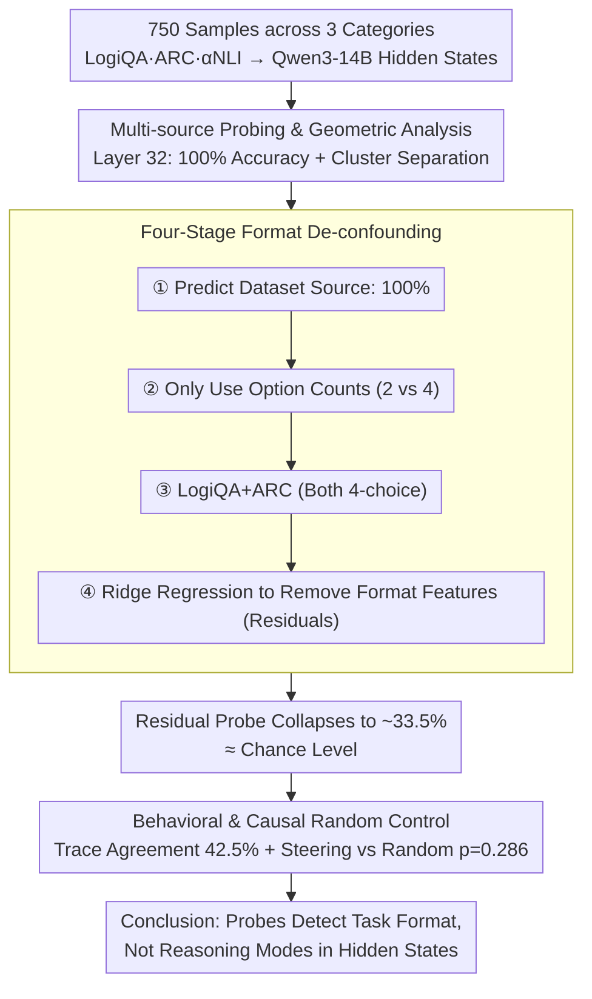

# Linear Probes Detect Task Format, Not Reasoning Mode in Language Model Hidden States

**Conference**: ACL 2026  
**arXiv**: [2606.02907](https://arxiv.org/abs/2606.02907)  
**Code**: https://github.com/SubramanyamSahoo/Linear-Probes-Detect-Task-Format-Not-Reasoning-Mode  
**Area**: Interpretability / Linear Probing / LLM Reasoning Analysis  
**Keywords**: Linear Probes, Format Confounding, Representational Geometry, Causal Steering, Reasoning Modes

## TL;DR
This paper uses probes, residual de-confounding, trace-anchor, and causal steering experiments on Qwen3-14B to demonstrate that while linear probes appear to distinguish deductive, inductive, and abductive reasoning with 100% accuracy, they actually detect data source and task format rather than reasoning modes within hidden states.

## Background & Motivation
**Background**: Linear probes are commonly used in mechanistic interpretability to determine whether model hidden states encode specific attributes. If a probe predicts "reasoning type" with high accuracy, many works further interpret this as the formation of distinct reasoning circuits or mode-specific representations within the model.

**Limitations of Prior Work**: Reasoning type evaluations often map different benchmarks directly to reasoning modes—for example, LogiQA representing deductive, ARC-Challenge representing inductive, and $\alpha$NLI representing abductive. This approach strictly binds reasoning labels to surface formats such as dataset source, number of options, prompt style, and output length. High probe accuracy may simply reflect identifying "which dataset this question comes from."

**Key Challenge**: Hidden states do contain a large amount of linearly separable information, but "predictability" does not equate to "causal participation in reasoning." If probes do not control for format confounding, it is impossible to distinguish whether the model truly possesses three reasoning mechanisms or has merely learned differences in the source of input distributions.

**Goal**: The authors aim to perform a systematic stress test on reasoning-mode probing: first replicating high probe accuracy and clean geometric separation, then progressively removing format information, and finally validating whether such geometry corresponds to actual reasoning modes through behavioral and causal experiments.

**Key Insight**: The paper intentionally adopts a standard multi-source reasoning setup to construct a balanced three-class dataset, then asks a direct question: how much of the original 100% probe signal remains after controlling for source identity, answer option count, and response length?

**Core Idea**: To pull linear probe conclusions back from "high accuracy implies internal structure" to an evidentiary standard where "high accuracy must first pass format de-confounding and random-direction causal control."

## Method
The methodology of the paper does not propose a new model, but rather an experimental pipeline for disproving probing conclusions. It first allows traditional probes to achieve the strongest surface results, then uses residual analysis, trace agreement, and causal steering to examine whether these results hold up from the perspectives of representation, behavior, and causality, respectively.

### Overall Architecture
The dataset contains 750 samples, with 250 in each of the three categories: LogiQA 2.0 (deductive), ARC-Challenge (inductive), and $\alpha$NLI (abductive). The model is Qwen3-14B (40 layers, 5120 hidden dimensions, bfloat16). The authors unify the prompts and set `DISABLE_THINKING=True` during inference to remove thinking blocks, preventing the thinking mode's linguistic style from becoming an additional confounder.

For each sample, hidden states of the last input token at all layers, generated text, and output confidence are extracted; geometric analysis uses only correctly answered samples. Subsequently, L2-regularized logistic regression linear probes are trained at each layer using 5-fold stratified cross-validation to predict reasoning-mode labels, with manifold geometry performed at the optimal layer. Finally, the functional relevance of the geometry is tested using format residuals, trace-anchor similarity, and activation steering.

### Key Designs

**1. Multi-source Probing & Geometric Analysis: Maximizing surface results before refutation**

The premise of the validation is that if the probe itself performs poorly, refuting it is meaningless; the "this result is a confounder" argument only carries impact when the probe yields near-perfect results. Thus, the authors train L2-regularized linear probes at every layer of Qwen3-14B to predict deductive/inductive/abductive labels, achieving 100% balanced accuracy at Layer 32. To be more convincing, they perform geometric analysis at the optimal layer, calculating intrinsic dimensionality, local curvature, inter-mode separation, and convex hull contamination, showing clean cluster separation for the three categories. This step deliberately maximizes the intuitive evidence that "hidden states encode reasoning modes" to set up the contrast for the subsequent disassembly.

**2. Four-Stage Format De-confounding: Gradually replacing "Reasoning Mode" signals with "Task Format" signals**

The core problem is whether the probe's high accuracy stems from reasoning mode or task format—since the three labels are mapped one-to-one to three datasets, surface features like source, option count, and response length could masquerade as reasoning signals. The authors clarify this through four progressive counterfactuals: Phase 1 uses the same probe to predict dataset source; 100% accuracy here shows the mode and source labels are informationally equivalent. Phase 2 uses only the number of options (2 vs 4). Phase 3 restricts data to 4-choice LogiQA + ARC to see if vocabulary and task style can still be separated. Phase 4 is most critical: representing format features as 

$$f_i=[\text{source one-hot},\ n_{\text{options}},\ |y_i|]$$

and using Ridge regression to remove format information from hidden states, yielding residuals $r_i=h_i-\hat{h}_i$. Probing these residuals for mode and source results in a collapse to approximately 33.5% (chance). This is the strongest evidence because it directly removes confounding variables to see if any true signal remains.

**3. Behavioral & Causal Random Control: Proving geometric directions are functional, not just correlated**

Even if geometric separation exists, a final step is needed: proving this direction truly changes reasoning behavior rather than any perturbation causing similar changes. The authors address this from two angles. Behaviorally, trace-anchor analysis compares the cosine similarity between model-generated traces and three anchor descriptions; trace-mode agreement was only 42.5%, barely above the 33.3% chance. Causally, steering experiments use mode centroid differences to construct steering directions, but critically, these are compared against $N_{rand}=20$ random directions, with empirical $p$-values calculated using Laplace correction. Random direction control is the "soul" of this section—many steering works report that a target direction is effective without proving it is more special than random noise. With this control, the authors found no credible difference in accuracy recovery between targeted steering and random directions ($p=0.286$, Cohen's $d<0.5$).

### Loss & Training
The paper does not train the language model itself but trains the linear probes for analysis. Probes are logistic regression with L2 regularization ($C=1.0$) and 5-fold cross-validation. Steering strength $\alpha^*$ is determined through coherence sweep and Otsu thresholding; the number of random directions is up to 20.

## Key Experimental Results

### Main Results
The original probe results are extremely strong, but after removing format via residuals, they collapse to chance level.

| Object of Analysis | Original Hidden States | De-formatted Residual States | Chance Level |
|----------|-------------------|------------------|----------|
| Reasoning Mode (D/I/A) Probe | 100.0% | ~33.5% | 33.3% |
| Dataset Source Probe | 100.0% | ~33.5% | 33.3% |
| Optimal Layer | Layer 32 | Layer 32 (Residual) | N/A |
| Original Geometry | 3 Clean Clusters | No Mode/Source Separability | N/A |

### Ablation Study
The four-stage confounding analysis shows the original "reasoning mode" separation is gradually explained away by format.

| Validation Stage | Setup | Results | Interpretation |
|----------|------|------|------|
| Stage 1 | Predict source using the same probe | 100% accuracy | Mode and source labels are equivalent |
| Stage 2 | Only use option counts (2 vs 4) | 33.3% mode accuracy | Option count identifies the $\alpha$NLI prior |
| Stage 3 | Only 4-choice LogiQA + ARC | Near perfect | Style/Vocab still allow separation |
| Stage 4 | Regress out source, option count, length | ~33.5% | Original separation driven by format |

### Key Findings
- Layer 32 probe reaches 100% balanced accuracy with perfect precision, recall, and F1; permutation tests show $p<0.0002$.
- Layer 32 geometry appears convincing: intrinsic dimensionality for deductive, inductive, and abductive is 20.6, 28.5, and 33.6 respectively, with convex hull contamination $<1.5\%$.
- Behaviorally, while Qwen3-14B has an 86.0% accuracy across tasks, trace-mode agreement is only 42.5% (slightly above 33.3% chance).
- Large variance in accuracy by source (LogiQA 73.2%, ARC 93.6%, $\alpha$NLI 91.2%) indicates significant differences in task difficulty and distribution.
- In steering, targeted accuracy recovery is 40.0% vs. a random mean of 31.7% with wide intervals ($p=0.286$, Cohen's $d<0.5$), failing to establish mode-specific causal effects for the centroid direction.

## Highlights & Insights
- The greatest strength of the paper is moving beyond a vague warning about confounding to constructing a complete chain of refutation: original probe, source probe, residual probe, trace behavior, and causal steering.
- Setting `DISABLE_THINKING=True` is a small but vital detail. It prevents the linguistic style of thinking blocks from externalizing the "reasoning mode," focusing the experiment on whether the input format alone causes separation.
- The paper provides a practical warning for interpretability: if labels map one-to-one to data sources, high probe accuracy only means the hidden state retains source information, not necessarily the target concept.
- Random direction control in steering is a practice worth adopting. Many steering studies only report that a target direction "works" without proving it is more special than random perturbation.

## Limitations & Future Work
- Experiments cover only Qwen3-14B. While format confounding is a design issue rather than a model issue, the "unified reasoning strategy" conclusion needs replication on Llama, Mistral, and GPT series.
- Residual analysis is conservative; regressing out source one-hot potentially removes some true reasoning signals. Future work could regress only option count and length to see how much is explained by non-source format features.
- Trace-anchor uses hand-written descriptions and cosine similarity, which might miss fine-grained reasoning differences. Stronger behavioral analysis could count explicit operations like syllogisms or hypothesis elimination.
- Structural differences between $\alpha$NLI (2-choice) and others (4-choice) are glaring. Future benchmarks should unify option counts and prompt templates.
- Steering evaluation was limited by scale (max 15 previously failed samples and 20 random directions), leaving effect size boundaries somewhat wide.

## Related Work & Insights
- **vs. Traditional Linear Probes**: Traditional probes emphasize linear readability; this work emphasizes that probes must pass de-confounding and causal control to move beyond correlation.
- **vs. Reasoning Circuit Work**: If reasoning mode labels come from different benchmarks, circuit explanations might be tracking benchmark style rather than reasoning algorithms.
- **vs. Activation Steering**: This paper focuses on the requirement of functional contrast with random directions to establish causality, rather than proposing a "stronger" steering method.
- **Insights**: When building reasoning interpretability datasets, researchers should prioritize labeling reasoning sub-types within the same source and format, or use paired samples to keep surface format consistent.

## Rating
- Novelty: ⭐⭐⭐⭐ (Comprehensive refutation pipeline is highly systematic).
- Experimental Thoroughness: ⭐⭐⭐⭐ (Representation, behavior, and causality are all covered, though model variety is limited).
- Writing Quality: ⭐⭐⭐⭐⭐ (Explicit problem awareness and clear experimental logic).
- Value: ⭐⭐⭐⭐⭐ (Strong methodological value for interpretability and benchmark design).

<!-- RELATED:START -->

## Related Papers

- [\[ICLR 2026\] Beyond Linear Probes: Dynamic Safety Monitoring for Language Models](../../ICLR2026/interpretability/beyond_linear_probes_dynamic_safety_monitoring_for_language_models.md)
- [\[ICLR 2026\] Hidden Breakthroughs in Language Model Training](../../ICLR2026/interpretability/hidden_breakthroughs_in_language_model_training.md)
- [\[ACL 2026\] AdaptiveK: Complexity-Driven Sparse Autoencoders for Interpretable Language Model Representations](adaptivek_complexity-driven_sparse_autoencoders_for_interpretable_language_model.md)
- [\[ACL 2026\] Rhetorical Questions in LLM Representations: A Linear Probing Study](rhetorical_questions_in_llm_representations_a_linear_probing_study.md)
- [\[ACL 2026\] Knowledge Vector of Logical Reasoning in Large Language Models](knowledge_vector_of_logical_reasoning_in_large_language_models.md)

<!-- RELATED:END -->
