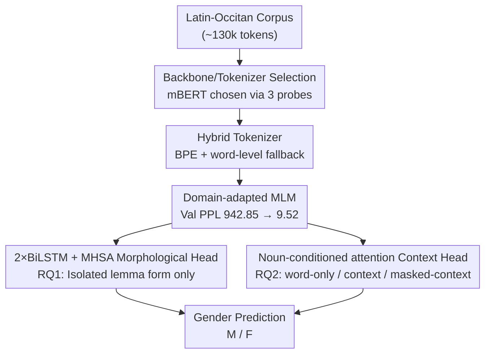

# Lost in Translation? Exploring the Shift in Grammatical Gender from Latin to Occitan

**Conference**: ACL 2026  
**arXiv**: [2605.09156](https://arxiv.org/abs/2605.09156)  
**Code**: https://github.com/ahan-2000/Lost-in-Translation- (Available)  
**Area**: Computational Linguistics / Historical Linguistics / Low-resource NLP  
**Keywords**: Medieval Occitan, Grammatical Gender, Latin Neuter, Explainable NLP, Hybrid Tokenization

## TL;DR
For Medieval Occitan, a low-resource historical language, the authors established an explainable framework using mBERT + Hybrid Tokenization + Domain-adapted MLM. By decomposing the problem of "whether original Latin neuter nouns became masculine or feminine in Occitan" into morphological cues versus syntactic context, they quantified the evidence and found that suffix morphology serves as the largest single signal, while context (especially articles and adjectives) pushes the Macro-F1 from 0.665 to 0.929.

## Background & Motivation

**Background**: The evolution of the Romance language family from the three Latin genders (Masculine / Feminine / Neuter) to two (Masculine / Feminine) is a classic problem in historical linguistics. However, most computational research focuses on high-resource languages like French and Spanish. Although Occitan is a Romance language listed as "endangered" by UNESCO, relevant NLP work is extremely scarce.

**Limitations of Prior Work**: ① Medieval Occitan orthography is highly unstable, with a single entry often having multiple spellings; standard WordPiece/BPE tokenizers either suffer from high OOV rates or break meaningful morphological cues into fragments. ② Existing gender prediction work is either purely rule-based (non-transferable) or only considers isolated word forms (ignoring agreement), failing to quantify the individual contributions of "morphology vs. context." ③ There is a lack of systematic explainable analysis regarding whether Latin neuter nouns were assigned masculine or feminine gender in Occitan.

**Key Challenge**: Gender information is distributed across two levels—intra-word morphology (suffixes like `-um/-ia/-la`) and sentence-level agreement (articles like `lo/la`, adjective endings). Existing methods do not separate these two lines of evidence, making it impossible to explain why models succeed or to determine how much the context helps when word forms are ambiguous (e.g., `psalmista`).

**Goal**: (RQ1) To determine how much Occitan gender can be predicted using only word-level morphological features. (RQ2) To determine the gain after adding sentence context and identify which parts of speech provide this gain.

**Key Insight**: Treat "gender assignment" as a quantifiable dual-source problem—intra-word signals + contextual signals. Model them separately for comparison, and then use three explainable tools—Ablation, SHAP, and PoS occlusion—to decompose each line of evidence.

**Core Idea**: Use mBERT + Hybrid Tokenization (Corpus BPE + word-level fallback) + Domain-adapted MLM as a unified backbone. Construct three types of inputs: word-only, context, and masked-context. Compare their Macro-F1 and log-probability increments in gender prediction to quantify the respective contributions of morphology and context.

## Method

### Overall Architecture

The framework aims to decompose the judgment of "whether Latin neuters became masculine or feminine in Occitan" into two quantifiable lines: intra-word morphology and syntactic context. The process begins with backbone and tokenizer selection—running three probes (frozen gender prediction, Latin→Occitan variant retrieval, and clustering) on Latin-Occitan pairs using FastText / mBERT / ByT5. mBERT was selected as the backbone. After comparing WordPiece, pure BPE, and Hybrid tokenization, a 10-epoch domain-adapted MLM was performed on mBERT using the Hybrid vocabulary (validation PPL dropped from 942.85 to 9.52). Above this backbone, two prediction paths are defined: RQ1 uses isolated lemma morphological-phonological features (suffix n-grams, syllable count, CV templates, stress proxies, etc.) concatenated with pretrained representations, fed into a set of classification heads for 10-fold lemma-grouped CV to quantify "how much gender can be predicted by word form alone." RQ2 aligns nouns in a ~130k token corpus to a Latin-Occitan lemma dictionary and constructs word-only / context / masked-context inputs, using the same mBERT + MLP head to quantify the increment brought by contextual agreement.

### Key Designs

**1. Hybrid Tokenizer (BPE + word-level fallback): Obtaining zero OOV and meaningful subwords in noisy spelling corpora**

Medieval Occitan orthography is extremely unstable. While standard mBERT WordPiece achieves 0% OOV, its masked recovery is only 15.78%. Conversely, pure BPE (vocab=600/800) introduces 2.63–2.86% OOV with recovery of only 3–5%. Both paths are flawed. The Hybrid approach first trains a small-vocabulary BPE on the Occitan corpus, iteratively merging the most frequent pairs as $V_{t+1}=V_t\cup\{ab\},\ (a,b)=\arg\max_{(x,y)} f(x,y)$, and then adds a word-level fallback rule: any whole word that BPE cannot split is kept as-is. This way, BPE subwords capture historical variation patterns like the consonant cluster variant `mp` in `primpcipat` or the word-final `t` in `secretament` (corresponding to the loss of `-t` in Old Occitan adverbs), while the fallback rule ensures zero OOV. Ultimately, the Hybrid approach was the only solution to achieve both 0% OOV and a masked recovery of 25.23%, serving as the best foundation for mBERT.

**2. 2×BiLSTM + MHSA Morphological Classification Head: Modeling subword sequences while locating sensitive positions**

Gender signals may be hidden in suffixes or specific phoneme combinations within a word. Tree models and shallow LSTMs only achieve an F1 of ~0.71–0.78, failing to capture this "sequence + key position" dual structure. This head takes multi-source features of isolated lemmas (Latin/Occitan n-grams + syntactic-phonological features + mBERT embeddings) as input. A two-layer BiLSTM captures the sequential dependencies of subwords, followed by an 8-head self-attention layer to allow the model to identify the subword positions most sensitive to gender. Training uses label smoothing CE or focal loss + class weight to handle the 2:1 class imbalance. It achieved the best lemma-level Macro-F1 = 0.8224 on mBERT embeddings.

**3. Noun-conditioned Attention Context Head: Delegating disambiguation weights to explainable attention distributions**

In Occitan, what truly disambiguates the gender of `la torista` is the article `la`. Simply using raw `[CLS]` pooling for the whole sentence would dilute this local agreement signal. This head first encodes the sentence with mBERT to obtain $H=(h_1,\dots,h_T)$, then treats the hidden state $h_i$ at target noun position $i$ as a query and the whole sentence as key/value to perform multi-head attention $\mathrm{Attn}(h_i, H, H)$, forcing the model to explicitly focus on "determining the gender of this noun." This is then concatenated with the Latin lemma embedding $e(L)$ and Latin gender one-hot $\mathrm{onehot}(G_L)$ before being fed into a shared MLP $p(y\mid r)=\mathrm{softmax}(f_\phi(r))$. The companion masked-context variant replaces the noun with `[MASK]` and reads $h_i^{\text{mask}}$, specifically measuring "how much gender can be recovered by context alone after stripping the noun itself," thereby cleanly separating morphological and contextual evidence.

### Loss & Training
- Word-level experiments used lemma-grouped 10-fold CV to prevent variant leakage. Hyperparameters were optimized via Optuna Bayesian optimization. The best head was 2×BiLSTM+MHSA, using CE + label smoothing 0.1, trained for 100 epochs. Focal loss + class weights handled imbalance.
- Contextual experiments used group K-fold (3 folds, grouped by lemma). AdamW, warmup 0.06 + linear decay, grad clip 0.5, dropout 0.1, fixed random seed 13.

## Key Experimental Results

### Main Results

| Setting (mBERT) | Accuracy | Macro F1 |
|---|---|---|
| Word-only | $0.808 \pm 0.154$ | $0.665 \pm 0.108$ |
| Context model (noun attention) | $0.979 \pm 0.012$ | $0.929 \pm 0.034$ |
| Context model (noun masked) | $0.977 \pm 0.008$ | $0.902 \pm 0.097$ |

Adding context increased Macro-F1 from 0.665 to 0.929 (+26.4). The masked-context version still reached 0.902, indicating that agreement signals in the context alone can recover the vast majority of gender assignments. The best lemma-level performance was mBERT + 2×BiLSTM+MHSA with a Macro-F1 = $0.8224 \pm 0.0385$. Paired bootstrap showed an advantage over ByT5 of $\Delta = +0.0395$, 95% CI $[+0.0250, +0.0543]$, $p<10^{-6}$.

### Ablation Study

| Feature Block Removed | F1 (mBERT) | $\Delta$ | % drop |
|---|---|---|---|
| Latin n-grams | 0.8092 | 0.0132 | 1.61% |
| Meta-features | 0.8168 | 0.0056 | 0.68% |
| Occitan n-grams | 0.8169 | 0.0055 | 0.67% |
| Syllable counts | 0.8194 | 0.0030 | 0.37% |
| VC patterns | 0.8220 | 0.0004 | 0.05% |
| Stress patterns | 0.8239 | -0.0015 | -0.18% |

Additional PoS-conditioned occlusion experiments: NOUN mean $\Delta=+0.0026$, DET $+0.0010$, ADJ $+0.0003$ (all $p<10^{-4}$ significantly positive). CCONJ/ADP/VERB showed negative contributions, while PUNCT/PRON were not significant. This quantitatively confirms that "gender information relies primarily on three types of agreement carriers: Nouns + Articles + Adjectives."

### Key Findings
- **Suffix morphology is the strongest single-source signal**: Removing Latin n-grams caused F1 drops of 1.6–1.8 points across all three embeddings, significantly higher than VC templates or stress proxies. Stress proxies even slightly harmed the model (F1 increased by 0.001-0.002 after removal), suggesting noise in the author's heuristic stress rules.
- **Context provides massive gains**: Comparing context vs. word-only showed $\Delta_1^{\text{prob}}=+0.283$ and $\Delta_2^{\log p}=+0.340$ (95% CI strictly greater than 0), indicating that context not only improves accuracy but also stabilizes confidence in the true class.
- **Latin meta-info acts as a context "amplifier"**: After removing the Latin lemma and Latin gender, the masked-context gain dropped from ~0.28 to ~0.09–0.11 (approx. 3× reduction), suggesting that cross-linguistic alignment features and context have a complementary amplifying relationship rather than being redundant.

## Highlights & Insights
- Creating three comparable input levels (word-only / context / masked-context) for "morphology vs. context" is highly effective. The masked-context design is particularly ingenious—it forces the model to recover gender from syntactic agreement without seeing the noun itself, thereby cleanly isolating the contributions of the two signals.
- The Hybrid tokenizer achieved both 0% OOV and 25.23% masked recovery, highlighting that OOV and subword quality are not mutually exclusive in low-resource historical corpora. This combined strategy can be directly transferred to languages like Latin, Ancient Greek, or Classical Arabic where spelling is unstable.
- PoS-conditioned occlusion + sign-flip permutation tests provided statistically significant contributions of each part of speech to gender prediction. This lightweight attribution tool is worth migrating to any "agreement-driven" linguistic task (e.g., case, number, or person prediction).

## Limitations & Future Work
- Small corpus size (~130k tokens) and 2:1 imbalance limit generalization for the feminine class; focal loss + class weight can mitigate but not cure this.
- Key hyperparameters were set heuristically: fuzzy matching threshold $\tau=0.85$, stress proxy rules, $\alpha=0.3$, etc., lack systematic tuning. Ablation showed stress proxies introduced slight noise.
- PoS occlusion relies on automatic tagging, but the PoS tagger's overall accuracy is 71% (NOUN 70%, ADJ lowest), meaning attribution results may be contaminated by tagging errors.
- Performance is significantly worse for nouns at the beginning/end of sentences or in sentences with sparse agreement words; error analysis shows this is the largest source of error. Future work could add boundary-aware attention masks or extra syntactic supervision.
- Conclusions are only validated on the "Latin Neuter → Occitan M/F" transition; whether they generalize to other Romance languages (e.g., Provençal, Catalan) has not been tested, nor does it directly answer "why this redistribution occurred historically," which requires diachronic parallel data.

## Related Work & Insights
- **vs. Williams et al. (2019) Information-theoretic quantification of gender in German/Czech**: They similarly decompose gender into form/meaning/inflection sources using information theory. This paper targets low-resource historical corpora and adds BERT-style contextual attribution. The advantage here is the explicit quantification of word vs. context gains and PoS-level explanation, while the disadvantage is the lack of formalized mutual information estimation.
- **vs. Cucerzan & Yarowsky (2003) Minimally supervised contextual gender induction**: They used co-occurrence with gendered articles to induce the gender of unseen words. This paper is a neural version (mBERT + attention) and provides a quantifiable masked vs. unmasked comparison. The insight is that "articles/adjectives as weak labels" remains valid and strong in historical corpora.
- **vs. Rule-based gender prediction in French (Lyster 2006)**: Rule-based methods are explainable but entirely language-dependent. This paper's Hybrid Tokenization + Domain-adapted mBERT paradigm is more transferable and provides visualizations equivalent to rules, such as "which suffix is most important," via SHAP/occlusion.

## Rating
- Novelty: ⭐⭐⭐ No flashy models, but "using NLP to quantify historical linguistics + explainable dual-source comparison" fills a gap for Medieval Occitan.
- Experimental Thoroughness: ⭐⭐⭐⭐ Embedding / Tokenization / Feature ablation + paired bootstrap + sign-flip tests + SHAP + occlusion are all present.
- Writing Quality: ⭐⭐⭐⭐ Clear research questions, strict alignment between conclusions and data, and complete appendices.
- Value: ⭐⭐⭐ Useful for both historical linguistics and low-resource NLP; the model itself is not revolutionary, but the methodological framework is reusable.

<!-- RELATED:START -->

## Related Papers

- [\[ICLR 2026\] Exploring Interpretability for Visual Prompt Tuning with Cross-layer Concepts](../../ICLR2026/interpretability/exploring_interpretability_for_visual_prompt_tuning_with_cross-layer_concepts.md)
- [\[AAAI 2026\] Finding the Translation Switch: Discovering and Exploiting the Task-Initiation Features in LLMs](../../AAAI2026/interpretability/finding_the_translation_switch_discovering_and_exploiting_the_task-initiation_fe.md)
- [\[ACL 2025\] CLEME2.0: Towards Interpretable Evaluation by Disentangling Edits for Grammatical Error Correction](../../ACL2025/interpretability/cleme2_gec_evaluation.md)
- [\[ICML 2026\] Optimal Attention Temperature Improves the Robustness of In-Context Learning under Distribution Shift in High Dimensions](../../ICML2026/interpretability/optimal_attention_temperature_improves_the_robustness_of_in-context_learning_und.md)
- [\[ACL 2026\] Learning What Matters: Dynamic Dimension Selection and Aggregation for Interpretable Vision-Language Reward Modeling](learning_what_matters_dynamic_dimension_selection_and_aggregation_for_interpreta.md)

<!-- RELATED:END -->
