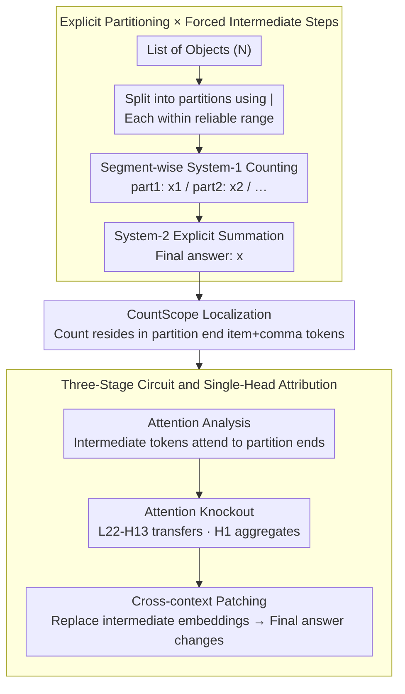

# Mechanistic Interpretability of Large-Scale Counting in LLMs through a System-2 Strategy

**Conference**: ACL 2026  
**arXiv**: [2601.02989](https://arxiv.org/abs/2601.02989)  
**Code**: TBD  
**Area**: Mechanistic Interpretability / LLM Reasoning / Counting  
**Keywords**: System-2, Counting, activation patching, causal mediation, attention knockout

## TL;DR
Addressing the failure of LLMs in large-scale counting (where a single forward pass is limited to ~$10–30$ due to layer depth), this study employs a simple test-time strategy: "slicing the list with `|` + prompting the model to count segments before summing." This approach increases accuracy for Qwen2.5/Llama3/Gemma3/GPT-4o/Gemini-2.5-Pro from 0–20% to 50–95% in scenarios with 50–100 objects. Through attention analysis and four types of causal mediation experiments, a three-stage circuit—"segment counting → intermediate step aggregation → final summation"—was localized to Layer 22 of Qwen2.5-7B (Head 13 for segmentation, Head 1 for aggregation).

## Background & Motivation
**Background**: LLMs perform adequately in simple arithmetic, but the accuracy of primitive counting tasks, such as "counting the number of apples in a list," drops sharply when $N > 10$. Prior work (Hasani 2025b, Yehudai 2024) has demonstrated this as an **architectural bottleneck** of Transformers: counting signals accumulate layer-by-layer (latent counter) and saturate once they reach the layer depth limit. Furthermore, numerical representations in LLMs are sublinear or log-like, causing larger numbers to become increasingly blurred.

**Limitations of Prior Work**: (1) Chain-of-Thought (CoT) alone offers limited help; structural organization combined with CoT is required. (2) Training-side fixes (re-tokenization, specialized math models) address symptoms rather than causes and remain constrained by depth. (3) Even works utilizing test-time partitioning (LVLM-COUNT, Izadi 2025) only verify behavioral outcomes without explaining the **internal mechanisms**—specifically, which heads and layers are activated by slicing and what functions they perform.

**Key Challenge**: (a) **Architecture vs. Task Scale**: A Transformer's single forward pass can only count up to its depth limit, whereas task scales can be infinite. (b) **Behavior vs. Mechanism**: While prompting is known to be effective, the underlying reasons and circuit structures remain unknown, preventing guaranteed controllable scaling.

**Goal**: (1) Propose "explicit partitioning + CoT summation" as a System-2 counting strategy and prove its effectiveness across various LLMs. (2) Decouple the three-stage circuit—"segment counting → writing intermediate steps → aggregation"—using attention analysis, activation patching, masking ablation, and attention knockout. (3) Causally verify that the final answer is directly regulated by intermediate step token embeddings via cross-context patching.

**Key Insight**: The authors adapt Kahneman’s dual-system theory: the implicit counting in an LLM's single forward pass is treated as "System-1" (fast but depth-limited), while "slicing + CoT summation" is treated as "System-2" (slow, explicit, scalable). Mechanistic interpretability is used to verify that System-2 is indeed implemented via specific heads and layers within the Transformer.

**Core Idea**: Explicit partitions are created in the input using `|`, and the model is prompted to output local counts as `part1: x1, part2: x2, ...` before the final sum. This ensures each partition remains within the model's "reliable counting range" (where System-1 works), while System-2 handles integer summation (a step where almost all models succeed, as shown by the 86–100% final-step accuracy in Table 3).

## Method

### Overall Architecture
The method externalizes a counting task that exceeds single-forward capacity into a multi-step operation unfolded over a token stream. The input $N$ is partitioned using `|` (approx. 6–9 items per segment for open-source models, 15–25 for closed-source models), falling within the reliable counting range. The prompt forces the model to output local counts in a fixed format (`part1: x1\npart2: x2\n...`) before providing the `Final answer: x`. Each segment is processed by the implicit System-1 counter, while cross-segment summation is handled by the System-2 token sequence. This requires no fine-tuning or external tools. Mechanistic analysis employs causal probes: CountScope probing to locate latent counts, token zero-ablation and layer-wise masking to identify counting layers, attention knockout for key heads, and cross-context patching to verify causal direction.

### Key Designs

**1. Explicit Partitioning × Forced Intermediate Steps: A Necessary Combination**

The bottleneck in large-scale counting is that the latent counter in a Transformer's forward pass saturates due to layer depth. The core solution is to decompose the task into segments the model can handle and materialize sub-results as tokens for subsequent attention access. A key finding is that these two steps must coexist: adding `|` without CoT is **harmful**—Qwen2.5-7B's accuracy for $N=11-20$ drops from 0.38 (unstructured) to 0.20 (structured-w/o-steps) because the partition resets the implicit counter without instructing the model to aggregate. Similarly, adding CoT without partitioning offers little improvement; only the combination raises accuracy from 0.38 to 0.95.

The bottleneck resides in segment counting rather than summation, as nearly all models achieve a final-step accuracy (summation stage) of $\ge 86\%$. System-2 performs well in summation; errors are concentrated in intermediate counts where System-1 operates. Partitioning provides a controllable System-1 sub-task space, while CoT materializes results into tokens that System-2 can aggregate.

**2. CountScope: Locating Latent Counts at Partition Boundary Tokens**

To perform causal intervention, it is necessary to identify which token's hidden state stores the count for each segment. The authors found logit-lens and tuned-lens unreliable for decoding numbers. Instead, they used CountScope (Hasani 2025b), a task-conditioned patching probe: activations from a target token are injected into an independent blank counting context; the number generated by the LM in that context represents the token's latent count.

The results confirmed the mechanistic hypothesis: count signals reside with high confidence on the **last item token + the last comma token of each partition**. Furthermore, counters reset between partitions; the end of the second segment stores the local count rather than a cumulative value. This provides precise targets for ablation and attention knockout while validating the independent segment counting mechanism.

**3. Three-Stage Circuit and Single-Head Causal Attribution**

The System-2 counting process is decomposed into three stages: "Information Storage (partition end tokens) → Information Transfer (intermediate step tokens) → Information Aggregation (final answer token)." These are mapped to specific attention pathways. Attention analysis reveals that in Layers 19–23, attention from intermediate tokens points strongly to the corresponding partition end (item+comma). Attention knockout identifies Layer 22 as the critical layer: **Head 22-13** handles "partition end → intermediate step" transfer, while **Head 22-1** handles "intermediate step → final answer" aggregation.

Cross-context patching provides final causal verification: replacing an intermediate step token's embedding in Context A with one from Context B causes the final answer in A to change accordingly (e.g., $19 \to 21$), confirming these embeddings are causal mediators rather than artifacts.

### Loss & Training
**Pure inference-time** strategy with no training involved. All interventions (CountScope, ablation, attention knockout, patching) are implemented via forward hooks.

## Key Experimental Results

### Main Results: Behavioral Performance (Accuracy / MAE for N=11–50/100)

| Model | Input | Output | Acc N=21-30 | Acc N=41-50 | MAE N=41-50 |
|---|---|---|---|---|---|
| Qwen2.5-7B (28 layer) | Unstruct | w/o steps | 0.13 | 0.00 | 10.50 |
| Qwen2.5-7B | Unstruct | w/ steps | 0.11 | 0.00 | 9.68 |
| Qwen2.5-7B | Struct | w/o steps | 0.13 | 0.01 | 6.35 |
| **Qwen2.5-7B** | **Struct** | **w/ steps** | **0.61** | **0.24** | **2.18** |
| **Llama3-8B** (32 layer) | **Struct** | **w/ steps** | **0.54** | **0.26** | **2.20** |
| **Gemma3-27B** (62 layer) | **Struct** | **w/ steps** | **0.85** | **0.50** | **2.25** |

| Closed Models (N=51-100) | Input/Output | Acc N=91-100 | MAE N=91-100 |
|---|---|---|---|
| GPT-4o, Unstruct, w/o steps | — | 0.24 | 4.26 |
| **GPT-4o**, **Struct**, **w/ steps** | — | **0.86** | **0.18** |
| Gemini-2.5-Pro, Unstruct, w/o steps | — | 0.20 | 2.70 |
| **Gemini-2.5-Pro**, **Struct**, **w/ steps** | — | **0.91** | **0.07** |

**Structured + w/ steps is the only universally effective configuration.**

### Ablation Study: Error Source Decomposition (Structured CoT setting)

| Model | Total Acc | Final-step Acc | Intermediate Acc |
|---|---|---|---|
| Qwen2.5-7B | 0.51 | **0.86** | 0.53 |
| Llama 3-8B | 0.49 | **0.96** | 0.48 |
| Gemma 3-27B | 0.71 | **0.93** | 0.76 |
| GPT-4o | 0.89 | **1.00** | 0.89 |
| Gemini-2.5-Pro | 0.94 | **0.97** | 0.94 |

The high Final-step Acc confirms that the bottleneck is entirely in the intermediate counting stage.

### Key Findings
- **Distinct failure modes for prompt combinations**: Partitioning without CoT causes models to output the "maximum partition size" as the answer ($13\%$ for Qwen2.5-7B, **$43.6\%$** for Llama3-8B). This aligns with the hypothesis that models output the maximum latent count.
- **Staged System-2 mechanism**: CountScope shows partition counters reset after each `|`. Intermediate tokens pull from these via Layer 22-Head 13, and the final answer aggregates intermediate tokens via Layer 22-Head 1.
- **Cross-model mechanistic consistency**: Parallel attention patterns were observed in Llama3.2-8B (L13-18) and Gemma3-4B (L21-23), suggesting that System-2 circuits activated by prompting are a general Transformer capability rather than model-specific.
- **Counter-intuitive CoT result**: While CoT is often viewed as a panacea, it fails here without structured input ($0.45$ vs $0.38$). Explicit separators provide the "anchor" for attention heads.

## Highlights & Insights
- **Staged Computation Framework**: The decomposition into "Storage → Transfer → Aggregation" and the mapping to specific heads provides a paradigm for interpreting any "divide and conquer" LLM task.
- **Input Structure as Stage Boundary**: Explicit separators create stage anchors in the token stream, which are more reliable than self-generated stages for attention indexing.
- **Methodological Contribution of CountScope**: The discovery that logit-lens is unreliable for numbers highlights the importance of patching-style probes for mathematical interpretability.
- **Bypassing Architecture via Test-Time Scaling**: Rather than adding layers, architectural constraints are bypassed by externalizing depth into token sequences, where token-by-token generation is equivalent to unrolling depth.

## Limitations & Future Work
- **Limitations**: (1) Use of synthetic data with repeated nouns; (2) Requirement to pre-determine reliable partition sizes; (3) Strategy is limited to near-independent sub-tasks (counting, multi-step arithmetic) and may not generalize to tightly coupled reasoning (e.g., multi-hop causal chains).
- **Future Directions**: Automating the determination of optimal partition sizes; extending the approach to tasks with stage interactivity (e.g., entity tracking); investigating why models like Qwen2.5-Math perform well even without steps (potential internalization via RLHF/SFT).

## Related Work & Insights
- **vs. CoT (Wei 2022)**: CoT provides steps but not boundaries; this study proves structure is necessary for saturation tasks.
- **vs. Hasani 2025b**: Extends their CountScope tool to a partitioning strategy and a full staged interpretation.
- **vs. Yehudai 2024**: While they provide a theoretical upper bound for implicit counting, this study provides an empirical method to bypass it.

## Rating
- **Novelty**: ⭐⭐⭐⭐☆ The behavioral strategy is simple, but the **first complete three-stage circuit** and causal verification are significant.
- **Experimental Thoroughness**: ⭐⭐⭐⭐⭐ Extensive testing across 5 models, various configurations, and multiple types of causal intervention.
- **Writing Quality**: ⭐⭐⭐⭐☆ Clear progression from phenomenon to localization and causality.
- **Value**: ⭐⭐⭐⭐⭐ Offers direct guidance for prompt engineering in capacity-saturated tasks and provides a framework for staged interpretability.

<!-- RELATED:START -->

## Related Papers

- [\[ACL 2026\] Revitalizing Black-Box Interpretability: Actionable Interpretability for LLMs via Proxy Models](revitalizing_black-box_interpretability_actionable_interpretability_for_llms_via.md)
- [\[ACL 2025\] Mechanistic Interpretability of Emotion Inference in Large Language Models](../../ACL2025/interpretability/mechanistic_interpretability_of_emotion_inference_in_large_language_models.md)
- [\[ACL 2026\] Towards Intrinsic Interpretability of Large Language Models: A Survey of Design Principles and Architectures](towards_intrinsic_interpretability_of_large_language_modelsa_survey_of_design_pr.md)
- [\[ACL 2026\] Preference Heads in Large Language Models: A Mechanistic Framework for Interpretable Personalization](preference_heads_in_large_language_models_a_mechanistic_framework_for_interpreta.md)
- [\[ICML 2026\] Beyond Additive Decompositions: Interpretability Through Separability](../../ICML2026/interpretability/beyond_additive_decompositions_interpretability_through_separability.md)

<!-- RELATED:END -->
