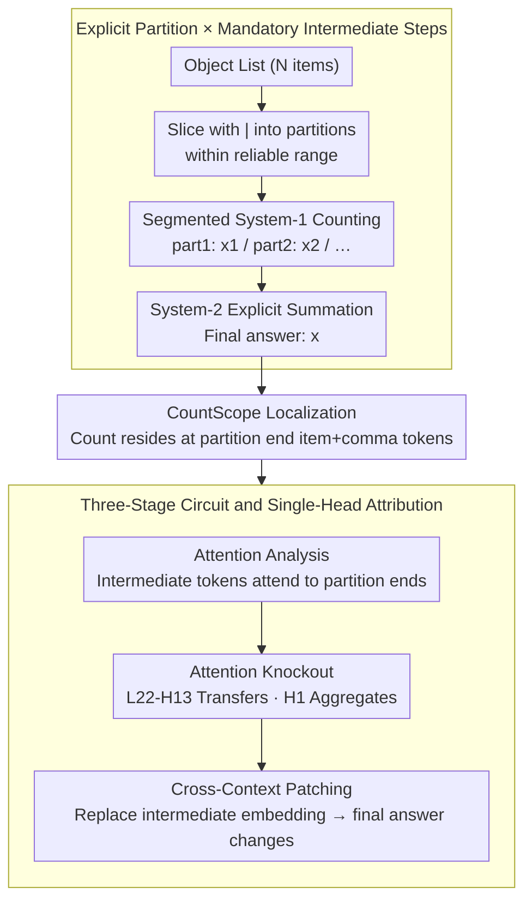

# Mechanistic Interpretability of Large-Scale Counting in LLMs through a System-2 Strategy

**Conference**: ACL 2026  
**arXiv**: [2601.02989](https://arxiv.org/abs/2601.02989)  
**Code**: To be confirmed  
**Area**: Mechanistic Interpretability / LLM Reasoning / Counting  
**Keywords**: System-2, Counting, Activation Patching, Causal Mediation, Attention Knockout

## TL;DR
Addressing the failure of large-scale counting in LLMs (single forward passes typically fail at $~10–30$ due to limited layer depth), a simple test-time strategy of "slicing lists with `|` + forcing segment-wise counting before summation" improves accuracy from 0–20% to 50–95% for Qwen2.5/Llama3/Gemma3/GPT-4o/Gemini-2.5-Pro in scenarios with 50–100 objects. Through attention analysis and four types of causal mediation experiments, the three-stage circuit of "segmented counting -> intermediate step aggregation -> final summation" is localized to Layer 22 of Qwen2.5-7B (Head 13 for segmentation, Head 1 for aggregation).

## Background & Motivation
**Background**: LLMs perform well on simple arithmetic, but accuracy for naive counting tasks (e.g., "count the number of apples in a list") drops sharply when $N > 10$. Prior work (Hasani 2025b, Yehudai 2024) has demonstrated this as an **architectural bottleneck** of Transformers: counting signals accumulate layer-by-layer (latent counter) and saturate at the depth limit; furthermore, numerical representations in LLMs are sublinear/log-like, making larger numbers increasingly blurred.

**Limitations of Prior Work**: (1) Chain-of-Thought (CoT) alone provides limited help (requiring structure + CoT); (2) Training-side fixes (re-tokenization, specialized math models) address symptoms rather than causes and remain depth-limited; (3) Existing work on test-time partitioning (LVLM-COUNT, Izadi 2025) validates behavioral effects but fails to explain **internal mechanisms**—specifically, which heads and layers are activated by slicing and what functions they perform.

**Key Challenge**: (a) **Architecture vs. Task Scale** — A single forward pass in a Transformer can only count up to its depth limit, whereas task scale can be infinite; (b) **Behavior vs. Mechanism** — While prompting is known to be effective, the underlying reasons and circuit structures remain unknown, preventing guaranteed controllable scaling.

**Goal**: (1) Propose "explicit partitioning + CoT summation" as a System-2 counting strategy and prove its effectiveness across various LLMs; (2) Use attention analysis, activation patching, masking ablation, and attention knockout to extract the three-stage circuit of "segmented counting → writing intermediate steps → aggregation"; (3) Causally verify via cross-context patching that the final answer is directly regulated by the token embeddings of intermediate steps.

**Key Insight**: The authors apply Kahneman’s Dual Process Theory: the implicit counting in a single LLM forward pass is treated as "System-1" (fast but depth-limited), while "slicing + CoT stepwise summation" is treated as "System-2" (slow, explicit, scalable). Mechanistic interpretability is used to verify that System-2 is indeed implemented via specific heads/layers within the Transformer.

**Core Idea**: Partition the input explicitly using `|` and require the model to output `part1: x1, part2: x2, ...` before the final sum. This ensures each partition stays within the model's "reliable counting range" (where System-1 works), while System-2 handles integer addition (a step where almost all models succeed, as shown by the 86–100% final-step accuracy in Table 3).

## Method

### Overall Architecture
The method externalizes a counting task that exceeds single-forward capacity into a multi-step operation unfolded across the token stream. At the input, $N$ objects are divided into several partitions using `|` (approx. 6-9 for open-source models, 15-25 for closed-source models, falling within the reliable range). Symbols force the model to output local counts in a fixed format: `part1: x1\npart2: x2\n...` followed by `Final answer: x`. Thus, each segment is handled by the implicit System-1 counter, while cross-segment summation is handled by the explicit token sequence (System-2), requiring no fine-tuning or external tools. Mechanistic analysis employs causal probes: CountScope probing to locate latent counts, token zero-ablation and layer-wise masking to identify counting layers, attention knockout for key heads, and cross-context patching to verify causal direction.

### Key Designs

**1. Explicit Partition × Mandatory Intermediate Steps: An Indispensable Combination**

The bottleneck of large-scale counting is that the latent counter in a Transformer's forward pass saturates due to layer depth. The core solution is decomposing the task into "countable" sub-segments and materializing sub-results as tokens for subsequent attention access. A key finding is that both steps must coexist: adding `|` without CoT is actually **harmful**—Qwen2.5-7B's accuracy for $N=11-20$ drops from 0.38 (unstructured) to 0.20 (structured-w/o-steps), because partitioning resets the implicit counter without telling the model how to aggregate. Adding CoT without partitioning also yields little benefit; only the combination increases accuracy from 0.38 to 0.95.

The bottleneck resides entirely in segmented counting rather than summation, as nearly all models achieve a final-step accuracy (summation stage) of $\ge 86\%$. System-2 performs well at summation; errors occur in intermediate counts where System-1 still operates within each segment. Partitioning provides a controllable sub-task space for System-1, and CoT materializes results into tokens for System-2 to aggregate.

**2. CountScope: Localizing Latent Counts to Partition Boundary Tokens**

Causal intervention requires knowing where the count for each segment is stored in hidden states. The authors found logit-lens/tuned-lens unreliable for decoding numbers and instead used CountScope (Hasani 2025b), a task-conditioned patching probe: the activation of a target token is injected into an independent blank counting context; the number generated by the LM in that context represents the token's implicit count.

Results confirmed the mechanism hypothesis—count signals reside with high confidence on the **last item token + last comma token** of each partition. Counters reset between partitions: the end of the second segment stores a local count rather than a cumulative value. This provides precise targets for zero-ablation and attention knockout.

**3. Three-Stage Circuit and Single-Head Causal Attribution**

System-2 counting is decomposed into: "Information Storage (partition end tokens) $\to$ Information Transfer (intermediate step tokens) $\to$ Information Aggregation (final answer token)." In Layers 19-23, attention from intermediate tokens points strongly to corresponding partition-end item+comma tokens. Attention knockout identifies Layer 22 as critical: **Head 22-13** handles transfer from partition ends to intermediate steps, while **Head 22-1** handles aggregation from intermediate steps to the final answer.

To move beyond correlation, cross-context patching was used for causal verification: replacing an intermediate step token's embedding from Context A with that from Context B caused the final answer to change accordingly ($19 \to 21$, $14 \to 12$). This confirms token embeddings are causal mediators. The use of different heads for different stages indicates a clear division of labor within the LLM.

### Loss & Training
**Pure inference-time**; no training involved. All interventions (CountScope probe, zero-ablation, attention knockout, cross-context patching) are implemented via forward hooks.

## Key Experimental Results

### Main Results: Behavioral Performance (Accuracy / MAE for $N=11–50$ open models, $N=51–100$ closed models)

| Model | Input | Output | Acc $N=21-30$ | Acc $N=41-50$ | MAE $N=41-50$ |
|---|---|---|---|---|---|
| Qwen2.5-7B (28 layer) | Unstruct | w/o steps | 0.13 | 0.00 | 10.50 |
| Qwen2.5-7B | Unstruct | w/ steps | 0.11 | 0.00 | 9.68 |
| Qwen2.5-7B | Struct | w/o steps | 0.13 | 0.01 | 6.35 |
| **Qwen2.5-7B** | **Struct** | **w/ steps** | **0.61** | **0.24** | **2.18** |
| **Llama3-8B** (32 layer) | **Struct** | **w/ steps** | **0.54** | **0.26** | **2.20** |
| **Gemma3-27B** (62 layer) | **Struct** | **w/ steps** | **0.85** | **0.50** | **2.25** |

| Closed Models ($N=51-100$) | In/Out | Acc $N=91-100$ | MAE $N=91-100$ |
|---|---|---|---|
| GPT-4o, Unstruct, w/o steps | — | 0.24 | 4.26 |
| **GPT-4o**, **Struct**, **w/ steps** | — | **0.86** | **0.18** |
| Gemini-2.5-Pro, Unstruct, w/o steps | — | 0.20 | 2.70 |
| **Gemini-2.5-Pro**, **Struct**, **w/ steps** | — | **0.91** | **0.07** |

**Structured + w/ steps** is the only consistently effective configuration.

### Ablation Study: Error Source Decomposition (Structured CoT setting)

| Model | Total Acc | Final-step Acc | Intermediate Acc |
|---|---|---|---|
| Qwen2.5-7B | 0.51 | **0.86** | 0.53 |
| Llama 3-8B | 0.49 | **0.96** | 0.48 |
| Gemma 3-27B | 0.71 | **0.93** | 0.76 |
| GPT-4o | 0.89 | **1.00** | 0.89 |
| Gemini-2.5-Pro | 0.94 | **0.97** | 0.94 |

Final-step accuracy $\ge 86\%$ indicates the bottleneck is entirely intermediate counting.

### Key Findings
- **Failure modes vary across prompt combinations**: Partitioning without CoT causes models to output the "maximum partition size" as the answer (13% for Qwen2.5-7B, **43.6%** for Llama3-8B). This aligns with the hypothesis that models output the maximum latent count.
- **System-2 mechanism is staged**: CountScope reveals partition counters reset after each `|`. Intermediate tokens grab these via Layer 22-Head 13 attention, and the final answer aggregates intermediate tokens via Layer 22-Head 1.
- **Cross-model mechanistic consistency**: Parallel patterns exist in Llama3.2-8B (Layers 13-18) and Gemma3-4B (Layers 21-23), suggesting the circuit activated by prompting is a general Transformer capability rather than model-specific.
- **Counter-intuitive finding on CoT**: While CoT is often seen as a panacea, it provides almost no improvement for unstructured inputs (0.45 vs 0.38) without the "explicit stage boundaries" provided by structured input.

## Highlights & Insights
- **Staged Computation Framework**: This paper decomposes System-2 behavior into "storage $\to$ transfer $\to$ aggregation," mapping stages to token positions and attention heads. This paradigm is extensible to any "divide and conquer" LLM task (multi-step reasoning, long-doc summarization, etc.).
- **Input Structure as Stage Boundary**: CoT often fails because models lack external signals on where to reset sub-task counters; explicit separators create "stage anchors" that attention heads can index.
- **Methodological Contribution of CountScope**: The discovery that logit-lens is unreliable for numbers highlights why patching-style probes are superior to linear probes for mathematical/reasoning interpretability.
- **Bypassing Architectural Limits via Test-time Scaling**: Transformer depth limits can be bypassed by externalizing computation into token sequences, where token-by-token generation is equivalent to unrolling depth.

## Limitations & Future Work
- (1) Experiments used synthetic data with repeated nouns rather than natural prose; (2) Requires prior knowledge of the model's "reliable partition size"; (3) Strategy applies only to nearly independent sub-tasks (counting, multi-step arithmetic), not strongly coupled reasoning (e.g., multi-hop causal chains).
- (4) Circuit localization was primarily verified on Qwen2.5-7B; although other models show similar attention patterns, specific head-level knockout was not exhaustive across all models.

## Related Work & Insights
- **vs. CoT (Wei 2022)**: CoT provides steps but not mandatory stage boundaries; this paper proves boundaries are essential for saturation tasks.
- **vs. Hasani 2025b**: Extends their layer-wise counter/CountScope tool into a System-2 interpretation.
- **vs. Yehudai 2024**: Empirically bypasses the theoretical upper bounds of Transformer counting through test-time decomposition.

## Rating
- Novelty: ⭐⭐⭐⭐☆ The behavioral strategy is simple, but the **first to provide a complete three-stage circuit** and causal verification.
- Experimental Thoroughness: ⭐⭐⭐⭐⭐ 5 models × 4 configurations, multiple context sizes, attention pattern comparisons, and 4 types of causal intervention.
- Writing Quality: ⭐⭐⭐⭐☆ Clear flow (phenomenon → localization → causality), though some sections (5.3) are dense.
- Value: ⭐⭐⭐⭐⭐ Direct guidance for prompt engineering and mechanistic understanding of capacity-saturated tasks.

<!-- RELATED:START -->

## Related Papers

- [\[CVPR 2026\] Understanding Counting Mechanisms in Large Language and Vision-Language Models](../../CVPR2026/interpretability/understanding_counting_mechanisms_in_large_language_and_vision-language_models.md)
- [\[ACL 2026\] Revitalizing Black-Box Interpretability: Actionable Interpretability for LLMs via Proxy Models](revitalizing_black-box_interpretability_actionable_interpretability_for_llms_via.md)
- [\[ACL 2025\] Mechanistic Interpretability of Emotion Inference in Large Language Models](../../ACL2025/interpretability/mechanistic_interpretability_of_emotion_inference_in_large_language_models.md)
- [\[ACL 2026\] Towards Intrinsic Interpretability of Large Language Models: A Survey of Design Principles and Architectures](towards_intrinsic_interpretability_of_large_language_modelsa_survey_of_design_pr.md)
- [\[ACL 2026\] Preference Heads in Large Language Models: A Mechanistic Framework for Interpretable Personalization](preference_heads_in_large_language_models_a_mechanistic_framework_for_interpreta.md)

<!-- RELATED:END -->
