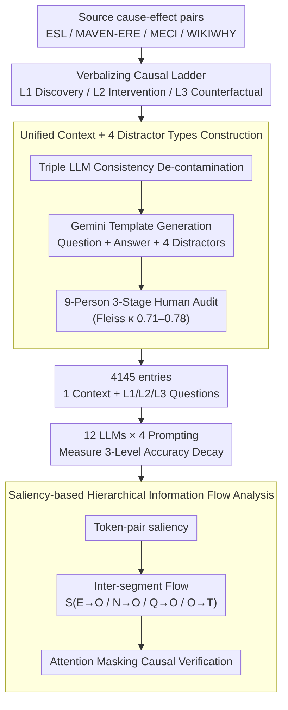

# METER: Evaluating Multi-Level Contextual Causal Reasoning in Large Language Models

**Conference**: ACL 2026  
**arXiv**: [2604.11502](https://arxiv.org/abs/2604.11502)  
**Code**: https://github.com/SCUNLP/METER (Available)  
**Area**: Causal Reasoning Evaluation / Mechanistic Interpretability  
**Keywords**: Contextual Causal Reasoning, Causal Ladder, Information Flow Analysis, Saliency Score, LLM Evaluation

## TL;DR
METER is the first benchmark to systematically evaluate LLMs' three-level causal reasoning (discovery / intervention / counterfactual) under a **unified context**. Utilizing 4,145 samples constructed via human-LLM collaboration, saliency-based information flow analysis reveals that LLM performance drops from 93% to 73% as they ascend the causal ladder. The root causes are interference from irrelevant facts during the discovery stage and a significant decline in faithfulness to the context at higher-level stages.

## Background & Motivation
**Background**: Causal reasoning is regarded as an essential capability for AGI, particularly in high-risk domains like medical diagnosis. Clinical reports often require answering simultaneously: (1) Why does ischemia occur? (discovery); (2) What happens if a PCI is performed? (intervention); (3) What would have happened if there were no blockage? (counterfactual). Judea Pearl’s "Causal Ladder" categorizes these into three levels of increasing difficulty. Existing benchmarks such as ExpliCa, CRASS, WIKIWHY, CausalQA, and IfQA evaluate causal capabilities, but each covers only a single level.

**Limitations of Prior Work**:
1.  **Incomplete Coverage**: Existing benchmarks evaluate either only discovery (WIKIWHY, CausalQA, RECESS, CRAB) or only counterfactual reasoning (CRASS, IfQA); none cover all three levels within a single benchmark.
2.  **Inconsistent Context**: Even in rare cases of multi-level evaluation (CalQuest, CLADDER, CausalBench), different questions use different contexts, precluding a strict comparison of capability gaps across levels for the same set of facts.
3.  **Lack of Mechanistic Analysis**: Benchmarks lack accompanying studies on "why models fail"—scores alone do not reveal where internal mechanisms break down.
4.  **Mixed Paradigms**: Current works mix commonsense (knowledge-based), formal (symbolic rules), and contextual (document-based) paradigms. Contextual causal reasoning—strictly following evidence in text—has not been evaluated in isolation.

**Key Challenge**: Implementing a "fair multi-level evaluation" requires each context to be paired with questions from all three levels. However, manual annotation is extremely costly, and strict de-contamination is needed to prevent LLMs from relying on memorized answers.

**Goal**: (i) Systematically evaluate three-level causal reasoning under a unified context; (ii) Provide a large-scale (4K+), high-quality, de-contaminated human-audited dataset; (iii) Use mechanistic interpretability (information flow analysis) to explain LLM failure modes.

**Key Insight**: Translate Pearl's Causal Ladder (numerical probability domain) into a **textual paradigm** and construct the benchmark using a "human-LLM collaboration + three-stage quality check" pipeline. Employ saliency-based information flow (Wang et al. 2023) to trace internal model focus.

**Core Idea**: (1) Derive three levels of questions from the same context to perform fair variable-controlled comparisons; (2) Design four types of distractors (contradictory / unfounded / causal-reversal / irrelevant-fact) to systematically detect failure modes; (3) Map "behavioral failures" to "mechanistic failures" via information flow analysis on erroneous samples.

## Method

### Overall Architecture
METER quantifies the "performance decay of LLMs on the causal ladder" through parallel data and analysis pipelines. The data pipeline extracts cause-effect pairs from four source datasets (ESL, MAVEN-ERE, MECI, WIKIWHY), uses Gemini-2.5-Pro to expand event descriptions and generate three-level questions, answers, and four types of distractors. Following a three-stage audit by nine NLP annotators, 4,145 entries were finalized—each containing a context paired with L1/L2/L3 multiple-choice questions. The analysis pipeline evaluates 12 LLMs (GPT-4o/5, Gemini-3 series, Qwen3 all-sizes, Llama-3.3-70B) across 4 prompting methods, calculates accuracy decay, and performs saliency-based information flow analysis on Qwen3-4B/8B and Llama-3.2-3B.

### Key Designs

**1. Translating Pearl’s Causal Ladder into Operational Linguistic Tasks**

To implement Pearl's mathematical definitions in LLMs, each level was rewritten as a template-based linguistic task based on "verbs / temporal order / modification dimensions." L1 **Causal Discovery** involves identifying existing causal relations in text (via explicit keywords like "caused/because" or implicit semantics), e.g., reading "thrombotic occlusion → myocardial ischemia" from a clinical report. L2 **Intervention** predicts consequences of "introducing new actions" into the context, requiring multi-step chain reasoning (e.g., "performing PCI" → "clearing occlusion" → "restoring blood flow"). L3 **Counterfactual** requires inverting known conditions to infer "what if things were different" (e.g., "If there had been no blockage, the damage would not have occurred").

**2. Unified Context + Four Distractor Types for Controlled Data Construction**

To isolate model capability as the cause for performance gaps, each entry strictly adheres to a "1 context (avg. 228.91 tokens) + 3 questions" structure. Each 5-option question contains 1 correct answer and 4 distractors designed as diagnostic probes for failure modes: **Contradictory** (directly conflicts with context facts), **Unfounded** (cannot be inferred from context, typical hallucination), **Causal Reversal** (inverted causal direction), and **Irrelevant Fact** (true statement from context but irrelevant to the causal chain).

**3. Saliency-based Hierarchical Information Flow Analysis**

To go beyond "how much" a model fails to "where" it fails, the study defines a saliency-based information flow. For token-pair $(i,j)$, saliency is calculated as $I_l(i,j) = \sum_h |A_{h,l}^\top \frac{\partial \mathcal{L}}{\partial A_{h,l}}|$. The segment-to-segment average information flow is defined as $S_{X \to Y} = \frac{\sum_{(i,j) \in \mathcal{C}_{X \to Y}} I_l(i,j)}{|\mathcal{C}_{XY}|}$. Prompts are segmented into **E** (evidence), **N** (non-evidence), **Q** (question), **O** (option), and **T** (target). $S_{E\to O}$ tracks whether the model actually attends to evidence.

### Loss & Training
**Purely an evaluation project; no training involved.** Closed-source LLMs use official APIs; open-source LLMs use vLLM on 4×A100. Four prompting methods: Zero-shot, Zero-shot CoT, Few-shot, Few-shot CoT. Metric: accuracy (averaged over 3 runs).

## Key Experimental Results

### Main Results (4 Prompting Methods × 12 LLMs × 3 Causal Levels)

**Zero-shot accuracy (%)**:

| Model | L1 Discovery | L2 Intervention | L3 Counterfactual | Drop |
|------|--------------|-----------------|--------------------|------|
| **Gemini3-Pro** | **93.50** | **81.92** | **73.05** | -20.45 |
| GPT-5 | 92.96 | 82.17 | 72.14 | -20.82 |
| Gemini3-Flash | 91.02 | 78.09 | 70.51 | -20.51 |
| Qwen3-Next-Thinking | 90.36 | 77.52 | 70.57 | -19.79 |
| Qwen3-Next-Instruct | 89.56 | 75.13 | 64.47 | -25.09 |
| GPT-4o | 87.92 | 77.96 | 67.42 | -20.50 |
| Llama-3.3-70B | 87.24 | 78.17 | 62.08 | -25.16 |
| Qwen3-32B | 87.26 | 71.54 | 61.12 | -26.14 |
| Qwen3-14B | 87.95 | 67.54 | 52.05 | -35.90 |
| Qwen3-8B | 86.27 | 64.48 | 51.40 | -34.87 |
| Qwen3-4B | 87.03 | 53.47 | 43.26 | -43.77 |
| Qwen3-0.6B | 64.46 | 31.27 | 25.88 | -38.58 |
| **Human** | **95.80** | **92.80** | **91.00** | **-4.80** |

**Two Key Findings**: (1) All LLMs demonstrate accuracy decay as they ascend the ladder (Gemin3-Pro drops 20+ points; Humans drop only 4.8). (2) **Reasoning-optimized models are significantly more robust at higher levels** compared to instruction-tuned models.

### Error Distribution Analysis (Ratio of distractor types in Zero-shot errors)

| Distractor Type | Discovery (Qwen3-4B) | Intervention | Counterfactual |
|----------------|----------------------|--------------|----------------|
| **Irrelevant Fact** | **55.41%** | 26.87% | 24.15% |
| Unfounded | 22.20% | 39.43% | 36.77% |
| Contradictory | 5.69% | 20.96% | **33.87%** |
| Causal Reversal | 16.70% | 12.74% | 5.22% |

- **Discovery**: Failures primarily caused by **irrelevant facts** (55%)—models choose statements that are true in context but irrelevant to the causal chain.
- **Higher-level**: **Unfounded** and **Contradictory** errors surge, indicating a collapse in faithfulness.
- **Counterfactual**: Contradictory errors reach 33.87%, showing models fail to maintain logical consistency under hypothetical scenarios.

### Information Flow Analysis (Avg. Saliency of Qwen3-4B)

| Metric | Discovery (Cor / Err) | Intervention | Counterfactual |
|------|----------------------|--------------|----------------|
| $S_{E\to O}$ (evidence→option) | **0.1690 / 0.1247** | 0.1144 / 0.0936 | 0.1095 / 0.0988 |
| $S_{N\to O}$ (noise→option) | **0.0945 / 0.1262** | 0.0858 / 0.0858 | 0.0805 / 0.0884 |

- **Discovery error samples**: $S_{E\to O}$ drops while $S_{N\to O}$ rises, confirming "distraction by irrelevant facts" at the mechanistic level.
- **Intervention/Counterfactual**: Regardless of correctness, $S_{E\to O}$ remains low (~0.10), suggesting models rely on internal knowledge rather than context.

### Attention Masking Causal Verification (Qwen3-4B)
Masking $E\to O$ flow in shallow layers (1-24) drops Discovery accuracy from 0.827 to 0.579, while masking it in deep layers has no effect, proving evidence aggregation occurs in shallow layers.

## Key Findings
- **Model Scale vs. Level**: For Qwen3, discovery saturates early (4B≈32B), while intervention/counterfactual improve by 40%+, suggesting high-level reasoning requires scale while discovery requires basic reading.
- **CoT is not a silver bullet**: Llama-3.3-70B gains 5 points on counterfactuals with CoT, while GPT-4o drops 2 points, possibly due to CoT introducing noise into already optimized paths.
- **Counterfactuals remain the ultimate hurdle**: LLMs show the largest gap compared to humans in L3 (73% vs 91%).

## Highlights & Insights
- **Unified-context Design**: Quantifying performance decay under identical facts eliminates difficulty as a confounding factor.
- **Behavior-Mechanism Link**: The paper connects "what kind of errors" (distractors) to "why they happen" (information flow) and verifies it via masking.
- **Value of Information Flow**: Explicitly providing evidence spans in prompts improves accuracy by 2-3 points across models, indicating that RAG's true value lies in **strengthening information flow**.

## Limitations & Future Work
**Limitations**: Analysis is restricted to open-source models; de-contamination is black-box; distractors generated by LLMs may introduce bias.
**Future Work**: Designing training objectives to specifically strengthen $S_{E\to O}$; expanding to open-ended generation; investigating how RLHF reshapes causal information flow.

## Related Work & Insights
- **Ours vs Commonsense Paradigms (CRASS, etc.)**: Others rely on prior knowledge; ours strictly evaluates evidence-based contextual reasoning.
- **Ours vs Discovery-only (WIKIWHY, etc.)**: Ours is the first to test the full hierarchy under a unified context.
- **Insight**: Benchmarks should evolve from reporting scores to providing "Scores + Error Distribution + Mechanistic Analysis + Causal Verification."

## Rating
- **Novelty**: ⭐⭐⭐⭐ Unified-context multi-level evaluation + information flow analysis is a clear innovation.
- **Experimental Thoroughness**: ⭐⭐⭐⭐⭐ High coverage (12 models, 4 prompts, multi-level mechanisms).
- **Writing Quality**: ⭐⭐⭐⭐⭐ Clear definitions, logical narrative, and persuasive case studies.
- **Value**: ⭐⭐⭐⭐⭐ Public code and 4,145 high-quality samples are indispensable resources for the community.

<!-- RELATED:START -->

## Related Papers

- [\[ACL 2026\] Knowledge Vector of Logical Reasoning in Large Language Models](knowledge_vector_of_logical_reasoning_in_large_language_models.md)
- [\[ACL 2026\] Jacobian Scopes: Token-Level Causal Attributions in LLMs](jacobian_scopes_token-level_causal_attributions_in_llms.md)
- [\[ACL 2026\] Sparse Feature Coactivation Reveals Causal Semantic Modules in Large Language Models](sparse_feature_coactivation_reveals_causal_semantic_modules_in_large_language_mo.md)
- [\[ACL 2026\] Compositional Steering of Large Language Models with Steering Tokens](compositional_steering_of_large_language_models_with_steering_tokens.md)
- [\[ACL 2026\] Experiments or Outcomes? Probing Scientific Feasibility in Large Language Models](experiments_or_outcomes_probing_scientific_feasibility_in_large_language_models.md)

<!-- RELATED:END -->
