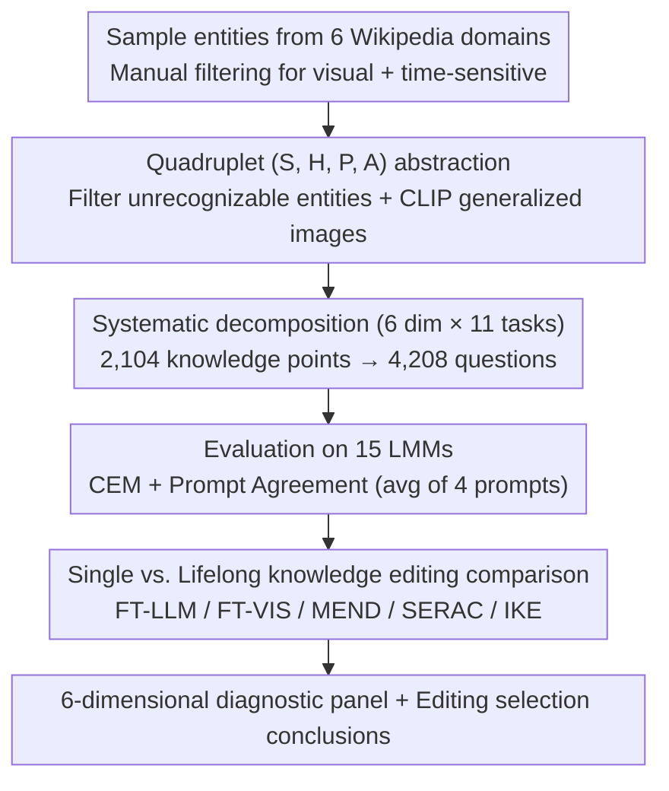

# MINED: Probing and Updating with Multimodal Time-Sensitive Knowledge for Large Multimodal Models

**Conference**: ACL 2026  
**arXiv**: [2510.19457](https://arxiv.org/abs/2510.19457)  
**Code**: TBD (Not provided in the paper)  
**Area**: Multimodal LMM / Knowledge Evaluation / Knowledge Editing / Time-sensitive Knowledge  
**Keywords**: time-sensitive knowledge, temporal awareness, benchmark, knowledge editing, LMM probing

## TL;DR
The authors propose MINED—the first evaluation benchmark for **multimodal time-sensitive knowledge**, consisting of 2,104 $(subject, hypernym, property, attribute-list)$ quadruplets across 11 sub-tasks in 6 dimensions (Cognition / Awareness / Trustworthiness / Understanding / Reasoning / Robustness), totaling 4,208 questions. Evaluation of 15 LME's shows Gemini-2.5-Pro achieving the highest average $\text{CEM}=63.07$ but still lacking ~15% of the knowledge; further tests using knowledge editing methods like FT-LLM / IKE effectively update outdated knowledge in LLaVA-v1.5 and Qwen-VL under single editing, but performance significantly degrades under lifelong editing (FT-LLM drops by 43.2% on average).

## Background & Motivation

**Background**: LMMs (such as LLaVA-v1.5, Qwen2.5-VL, Gemini-2.5-Pro) encode vast factual knowledge through large-scale pre-training. However, parameters are static—once Messi transfers to Inter Miami CF, the answer to "Which team does Messi play for now?" becomes outdated. While text-based benchmarks like TimeQA, TempReason, and EvolveBench exist for temporal reasoning, they primarily test temporal expressions or logical relations rather than the freshness of internal time-sensitive facts. On the multimodal side, benchmarks like LiveVQA and MMKU-Bench focus on real-time visual knowledge updates but lack systematic temporal awareness evaluation.

**Limitations of Prior Work**: (i) Existing multimodal benchmarks cover only a single dimension (cognition or reasoning) and lack a combined six-dimensional evaluation. (ii) There is no benchmark explicitly testing common but neglected issues in deployment, such as how models perform when there is a mismatch between query time and external context time (temporal misalignment), how to reject unanswerable dates outside the time window, or how to understand implicit temporal concepts (e.g., "during Bezos's tenure as Amazon CEO"). (iii) Corresponding evaluation protocols, such as standardized fine-grained metrics like CEM or Prompt Agreement for multimodal temporal scenarios, are missing.

**Key Challenge**: There is an inevitable gap between the static parameterized knowledge of LMMs and dynamic real-world facts. Current evaluations only indicate that a model is "wrong" without explaining **why** (is it a failure in cognition? a lack of implicit time understanding? or being misled by misaligned context?), making subsequent improvements directionless.

**Goal**: (a) Construct a multimodal time-sensitive knowledge benchmark across 6 domains (country, sport, company, university, organization, competition), 6 dimensions, and 11 sub-tasks. (b) Evaluate 15 SOTA LMMs to identify common weaknesses. (c) Verify whether existing knowledge editing methods can effectively update time-sensitive knowledge in multimodal scenarios.

**Key Insight**: Each piece of time-sensitive knowledge is abstracted as a quadruplet $(S, H, P, A)$, where $S$ is the subject (e.g., Lionel Messi), $H$ is the hypernym (e.g., footballer), $P$ is the property (e.g., plays for), and $A = [a_1, \ldots, a_n]$ is the attribute temporal list (e.g., ["FC Barcelona | 2003-2021", "PSG | 2021-2023", "Inter Miami | 2023-now"]). These quadruplets are used to generate 11 sub-tasks (time-agnostic, interval-aware, timestamp-aware, unanswerable date, implicit concept, ranking, calculation, adversarial error, etc.) via templates.

**Core Idea**: Deconstruct "time-sensitive knowledge capability" into a systematic "diagnostic panel" consisting of six dimensions: cognition (recall) $\rightarrow$ awareness (context conflict detection) $\rightarrow$ trustworthiness (reject invalid time) $\rightarrow$ understanding (implicit time) $\rightarrow$ reasoning (rank/calc) $\rightarrow$ robustness (self-correct).

## Method

### Overall Architecture
MINED frames the gap between static model knowledge and dynamic reality as a diagnostic and updatable evaluation system through a three-stage pipeline. First, benchmark construction: candidates are sampled from Wikipedia across six domains using human and GPT-4o assistance. Two annotators manually filter visual and time-sensitive entities, extracting them into quadruplets $(S, H, P, A)$ with original images. Entities unrecognizable by at least 10 out of 15 LMMs are filtered out via perception templates to ensure visual perception standards, and generalized images are collected via Google and filtered by CLIP top-1 similarity. Second, the 4,208 questions are generated from the unique 2,104 pieces of knowledge across 11 sub-tasks and evaluated on 15 LMMs using CEM and Prompt Agreement. Finally, knowledge editing: LLaVA-v1.5 (7B) and Qwen-VL (7B) are used as "outdated models" to compare five methods (FT-LLM, FT-VIS, MEND, SERAC, IKE) under single and lifelong settings.

### Key Designs

**1. (S, H, P, A) Quadruplet Abstraction + Prompt Agreement Protocol**

The benchmark's foundation is the abstraction of knowledge into $(S, H, P, A)$ quadruplets—subject, hypernym, property, and attribute temporal list—rather than natural language QA pairs. This allows a single knowledge point to be batch-applied to different sub-task templates: (Lionel Messi, footballer, plays for, [...]) generates "Which club does the footballer in the image currently play for?" for T.A and "...can you identify which one was former?" for R.K. This abstraction ensures the benchmark is "evolvable"—refreshing the attribute list $A$ per quarter is the core of its maintainability. During construction, 5 perception templates filter out entities that most LMMs fail to recognize, and CLIP-captured generalization images are used for robust evaluation.

The evaluation protocol uses Cover Exact Match $\text{CEM} = \mathbb{1}(\hat y \subseteq Y)$ instead of strict EM, where an answer is correct if the ground truth appears in the generation. This is more suitable for free-form factual queries than BLEU/F1. Prompt Agreement averages scores across four semantically equivalent prompts (Question, Generalization Question, Image, Generalization Image) to eliminate artifacts and noise caused by prompt phrasing.

**2. Systematic Evaluation Decomposition (6 Dimensions × 11 Tasks)**

Using the quadruplets, time-sensitive knowledge understanding is split into six diagnostic dimensions to generate questions, targeting specific real-world pain points in LMM deployment. **Cognition** uses T.A/T.I.A/T.S.A formats (e.g., "currently?", "from 2021 to 2023?", "on 2024-01-01?") to measure recall. **Awareness** uses F.M.C/P.M.C to test whether the model is misled by mismatched context and query times. **Trustworthiness** uses P.U.D/F.U.D to test the rejection of queries for dates outside property windows (e.g., Messi in 2075). **Understanding** uses I.T.C to test implicit time resolution (e.g., "during Bezos's tenure"). **Reasoning** covers R.K (chronological ranking) and C.A (calculating days between events). **Robustness** uses A.T.E to test self-correction after being told an answer is wrong.

This decomposition surfaces specific diagnostic signals—for instance, smaller models are extremely fragile to past misalignment context (Qwen2-VL 7B drops 56.43% in P.M.C), a phenomenon hidden by overall metrics. Cross-validation across cognition tasks shows that timestamp-aware tasks are the easiest, suggesting that LMM internal knowledge is indexed more by points-in-time than intervals.

**3. Multi-modal Knowledge Editing Comparison (Single vs. Lifelong)**

After identifying outdated knowledge, this stage asks whether existing editing methods can effectively update it. Editing data is selected from samples where LLaVA-v1.5 (7B) or Qwen-VL (7B) had $\text{CEM} \neq 100$. **Single editing** resets weights after each edit to measure pure update effectiveness, while **Lifelong editing** evaluates the entire dataset after batch editing to measure cumulative interference. Evaluated methods include parameter-modifying (FT-LLM, FT-VIS, MEND) and parameter-preserving (SERAC, IKE) approaches.

The results provide an actionable roadmap: FT-LLM achieves a nearly perfect 97.2% in single editing but collapses to 54.0% (−43.2pp) in lifelong editing. In contrast, SERAC achieves only 61.6% in single editing but maintains 51.2% (−10.4pp) in lifelong editing due to its explicit cache. Conclusion: Use FT-LLM for under 100 updates, and use memory-based SERAC for 1,000+ updates.

### Loss & Training
This paper presents a benchmark and evaluation; no new model is trained. For knowledge editing, the original methods' losses are used (FT-LLM = standard CE fine-tuning, MEND = hypernetwork loss, SERAC = retrieval + counterfactual model loss). The primary metric is $C_d = \frac{1}{N}\sum_i^N \text{CEM}_i$, where $\text{CEM} = \mathbb{1}(\hat y \subseteq Y)$.

## Key Experimental Results

### Main Results
CEM (%) of 15 LMMs on 11 MINED sub-tasks (selection of 5 models, focusing on Cog./Awa./Tru./Und./Rea./Rob.):

| Model | T.S.A (Cog) | F.M.C (Awa) | P.M.C (Awa) | P.U.D (Tru) | F.U.D (Tru) | I.T.C (Und) | R.K (Rea) | C.A (Rea) | A.T.E (Rob) | **Avg** |
|------|-------------|--------------|--------------|--------------|--------------|--------------|------------|------------|---------------|---------|
| LLaVA-v1.5 (7B) | 16.88 | 7.66 | 6.40 | 53.99 | 50.00 | 1.57 | 15.12 | 6.17 | 0.39 | 15.85 |
| Qwen2.5-VL (7B) | 41.67 | 40.04 | 33.98 | 99.64 | 99.76 | 4.02 | 38.89 | 25.00 | 16.86 | 39.55 |
| InternVL2.5 (8B) | 44.83 | 42.37 | 38.26 | 98.31 | 99.88 | 4.22 | 61.73 | 19.14 | 0.00 | 40.70 |
| GPT-4o | 80.91 | 78.07 | 77.49 | 65.22 | 91.30 | 8.63 | 15.74 | 59.57 | 17.58 | 51.82 |
| **Gemini-2.5-Pro** | **84.96** | **83.09** | **84.30** | 80.31 | 97.10 | **18.73** | 38.48 | **76.54** | **39.58** | **63.07** |

$\rightarrow$ Closed-source models lead significantly; I.T.C (implicit temporal concept) is a failure point for all models (max 18.73%); A.T.E (self-correction) is a universal weakness (mostly < 20%).

### Ablation Study
Single vs. Lifelong knowledge editing (LLaVA-v1.5 7B, average CEM % across 9 tasks, $\Delta = \text{lifelong} - \text{single}$):

| Method | Single avg | Lifelong avg | $\Delta$ | Assessment |
|------|------------|---------------|----|------|
| **FT-LLM** | **97.2** | 54.0 | **−43.2** | Strongest single, collapses in lifelong |
| FT-VIS | 86.6 | 34.8 | −51.8 | Unstable visual editing |
| MEND | 62.7 | - | — | Weak in single editing |
| **SERAC** | 61.6 | **51.2** | **−10.4** | Mediocre single; stable lifelong; A.T.E +12.6 |
| IKE | 76.0 | - | — | OK single editing (in-context) |

$\rightarrow$ SERAC is 4 $\times$ more robust than parameter-modification methods in lifelong editing due to its memory-based explicit cache avoiding catastrophic forgetting.

### Key Findings
- **Obs 1: Timestamp-Aware > Interval-Aware > Time-Agnostic**: LMMs perform best on specific time points, suggesting internal knowledge is point-indexed; however, Gemini-2.5-Pro still misses 15% of knowledge on T.S.A.
- **Obs 2: Small models are extremely fragile to past misalignment context**: Qwen2-VL (7B) drops 56.43% in P.M.C, whereas closed-source and large models are much more robust (GPT-4o drops only 4.6%).
- **Obs 3: Rejection of future dates is more accurate than past dates**: Future dates are "unseen concepts," providing higher confidence for refusal; Qwen2-VL series achieves ~99% rejection, likely from defensive instruction tuning.
- **Obs 5: Larger models are not necessarily better at ranking**: Qwen2.5-VL ranking accuracy decreases monotonically from 3B (50.3) $\rightarrow$ 7B (38.9) $\rightarrow$ 72B (11.4), possibly due to over-thinking.
- **Obs 7: Newer models have stronger temporal awareness**: Release time is generally positively correlated with Avg CEM, likely due to updated training data cutoffs.
- **Exploration 3: Open-source models generate many irrelevant responses**: In Time-Agnostic tasks, 57.65% of LLaVA-v1.5 (7B) responses were irrelevant. Closed-source models reduced irrelevant responses to 14–18%, but outdated responses still accounted for 53–64%, revealing that **most models generate outdated rather than latest answers**.

## Highlights & Insights
- **Diagnostic Panel Categorizes Failure Modes**: Splitting temporal knowledge into six dimensions targets real-world pain points (e.g., RAG context conflict maps to Awareness, refusal-to-answer maps to Trustworthiness), allowing targeted future improvements.
- **(S, H, P, A) + Quarterly Updates = Evolvable Benchmark**: Abstracting knowledge into quadruplets with a pipeline for quarterly Wikipedia updates makes MINED a **living** benchmark—a "benchmark as data infrastructure" approach invaluable for long-term evaluation.
- **I.T.C Failure is a Wake-up Call**: SOTA models fail at implicit temporal concepts (e.g., "during Bezos's tenure") with only 18.73% accuracy. This suggests LMMs struggle to ground temporal phrases into intervals before knowledge retrieval, representing an open research problem.
- **Single vs. Lifelong Editing Comparison is Actionable**: The study quantitatively validates that FT-LLM is suitable for small-scale edits, while SERAC is necessary for lifelong scenarios, providing guidance for deploying LMMs-as-databases.

## Limitations & Future Work
- Coverage is limited to 6 domains (Country/Sport/Company/University/Organization/Competition); medical or legal fields are not covered. Visual data is limited to static images without video.
- The "evolvable" quarterly update pipeline is a design concept and has not been tested over multiple real cycles.
- Knowledge editing experiments were conducted only on older models (LLaVA-v1.5 and Qwen-VL); these conclusions may not transfer to newer SOTA models like Qwen2.5-VL.
- I.T.C mapping is manually curated to ensure temporal uniqueness (e.g., "Messi only played for Barcelona during Bezos's tenure"), leading to small sample sizes.
- Evaluation relies on CEM (subset matching), which might not capture nuances in free-text or Chinese responses. Future work includes expansion to professional domains, video data, and fuzzy semantic matching.

## Related Work & Insights
- **vs. EvolveBench (Zhu et al. 2025)**: While EvolveBench tests two dimensions in text, this work extends to six multimodal dimensions, including implicit concepts and adversarial robustness.
- **vs. LiveVQA / MMKU-Bench**: LiveVQA focuses on real-time visual knowledge acquisition but ignores temporal misalignment; this work explicitly constructs misalignment scenarios to test robustness.
- **vs. TimeQA / TempReason**: These text benchmarks focus on expression reasoning (e.g., "which event was earlier"), while this work evaluates whether internal factual knowledge is up-to-date.
- **vs. VLKEB / MIKE**: These measure general multimodal editing, whereas this work specifically targets time-sensitive knowledge and validates degradation in lifelong editing.

## Rating
- Novelty: ⭐⭐⭐⭐ First multimodal time-sensitive benchmark with a 6-dimension breakdown and evolvable schema; however, sub-task designs have precedents in text benchmarks.
- Experimental Thoroughness: ⭐⭐⭐⭐⭐ Comprehensive coverage across 15 LMMs, 11 sub-tasks, 5 editing methods, and multiple observations/explorations.
- Writing Quality: ⭐⭐⭐⭐ Logical task classification and clear takeaways, though high-density tables (e.g., Table 3) affect readability.
- Value: ⭐⭐⭐⭐⭐ Significant long-term value as an infrastructure; the I.T.C failure discovery is a potential new research direction.

<!-- RELATED:START -->

## Related Papers

- [\[ACL 2026\] Knowledge Vector of Logical Reasoning in Large Language Models](knowledge_vector_of_logical_reasoning_in_large_language_models.md)
- [\[ACL 2026\] Experiments or Outcomes? Probing Scientific Feasibility in Large Language Models](experiments_or_outcomes_probing_scientific_feasibility_in_large_language_models.md)
- [\[ACL 2026\] Tracing Relational Knowledge Recall in Large Language Models](tracing_relational_knowledge_recall_in_large_language_models.md)
- [\[ACL 2025\] Around the World in 24 Hours: Probing LLM Knowledge of Time and Place](../../ACL2025/interpretability/around_the_world_in_24_hours_probing_llm_knowledge_of_time_and_place.md)
- [\[ICLR 2026\] Precise and Interpretable Editing of Code Knowledge in Large Language Models](../../ICLR2026/interpretability/precise_and_interpretable_editing_of_code_knowledge_in_large_language_models.md)

<!-- RELATED:END -->
## Related Papers

- [\[ACL 2026\] Knowledge Vector of Logical Reasoning in Large Language Models](knowledge_vector_of_logical_reasoning_in_large_language_models.md)
- [\[ACL 2026\] Experiments or Outcomes? Probing Scientific Feasibility in Large Language Models](experiments_or_outcomes_probing_scientific_feasibility_in_large_language_models.md)
- [\[ACL 2026\] Tracing Relational Knowledge Recall in Large Language Models](tracing_relational_knowledge_recall_in_large_language_models.md)
- [\[ACL 2026\] FineSteer: A Unified Framework for Fine-Grained Inference-Time Steering in Large Language Models](finesteer_a_unified_framework_for_fine-grained_inference-time_steering_in_large_.md)
- [\[ACL 2025\] Around the World in 24 Hours: Probing LLM Knowledge of Time and Place](../../ACL2025/interpretability/around_the_world_in_24_hours_probing_llm_knowledge_of_time_and_place.md)

<!-- RELATED:END -->
