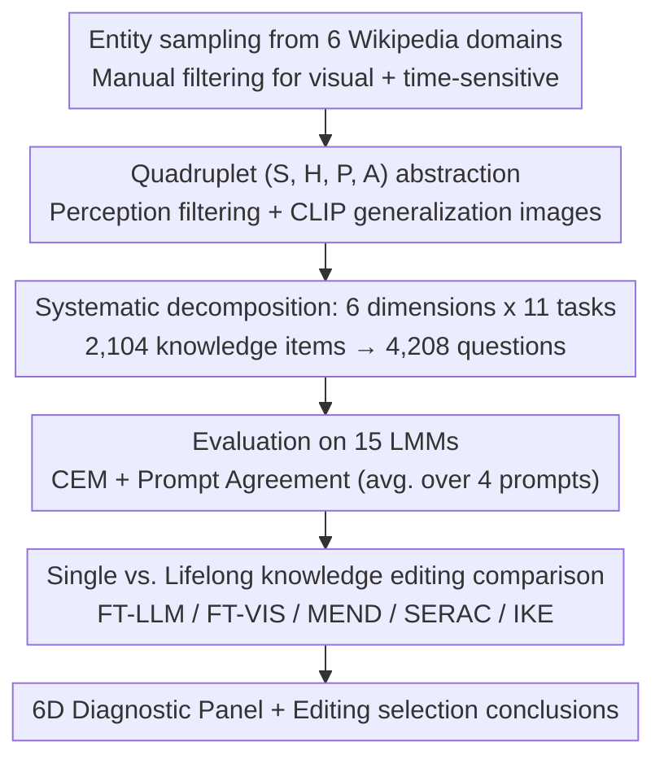

# MINED: Probing and Updating with Multimodal Time-Sensitive Knowledge for Large Multimodal Models

**Conference**: ACL 2026  
**arXiv**: [2510.19457](https://arxiv.org/abs/2510.19457)  
**Code**: TBD (Not provided in the paper)  
**Area**: Multimodal LMM / Knowledge Probing / Knowledge Editing / Time-Sensitive Knowledge  
**Keywords**: time-sensitive knowledge, temporal awareness, benchmark, knowledge editing, LMM probing

## TL;DR
The authors propose MINED—the first **multimodal time-sensitive knowledge** evaluation benchmark, comprising 2,104 (subject, hypernym, property, attribute-list) quadruplets across 6 dimensions (Cognition / Awareness / Trustworthiness / Understanding / Reasoning / Robustness) with 11 subtasks and 4,208 questions. Evaluation of 15 LMMs shows that Gemini-2.5-Pro achieves the highest average CEM of 63.07 but still misses ~15% of knowledge. Furthermore, while knowledge editing methods such as FT-LLM / IKE can effectively update outdated knowledge in LLaVA-v1.5 and Qwen-VL under single editing, performance degrades significantly under lifelong editing (FT-LLM drops by 43.2% on average).

## Background & Motivation

**Background**: LMMs (e.g., LLaVA-v1.5, Qwen2.5-VL, Gemini-2.5-Pro) encode vast amounts of factual knowledge through large-scale pre-training. However, parameters are static—once Messi transfers to Inter Miami CF, the model's answer to "Which team does Messi play for now?" becomes outdated. While text-side benchmarks like TimeQA / TempReason / EvolveBench evaluate temporal reasoning, they primarily test temporal expressions or logical relations rather than whether the model's internal time-sensitive facts are up-to-date. In the multimodal domain, only LiveVQA / MMKU-Bench address real-time visual knowledge updates, lacking a systematic temporal awareness evaluation.

**Limitations of Prior Work**: (i) Existing multimodal benchmarks cover only a single dimension (cognition or reasoning) rather than a joint six-dimensional evaluation; (ii) No benchmark explicitly tests common but overlooked real-world deployment issues, such as "how the model performs when the query time and external context time are mismatched (temporal misalignment)," "how to reject unanswerable dates outside the time window," or "how to understand implicit temporal concepts" (e.g., "During Bezos's tenure as Amazon CEO"); (iii) Lack of corresponding evaluation protocols—fine-grained metrics like CEM and Prompt Agreement have not been standardized for multimodal time-sensitive scenarios.

**Key Challenge**: There is an inevitable gap between the static parametric knowledge of LMMs and dynamic reality. Current evaluations merely indicate *that* a model failed without explaining *why* (e.g., cognition failure, lack of implicit time understanding, or being misled by misaligned context), leaving subsequent improvements without clear direction.

**Goal**: (a) Construct a multimodal time-sensitive knowledge benchmark across 6 domains (country / sport / company / university / organization / competition), 11 subtasks, and 6 dimensions; (b) Evaluate 15 SOTA LMMs to identify common weaknesses; (c) Verify if existing knowledge editing methods can effectively update time-sensitive knowledge in multimodal scenarios.

**Key Insight**: The authors abstract each piece of time-sensitive knowledge into a quadruplet $(S, H, P, A)$, where $S$ is the subject (e.g., Lionel Messi), $H$ is the hypernym (e.g., footballer), $P$ is the property (e.g., plays for), and $A = [a_1, \ldots, a_n]$ is an attribute timeline (e.g., ["FC Barcelona | 2003-2021", "PSG | 2021-2023", "Inter Miami | 2023-now"]). These quadruplets are then transformed using templates into 11 subtasks (time-agnostic / interval-aware / timestamp-aware / unanswerable date / implicit concept / ranking / calculation / adversarial error, etc.).

**Core Idea**: Decompose "time-sensitive knowledge capability" into six dimensions: cognition (recall) $\rightarrow$ awareness (context conflict detection) $\rightarrow$ trustworthiness (reject invalid time) $\rightarrow$ understanding (implicit time) $\rightarrow$ reasoning (rank/calc) $\rightarrow$ robustness (self-correct), forming a systematic "diagnostic panel."

## Method

### Overall Architecture
MINED transforms the gap between "static parametric knowledge of LMMs vs. dynamic reality" into a diagnosable and updatable evaluation system through a three-stage workflow. First, benchmark construction: Candidates are sampled from Wikipedia across six domains using GPT-4o and human experts. Annotators filter for visual and time-sensitive entities to form $(S, H, P, A)$ quadruplets with original images. Entities unrecognizable by more than 10 out of 15 LMMs are filtered out via perception templates to ensure visual accessibility. CLIP is used to crawl generalization images from Google, selecting the top-1 by similarity. Second, 4,208 questions are generated from 2,104 unique knowledge items (using 11 subtask templates) and evaluated on 15 LMMs using CEM and Prompt Agreement. Finally, knowledge editing: LLaVA-v1.5 (7B) and Qwen-VL (7B) serve as "outdated models" to compare five methods (FT-LLM, FT-VIS, MEND, SERAC, IKE) under single and lifelong editing settings.

### Key Designs

**1. (S, H, P, A) Quadruplet Abstraction + Prompt Agreement Evaluation Protocol**

The foundation of the pipeline is abstracting knowledge into quadruplets $(S, H, P, A)$—subject, hypernym, property, and attribute timeline—instead of natural language QA pairs. This allows a single knowledge point to be batch-processed into different subtask templates: for (Lionel Messi, footballer, plays for, [...]), a T.A. template generates "Which club does the footballer in the image currently play for?", while R.K. generates "...can you identify which one was former?". This abstraction makes the benchmark "evolvable"—the attribute list $A$ can be refreshed quarterly from Wikipedia. For evaluation, Cover Exact Match $\text{CEM} = \mathbb{1}(\hat y \subseteq Y)$ is used instead of strict EM to accommodate free-form answers. Prompt Agreement calculates the average score across four semantically equivalent prompts (Question / Generalization Question / Image / Generalization Image) to reduce noise from prompt phrasing.

**2. Systematic Evaluation via 6 Dimensions x 11 Tasks**

Using the quadruplets, "time-sensitive knowledge understanding" is split into six diagnostic dimensions. While previous benchmarks reported only overall accuracy, this approach identifies specific failure modes. Cognition uses T.A/T.I.A/T.S.A formats to measure recall. Awareness uses F.M.C/P.M.C to test if misaligned context (e.g., past context for a current query) misleads the model. Trustworthiness uses P.U.D/F.U.D to test if the model rejects queries for dates outside the attribute's validity window. Understanding uses I.T.C for implicit time parsing. Reasoning covers chronological ranking (R.K) and date calculation (C.A). Robustness uses A.T.E to test self-correction after being told an answer is wrong. 

The diagnostic value is significant—for example, it reveals that "small models are extremely fragile to past misaligned context" (Qwen2-VL 7B CEM drops 56.43% in P.M.C), a phenomenon hidden by single overall metrics.

**3. Multi-modal Knowledge Editing: Single vs. Lifelong Settings**

This step investigates whether existing methods can truly update outdated knowledge. Data is selected from samples where LLaVA-v1.5 and Qwen-VL failed. **Single editing** restores weights after each edit to measure pure update effectiveness. **Lifelong editing** evaluates the model after a batch of sequential edits to measure cumulative interference. The comparison covers parameter-modifying methods (FT-LLM, FT-VIS, MEND) and parameter-preserving methods (SERAC, IKE). Results provide a clear roadmap: FT-LLM is nearly perfect for single edits (97.2%) but collapses under lifelong edits (54.0%), while memory-based SERAC is more stable for large-scale updates.

### Loss & Training
This is a benchmark and evaluation paper; no new model was trained. The knowledge editing section follows the original losses of each method: FT-LLM uses standard CE fine-tuning, MEND uses hypernetwork loss, and SERAC uses retrieval + counterfactual model loss. The primary metric is $C_d = \frac{1}{N}\sum_i^N \text{CEM}_i$, where $\text{CEM} = \mathbb{1}(\hat y \subseteq Y)$.

## Key Experimental Results

### Main Results
CEM (%) of 15 LMMs across 11 MINED subtasks (selection of 5 representative models):

| Model | T.S.A (Cog) | F.M.C (Awa) | P.M.C (Awa) | P.U.D (Tru) | F.U.D (Tru) | I.T.C (Und) | R.K (Rea) | C.A (Rea) | A.T.E (Rob) | **Avg** |
|------|-------------|--------------|--------------|--------------|--------------|--------------|------------|------------|---------------|---------|
| LLaVA-v1.5 (7B) | 16.88 | 7.66 | 6.40 | 53.99 | 50.00 | 1.57 | 15.12 | 6.17 | 0.39 | 15.85 |
| Qwen2.5-VL (7B) | 41.67 | 40.04 | 33.98 | 99.64 | 99.76 | 4.02 | 38.89 | 25.00 | 16.86 | 39.55 |
| InternVL2.5 (8B) | 44.83 | 42.37 | 38.26 | 98.31 | 99.88 | 4.22 | 61.73 | 19.14 | 0.00 | 40.70 |
| GPT-4.1 | 80.91 | 78.07 | 77.49 | 65.22 | 91.30 | 8.63 | 15.74 | 59.57 | 17.58 | 51.82 |
| **Gemini-2.5-Pro** | **84.96** | **83.09** | **84.30** | 80.31 | 97.10 | **18.73** | 38.48 | **76.54** | **39.58** | **63.07** |

→ Closed-source models lead significantly; I.T.C (implicit temporal concept) results in near-total failure for all models (max 18.73%); A.T.E (self-correction) is also a widespread weakness (mostly < 20%).

### Ablation Study
Single vs. Lifelong knowledge editing (LLaVA-v1.5 7B, average CEM % across 9 tasks, Δ = change from single to lifelong):

| Method | Single avg | Lifelong avg | Δ | Evaluation |
|------|------------|---------------|----|------|
| **FT-LLM** | **97.2** | 54.0 | **−43.2** | Strongest in single but collapses in lifelong |
| FT-VIS | 86.6 | 34.8 | −51.8 | Visual-side editing is less stable |
| MEND | 62.7 | (N/A) | — | Weak even in single editing |
| **SERAC** | 61.6 | **51.2** | **−10.4** | Mediocre in single but stable in lifelong; A.T.E actually +12.6 |
| IKE | 76.0 | (N/A) | — | In-context method is acceptable in single editing |

→ In lifelong editing, SERAC is 4× more robust than parameter-modification methods due to its memory-based architecture and explicit caching.

### Key Findings
- **Obs 1: Timestamp-Aware > Interval-Aware > Time-Agnostic**: LMMs perform best with specific point-in-time queries, suggesting internal knowledge is indexed by time points; however, Gemini-2.5-Pro still misses 15% of knowledge in T.S.A.
- **Obs 2: Small models are extremely fragile to past misaligned context**: Qwen2-VL (7B) drops 56.43% in P.M.C, whereas closed-source and larger models are significantly more robust (GPT-4.1 drops only 4.6%).
- **Obs 3: Rejecting future dates is more accurate than past dates**: Future dates are "unseen concepts" providing higher refusal confidence; Qwen2-VL series achieves ~99% refusal, likely due to defensive mechanisms in instruction tuning.
- **Obs 5: Scaling up doesn't necessarily improve ranking**: Qwen2.5-VL ranking accuracy decreases monotonically from 3B (50.3) $\rightarrow$ 7B (38.9) $\rightarrow$ 72B (11.4), possibly due to over-thinking.
- **Obs 7: Newer models show stronger temporal awareness**: Release time and average CEM are positively correlated, likely due to updated training data cutoffs.
- **Exploration 3: Open-source models generate high "Irrelevant" responses**: In Time-Agnostic tasks, LLaVA-v1.5 (7B) has 57.65% irrelevant responses. While closed-source models reduce this to 14–18%, "Outdated" answers still account for 53–64%, revealing that **most models generate outdated rather than latest answers.**

## Highlights & Insights
- **Diagnostic panel for localized failure modes**: Decomposing capabilities into six dimensions targets real-world deployment pain points (e.g., Awareness targets context conflict in RAG; Trustworthiness targets the need for refusal in customer service).
- **Quadruplet + Quarterly Update = Evolvable Benchmark**: The (S, H, P, A) abstraction and update pipeline allow MINED to stay current, treating a benchmark as "data infrastructure."
- **I.T.C failure as a wake-up call**: The low performance (max 18.73%) in implicit temporal concepts suggests LMMs struggle to ground temporal phrases to intervals before retrieving knowledge, marking an open problem for the field.
- **Actionable Tooling Insights**: The contrast between Single and Lifelong editing provides clear engineering guidance: use FT-LLM for small batches and memory-based SERAC for lifelong updates.

## Limitations & Future Work
- Coverage is limited to 6 domains; specialized fields like law or medicine are excluded, and visual data is limited to static images without video.
- The "evolvable" quarterly update pipeline remains a proposal without multiple cycle comparison data.
- Knowledge editing experiments were conducted on older models (LLaVA-v1.5, Qwen-VL); conclusions may not generalize to newer architectures.
- The I.T.C task sample size is small due to the requirement for temporal uniqueness (e.g., Messi was *only* at Barcelona during Bezos's early CEO years).
- CEM (subset matching) might not suit free-text or multilingual responses as well as fuzzy/semantic matching.

## Related Work & Insights
- **vs. EvolveBench (Zhu et al. 2025)**: While EvolveBench tests cognition and consciousness in text, this work extends to six multimodal dimensions and adds I.T.C and adversarial robustness.
- **vs. LiveVQA / MMKU-Bench**: LiveVQA focuses on real-time acquisition but ignores misalignment; this work explicitly tests robustness against temporal misinformation.
- **vs. TimeQA / TempReason**: These test expression reasoning (which event was earlier), whereas this work tests whether the *stored factual knowledge* at specific times is up-to-date.
- **vs. VLKEB / MIKE**: These measure general multimodal editing, while this work focuses on time-sensitive updates and quantifies the degradation in lifelong editing scenarios.

## Rating
- Novelty: ⭐⭐⭐⭐ First multimodal time-sensitive benchmark with 6D decomposition, though individual task designs draw inspiration from text-based benchmarks.
- Experimental Thoroughness: ⭐⭐⭐⭐⭐ 15 LMMs x 11 subtasks + Prompt Agreement + multiple editing methods and settings.
- Writing Quality: ⭐⭐⭐⭐ Clear logical grouping; however, tables are quite dense (Table 3 has 11 columns).
- Value: ⭐⭐⭐⭐⭐ Long-term value due to the evolvable schema; identifying I.T.C as a major bottleneck is highly valuable for future research.

<!-- RELATED:START -->

## Related Papers

- [\[ACL 2026\] Knowledge Vector of Logical Reasoning in Large Language Models](knowledge_vector_of_logical_reasoning_in_large_language_models.md)
- [\[CVPR 2026\] Towards Faithful Multimodal Concept Bottleneck Models](../../CVPR2026/interpretability/towards_faithful_multimodal_concept_bottleneck_models.md)
- [\[ACL 2026\] Experiments or Outcomes? Probing Scientific Feasibility in Large Language Models](experiments_or_outcomes_probing_scientific_feasibility_in_large_language_models.md)
- [\[ACL 2026\] Tracing Relational Knowledge Recall in Large Language Models](tracing_relational_knowledge_recall_in_large_language_models.md)
- [\[ACL 2026\] FineSteer: A Unified Framework for Fine-Grained Inference-Time Steering in Large Language Models](finesteer_a_unified_framework_for_fine-grained_inference-time_steering_in_large_.md)

<!-- RELATED:END -->
