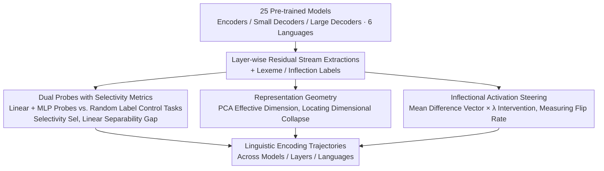

# Model Internal Sleuthing: Finding Lexical Identity and Inflectional Features in Modern Language Models

**Conference**: ACL 2026  
**arXiv**: [2506.02132](https://arxiv.org/abs/2506.02132)  
**Code**: [https://github.com/ml5885/model_internal_sleuthing](https://github.com/ml5885/model_internal_sleuthing)  
**Area**: Model Compression / NLP Understanding  
**Keywords**: Linguistic Probing, Lexical Identity, Inflectional Features, Representation Geometry, Cross-lingual Analysis

## TL;DR
This paper systematically probes 25 Transformer language models (from BERT Base to Qwen2.5-7B), finding that lexical identity (lexeme) is linearly decodable in early layers but decays with depth, while inflectional features remain stably readable across all layers and occupy a compact, controllable subspace.

## Background & Motivation

**Background**: Probing is a core method for understanding internal linguistic representations in Transformers. Early work on BERT and GPT-2 established a hierarchical understanding where "different layers encode different linguistic levels"—bottom layers encode surface features, middle layers encode syntax, and top layers encode semantics.

**Limitations of Prior Work**: Previous probing studies focused almost exclusively on the first generation of models (BERT, GPT-2). However, modern LLMs have undergone massive changes in architecture (encoder vs. decoder), training data scale (billions vs. trillions of tokens), and post-training adaptation. Whether early conclusions still hold lacks verification.

**Key Challenge**: Current understanding of how modern LLMs encode basic linguistic information (lexical identity vs. grammatical inflection) is still built on outdated experiments with small models, resulting in a significant knowledge gap.

**Goal**: (1) Systematically probe the encoding patterns of lexical identity and inflectional features across 25 modern models; (2) Analyze multiple dimensions including representation geometry, attention vs. residual streams, activation steering, and pre-training dynamics.

**Key Insight**: Choosing lexical identity (lexeme, e.g., walk/walked sharing a stem) and inflectional features (e.g., plural, past tense) as targets—the former associated with semantics and the latter with syntax—allows for decoupling how models weight "meaning" versus "form."

**Core Idea**: Use linear/non-linear probes combined with selectivity metrics, representation geometry analysis, and activation steering experiments to comprehensively characterize the encoding trajectories of lexical and inflectional information in modern LLMs.

## Method

### Overall Architecture

The paper does not train new models but treats 25 off-the-shelf pre-trained models (covering encoders, small decoders, and large decoders across six languages) as subjects for dissection. The process involves extracting residual stream activations for each word layer-by-layer as input. Probes are then trained to decode two types of labels: lexical identity (lexeme) and inflectional features. The results are analyzed using selectivity, representation geometry, and activation steering to determine if the information is truly encoded, what subspace it occupies, and whether it can be causally manipulated. The final output is a mapping of linguistic information encoding trajectories across models, layers, and languages.

### Key Designs

**1. Dual Probes with Selectivity Metrics: Decoupling "Memory" from "Encoding"**

A common issue in probing is that high accuracy can be misleading—a probe with sufficient capacity can achieve high scores by memorizing training samples even if the representation contains no true linguistic structure. This study trains both a linear regression probe and a two-layer MLP probe for every layer, pairing each with a control task using random labels. True linguistic signals are defined by a selectivity metric $\text{Sel}_\ell = \text{Acc}^\text{real}_\ell - \text{Acc}^\text{control}_\ell$. Information is considered truly encoded only when real-label accuracy significantly exceeds the random-label control.

Furthermore, a linear separability gap $\text{Gap}_\ell = \text{Sel}^\text{nonlin}_\ell - \text{Sel}^\text{linear}_\ell$ is introduced. A positive gap would indicate the non-linear probe captures real structures the linear probe cannot. However, the study observes a globally negative Gap, proving that the MLP’s extra capacity is primarily used to capture spurious correlations rather than deeper linguistic information.

**2. Representation Geometry: Characterizing Mid-layer Compression and Collapse**

To understand the space where information "resides," the paper calculates the linear effective dimension of activations—how many PCA principal components are needed to explain a fixed percentage of variance. This metric directly correlates with probe performance and steering effectiveness. GPT-2, Qwen2.5, and Pythia show sharp dimensional collapse in middle layers, with absolute activation values surging to approximately 8000, whereas Llama and OLMo exhibit smooth compression. Layers with dimensional collapse coincide with a significant drop in steering effectiveness, indicating that drastic changes in geometry simultaneously alter the representation's responsiveness to intervention.

**3. Inflectional Activation Steering: Moving from Correlation to Causality**

Probes only prove that information "exists," not that it is "functional." The study computes mean difference vectors for pairs of inflectional categories (e.g., singular vs. plural) and adds them to hidden states with varying intensity $\lambda$. The category flip rate is then measured using the linear probe. Results show that even a moderate intensity of $\lambda=5$ causes significant probability shifts, demonstrating that inflectional features are not just encoded but occupy a compact, controllable low-dimensional subspace. This chain—from probing for existence to steering for control—upgrades the conclusions from correlation to causality.

### Loss & Training

Linear probes utilize a closed-form solution for ridge regression. MLP probes consist of a two-layer ReLU network with a 64-dimensional hidden layer trained using standard cross-entropy. Control tasks use the exact same probe configurations as real tasks, only replacing the labels to ensure comparability in selectivity.

## Key Experimental Results

### Main Results

| Attribute | Model Type | Early Layer Acc | Deep Layer Acc | Selectivity Trend |
| :--- | :--- | :--- | :--- | :--- |
| Lexeme | Encoder | 0.8-1.0 | Sharp decrease | Near zero |
| Lexeme | Small Decoder | 0.8-1.0 | Gradual decrease | Near zero |
| Lexeme | Large Decoder | 0.8-1.0 | Remains high | Near zero |
| Inflection | All | 0.9-1.0 | 0.9-1.0 | 0.4-0.6 (Postive) |

### Ablation Study

| Analysis Dimension | Key Finding | Description |
| :--- | :--- | :--- |
| Linear vs. Non-linear | Gap < 0 (Global) | MLP capacity captures spurious correlations rather than true structure. |
| Residual vs. Attention | Residual flow significantly outperforms attention | Mid-layer Lexeme: Residual 0.6-0.9 vs. Attention 0.2-0.4. |
| Cross-lingual | Turkish decays fastest | Lexeme accuracy drops from 0.95 to 0.25 due to morphological complexity. |
| Pre-training Dynamics | Inflection stabilizes early; Lexeme evolves | Inflection converges in few checkpoints; Lexemes continue reshaping. |

### Key Findings
- High early accuracy for lexeme information is accompanied by near-zero selectivity, implying it is driven by surface correlations (e.g., subword overlap) rather than true lexical structure.
- Inflectional information maintains positive selectivity (0.4-0.6) throughout the model depth, indicating it is a "truly encoded" linguistic property.
- Frequency is strongly correlated with probe accuracy—rare lexemes and rare inflectional forms are the primary sources of error.
- DeBERTa-v3 shows a sudden drop in steering effectiveness at approximately 75% depth, suggesting unique architectural constraints on representation.

## Highlights & Insights
- The **systematic application of selectivity metrics** is the primary methodological highlight: by reporting control comparisons alongside accuracy, the "memorization artifact" long present in probing research is effectively addressed. This paradigm is transferable to any probing experiment.
- The validation path from "correlation" to "causality" via activation steering is comprehensive: first proving existence with probes, then proving controllability with steering, and finally tracking formation with pre-training dynamics.
- The scale of 25 models across 6 languages is unprecedented, lending strong generalizability to the conclusions.

## Limitations & Future Work
- Decoder models use the last subword token as the word representation, which may not be optimal for all architectures.
- Probes detect correlation rather than causal mechanisms; steering experiments measure classifier changes rather than downstream generation effects.
- Ambiguous homographs (e.g., English verbs where the infinitive and non-past forms are identical) are not handled.
- Future work could extend to larger models (70B+) and more linguistic features (syntactic dependency, semantic roles, etc.).

## Related Work & Insights
- **vs. Jawahar et al. (2019) / Tenney et al. (2019)**: They established the hierarchical encoding paradigm in BERT; Ours systematically validates and updates these conclusions for 25 modern models.
- **vs. Acs et al. (2024)**: They conducted multilingual morphosyntactic probing restricted to mBERT and XLM-RoBERTa; Ours extends this to modern decoder models and adds representation geometry analysis.

## Rating
- Novelty: ⭐⭐⭐⭐ (Refined methodology on an unprecedented scale)
- Experimental Thoroughness: ⭐⭐⭐⭐⭐ (Extremely comprehensive analysis)
- Writing Quality: ⭐⭐⭐⭐⭐ (Clear structure and rich visualization)

<!-- RELATED:START -->

## Related Papers

- [\[ICLR 2026\] Internal Planning in Language Models: Characterizing Horizon and Branch Awareness](../../ICLR2026/interpretability/internal_planning_in_language_models_characterizing_horizon_and_branch_awareness.md)
- [\[AAAI 2026\] Finding the Translation Switch: Discovering and Exploiting the Task-Initiation Features in LLMs](../../AAAI2026/interpretability/finding_the_translation_switch_discovering_and_exploiting_the_task-initiation_fe.md)
- [\[ICLR 2026\] Universal Properties of Activation Sparsity in Modern Large Language Models](../../ICLR2026/interpretability/universal_properties_of_activation_sparsity_in_modern_large_language_models.md)
- [\[CVPR 2026\] Language Models Can Explain Visual Features via Steering](../../CVPR2026/interpretability/language_models_can_explain_visual_features_via_steering.md)
- [\[ACL 2026\] Dual Alignment Between Language Model Layers and Human Sentence Processing](dual_alignment_between_language_model_layers_and_human_sentence_processing.md)

<!-- RELATED:END -->
