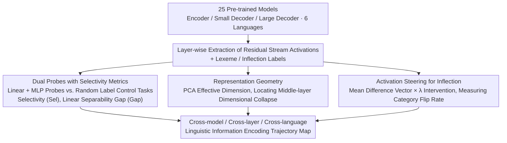

# Model Internal Sleuthing: Finding Lexical Identity and Inflectional Features in Modern Language Models

**Conference**: ACL 2026  
**arXiv**: [2506.02132](https://arxiv.org/abs/2506.02132)  
**Code**: [https://github.com/ml5885/model_internal_sleuthing](https://github.com/ml5885/model_internal_sleuthing)  
**Area**: Model Compression / NLP Understanding  
**Keywords**: Linguistic Probing, Lexical Identity, Inflectional Features, Representation Geometry, Cross-lingual Analysis

## TL;DR
This paper systematically probes 25 Transformer language models (ranging from BERT Base to Qwen2.5-7B) and discovers that lexical identity (lexeme) is linearly decodable in early layers but decays with depth, whereas inflectional features remains stable and readable across all layers, occupying a compact and controllable subspace.

## Background & Motivation

**Background**: Probing research is a core method for understanding the internal linguistic representations of Transformers. Early work on BERT and GPT-2 established a hierarchical understanding where "different layers encode different linguistic levels"—lower layers encode surface features, middle layers encode syntax, and higher layers encode semantics.

**Limitations of Prior Work**: Previous probing studies focused almost exclusively on first-generation models (BERT, GPT-2). However, modern LLMs have undergone significant changes in architecture (Encoder/Decoder), training data scale (billions vs. trillions of tokens), and post-training adaptation, leaving the validity of early conclusions unverified.

**Key Challenge**: Current understanding of how modern large language models encode basic linguistic information (lexical identity vs. grammatical inflection) is still built on outdated small-model experiments, representing a serious knowledge gap.

**Goal**: (1) Systematically probe the encoding patterns of lexical identity and inflectional features across 25 modern models; (2) Analyze multiple dimensions including representation geometry, attention vs. residual flow, activation steering, and pre-training dynamics.

**Key Insight**: The authors select two attributes: lexical identity (lexeme, e.g., "walk/walked" sharing a lemma) and inflectional features (e.g., plural, past tense). The former relates to semantics while the latter relates to grammar, used to decouple how models balance "meaning" and "form."

**Core Idea**: Utilize linear/non-linear probes combined with selectivity metrics, representation geometry analysis, and activation steering experiments to comprehensively characterize the encoding trajectories of lexical and inflectional information in modern LLMs.

## Method

### Overall Architecture

This work does not train new models but treats 25 off-the-shelf pre-trained models (covering encoders, small decoders, and large decoders across six languages) as subjects for dissection. The process involves extracting residual stream activations for each word layer-by-layer as input. Probes are trained to read back two types of labels: lexical identity (lexeme) and inflectional features. Three sets of tools—selectivity, representation geometry, and activation steering—are then used to translate "probe accuracy" into conclusions regarding whether information is truly encoded, what subspace it occupies, and whether it can be causally manipulated. The final output is a linguistic information encoding trajectory map across models, layers, and languages.

### Key Designs

**1. Dual Probes with Selectivity Metrics: Separating "Memorization" from "Encoding"**

A common pitfall in probing research is that high accuracy can be deceptive—a probe with sufficient capacity can achieve high scores by memorizing training samples even if the representation lacks true linguistic structure. This paper trains both a linear regression probe and a two-layer MLP probe for each layer, paired with a control task using random labels. True linguistic signals are defined by a selectivity metric $\text{Sel}_\ell = \text{Acc}^\text{real}_\ell - \text{Acc}^\text{control}_\ell$. Only when the real label accuracy is significantly higher than that of the random labels does it indicate that the layer truly encodes the information.

Furthermore, a linear separability gap $\text{Gap}_\ell = \text{Sel}^\text{nonlin}_\ell - \text{Sel}^\text{linear}_\ell$ is introduced to compare the selectivity difference between MLP and linear probes. If the gap is positive, it suggests the non-linear probe extracts real structures that the linear probe cannot; however, the authors observe that Gap is almost globally negative, proving that the extra capacity of the MLP is primarily used to capture spurious correlations rather than deeper linguistic information.

**2. Representation Geometry: Characterizing Middle-Layer Compression and Collapse via Effective Dimension**

To understand the space where information "resides," the authors calculate the linear effective dimension of activations at each layer, defining how many PCA principal components are needed to explain a fixed percentage of variance. This metric correlates directly with probe performance and steering effects: models like GPT-2, Qwen2.5, and Pythia exhibit sharp dimensional collapse in middle layers (with absolute activation values soaring to ~8000), while Llama and OLMo show smooth compression. Layers with dimensional collapse coincide with layers where steering effects significantly decline, suggesting that drastic geometric changes simultaneously alter the representation's responsiveness to interventions.

**3. Activation Steering for Inflection: Moving from Correlation to Causality**

Probes can only prove information "exists," not that it is "controllable." The authors calculate mean difference vectors for pairs of inflectional categories (e.g., singular vs. plural) and superimpose them onto hidden states with varying intensities $\lambda$, then measure the category flip rate via linear probes. Results show that even moderate intensity $\lambda=5$ causes significant probability shifts, indicating that inflectional features are not only encoded but also occupy a compact, controllable low-dimensional subspace. This chain from "probing for existence" to "steering for control" upgrades the conclusions from correlation to causality, providing practical implications for representation engineering.

### Loss & Training

Linear probes use closed-form solutions for ridge regression. MLP probes are two-layer ReLU networks with a 64-dimensional hidden layer, trained using standard cross-entropy. Control tasks share the same probe configurations as real tasks, with only the labels replaced, ensuring comparability of selectivity.

## Key Experimental Results

### Main Results

| Attribute | Model Type | Early Layer Acc | Deep Layer Acc | Selectivity Trend |
|------|---------|------------|----------|----------|
| Lexeme | Encoder | 0.8-1.0 | Sharp Decrease | Near Zero |
| Lexeme | Small Decoder | 0.8-1.0 | Gradual Decrease | Near Zero |
| Lexeme | Large Decoder | 0.8-1.0 | Remains High | Near Zero |
| Inflection | All | 0.9-1.0 | 0.9-1.0 | 0.4-0.6 (Positive) |

### Ablation Study

| Analysis Dimension | Key Finding | Description |
|---------|---------|------|
| Linear vs. Non-linear | Gap < 0 (Global) | MLP capacity captures spurious correlations rather than true linguistic structure |
| Residual vs. Attention | Residual >> Attention | Middle layer lexeme: Residual 0.6-0.9 vs. Attention 0.2-0.4 |
| Cross-lingual | Fastest decay in Turkish | Lexeme accuracy drops from 0.95 to 0.25 due to morphological complexity |
| Pre-training Dynamics | Inflection stabilizes early; Lexeme evolves | Inflection converges in a few checkpoints; Lexeme reshapes late in training |

### Key Findings
- High early accuracy for lexemes accompanied by near-zero selectivity implies that it is primarily driven by surface correlations (e.g., subword overlap) rather than true lexical structure.
- Inflectional information maintains positive selectivity (0.4-0.6) across the entire model depth, indicating it is a "truly encoded" linguistic attribute.
- Frequency strongly correlates with probe accuracy; rare lexemes and rare inflectional forms are the primary sources of error.
- DeBERTa-v3 exhibits a sudden drop in steering effectiveness at approximately 75% depth, suggesting unique structural representation constraints.

## Highlights & Insights
- The **systematic application of selectivity metrics** is the primary methodological highlight: by reporting both accuracy and control baselines, the study effectively addresses the long-standing "memorization" issue in probing research. This paradigm is directly transferable to any probing experiment.
- The validation logic from "correlation" to "causality" via activation steering is very robust: first using probes to detect information existence, then using steering to prove controllability, and finally using pre-training dynamics to track when the information forms.
- The scale of covering 25 models across 6 languages is unprecedented, granting the conclusions strong universality.

## Limitations & Future Work
- Decoder models use the last subword token as the word representation, which may not be optimal for all architectures.
- Probing only detects correlation, not causal mechanisms; steering experiments only measure classifier shifts rather than downstream generation effects.
- Ambiguous cases like syncretism (e.g., English infinitives and non-past verb forms appearing identical) are not explicitly handled.
- Future work could extend to even larger models (70B+) and more linguistic features (syntactic dependencies, semantic roles, etc.).

## Related Work & Insights
- **vs. Jawahar et al. (2019) / Tenney et al. (2019)**: While they established the hierarchy of linguistic encoding in BERT, this paper systematically verifies and updates these conclusions for 25 modern models.
- **vs. Acs et al. (2024)**: While they conducted multilingual morphosyntactic probing, they were limited to mBERT and XLM-RoBERTa; this work expands to modern decoder models and incorporates representation geometry analysis.

## Rating
- Novelty: ⭐⭐⭐⭐ Not a completely new paradigm, but unprecedented in scale and depth.
- Experimental Thoroughness: ⭐⭐⭐⭐⭐ Extremely comprehensive across 25 models, 6 languages, and multiple dimensions.
- Writing Quality: ⭐⭐⭐⭐⭐ Clear structure, fluent narrative, and rich visualizations.

<!-- RELATED:START -->

## Related Papers

- [\[AAAI 2026\] Finding the Translation Switch: Discovering and Exploiting the Task-Initiation Features in LLMs](../../AAAI2026/interpretability/finding_the_translation_switch_discovering_and_exploiting_the_task-initiation_fe.md)
- [\[ICLR 2026\] Internal Planning in Language Models: Characterizing Horizon and Branch Awareness](../../ICLR2026/interpretability/internal_planning_in_language_models_characterizing_horizon_and_branch_awareness.md)
- [\[ICLR 2026\] Universal Properties of Activation Sparsity in Modern Large Language Models](../../ICLR2026/interpretability/universal_properties_of_activation_sparsity_in_modern_large_language_models.md)
- [\[CVPR 2026\] Language Models Can Explain Visual Features via Steering](../../CVPR2026/interpretability/language_models_can_explain_visual_features_via_steering.md)
- [\[ACL 2026\] Dual Alignment Between Language Model Layers and Human Sentence Processing](dual_alignment_between_language_model_layers_and_human_sentence_processing.md)

<!-- RELATED:END -->
