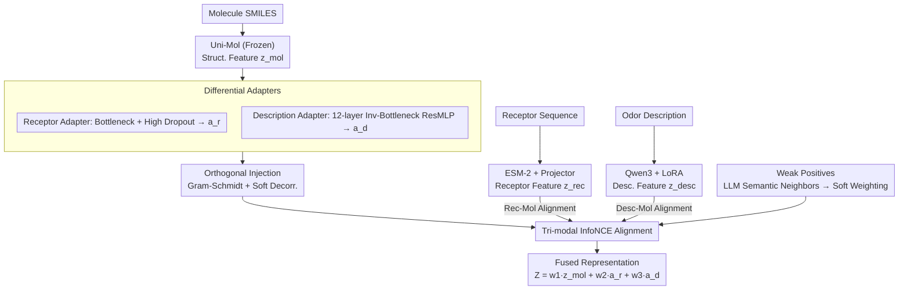

# NOSE: Neural Olfactory-Semantic Embedding with Tri-Modal Orthogonal Contrastive Learning

**Conference**: ACL 2026  
**arXiv**: [2604.10452](https://arxiv.org/abs/2604.10452)  
**Code**: [GitHub](https://github.com/Xianyusyy/NOSE)  
**Area**: Interpretability  
**Keywords**: Olfactory representation learning, Tri-modal alignment, Orthogonal decoupling, Contrastive learning, Weak positive samples

## TL;DR
The authors propose NOSE, a tri-modal olfactory representation learning framework. By using molecules as a hub, the framework aligns molecular structure, receptor sequences, and natural language descriptions through an orthogonal injection mechanism. Coupled with an LLM-driven weak positive sample strategy to alleviate description sparsity, it achieves SOTA performance across 11 downstream tasks and demonstrates excellent zero-shot generalization capabilities.

## Background & Motivation

**Background**: Olfaction is the most challenging sense to digitize. While vision relies on pixels and audition on spectra, olfaction lacks a stable mapping from physical quantities to perception. The olfactory perception chain consists of: Molecular structure → Receptor binding → Neural signals → Language description.

**Limitations of Prior Work**: (1) Existing methods only model fragments of the olfactory pathway (e.g., only molecular structure, or only molecule-description/receptor pairs), failing to capture the complete chain in a unified framework. (2) Prevailing methods treat odor prediction as a classification problem (e.g., "floral" vs. "fruity"), which breaks the continuity of the odor space—"minty" and "cool" are highly correlated but treated as independent labels in classification. (3) Classification objectives force models to fit label boundaries, discarding structural information that is important for molecules but irrelevant for specific categories.

**Key Challenge**: Complete tri-modal data (molecule-receptor-description triplets) is extremely scarce, whereas bi-modal data (molecule-receptor and molecule-description) can be obtained separately. How can tri-modal alignment be achieved without triplet annotations?

**Goal**: Construct a continuous representation space covering the entire olfactory perception pathway, ensuring molecular representations encode both receptor and semantic information without mutual interference.

**Key Insight**: Molecules serve as the unique intersection of the two bi-modal datasets and can act as a hub to bridge receptor and semantic information. The critical issue is preventing signals from overwriting each other during injection; the proposed solution is orthogonal injection.

**Core Idea**: Receptor and semantic features are superimposed onto molecular representations as orthogonal increments. Independence between modalities is guaranteed through Gram-Schmidt orthogonalization, while LLMs are used to mine semantic neighbors among odor descriptors to expand sparse labels.

## Method

### Overall Architecture

NOSE aims to compress the complete olfactory pathway into a continuous representation space without "molecule-receptor-description" triplet labels. Using the molecule as a hub: Uni-Mol (frozen) extracts 3D molecular structure features $z_{mol}$; ESM-2 with a trainable projection layer extracts receptor sequence features $z_{rec}$; and Qwen3 Embedding fine-tuned via LoRA extracts odor description features $z_{desc}$. Molecular embeddings are decomposed by dual adapters into a receptor-aligned component $a_r$ and a description-aligned component $a_d$. Both are orthogonalized and aligned to their respective modalities using sets of InfoNCE losses. Thus, the molecule serves as a pivot for indirect bridging. At inference time, only the molecular encoder and adapters are required to output tri-modal fused representations.

### Key Designs

**1. Differential Adapters: Absorbing a 20x Scale Gap via Architectural Variance**

Molecular representations $z_{mol}$ must align with both receptor and description modalities, but the dataset scales vary drastically—receptor data contains only 3,877 pairs, while description data reaches 88,512 pairs. A unified architecture would inevitably overfit one side and underfit the other. NOSE designs adapters with different capacities: the description adapter uses a 12-layer inverse-bottleneck ResMLP to handle rich text, while the receptor adapter uses a bottleneck structure with high dropout to provide strong regularization against sparse data. The architectural difference specifically matches the data volume.

**2. Orthogonal Injection: Ensuring Independent Subspaces for Receptor and Semantic Signals**

Simply superimposing components $a_r$ and $a_d$ onto the molecular representation leads to redundancy and signal overwriting. NOSE employs two orthogonal constraints. Hard orthogonalization achieves geometric decoupling by projecting adapter outputs onto the orthogonal complement of $z_{mol}$ via Gram-Schmidt: $z_{adapter} = a_{adapter} - \frac{a_{adapter} \cdot z_{mol}}{\|z_{mol}\|^2 + \epsilon} z_{mol}$, ensuring increments are perpendicular to the backbone. Soft orthogonalization performs optimization-level decorrelation using a regularization term $\mathcal{L}_{orth} = \sum_{(i,j)} \|\frac{z_i}{\|z_i\|} \cdot \frac{z_j}{\|z_j\|}\|^2$ to keep the three subspaces decorrelated. Together, they allow each modality to contribute unique information without interference.

**3. LLM-Driven Weak Positives: Softening Discrete Labels into Continuous Semantic Manifolds**

Alignment components rely on contrastive loss, but odor descriptions are naturally sparse. Traditional contrastive learning treats "lemon" and "sour" as negative samples that repel each other, even though they are adjacent in olfactory space. NOSE uses DeepSeek to mine semantic neighbors among 1,086 odor descriptors, expanding isolated labels into continuous neighborhoods. In description-molecule contrastive learning, positive samples are weighted 1.0, weak positives 0.5, and negatives 0.0, resulting in a softened InfoNCE loss that reshapes the label space into a semantic manifold.

### Loss & Training

The total loss consists of receptor-molecule InfoNCE, description-molecule soft-weighted InfoNCE, intra-modal InfoNCE, and orthogonal constraint losses. During training, the molecular encoder (Uni-Mol) is frozen, only the ESM-2 projection layer is trained, and Qwen3 Embedding is fine-tuned via LoRA. The final representation is a weighted fusion: $Z = w_1 \cdot z_{mol} + w_2 \cdot a_r + w_3 \cdot a_d$.

## Key Experimental Results

### Main Results (Basic Perceptual Attribute Prediction, Pearson Correlation)

| Method | Threshold (Abraham) | Pleasantness (Keller) | Pleasantness (Sagar) | Intensity (Keller) | Intensity (Sagar) | Intensity (Ravia) |
|------|-------------|---------------|---------------|-------------|-------------|-------------|
| Uni-Mol | 0.78 | 0.68 | 0.14 | 0.27 | 0.37 | 0.31 |
| ChemBERTa | 0.81 | 0.65 | 0.15 | 0.39 | 0.45 | 0.47 |
| **NOSE** | **0.84** | **0.71** | **0.40** | **0.42** | **0.47** | **0.49** |

### Ablation Study

| Configuration | Key Metric | Description |
|------|---------|------|
| NOSE (Full) | SOTA | Tri-modal + Orthogonal + Weak Positives |
| w/o Receptor | Significant drop | Bi-modal only, lacks biological grounding |
| w/o Orthogonality | Drop | Redundant modal features |
| w/o Weak Positives | Drop | False negatives cause representation collapse |

### Key Findings
- NOSE consistently reaches or exceeds SOTA across 11 downstream tasks, with the largest gains in sparse datasets (e.g., Sagar Pearson jumped from 0.14 to 0.40).
- Superior zero-shot generalization confirms high alignment between the representation space and human olfactory intuition.
- Performance on mixture tasks suggests the learned representations capture non-linear interactions between molecules.

## Highlights & Insights
- Implementing tri-modal alignment without triplet annotations by using molecules as a hub is the core innovation.
- The orthogonal injection philosophy is highly transferable: in any multi-modal fusion where sources provide complementary information, orthogonal constraints prevent information overwriting.
- The weak positive strategy "softens" discrete label spaces into continuous manifolds, serving as a general technique for handling label sparsity in contrastive learning.

## Limitations & Future Work
- Receptor data is still limited (3,877 pairs); performance may improve as more receptor-ligand data accumulates.
- The model currently focuses on single-molecule odor prediction; combinatorial effects in real-world mixtures are more complex.
- Subjectivity in olfactory descriptions remains an inherent challenge, with significant variations across cultural backgrounds.

## Related Work & Insights
- **vs POM**: POM only models molecule-description bi-modality and lacks biological grounding from receptors; NOSE outperforms POM consistently in perceptual attribute tasks.
- **vs Uni-Mol**: While Uni-Mol is a strong molecular encoder, NOSE enhances it by injecting receptor and semantic information.
- **vs Classification Methods**: Traditional classification cannot capture the continuity of odor space; NOSE's representation learning paradigm fundamentally addresses this issue.

## Rating
- Novelty: ⭐⭐⭐⭐⭐ First tri-modal framework covering the full olfactory pathway; novel orthogonal injection.
- Experimental Thoroughness: ⭐⭐⭐⭐⭐ 11 downstream tasks across 6 datasets with extensive ablation and zero-shot tests.
- Writing Quality: ⭐⭐⭐⭐⭐ Clear derivation of motivation, high-quality figures, and accessible background introduction.
- Value: ⭐⭐⭐⭐ Olfactory computing is a rising cross-disciplinary field; the framework design is transferable to other multi-modal scenarios.

<!-- RELATED:START -->

## Related Papers

- [\[AAAI 2026\] Explainable Melanoma Diagnosis with Contrastive Learning and LLM-based Report Generation](../../AAAI2026/interpretability/explainable_melanoma_diagnosis_with_contrastive_learning_and_llm-based_report_ge.md)
- [\[CVPR 2026\] PRISM: Prototype-based Reasoning with Inter-modal Semantic Mining for Interpretable Image Recognition](../../CVPR2026/interpretability/prism_prototype-based_reasoning_with_inter-modal_semantic_mining_for_interpretab.md)
- [\[ICLR 2026\] Dissecting Representation Misalignment in Contrastive Learning via Influence Function](../../ICLR2026/interpretability/dissecting_representation_misalignment_in_contrastive_learning_via_influence_fun.md)
- [\[ICLR 2026\] Sparse CLIP: Co-optimizing Interpretability and Performance in Contrastive Learning](../../ICLR2026/interpretability/sparse_clip_co-optimizing_interpretability_and_performance_in_contrastive_learni.md)
- [\[ICML 2026\] Formal Concept Lattices are Good Semantic Scaffolds for Concept-Based Learning](../../ICML2026/interpretability/formal_concept_lattices_are_good_semantic_scaffolds_for_concept-based_learning.md)

<!-- RELATED:END -->
