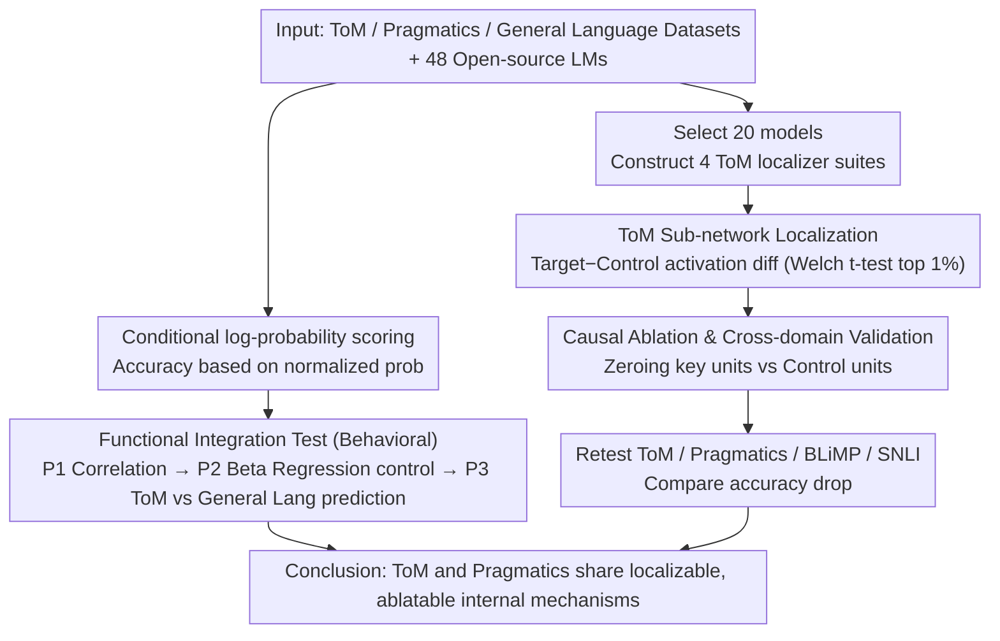

# On Emergent Social World Models -- Evidence for Functional Integration of Theory of Mind and Pragmatic Reasoning in Language Models

**Conference**: ACL2026  
**arXiv**: [2602.10298](https://arxiv.org/abs/2602.10298)  
**Code**: https://github.com/polina-tsvilodub/lm-emergent-social-world-models  
**Area**: Interpretability / Social Cognition Evaluation  
**Keywords**: Theory of Mind, Pragmatic Reasoning, Functional Localization, Causal Ablation, Social World Models

## TL;DR
This paper provides evidence through large-scale behavioral evaluation and cognitive neuroscience-inspired functional localization/ablation experiments that Theory of Mind (ToM) and pragmatic reasoning in language models likely share internal computational mechanisms. It advances the concept of "Social World Models" from mere capability scores to a testable functional integration hypothesis.

## Background & Motivation
**Background**: Discussions on whether Large Language Models (LLMs) possess "world models" have historically focused on environments with clear boundaries, such as board games, navigation, or text-based games. Functional capabilities in natural language understanding are more complex, as models must not only process syntax and lexical semantics but also infer speakers' intentions, knowledge, beliefs, and social commitments. Theory of Mind and pragmatic reasoning sit precisely at this intersection: the former concerns representing others' mental states, while the latter concerns understanding the true intent of utterances in specific communicative contexts.

**Limitations of Prior Work**: Existing work often measures ToM and pragmatic abilities separately, reporting only whether a model succeeds on a specific benchmark. Such behavioral scores struggle to demonstrate whether the model employs the same internal mechanism. Correlation in performance between two tasks might simply result from larger model size, stronger instruction tuning, or more world knowledge; high scores on a single task might also stem from data contamination, heuristic matching, or answer format preferences.

**Key Challenge**: If ToM and pragmatic reasoning are isolated skills, models could learn two distinct specialized mechanisms. However, if social meaning in language requires repeated invocation of representations regarding others' beliefs, intentions, and knowledge, then compression and reuse pressures might drive the model to form a "social world model" invokable across tasks. The core question is not whether a model can solve a specific problem, but whether these abilities are functionally integrated internally.

**Goal**: The authors break this large question into two testable levels: First, whether behavioral performance on ToM and pragmatic tasks is systematically correlated across different models beyond what general language ability can explain. Second, whether sub-networks supporting ToM can be localized within the model and if ablating these sub-networks also impairs pragmatic reasoning.

**Key Insight**: Borrowing the "functional localizer" approach from human cognitive neuroscience, the paper identifies units related to ToM by the activation difference between target and control conditions. The advantage of this perspective is that it asks not just "does the model answer correctly," but also "which internal units are selectively invoked under what conditions, and do these units have a causal role in downstream tasks?"

**Core Idea**: Use a triple-fold body of evidence—behavioral correlation, functional localization, and causal ablation—to test whether ToM and pragmatic reasoning share reusable internal mechanisms, rather than relying on superficial scores from single benchmarks.

## Method
The methodology of this paper proceeds along two parallel lines: cross-model statistical analysis at the behavioral level and functional localization and ablation at the mechanistic level. The former answers whether two abilities "rise and fall together," while the latter answers whether the same set of internal units actually supports both.

### Overall Architecture
The input consists of multiple sets of ToM, pragmatics, and general language ability datasets in multiple-choice format, along with a suite of open/open-weight language models. The authors first score each model on each dataset using conditional log-probabilities: calculating normalized conditional log-probabilities for all candidate answers to a question, selecting the option with the highest probability as the model's prediction, and then calculating accuracy.

Behavioral experiments cover 48 models from seven families (Llama, Qwen, Falcon, Mistral, OLMo, Pythia, Gemma), ranging from 0.5B to 72B parameters, distinguishing between base and fine-tuned models. The task side includes 16 pragmatic datasets, 22 ToM datasets, and two general language ability control datasets (BLiMP and SNLI).

Mechanistic experiments select 20 models, primarily from the Qwen-2.5, Llama, Falcon-3, and Gemma-2 series. The authors construct four ToM localizer suites: LatentBeliefs, CommunicativeIntent, GameBeliefs, and MoralIntent. Each localizer contains "target" conditions requiring mental state reasoning and "control" conditions that match surface forms as closely as possible but do not require ToM. When the model processes these stimuli, the authors record unit activations in the transformer blocks before the final token to be predicted, locate functional sub-networks using target-control activation differences, and verify their causal role through zeroing ablation.

### Key Designs

**1. Behavioral Functional Integration Test: Separating "Scaling Effects" from "Capability Coupling"**

Simply observing a correlation between ToM and pragmatics accuracy might lead to the misinterpretation that "large models are good at everything." The authors block this loophole with three progressive predictions: P1 requires ToM accuracy and pragmatics accuracy to be positively correlated across 48 models; P2 requires that in a Bayesian beta regression—after controlling for model family, size, training type, and dataset type—the "domain" label (ToM vs. Pragmatics) itself no longer significantly predicts accuracy; P3 requires that ToM accuracy predicts pragmatics accuracy better than general language ability (BLiMP/SNLI) does. P2 absorbs obvious confounders like model scale and fine-tuning, while P3 proves a specific link beyond general linguistic competence.

**2. ToM Sub-network Localization via Cognitive Neuroscience Localizers: Mapping Brain Localization to Transformers**

To discuss "shared mechanisms," one must first identify ToM-related units. Borrowing the functional localizer concept from human fMRI, the authors compare activations of each unit $(l,i)$ between a set of target stimuli (requiring mental state reasoning) and control stimuli (surface-matched but no ToM required), calculating statistical significance via Welch's $t$-test. Two types of localizers are used: a "simple localizer" that merges all target/control conditions, and a "conjunctive localizer" that takes the minimum statistic across all target-control pairs—similar to "minimum statistic" in neuroscience—to find units consistently active across conditions. Significant units exceeding 1% of total units are truncated to the top 1%. To avoid narrowing ToM to a single template, the authors use the ATOMS framework (covering beliefs, intentions, desires, emotions, knowledge, percepts, and non-literal communication) and synthesize 1,400 stimuli derived from validated human fMRI materials to create the localizer suites.

**3. Causal Ablation and Cross-domain Validation: Turning "Shared Mechanisms" into Falsifiable Predictions**

Localization only indicates correlational activation. To confirm these units support ToM and pragmatics, ablation is necessary. For each model and localizer, the authors perform two control ablations: one zeroing out key units selected by the ToM target, and another zeroing out an equal number of the least active control units. They then re-evaluate ToM, pragmatics, BLiMP, and SNLI, comparing the accuracy drop relative to the full model. This design translates the abstract "functional integration" hypothesis into observable causal predictions: if integration holds, ToM sub-network ablation should impair both ToM and pragmatic tasks significantly more than control ablation, without equally destroying general language ability.

### Loss & Training
No new models were trained; the core involves evaluation, localization, and ablation. Predictions were made via conditional log-probability scoring of candidate answers, with average normalization for token length. Statistical analysis utilized Bayesian beta regression and leave-one-out cross-validation. In the mechanistic analysis, units were filtered by target-control differences and zeroed out during the ablation phase.

## Key Experimental Results

### Main Results
Behavioral experiments support a close relationship between ToM and pragmatic reasoning, which is not merely a byproduct of "scaling." Crucially, ToM accuracy explains pragmatic accuracy better than general language ability, making the argument more robust than a simple correlation analysis.

| Question | Setting | Key Result | Explanation |
|------|------|----------|----------|
| Correlation between ToM and Pragmatics | Avg ToM accuracy vs. pragmatics accuracy across 48 models | $r=0.68$, $p=1.24 \times 10^{-7}$ | Significant positive correlation, supporting P1 |
| Domain effect after controlling for model factors | Bayesian beta regression controlling size, family, etc. | Domain coeff $\beta=-0.03[-0.74,0.67]$ | Domain label provides no extra explanation, supporting P2 |
| ToM vs. General Lang as predictors | Comparing M1 (ToM) vs. M0 (BLiMP/SNLI) | M1 significantly outperforms M0, $ELPD=-16.1$, $p=0$ | ToM is a stronger predictor of pragmatics, supporting P3 |
| Which ToM aspects are more explanatory | Regression comparison across 128 ATOMS-based models | Best model includes intentions, desires, emotions, percepts, non-literal comm | ToM is not homogeneous; dimensions like "percepts" are especially critical |

Functional localization experiments show that units are not randomly distributed, and distributions vary by localizer. CommunicativeIntent units are more concentrated in final layers, while LatentBeliefs units are in mid-to-late layers. 10-fold cross-validation shows that "All," MoralIntent, and GameBeliefs localize most robustly; simple Broad localizers are stable, while conjunctive suites are relatively weaker.

### Ablation Study
Ablation results provide the most significant mechanistic evidence: ToM sub-network ablation impairs both ToM and pragmatics while showing no credible drop in general language benchmarks. This supports the "shared social reasoning mechanism" rather than a "general language processing disruption" explanation.

| Prediction | Test Content | Global Analysis Result | Supported? |
|------|----------|--------------|----------|
| P1.1 | ToM ablation reduces ToM performance | $\beta=0.25[0.14,0.35]$ | Yes |
| P1.2 | ToM ablation hurts ToM more than control ablation | $\beta=0.06[0.02,0.11]$ | Yes |
| P2.1 | ToM ablation reduces Pragmatics performance | $\beta=0.30[0.20,0.39]$ | Yes |
| P2.2 | ToM ablation hurts Pragmatics more than control ablation | $\beta=0.07[0.02,0.12]$ | Yes |
| P3.1 | ToM ablation does not credibly reduce general lang ability | $\beta=0.13[-0.10,0.35]$ | Yes (no credible drop) |
| P3.2 | Effect on Pragmatics is stronger than on general lang | $\beta=0.17[-0.07,0.41]$ | Inconclusive |

Granular analysis shows that not all localizers contribute equally. P1.1, P2.1, and P3.1 generally hold across most localizers, but P1.2 and P2.2 are primarily driven by LatentBeliefs (simple/conjunctive) and GameBeliefs. This suggests that sub-networks related to beliefs, percepts, desires, and emotions are the most stable supports for both ToM and pragmatics.

| Subject | Observed Phenomenon | Implication |
|----------|--------------|------|
| LatentBeliefs / GameBeliefs | Significant drop in both ToM and Pragmatics after ablation | Units related to beliefs/percepts are likely primary sources of the shared mechanism |
| CommunicativeIntent | Clear layer distribution but inconsistent causal results | The "non-literal communication" localizer might not capture the most critical pragmatic support |
| Entity tracking | Some key ablations affect entity tracking similarly to ToM/Pragmatics | The shared mechanism might involve entity state tracking rather than just "pure" social mentalizing |
| Model size comparison | No credible difference in ablation effects between model sizes | Functional integration is not just a feature of model scaling, though further verification is needed |

### Key Findings
- Behaviorally, ToM and pragmatic accuracy are significantly correlated, and ToM serves as a better predictor for pragmatic performance than general linguistic benchmarks (BLiMP/SNLI).
- Mechanistically, sub-networks identified by ToM localizers have a causal impact on both ToM and pragmatic tasks, with LatentBeliefs and GameBeliefs being the most stable.
- The ATOMS framework highlights that percepts, intentions, desires, emotions, and non-literal communication explain variance in ToM benchmarks, suggesting ToM should not be treated as a single monolithic score.
- The paper acknowledges complexities: the CommunicativeIntent localizer's causal results are less intuitive, and entity tracking might be a common underlying factor for these social tasks.

## Highlights & Insights
- The biggest highlight is transforming the question "Do LLMs have social world models?" into an operational "functional integration" problem. Instead of claiming models "understand minds," it asks if ToM and pragmatics share localizable mechanisms, a more restrained and testable claim.
- The localizer design is highly inspired: instead of just using traditional false-belief tasks, it uses multiple suites (MoralIntent, GameBeliefs, etc.) and conjunctive analysis to find stable units. This method can be ported to other studies like moral reasoning or multi-agent planning.
- Behavioral statistics and mechanistic ablation complement each other. Correlation suggests abilities "move together," while ablation shows that damaging specific units hurts both, moving closer to a "reused units" conclusion than benchmark papers typically do.

## Limitations & Future Work
- Conclusions depend on whether benchmarks truly measure ToM and pragmatics. If benchmarks contain heuristic shortcuts, the localized units might represent "test-taking tricks" rather than mental state representations.
- Ablation is a relatively coarse method. Zeroing out units shows causal necessity but doesn't explain the specific information flow or distinguish between encoding beliefs vs. encoding task difficulty. Future work could use activation patching or circuit discovery.
- Synthetic localizers, while inspired by human neuroscience, are not validated via human fMRI. They are proxies and do not imply that LLM organization is identical to that of the human brain.
- Evaluation is limited to English. Real-world communication involves cultural norms and multi-turn dynamics; future work should expand to multilingual and interactive scenarios.
- Potential data contamination for older benchmarks remains an open issue, though synthetic localizers help mitigate this for mechanistic tests.

## Related Work & Insights
- **vs. AlKhamissi et al. 2025a**: This work introduced functional localization to LLMs for language networks; **Ours** extends this to ToM with larger datasets and a refined taxonomy (ATOMS), providing stronger causal evidence.
- **vs. Hu et al. / Sap et al.**: These focused on performance on social benchmarks; **Ours** asks whether the underlying mechanisms are shared.
- **vs. Human Neuroscience (Saxe & Kanwisher)**: Human studies find overlap between ToM networks and non-literal language understanding; **Ours** migrates this hypothesis to LMs while remaining cautious about direct brain-model analogies.
- **vs. Mechanistic Interpretability**: Often focused on specific circuits or belief representations; **Ours** works at a coarser "functional sub-network" level, suggesting a path for high-level capability interpretability.

## Rating
- Novelty: ⭐⭐⭐⭐☆ Effectively links ToM, pragmatics, and neuroscience-inspired localization in LLMs.
- Experimental Thoroughness: ⭐⭐⭐⭐☆ Coverage of 48 models is impressive, though the reliance on synthetic localizers is a minor trade-off.
- Writing Quality: ⭐⭐⭐⭐☆ Highly structured and transparent about statistical testing.
- Value: ⭐⭐⭐⭐☆ Provides a rigorous framework for investigating high-level functional integration in LLMs.

<!-- RELATED:START -->

## Related Papers

- [\[NeurIPS 2025\] LLM World Models Are Mental: Output Layer Evidence of Brittle World Model Use in LLM Mechanical Reasoning](../../NeurIPS2025/interpretability/llm_world_models_are_mental_output_layer_evidence_of_brittle_world_model_use_in_.md)
- [\[ACL 2026\] Knowledge Vector of Logical Reasoning in Large Language Models](knowledge_vector_of_logical_reasoning_in_large_language_models.md)
- [\[ACL 2026\] METER: Evaluating Multi-Level Contextual Causal Reasoning in Large Language Models](meter_evaluating_multi-level_contextual_causal_reasoning_in_large_language_model.md)
- [\[ACL 2026\] Preference Heads in Large Language Models: A Mechanistic Framework for Interpretable Personalization](preference_heads_in_large_language_models_a_mechanistic_framework_for_interpreta.md)
- [\[ACL 2026\] Sparse Feature Coactivation Reveals Causal Semantic Modules in Large Language Models](sparse_feature_coactivation_reveals_causal_semantic_modules_in_large_language_mo.md)

<!-- RELATED:END -->
## Related Papers

- [\[NeurIPS 2025\] LLM World Models Are Mental: Output Layer Evidence of Brittle World Model Use in LLM Mechanical Reasoning](../../NeurIPS2025/interpretability/llm_world_models_are_mental_output_layer_evidence_of_brittle_world_model_use_in_.md)
- [\[ACL 2026\] Knowledge Vector of Logical Reasoning in Large Language Models](knowledge_vector_of_logical_reasoning_in_large_language_models.md)
- [\[ACL 2026\] METER: Evaluating Multi-Level Contextual Causal Reasoning in Large Language Models](meter_evaluating_multi-level_contextual_causal_reasoning_in_large_language_model.md)
- [\[ACL 2026\] Preference Heads in Large Language Models: A Mechanistic Framework for Interpretable Personalization](preference_heads_in_large_language_models_a_mechanistic_framework_for_interpreta.md)
- [\[ACL 2026\] Sparse Feature Coactivation Reveals Causal Semantic Modules in Large Language Models](sparse_feature_coactivation_reveals_causal_semantic_modules_in_large_language_mo.md)

<!-- RELATED:END -->
