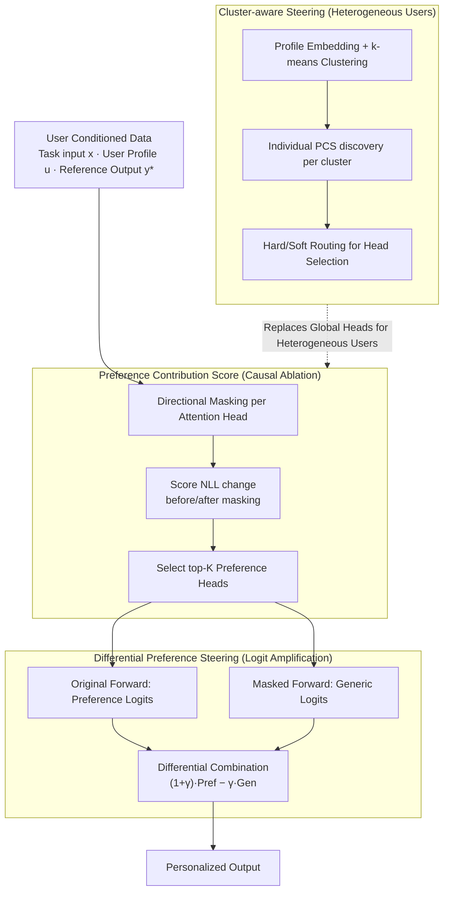

# Preference Heads in Large Language Models: A Mechanistic Framework for Interpretable Personalization

**Conference**: ACL2026  
**arXiv**: [2604.22345](https://arxiv.org/abs/2604.22345)  
**Code**: https://github.com/weixuzhang/DPS  
**Area**: Interpretability / Personalized Generation / LLM  
**Keywords**: Mechanistic Interpretability, Attention Heads, Personalized Generation, Contrastive Decoding, User Preference

## TL;DR
This paper proposes Preference Heads and Differential Preference Steering (DPS), using causal ablation to identify a small set of attention heads that carry user preferences. It then amplifies preference signals from these heads during decoding to improve personalized generation and prediction without modifying model parameters.

## Background & Motivation
**Background**: LLMs have demonstrated strong implicit personalization capabilities. Given user history, profiles, or brief preference descriptions, models often align with users in tone, topic selection, headline style, and recommendation rationales. Existing personalized LLM methods primarily follow three routes: prompting/RAG with user info, fine-tuning/preference learning on user data, or altering output distributions via contrastive methods during decoding.

**Limitations of Prior Work**: Most methods treat the model as a black box. While they align outputs with users, they struggle to answer mechanistic questions: where are user preferences represented inside the model? Is every layer contributing uniformly, or do a few modules play key roles? Relying solely on final text metrics makes interpretability analysis difficult and fails to diagnose whether personalization failures stem from inaccurate profiles, poor retrieval, or inactivated internal preference pathways.

**Key Challenge**: Personalization requires enhancing user-related signals, but LLM logits simultaneously mix general linguistic ability, task constraints, and user preference signals. Pure prompting or fine-tuning changes overall behavior without distinguishing "which internal components transmit preferences." If preference signals are sparse and localized, global interventions are neither transparent nor noise-free.

**Goal**: The authors aim to decompose personalization from a black-box behavior into a locatable mechanistic problem: first, identify attention heads with a causal contribution to user-aligned outputs, and then utilize these heads for controllable preference enhancement during inference, maintaining content relevance and fluency.

**Key Insight**: The paper draws inspiration from mechanistic interpretability analyses of induction heads, retrieval heads, and factuality heads. Since specific transformer behaviors can be explained by specialized attention heads, user style and topic preferences may also reside in "Preference Heads." The key is verifying causal contribution through ablation: whether the likelihood of user reference output drops after removing a head.

**Core Idea**: Identify Preference Heads using causal head ablation, then use the differential signal between "original model logits" and "generic logits (masking preference heads)" to reinforce user preference directions during decoding.

## Method
The research pipeline consists of three steps: first, defining and discovering Preference Heads; second, performing Differential Preference Steering using these heads; third, extending to heterogeneous preferences using user clustering and weighted routing.

### Overall Architecture
The input consists of user-conditioned data, where each sample contains a task input $x$, a user profile or history $u$, and a reference output $y^*$. The authors traverse attention heads offline, performing directional masking on each head to measure the change in Negative Log-Likelihood (NLL) of the reference output. Higher scores indicate greater importance to user alignment. A small set of top-scoring heads is selected as Preference Heads.

During inference, DPS performs two forward passes on the same context: one with the original model to obtain preference-conditioned logits, and one with Preference Heads masked to obtain generic logits. The difference between the two is amplified to produce final decoding logits. The intuition is that the difference primarily captures the personalized signal contributed by the preference heads.

For diverse user groups, user profiles are encoded into embeddings and clustered. Preference Heads are rediscovered within each cluster. During inference, heads are selected via hard or soft routing based on the user's similarity to each cluster.

### Key Designs
**1. Preference Contribution Score: Causal Ablation for Individual Attention Heads**

Unlike interpretability analyses limited to activation visualization, PCS uses intervention. By masking head $h_{l,k}$ (layer $l$, head $k$), it compares the masked model $M_{\theta \setminus h_{l,k}}$ with the original model $M_\theta$ regarding the average NLL of user reference outputs: $PCS(h_{l,k}) = E[L(M_{\theta \setminus h_{l,k}}, x, u, y^*) - L(M_\theta, x, u, y^*)]$. A high positive PCS indicates that removing the head significantly lowers preference alignment, proving causal contribution.

**2. Differential Preference Steering: Enhancing Signals without Parameter Tuning**

DPS combines the original logits $l_t^{pref}$ and generic logits $l_t^{gen}$ (from the masked model) as $\tilde{l}_t = (1 + \gamma) l_t^{pref} - \gamma l_t^{gen}$. When $\gamma = 0$, it is the original model. As $\gamma$ increases, it emphasizes the preference direction contributed by the specific heads. This acts as an internal pathway enhancer rather than an external steering target.

**3. Cluster-aware Preference Steering: Addressing Diluted Signals via User Groups**

Jaccard overlap analysis shows that top-K Preference Heads for different users have low overlap. Merging all users' heads into a global set dilutes signals. DPS clusters users via profile embeddings. Each cluster receives its own head set. Inference uses hard routing (nearest cluster) or soft routing (weighted similarity), balancing personalization with statistical stability.

### Loss & Training
DPS requires no parameter training. The offline phase calculates NLL changes for top-K head selection. Inference involves one additional forward pass with masked Preference Heads. Routing strategies for different tasks were analyzed: hard routing for classification and soft routing for generation.

## Key Experimental Results

### Main Results
Evaluation was performed on the LaMP benchmark using LLaMA-3-8B-Instruct, Qwen2-7B-Instruct, and Mistral-7B-Instruct across news/academic headline generation, tweet paraphrasing, citation identification, movie tagging, and product rating.

| Model | Method | News R-1 / R-L / METEOR | Academic R-1 / R-L / METEOR | Tweet R-1 / R-L / METEOR |
|------|------|------------------------------|-------------------------------|-------------------------------|
| LLaMA-3-8B | CAD | 0.1681 / 0.1498 / 0.1568 | 0.3530 / 0.3068 / 0.3925 | 0.3368 / 0.2893 / 0.2813 |
| LLaMA-3-8B | DeCoRe | 0.1768 / 0.1572 / 0.1626 | 0.4010 / 0.3527 / 0.4004 | 0.3231 / 0.2764 / 0.2729 |
| LLaMA-3-8B | DoLa | 0.1694 / 0.1508 / 0.1592 | 0.3636 / 0.3117 / 0.4079 | 0.3365 / 0.2877 / 0.2795 |
| LLaMA-3-8B | DPS | 0.1787 / 0.1596 / 0.1650 | 0.3243 / 0.2787 / 0.3826 | 0.3389 / 0.2898 / 0.2884 |
| Qwen2-7B | CAD | 0.1580 / 0.1392 / 0.1255 | 0.4197 / 0.3780 / 0.4381 | 0.3590 / 0.3106 / 0.3384 |
| Qwen2-7B | DeCoRe | 0.1581 / 0.1305 / 0.1232 | 0.4311 / 0.3729 / 0.4565 | 0.3470 / 0.3065 / 0.3173 |
| Qwen2-7B | DoLa | 0.1642 / 0.1473 / 0.1272 | 0.4277 / 0.3746 / 0.4596 | 0.3524 / 0.3046 / 0.3246 |
| Qwen2-7B | DPS | 0.1627 / 0.1450 / 0.1318 | 0.4071 / 0.3421 / 0.4230 | 0.3533 / 0.2981 / 0.3269 |
| Mistral-7B | CAD | 0.1361 / 0.1132 / 0.0980 | 0.4375 / 0.3712 / 0.4561 | 0.3342 / 0.2916 / 0.3097 |
| Mistral-7B | DeCoRe | 0.1299 / 0.1085 / 0.0908 | 0.4135 / 0.3648 / 0.4419 | 0.3407 / 0.2927 / 0.2978 |
| Mistral-7B | DoLa | 0.1362 / 0.1136 / 0.0962 | 0.4364 / 0.3733 / 0.4605 | 0.3291 / 0.2852 / 0.3026 |
| Mistral-7B | DPS | 0.1536 / 0.1366 / 0.1399 | 0.3983 / 0.3350 / 0.4162 | 0.3441 / 0.2998 / 0.2990 |

DPS is highly stable in news headline generation and tweet paraphrasing. While DeCoRe/DoLa perform better on academic titles for some models, DPS shows superior cross-task consistency for short-text style alignment.

| Model | Method | Citation Acc / F1 | Movie Tag Acc / F1 | Product MAE / RMSE |
|------|------|-------------------|-------------------|---------------------|
| LLaMA-3-8B | CAD | 0.6240 / 0.6070 | 0.4552 / 0.3839 | 0.4426 / 0.9300 |
| LLaMA-3-8B | DeCoRe | 0.6232 / 0.6200 | 0.4639 / 0.4034 | 0.4442 / 0.9458 |
| LLaMA-3-8B | DoLa | 0.6156 / 0.5961 | 0.2800 / 0.1643 | 0.4200 / 0.8718 |
| LLaMA-3-8B | DPS | 0.6356 / 0.6288 | 0.4610 / 0.3910 | 0.4236 / 0.9278 |
| Qwen2-7B | CAD | 0.6230 / 0.6250 | 0.1850 / 0.1181 | 0.3180 / 0.6240 |
| Qwen2-7B | DeCoRe | 0.5400 / 0.5891 | 0.2320 / 0.1217 | 0.3250 / 0.6325 |
| Qwen2-7B | DoLa | 0.6790 / 0.6795 | 0.2412 / 0.0958 | 0.3200 / 0.6300 |
| Qwen2-7B | DPS | 0.6932 / 0.7078 | 0.3902 / 0.3202 | 0.3276 / 0.6719 |

### Ablation Study

| Analysis | Result | Description |
|--------|------|------|
| Preference Head Sparsity | High PCS heads are localized in heatmaps. | Personalization is driven by sparse internal components rather than uniform contribution. |
| Cross-user Overlap | Jaccard overlap of top-K head sets is near 0. | Preference pathways vary significantly between users, supporting cluster-aware design. |
| Random Head Control | Replacing Preference Heads with random ones yields stable degradation. | DPS gains stem from semantically meaningful causal components. |
| K-value Sensitivity | Performance saturates as K increases; excessive heads add noise. | Signal is concentrated in a limited head set. |
| Routing Strategy | Hard routing benefits classification; soft routing is more stable for generation. | Discrete vs. smooth preference mixing trade-offs. |

Efficiency analysis shows that since prompt prefill is shared, relative overhead decreases as context length increases (e.g., 1.02x at 2048 tokens).

### Key Findings
- Preference Heads are sparse and user-dependent. PCS heatmaps show localized high-scoring heads rather than a uniform distribution across layers.
- Low overlap between users' preference heads explains why global personalization sets are unstable and why cluster-aware routing is necessary.
- DPS excels in personalized generation and classification (mapping history to style/topic), though its impact on numerical regression (ratings) is mixed.
- Automatic metrics are supplemented by human and LLM-as-judge evaluations, which show DPS is superior in style and alignment.

## Highlights & Insights
- The primary highlight is shifting personalization from "external conditional control" to "internal component localization."
- PCS provides a clean causal evaluation of contributions instead of relying on attention weight magnitudes.
- DPS bridges the gap between mechanistic analysis and decoding control by turning discovered heads into steering signals.
- Cluster-aware extensions address the non-global nature of user preferences, finding a middle ground between individualization and statistical robustness.

## Limitations & Future Work
- Requires access to internal heads and activations; not applicable to black-box APIs.
- Inference requires a second forward pass, posing potential latency issues in some scenarios.
- Offline PCS discovery may be costly to update frequently for expanding user bases.
- Bias concerns: amplifying existing user preferences might reinforce narrow patterns or biases found in user histories.

## Related Work & Insights
- **vs. Prompt/Retrieval**: While others provide more context, DPS identifies which internal components transmit the signal.
- **vs. Fine-tuning**: DPS avoids training costs and parameter updates, acting as an inference-time steering mechanism.
- **vs. CAD/DoLa/DeCoRe**: Unlike generic contrastive methods, DPS is mechanism-driven, contrasting against logic explicitly identified through causal personalization analysis.

## Rating
- Novelty: ⭐⭐⭐⭐☆ Introduces mechanistic interpretability to personalization with a clear logic chain from causal discovery to steering.
- Experimental Thoroughness: ⭐⭐⭐⭐☆ Extensive coverage across models and tasks; human and efficiency analyses are included.
- Writing Quality: ⭐⭐⭐⭐☆ Logic flow is smooth, though some task-specific wins in the tables require careful interpretation.
- Value: ⭐⭐⭐⭐☆ Inspires future work on "identify-then-steer" pathways for specialized model behaviors.

<!-- RELATED:START -->

## Related Papers

- [\[ACL 2026\] Embracing Anisotropy: Turning Massive Activations into Interpretable Control Knobs for Large Language Models](embracing_anisotropy_turning_massive_activations_into_interpretable_control_knob.md)
- [\[ACL 2026\] From Interpretability to Performance: Optimizing Retrieval Heads for Long-Context Language Models](from_interpretability_to_performance_optimizing_retrieval_heads_for_long-context.md)
- [\[ACL 2025\] Mechanistic Interpretability of Emotion Inference in Large Language Models](../../ACL2025/interpretability/mechanistic_interpretability_of_emotion_inference_in_large_language_models.md)
- [\[ACL 2026\] FineSteer: A Unified Framework for Fine-Grained Inference-Time Steering in Large Language Models](finesteer_a_unified_framework_for_fine-grained_inference-time_steering_in_large_.md)
- [\[ACL 2026\] Retrieval Heads are Dynamic](retrieval_heads_are_dynamic.md)

<!-- RELATED:END -->
