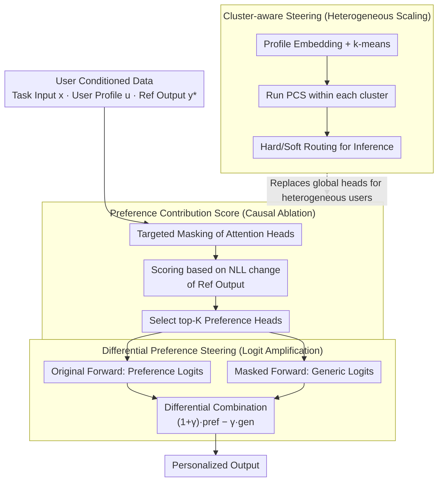

# Preference Heads in Large Language Models: A Mechanistic Framework for Interpretable Personalization

**Conference**: ACL2026  
**arXiv**: [2604.22345](https://arxiv.org/abs/2604.22345)  
**Code**: https://github.com/weixuzhang/DPS  
**Area**: Interpretability / Personalized Generation / LLM  
**Keywords**: Mechanistic Interpretability, Attention Heads, Personalized Generation, Contrastive Decoding, User Preference

## TL;DR
This paper proposes Preference Heads and Differential Preference Steering, utilizing causal ablation to identify a small number of attention heads that carry user preferences. It then amplifies preference signals from these heads during decoding to improve personalized generation and prediction without modifying model parameters.

## Background & Motivation
**Background**: LLMs have demonstrated strong implicit personalization capabilities. Given user history, profiles, or brief preference descriptions, models can often align with the user in terms of tone, topic selection, headline style, and recommendation reasoning. Existing personalized LLM methods primarily follow three paths: first, including user information in prompts or retrieval-augmented contexts; second, utilizing user data for fine-tuning or preference learning; third, employing contrastive methods at the decoding stage to alter output distributions.

**Limitations of Prior Work**: Most of these methods treat the model as a black box. While they make the output appear more user-aligned, they struggle to answer a mechanistic question: exactly where in the model are user preferences represented? Are all layers contributing uniformly, or do a few modules play a critical role at key moments? Relying solely on final text metrics makes interpretability analysis difficult and makes it hard to determine if personalization failure stems from inaccurate user profiles, poor retrieval, or the failure to activate internal preference pathways.

**Key Challenge**: Personalization requires enhancing user-related signals, but the logits of language models simultaneously mix general linguistic capabilities, task content constraints, and user preference signals. Pure prompting or fine-tuning can change overall behavior but fails to distinguish "which internal components transmit preferences." If preference signals are indeed sparse and localized, global interventions are both non-transparent and may introduce redundant noise.

**Goal**: The authors aim to decompose personalization from a black-box behavior into a localizable mechanistic problem: first, identify which attention heads make causal contributions to user-aligned output, and then utilize these heads for controllable preference enhancement during inference while maintaining content relevance and generation fluency.

**Key Insight**: The paper draws on analysis methods for induction heads, retrieval heads, and factuality heads from mechanistic interpretability. Since certain transformer behaviors can be explained by a few specialized attention heads, user style and thematic preferences may also have similar "preference heads." The key is not to look at correlation or activation intensity, but to verify through ablation: whether the likelihood of the model's user-referenced output decreases after a specific head is removed.

**Core Idea**: Discover Preference Heads using causal head ablation, and then reinforce user preference directions during decoding via a differential signal derived from "original model logits minus generic logits after masking preference heads."

## Method
The main workflow of this paper can be broken down into three steps: first, defining and discovering Preference Heads; second, utilizing these heads for Differential Preference Steering (DPS); third, addressing the issue of non-shared preferences among different users through user clustering and weighted routing for heterogeneous preference scaling.

### Overall Architecture
The input consists of a set of user-conditioned data, where each sample includes a task input $x$, a user profile or history $u$, and a reference output $y^*$. The authors first traverse the attention heads in the model offline, performing targeted masking on each head to measure if the negative log-likelihood (NLL) of the user reference output worsens after masking. A greater decrease indicates the head's importance to user-aligned output. A small number of heads with the highest scores are selected as Preference Heads.

During inference, DPS performs two forward passes on the same context: one with the original model to obtain preference-conditioned logits, and another with the preference heads masked to obtain generic logits representing more general behavior. The difference between the two is then amplified to obtain the final decoding logits. The intuition is that the difference between the original and masked models primarily represents the personalization signal contributed by the preference heads.

If user groups vary significantly, the paper first encodes user profiles into embeddings and clusters them. Preference Heads are rediscovered within each cluster. During inference, hard routing or soft routing is performed based on the similarity between the user and each cluster to avoid crudely merging all users' preference heads into a global set.

### Key Designs
**1. Preference Contribution Score: Assigning a personalization contribution score to each attention head using causal ablation**

Many interpretability analyses stop at activation visualization or correlation statistics, observing that a certain head "lights up" without being able to say whether it actually changes the output. PCS answers this directly via intervention: by performing targeted masking of the $k$-th head $h_{l,k}$ in the $l$-th layer and comparing the average negative log-likelihood of the user reference output between the masked model $M_{\theta \setminus h_{l,k}}$ and the original model $M_\theta$, the score is defined as $PCS(h_{l,k}) = E[L(M_{\theta \setminus h_{l,k}}, x, u, y^*) - L(M_\theta, x, u, y^*)]$. If the PCS is positive and large, it indicates that removing the head significantly reduces the probability of user-aligned output, proving that the head is not just "correlated" but has a causal contribution to personalized behavior. This causal evaluation, directly tied to personalized output likelihood, is far more reliable than merely looking at attention weights.

**2. Differential Preference Steering: Amplifying differential signals from preference heads during decoding without parameter modification**

Forcing specific output styles directly can often damage content consistency. DPS adopts a different approach. It calculates the original model logits $l_t^{pref}$ and the logits $l_t^{gen}$ after masking Preference Heads for the same context, combining them as $\tilde{l}_t = (1 + \gamma) l_t^{pref} - \gamma l_t^{gen}$. When $\gamma = 0$, it degrades to the original model; as $\gamma$ increases, the model emphasizes the preference direction that the original model has over the generic model. Since this difference is primarily the personalization signal contributed by preference heads, DPS acts more like enhancing existing internal preference pathways rather than imposing a new external control objective—it amplifies the personalized tendency that the model "already wants to express."

**3. Cluster-aware Preference Steering: Discovering preference heads per user group to avoid signal dilution in global sets**

Jaccard overlap analysis in the experiments shows that the top-K Preference Heads for different users have very low overlap. Crudely merging all users' preference heads into a global set would dilute the truly useful signals. Therefore, DPS first obtains profile embeddings from user history text and uses k-means to divide users into several preference clusters. The PCS discovery process is run separately within each cluster to obtain cluster-specific head sets. During inference, users can either be hard-assigned to the nearest cluster or soft-routed based on similarity. This achieves a compromise between individualization and statistical stability: shared heads for similar users preserve personalization while preventing sparse single-user samples from producing inaccurate preference head estimates.

### Loss & Training
DPS itself does not train model parameters and requires no additional fine-tuning. The offline phase only uses reference outputs to calculate NLL changes for each head to select the top-K heads. The inference phase requires an additional forward pass with Preference Heads masked to control generation intensity using differential logits. The paper also analyzes the $K$ value and routing strategies: smaller $K$ may miss preference signals, while larger $K$ gradually introduces noise; hard routing is better for classification tasks, while soft routing is more stable for generation tasks.

## Key Experimental Results

### Main Results
The paper evaluates LLaMA-3-8B-Instruct, Qwen2-7B-Instruct, and Mistral-7B-Instruct on the LaMP personalization benchmark, covering news headline generation, scholarly title generation, tweet paraphrasing, citation identification, movie tagging, and product rating. Generation tasks use ROUGE-1, ROUGE-L, and METEOR; classification tasks use Accuracy/F1; regression tasks use MAE/RMSE. Comparison methods include CAD, DeCoRe, and DoLa.

| Model | Method | News Headline R-1 / R-L / METEOR | Scholarly Title R-1 / R-L / METEOR | Tweet Paraphrasing R-1 / R-L / METEOR |
|------|------|------------------------------|-------------------------------|-------------------------------|
| LLaMA-3-8B | CAD | 0.1681 / 0.1498 / 0.1568 | 0.3530 / 0.3068 / 0.3925 | 0.3368 / 0.2893 / 0.2813 |
| LLaMA-3-8B | DeCoRe | 0.1768 / 0.1572 / 0.1626 | 0.4010 / 0.3527 / 0.4004 | 0.3231 / 0.2764 / 0.2729 |
| LLaMA-3-8B | DoLa | 0.1694 / 0.1508 / 0.1592 | 0.3636 / 0.3117 / 0.4079 | 0.3365 / 0.2877 / 0.2795 |
| LLaMA-3-8B | DPS | 0.1787 / 0.1596 / 0.1650 | 0.3243 / 0.2787 / 0.3826 | 0.3389 / 0.2898 / 0.2884 |
| Qwen2-7B | CAD | 0.1580 / 0.1392 / 0.1255 | 0.4197 / 0.3780 / 0.4381 | 0.3590 / 0.3106 / 0.3384 |
| Qwen2-7B | DeCoRe | 0.1581 / 0.1305 / 0.1232 | 0.4311 / 0.3729 / 0.4565 | 0.3470 / 0.3065 / 0.3173 |
| Qwen2-7B | DoLa | 0.1642 / 0.1473 / 0.1272 | 0.4277 / 0.3746 / 0.4596 | 0.3524 / 0.3046 / 0.3246 |
| Qwen2-7B | DPS | 0.1627 / 0.1450 / 0.1318 | 0.4071 / 0.3421 / 0.4230 | 0.3533 / 0.2981 / 0.3269 |
| Mistral-7B | CAD | 0.1361 / 0.1132 / 0.0980 | 0.4375 / 0.3712 / 0.4561 | 0.3342 / 0.2916 / 0.3097 |
| Mistral-7B | DeCoRe | 0.1299 / 0.1085 / 0.0908 | 0.4135 / 0.3648 / 0.4419 | 0.3407 / 0.2927 / 0.2978 |
| Mistral-7B | DoLa | 0.1362 / 0.1136 / 0.0962 | 0.4364 / 0.3733 / 0.4605 | 0.3291 / 0.2852 / 0.3026 |
| Mistral-7B | DPS | 0.1536 / 0.1366 / 0.1399 | 0.3983 / 0.3350 / 0.4162 | 0.3441 / 0.2998 / 0.2990 |

The most obvious conclusion is that DPS is very stable on news headline generation and tweet paraphrasing, particularly with Mistral-7B's news headline metrics improving from 0.1361 / 0.1132 / 0.0980 (CAD) to 0.1536 / 0.1366 / 0.1399. On scholarly title generation, DeCoRe or DoLa are stronger on several models, indicating that Preference Heads are not absolutely superior for every task; however, DPS maintains better cross-task consistency, especially for short text generation requiring specific user styles.

| Model | Method | Citation ID Acc / F1 | Movie Tagging Acc / F1 | Product Rating MAE / RMSE |
|------|------|-------------------|-------------------|---------------------|
| LLaMA-3-8B | CAD | 0.6240 / 0.6070 | 0.4552 / 0.3839 | 0.4426 / 0.9300 |
| LLaMA-3-8B | DeCoRe | 0.6232 / 0.6200 | 0.4639 / 0.4034 | 0.4442 / 0.9458 |
| LLaMA-3-8B | DoLa | 0.6156 / 0.5961 | 0.2800 / 0.1643 | 0.4200 / 0.8718 |
| LLaMA-3-8B | DPS | 0.6356 / 0.6288 | 0.4610 / 0.3910 | 0.4236 / 0.9278 |
| Qwen2-7B | CAD | 0.6230 / 0.6250 | 0.1850 / 0.1181 | 0.3180 / 0.6240 |
| Qwen2-7B | DeCoRe | 0.5400 / 0.5891 | 0.2320 / 0.1217 | 0.3250 / 0.6325 |
| Qwen2-7B | DoLa | 0.6790 / 0.6795 | 0.2412 / 0.0958 | 0.3200 / 0.6300 |
| Qwen2-7B | DPS | 0.6932 / 0.7078 | 0.3902 / 0.3202 | 0.3276 / 0.6719 |

Classification/regression results show that DPS reaches 0.6356 / 0.6288 for citation identification on LLaMA-3-8B and 0.6932 / 0.7078 on Qwen2-7B, significantly outperforming CAD, DeCoRe, and DoLa on the movie tagging task for Qwen2-7B. Product rating results are more mixed as a regression task, with DoLa showing the lowest error on LLaMA-3-8B and CAD showing the lowest on Qwen2-7B, suggesting that preference signal amplification is not always equivalent to numerical prediction optimality.

### Ablation Study

| Analysis Item | Result | Explanation |
|--------|------|------|
| Preference Heads Sparsity | High PCS heads are locally concentrated in layer-head heatmaps | Personalization is dominated by a few internal components rather than uniform contribution. |
| Cross-user Overlap | Pairwise Jaccard overlap of top-K head sets is mostly near 0 | Distinct preference pathways per user justify the cluster-aware design. |
| Random Heads Control | Replacing Preference Heads with random heads leads to steady degradation | DPS gains come from semantically meaningful causal components, not arbitrary sparsity. |
| K-value Sensitivity | Performance rises then saturates with K; excessive heads introduce noise | User preference signals are concentrated in finite sets; medium scale is optimal. |
| Routing Strategy | Hard routing is slightly better for classification; soft routing is more stable for generation | Discrete tasks benefit from specialization; generation benefits from smooth mixing. |

The paper also reports inference overhead. DPS requires two forward passes (original and masked) per decoding step but shares the prompt prefill; thus, the longer the context, the lower the relative overhead.

| Prompt Length | Baseline Dec. TFlop | DPS TFlop | Relative Overhead |
|-------------|----------------|-----------|----------|
| 512 | 6.57 | 6.96 | 1.06x |
| 1024 | 13.04 | 13.43 | 1.03x |
| 2048 | 26.80 | 27.21 | 1.02x |

Human and LLM-as-judge evaluations focused on the LaMP-4 news headline task. Human annotators preferred DPS in anonymous pairwise comparisons for user profile matching; GPT-5.2 evaluation also showed DPS scored higher than CAD in relevance, fluency, style, alignment, and factuality.

| Evaluation Dimension | CAD | DPS |
|----------|-----|-----|
| Relevance | 3.97 | 4.45 |
| Fluency | 4.51 | 4.83 |
| Style | 3.62 | 3.91 |
| Alignment | 3.63 | 3.93 |
| Factuality | 4.08 | 4.21 |

### Key Findings
- Preference Heads are sparse and user-specific. PCS heatmaps show high scores concentrated in a few heads rather than being spread across all layers, supporting the argument that personalization can be explained by localized circuits.
- User preference head overlap is very low. This explains why simple global personalization sets might be unstable and why cluster-aware routing is necessary.
- DPS advantages are primarily in personalized generation and classification, especially tasks mapping user history to style or topic preferences. For numerical regression like ratings, preference amplification doesn't always reduce error.
- Efficiency analysis is more optimistic than intuition. Due to prompt prefill sharing, the estimated FLOPs for a 2048-token prompt only increase from 26.80 to 27.21 (approx. 1.02x).
- Automatic metrics do not fully capture personalization quality. The inclusion of human and LLM evaluations is justified since "sounding like a user" is not always reflected by ROUGE or METEOR.

## Highlights & Insights
- The major highlight is transforming personalization from "external condition control" to "internal component localization." This moves personalized LLMs beyond just prompt/parameter tuning to asking: which attention heads carry user preferences?
- The PCS design is clean: it defines contribution via NLL change after ablation, rather than just attention weight size. For interpretability, this causal evaluation is more reliable than visualization.
- DPS bridges mechanistic analysis and decoding control. While many interpretability works stop at the explanation stage, this paper utilizes discovered heads as signals for generation control.
- The cluster-aware extension captures the essence of personalization: user preference is not a global property. The low overlap of preference heads suggests that stable personalization requires hierarchical modeling between individual and group levels.

## Limitations & Future Work
- DPS requires access to internal attention heads and activations, making it inapplicable to black-box APIs. This limits its use in closed commercial models.
- Inference requires a second forward pass; while FLOPs increase is low for long contexts, it may be a burden for ultra-low latency scenarios.
- PCS discovery is offline. Efficiently updating Preference Heads for rapidly changing user profiles or massive user counts requires further research.
- Experiments focus on LaMP. While tasks are diverse, they don't yet prove stability in long-term dialogues, multi-turn preference drift, or cross-lingual personalization.
- Explicitly amplifying user preferences might reinforce biases. If user history is noisy or contains unwanted tendencies, DPS might narrow model behavior excessively.

## Related Work & Insights
- **vs Prompt / Retrieval Personalization**: Those methods provide external user context; this study asks which internal components transmit those signals. The former is easier to deploy, while the latter is more interpretable and suited for mechanistic analysis.
- **vs Fine-tuning / Preference Learning**: Fine-tuning changes behavior strongly but incurs training costs. DPS is parameter-efficient and suitable for inference-time control, though its capacity is limited by existing pathways in the base model.
- **vs CAD / DoLa / DeCoRe**: CAD contrasts contexts, DoLa contrasts layers, and DeCoRe targets retrieval heads; DPS contrasts based on causally identified personalization heads.
- **Insight for Future Research**: The PCS approach could be used to discover "Safety Heads," "Politeness Heads," or "Term Selection Heads," moving high-level behaviors toward causal component discovery followed by lightweight control.

## Rating
- Novelty: ⭐⭐⭐⭐☆ Introduces mechanistic interpretability to LLM personalization, connecting causal discovery to decoding control effectively.
- Experimental Thoroughness: ⭐⭐⭐⭐☆ Covers multiple tasks, models, main results, ablation, efficiency, and human evaluation; benchmarks slightly limited to LaMP.
- Writing Quality: ⭐⭐⭐⭐☆ Clear structure; the logic chain between PCS and DPS is smooth, and figures support the core arguments well.
- Value: ⭐⭐⭐⭐☆ Highly valuable for interpretable personalization and inference-time control, inspiring a "mechanism-first, control-second" research path.

<!-- RELATED:START -->

## Related Papers

- [\[ACL 2026\] Embracing Anisotropy: Turning Massive Activations into Interpretable Control Knobs for Large Language Models](embracing_anisotropy_turning_massive_activations_into_interpretable_control_knob.md)
- [\[ACL 2025\] Mechanistic Interpretability of Emotion Inference in Large Language Models](../../ACL2025/interpretability/mechanistic_interpretability_of_emotion_inference_in_large_language_models.md)
- [\[ACL 2026\] FineSteer: A Unified Framework for Fine-Grained Inference-Time Steering in Large Language Models](finesteer_a_unified_framework_for_fine-grained_inference-time_steering_in_large_.md)
- [\[ACL 2026\] From Interpretability to Performance: Optimizing Retrieval Heads for Long-Context Language Models](from_interpretability_to_performance_optimizing_retrieval_heads_for_long-context.md)
- [\[ACL 2026\] Retrieval Heads are Dynamic](retrieval_heads_are_dynamic.md)

<!-- RELATED:END -->
