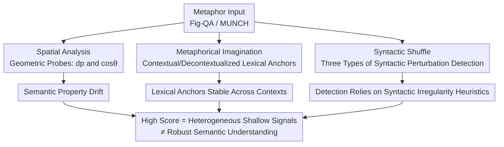

# Probing Semantic Alignment, Lexical Invariance, and Syntactic Influence in LLM Metaphor Processing

**Conference**: ACL2026  
**arXiv**: [2510.04120](https://arxiv.org/abs/2510.04120)  
**Code**: None (Diagnostic analysis paper)  
**Area**: Interpretability / Probing Analysis / Metaphor Processing  
**Keywords**: Metaphor processing, geometric probing, lexical invariance, syntactic perturbation, diagnostic analysis  

## TL;DR
This is a diagnostic analysis paper: instead of competing for performance, the authors probe LLM metaphor processing from three complementary dimensions—**semantic property alignment, lexical invariance, and syntactic influence**. They find that "high scores on metaphor benchmarks" may stem from heterogeneous shallow signals (semantic drift + stable lexical anchors + heuristic sensitivity to syntactic irregularities) rather than robust integrated semantic understanding.

## Background & Motivation
**Background**: LLMs achieve high scores on metaphor detection and interpretation tasks, which is widely treated as evidence of "understanding metaphors." Linguistically, metaphors are characterized by theories such as SPV (Selectional Preference Violation), MIP (Metaphor Identification Procedure), and CMT (Conceptual Metaphor Theory's cross-domain mapping). The core difficulty is that the "mapping properties" of metaphors are often implicit.

**Limitations of Prior Work**: It remains unclear what high scores actually represent. Since the core mapping in metaphor interpretation is implicit, models might capture salient features while missing intended properties (e.g., in "The computer is a tortoise," the mapping should be "slow," but the model might refer to "longevity"). Furthermore, research has identified the **trigger word effect**, where interpretations are biased by highly associated words (e.g., seeing "arm" shifts meaning toward war), suggesting the model might rely on stable lexical associations rather than contextual integration. Additionally, most prior work looks at discrete outcomes like multiple-choice accuracy, failing to reveal "how far the generated explanation deviates from intended properties."

**Key Challenge**: There exists a chasm between behavioral success (answering correctly) and mechanistic understanding (performing true cross-domain mapping). Discrete answer-level evaluation lacks the resolution to reveal whether models use a unified semantic mechanism or a collection of heterogeneous shallow signals when processing metaphors.

**Goal**: To dissect three complementary dimensions from a diagnostic perspective: (1) whether generated explanations geometrically align with reference semantic properties; (2) whether metaphor-literal lexical associations remain stable across contexts (i.e., whether they rely on fixed lexical anchors rather than context); and (3) how syntactic perturbations affect metaphor detection. This aims to distinguish between semantic alignment, lexical bias, and syntactic sensitivity.

**Core Idea**: Use controlled probes + geometry/lexical/syntactic metrics to dissect "benchmark high scores" into distinguishable behavioral signals, reminding the community not to equate high scores directly with robust semantic understanding.

## Method
This paper presents a diagnostic framework where the "method" comprises the design of three complementary probing experiments. Mechanism: Avoid modifying or fine-tuning models; instead, construct controlled inputs and geometric measures to characterize model behavior at the interpretation level (Spatial Analysis) and detection level (Metaphorical Imagination + Syntactic Shuffle).

### Overall Architecture
The three probes target different facets of metaphor processing, sharing a "diagnostic rather than performance-driven" orientation: Spatial Analysis measures "how far generated explanations deviate from the reference semantic property plane" in a shared embedding space; Metaphorical Imagination compares lexical overlap between "with context vs. without context" generations to check label stability; Syntactic Shuffle applies three types of syntactic perturbations to observe changes in detection accuracy. Together, they answer "what signals drive the high scores."

### Key Designs

**1. Spatial Analysis: Measuring Semantic Property Alignment via "Geometric Deviation from Reference Plane"**

To address the limitation that multiple-choice accuracy cannot capture how far explanations deviate from intended properties, the authors transform alignment into a geometric quantity. Each target metaphor $m_i$ is paired with a metaphor $m_i'$ that is superficially different but shares the same semantic property. Two human-annotated explanations $R_i, R_i'$ (semantic anchors) plus one model-generated literal paraphrase $S_i$ (literal anchor) span an affine **reference plane** $\gamma_i$. The model-generated explanation is denoted as $M_i$. Two complementary metrics characterize the relationship between $M_i$ and $\gamma_i$: $d_p$ is the perpendicular distance from $M_i$ to $\gamma_i$ (magnitude of deviation), and $\cos\theta$ is the cosine of the angle between the reference plane $\gamma_i$ and the explanation plane $\beta_i = \text{span}\{R_i, R_i', M_i\}$ (direction of deviation). All sentences are encoded into the shared OpenAI `text-embedding-3-small` space. The plane basis is obtained via SVD ($A = U\Sigma V^\top$) on centered anchor vectors, taking the top singular vectors. Larger $d_p$ or smaller $\cos\theta$ indicates greater deviation from reference semantic properties. Crucially, the authors emphasize that $d_p$ has **no absolute calibration meaning** and serves only as a **relative** diagnostic signal across instances/models.

**2. Metaphorical Imagination + Anchor Score: Testing Cross-Context Lexical Anchor Stability**

Addressing the trigger word effect—where interpretations may be biased by fixed high-association words—the authors compare lexical overlap across "contextualized" and "isolated target word" generations. Two directions are explored: Literal-to-Metaphor (LM) and Metaphor-to-Literal (ML), with 20 candidate replacements generated for each target word. Stability is measured via the **Anchor Score**: if the two sets (contextualized vs. decontextualized) share words, Anchor Score $= 1$ (presence of shared lexical anchor); if no words are shared, the maximum cosine similarity between the two sets is taken using 300d GloVe embeddings. Higher Anchor Score indicates lexical associations are less context-dependent. The authors further analyze this by genre (news/fiction/academic/dialogue) and novelty (MUNCH subset with novelty $> 0.3$) to check if stability varies.

**3. Syntactic Shuffle: Using Controlled Syntactic Perturbations to Check Structural vs. Shallow Clue Reliance**

To investigate whether high detection scores truly utilize integrated sentence structures, the authors apply three types of perturbations that damage syntax while largely preserving lexical content. ① **Random Shuffle**: Randomly reorders words, destroying both syntax and semantic coherence (as an extreme stress test); ② **POS Shuffle**: Replaces the metaphorical word with a synonym of a different Part-of-Speech, introducing syntactic irregularity while keeping meaning largely intact; ③ **Metaphorical Word Reposition**: Moves the metaphorical word to the beginning, middle, or end of the sentence to test sensitivity to position. Perturbations are performed using WordNet 2020 for tokenization and controlled lexical replacement. Comparing detection accuracy across these conditions reveals whether detection relies on integrated sentence structure or shallow heuristic clues like "syntactic anomaly."

### Example: Semantic Drift of monk/lawyer
Consider "The monks had the honor of a knight" (intended property: social honor/respect) through Spatial Analysis: it is paired with a shared-property $m_i'$, associated with human explanations $R_i, R_i'$ and literal anchor $S_i$ to span the reference plane. For the "knight" version, the model generates "were highly respected," with $d_p = 0.1153$ and $\cos\theta = 0.9034$, geometrically close to the reference plane, preserving the property. However, when the vehicle is changed to "lawyer," the model generates "had the privilege of legal representation," drifting toward "legal rights" rather than "social honor." Here, $d_p$ spikes to $0.7913$ and $\cos\theta$ drops to $0.2609$—the geometric probe immediately detects the loss of intended mapping, which multiple-choice accuracy fails to capture.

## Key Experimental Results

### Main Results: Semantic Alignment and Lexical Invariance

| Probe / Setting | Representative Metric | Key Observation |
|-------------|----------|----------|
| Spatial (GPT-4o) | Lowest mean $d_p = 0.1772$ | GPT-4o has smallest geometric deviation |
| Spatial (V3-671B) | Highest mean $\cos\theta = 0.8207$ | V3-671B direction aligns best with reference plane |
| MC Validation (Fine-grained Polarity) | All models $\approx 46\!-\!52\%$ (Near random) | Discrete eval is blind to polarity/intensity distinctions |
| Anchor Score (LM/ML) | $\approx 65\%\!-\!80\%$ | Lexical anchors generally stable across contexts, ML > LM |
| Human Verification (Low vs. High $d_p$) | Mean $1.96$ vs. $0.84$ ($\Delta = 1.12$, 3-pt scale) | $d_p$ corresponds to human-judged semantic alignment |

The consistency of geometric signals was also validated: Spearman $\rho = -0.62$ between $d_p$ and similarity $A_d$; $\rho = -0.64$ between $\cos\theta$ and $d_p$. Permutation tests breaking instance pairs saw correlations collapse to near zero, proving this represents true alignment rather than marginal distribution artifacts.

### Detection Accuracy under Syntactic Perturbation (Excerpt from Table 6)

| Model | Original | Random | POS | Beginning | Middle | End |
|------|----------|--------|-----|-----------|--------|-----|
| GPT-4 | 34.73 | 12.93 | **43.74** | 36.07 | 37.92 | 37.60 |
| GPT-4o | 28.89 | 7.78 | **36.87** | 30.92 | 30.84 | 29.98 |
| R1-671B | 28.68 | 12.22 | **46.41** | 39.25 | 30.88 | 36.03 |
| LLaMA-3.1-8B | 53.36 | 50.33 | 53.81 | 51.75 | 53.08 | 53.67 |

### Key Findings
- **Systematic Drift in Semantic Properties**: Explanations across models deviate from intended properties (e.g., drifting from "social honor" to "legal rights" in the monk/lawyer example). Multiple-choice evaluation is near random on fine-grained polarity differences, proving discrete metrics lack resolution whereas geometric probes can detect fine-grained deviation structures.
- **Lexical Anchors Stable Across Context**: Anchor Scores generally range from $65\!-\!80\%$, with ML consistently higher than LM (metaphor $\rightarrow$ literal is more constrained than the reverse). Even for novel metaphors (novelty $> 0.3$), over $50\%$ of samples maintain an Anchor Score of 1. While stable anchors benefit conventional metaphors, they bias novel metaphors requiring contextual integration (trigger word effect). However, the authors cautiously note that high Anchor Scores do not strictly imply "ignoring context," as lexical priors and contextual evidence may happen to align.
- **Detection Relies on Syntactic Irregularity Heuristics**: Most models perform **better under POS Shuffle than on original sentences** (e.g., R1-671B 46.41 vs. 28.68). This is because POS perturbations create anomalous combinations that amplify SPV-style clues. Positional perturbations (Beginning/Middle/End) have minimal impact, suggesting models are more sensitive to "local irregularity" than "word position." LLaMA-3.1-8B stayed near the 50% random baseline regardless of perturbation, which, combined with its low Anchor Score, suggests limited responsiveness to these probes. Random Shuffle was explicitly positioned as a stress test rather than evidence of natural metaphor processing.

## Highlights & Insights
- **Geometric Probing Transforms "Alignment" into Continuous Metrics**: Using $d_p$ for magnitude and $\cos\theta$ for direction to characterize how explanations deviate from intended properties is far more nuanced than multiple-choice accuracy. Backed by human verification ($d_p$ Low/High mapping to 1.96 vs. 0.84) and permutation tests, this "local reference plane + SVD basis" probe is transferable to any task requiring measurement of "whether generation stays within a reference semantic region."
- **Deconstructing High Scores into Three Signals**: Semantic drift, stable lexical anchors, and syntactic heuristics. Together, they explain "why benchmarks are high despite shaky understanding." This "diagnosis over leaderboard" methodology is highly instructive.
- **Counter-intuitive Gain in POS Shuffle**: This finding is an "Aha!" moment: it shows that a significant portion of detection capability comes from shallow sensitivity to syntactic anomalies rather than true sentence-level semantic integration—a warning to be wary of such shortcuts in metaphor evaluation.

## Limitations & Future Work
- **Geometric Analysis Depends on Construction of Reference Regions and Choice of Embeddings**: The reference semantic property region is a behavioral proxy constructed from human+LLM sentences and does not directly reflect cognitive representations. $d_p$ and $\cos\theta$ depend on the embedding space; changing embeddings would alter absolute distances. The third anchor $S_i$ is a pragmatic choice to balance interpretability and expressiveness, but not claimed as dimensionally optimal.
- **Metaphorical Imagination Only Covers Word-Level Metaphors**: MUNCH metaphors center on a single annotated word; results may not directly generalize to multi-word or discourse-level metaphors.
- **Random Shuffle is Not Natural Language**: It serves only as an extreme stress test; results do not reflect natural metaphor processing. Interpretable evidence mainly comes from POS and position perturbations.
- **English Dataset Restriction**: Both Fig-QA and MUNCH are in English; the universality across languages or culture-specific metaphors remains to be verified. Human evaluation was conducted by only one senior Master's student, representing a small scale.

## Related Work & Insights
- **vs. Discrete Accuracy Evaluations (Li 2024, Zhao 2021)**: These use discrete answers to gauge metaphor understanding. Ours proves such signals are near random on fine-grained polarity, shifting to geometric probes for continuous deviation.
- **vs. Trigger Word Effect Studies (Wachowiak & Gromann 2023)**: They noted interpretations are biased by associated words; Ours quantifies "lexical anchor stability across contexts" via Anchor Score and breaks it down by genre/novelty.
- **vs. Representation Layer Probing (Aghazadeh 2022)**: They explore if pretrained models encode metaphor structures via indirect evidence; Ours approaches from the behavior layer (explanation/detection output), providing geometric signals comparable to human judgment.
- **vs. CoT/Knowledge-Enhanced Interpretation (Tian 2024, Wang 2024a)**: Those works aim to improve explanation quality; Ours does not seek performance gains but diagnoses "what shallow signals drive current high scores."

## Rating
- Novelty: ⭐⭐⭐⭐ Geometric probes + three-dimensional diagnostic framework provide a novel and consistent analysis perspective.
- Experimental Thoroughness: ⭐⭐⭐⭐ 7 models × 3 probes + permutation tests/human verification; solid analysis (though human eval scale is small).
- Writing Quality: ⭐⭐⭐⭐ Clear diagnostic orientation, with cautious causal caveats provided for every signal.
- Value: ⭐⭐⭐⭐ Reminds the community not to mistake metaphor benchmark scores for robust understanding; methodology is reusable.

<!-- RELATED:START -->

## Related Papers

- [\[ICLR 2026\] One Language, Two Scripts: Probing Script-Invariance in LLM Concept Representations](../../ICLR2026/interpretability/one_language_two_scripts_probing_script-invariance_in_llm_concept_representation.md)
- [\[ACL 2026\] Dual Alignment Between Language Model Layers and Human Sentence Processing](dual_alignment_between_language_model_layers_and_human_sentence_processing.md)
- [\[ACL 2026\] Rhetorical Questions in LLM Representations: A Linear Probing Study](rhetorical_questions_in_llm_representations_a_linear_probing_study.md)
- [\[ICLR 2026\] Dynamic Reflections: Probing Video Representations with Text Alignment](../../ICLR2026/interpretability/dynamic_reflections_probing_video_representations_with_text_alignment.md)
- [\[ACL 2026\] Fine-Grained Analysis of Shared Syntactic Mechanisms in Language Models](fine-grained_analysis_of_shared_syntactic_mechanisms_in_language_models.md)

<!-- RELATED:END -->
