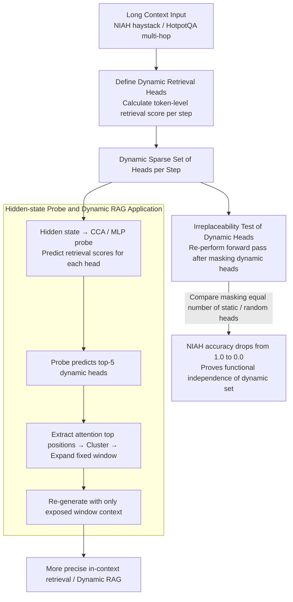

# Retrieval Heads are Dynamic

**Conference**: ACL2026  
**arXiv**: [2602.11162](https://arxiv.org/abs/2602.11162)  
**Code**: No public code  
**Area**: Information Retrieval / Mechanistic Interpretability / Dynamic RAG  
**Keywords**: retrieval heads, dynamic attention heads, long context, HotpotQA, dynamic RAG

## TL;DR
This paper demonstrates that the retrieval heads in LLMs responsible for extracting information from the context are not a fixed set but change dynamically across generation steps. They cannot be replaced by static heads and can be predicted from hidden states, which can enhance the retrieval performance of dynamic RAG.

## Background & Motivation
**Background**: Existing mechanistic interpretability studies have found functional differentiation in Transformer attention heads, such as induction heads, attention sinks, and retrieval heads. Retrieval heads are generally considered responsible for copying or extracting key information from the input context, serving as an important internal mechanism for long-context utilization and in-context retrieval.

**Limitations of Prior Work**: Past methods for identifying retrieval heads mostly treat them as a static set: they statistically determine which heads frequently point to target information across a large number of samples and then take the top-k as the model's retrieval heads. This approach is suitable for global average analysis but ignores the fact that the state and requirements of each token change during autoregressive generation.

**Key Challenge**: If retrieval heads are actually step-specific, then static top heads are merely an average approximation. Certain long-tail heads that rarely appear in global statistics might perform irreplaceable retrieval functions at specific context and generation steps. Static pruning, static KV cache compression, or static RAG triggering strategies might mistakenly delete these critical mechanisms.

**Goal**: The authors organize their study around three claims: whether retrieval heads change dynamically; whether dynamic heads can be replaced by static heads; and whether the model's hidden states encode future retrieval head patterns in advance. Subsequently, these findings are extended to HotpotQA multi-hop question answering and used to modify Dynamic RAG with dynamic head selection.

**Key Insight**: The paper shifts the definition of retrieval heads from dataset-level statistics to timestep-level behavior, directly observing which heads are retrieving target information at each generation step. This granularity is closer to the actual generation process of LLMs.

**Core Idea**: Treat retrieval heads as a dynamic sparse set determined by the current context and generation state, use a hidden-state probe to predict the heads needed at the current step, and apply this for more precise in-context retrieval.

## Method

### Overall Architecture
The paper first defines a copy-paste retrieval score on the Needle-in-a-Haystack (NIAH) task: if a head's maximum attention at the current step falls on a needle token and that token matches the token about to be generated, the head's retrieval score is 1. Based on this definition, the authors verify dynamics, irreplaceability, and hidden-state correlation. Then, the definition is relaxed to a reasoning retrieval score on HotpotQA, representing the proportion of attention allocated to supporting facts. Finally, the authors integrate dynamic heads into a modified version of DRAGIN, exposing only the context window focused on by dynamic heads when retrieval is needed, comparing dynamic, static, and random strategies.

### Key Designs
**1. Step-wise Definition of Dynamic Retrieval Heads: Shifting from Dataset Statistics to Token-level Behavior**

Previously, identifying retrieval heads involved counting which heads frequently pointed to target information across many samples and selecting the top-k. This average approximation underestimates heads that only activate under specific tokens or contexts. This paper localized the definition to each generation step: in NIAH, the copy-paste retrieval score of head $h$ at timestep $t$ is $1[i^*\in I_{needle}\land x^t_{i^*}=\hat{y}]$, where $i^*$ is the position of the maximum attention token for that head at the current step. A score of 1 is only recorded if the head is "looking" at the needle and the needle token exactly matches the token to be generated. Unlike static top-k, this set is recomputed at each step, thus capturing the fact that "long-context retrieval is not continuously performed by the same set of heads."

**2. Irreplaceability Test of Dynamic Heads: Masking to Observe if the Model Fails**

Merely stating that the dynamic set changes is insufficient; it must be proven that it is not just another view of static heads. At each generation step, the authors first perform a normal forward pass to identify dynamic retrieval heads, then mask them and regenerate the token for that same step. The control groups mask an equal number of top static heads or random heads. Furthermore, they gradually mask $k$ dynamic heads to see if the model compensatorily activates static heads. The result shows that even if the model does activate static top heads to compensate, the NIAH accuracy still drops from 1.0 to 0.0. This indicates that dynamic heads perform context-specific functions that static heads cannot fulfill—the dynamic set has independent functional necessity, rather than being a simple subset of a larger static set.

**3. Hidden-state Probe and Dynamic RAG Application: Proving Predictability and Controlling Retrieval**

If dynamic heads can only be identified after the fact, their engineering value is limited. This paper aims to prove they are predictable before generation. The authors used temporal-offset CCA to measure the correlation between the final hidden state at timestep $n$ and retrieval scores at future $n+k$ steps. They found that for $k=0$, the top-1 canonical correlation is as high as 0.966, and remains 0.931 and 0.915 for $k=1$ and $k=2$, respectively—implying the model encodes which retrieval mechanisms will be needed before generation. Based on this, an MLP probe was trained to predict the retrieval score pattern of all heads from the final hidden state. In the modified Dynamic RAG, the probe predicts the top-5 dynamic heads, clusters their top attention positions, and expands a context window to let the model see only these local fragments. Predictability is the key step: it transforms the dynamic mechanism from "posterior analysis" into an "online control signal" that can be linked to dynamic KV cache, dynamic retrieval triggering, or hallucination monitoring.

### Loss & Training
The main body of this paper is an analytical study and does not involve training new LLMs. The MLP probe performs binary classification in NIAH, where the input is the final hidden state and the target is the binary retrieval score of each attention head. In HotpotQA, it performs regression to predict continuous reasoning retrieval scores. The Dynamic RAG part uses the probe to predict the top-5 dynamic heads and combines this with the RIND retrieval triggering strategy from DRAGIN.

## Key Experimental Results

### Main Results
Statistical results on NIAH show that dynamic retrieval heads are distributed among long-tail heads far beyond the top-20 static set, and the set of heads changes significantly between adjacent generation steps.

| Model | Dynamic Heads per Step | Activated Heads / Total Heads | Jaccard w/ top-20 static | Adjacent Step Jaccard | Entropy |
|------|-------------------|---------------------------|--------------------------|----------------|---------|
| Llama-3.1-8B | 12.97 ± 7.69 | 238 / 1024 | 0.3512 | 0.2793 | 3.8154 |
| Llama-3.2-3B | 9.69 ± 6.18 | 149 / 672 | 0.3126 | 0.3188 | 3.0083 |
| Qwen3-8B | 20.18 ± 10.43 | 415 / 1152 | 0.4611 | 0.3668 | 4.1038 |
| Llama-2-13B | 6.20 ± 5.49 | 172 / 1600 | 0.2077 | 0.4979 | 4.8973 |
| Phi-4-mini | 6.13 ± 7.09 | 176 / 768 | 0.1845 | 0.5056 | 3.5532 |

The MLP probe can decode the retrieval score pattern from the hidden state, indicating that dynamic heads are not purely random fluctuations but functional patterns predictable from internal states.

| Model | Precision | Recall | F1 | AUPRC |
|------|-----------|--------|----|-------|
| Llama-3.1-8B | 0.8344 | 0.8353 | 0.8349 | 0.9173 |
| Llama-3.2-3B | 0.8564 | 0.8351 | 0.8456 | 0.9289 |
| Qwen3-8B | 0.8780 | 0.8362 | 0.8566 | 0.9339 |
| Llama-2-13B | 0.8455 | 0.8220 | 0.8336 | 0.9183 |
| Phi-4-mini | 0.8219 | 0.7865 | 0.8038 | 0.8862 |

### Ablation Study
On HotpotQA, the authors modified the retrieval score to the supporting facts attention ratio and trained an MLP regressor. The $R^2$ reached a maximum of 0.8120, showing that dynamic retrieval signals in multi-hop reasoning scenarios are also predictable from hidden states.

| Model | MSE ↓ | MAE ↓ | $R^2$ ↑ |
|------|-------|-------|------|
| Llama-3.1-8B | 0.0023 | 0.0177 | 0.8120 |
| Llama-3.2-3B | 0.0036 | 0.0247 | 0.8015 |
| Qwen3-8B | 0.0050 | 0.0255 | 0.7200 |
| Llama-2-13B | 0.0009 | 0.0121 | 0.7669 |
| Phi-4-mini | 0.0014 | 0.0109 | 0.7333 |

The Dynamic RAG case study on HotpotQA compares dynamic heads, static heads, random heads, and no RAG. In most models, the dynamic strategy outperforms the static strategy.

| Model | Dynamic EM/F1 | Static EM/F1 | Dynamic Random EM/F1 | Fixed Random EM/F1 | w/o RAG EM/F1 |
|------|---------------|--------------|----------------------|--------------------|---------------|
| Llama-3.1-8B | 0.456 / 0.5586 | 0.398 / 0.5098 | 0.272 / 0.3670 | 0.272 / 0.3763 | 0.252 / 0.3257 |
| Llama-3.2-3B | 0.384 / 0.4993 | 0.428 / 0.5386 | 0.224 / 0.3143 | 0.226 / 0.3051 | 0.184 / 0.2439 |
| Qwen3-8B | 0.286 / 0.3580 | 0.278 / 0.3429 | 0.210 / 0.2804 | 0.210 / 0.2804 | 0.220 / 0.2961 |
| Llama-2-13B | 0.284 / 0.3838 | 0.278 / 0.3789 | 0.276 / 0.3762 | 0.272 / 0.3751 | 0.192 / 0.2750 |
| Phi-4-mini | 0.202 / 0.2690 | 0.186 / 0.2505 | 0.082 / 0.1090 | 0.086 / 0.1111 | 0.172 / 0.2331 |

### Key Findings
- Jaccard similarity between dynamic heads and top-20 static heads is generally low. Expanding the static set to top-50 or top-100 actually decreases the Jaccard index, indicating that dynamic heads are not simple subsets of a larger static set.
- Masking dynamic retrieval heads causes significantly more damage to NIAH and HotpotQA than masking static or random heads, proving the functional necessity of the dynamic set.
- There is a strong correlation between hidden states and future retrieval scores, suggesting that the model codes the required retrieval mechanisms before generation.
- The improvement in Dynamic RAG is most significant in Llama-3.1-8B, with F1 increasing from 0.5098 (static) to 0.5586 (dynamic). However, Llama-3.2-3B is an exception, possibly because small models have fewer heads, each carrying more mixed functions.

## Highlights & Insights
- The most interesting aspect of the paper is redefining the retrieval head from a "fixed organ within the model" to a "functional role activated by state." This is crucial for interpretability, pruning, and retrieval-augmented reasoning.
- The hidden-state probe is a highly transferable tool. It allows dynamic mechanisms to go beyond post-hoc analysis and become online inference control signals.
- The implications for KV cache compression are direct: statically pruning heads with low average importance might mistakenly remove long-tail but critical dynamic retrieval heads. Future compression strategies should retain heads based on timestep.
- It also inspires hallucination detection: if the model lacks retrieval head activation when generating factual claims, it may be an internal signal of "not truly orizing evidence from the context."

## Limitations & Future Work
- The Dynamic RAG experiments use attention masking to simulate context selection, rather than truly retrieving and concatenating external documents as in production RAG; deployment feasibility requires further validation.
- The MLP probe is not an oracle; prediction errors may incorporate non-optimal heads into retrieval control, potentially introducing noise.
- The experiments mainly cover NIAH and HotpotQA, which are still biased towards retrieval-intensive QA. Whether the same mechanism exists in long-form summarization, legal reasoning, or codebase QA needs testing.
- The paper focuses on attention heads but does not further explain whether different dynamic heads form stable circuits or bind with specific semantic operations.

## Related Work & Insights
- **vs Wu et al. retrieval heads**: Early works use dataset statistics to identify fixed retrieval heads; this paper emphasizes that the same model activates different heads at different generation steps, and static sets are only incomplete approximations.
- **vs QRHead / HeadKV**: These methods already focus on query-aware or head-level importance but are still commonly used for static compression or re-ranking; this paper places token-level dynamics as the central object.
- **vs DRAGIN**: DRAGIN decides when to retrieve; this paper further decides which internal retrieval heads and context windows should be relied upon at the current moment.
- **Insights**: Future long-context inference can jointly model "when retrieval is needed," "which context segment to retrieve," and "which heads should be preserved."

## Rating
- Novelty: ⭐⭐⭐⭐⭐ The dynamic retrieval head perspective clearly challenges the static head statistical paradigm.
- Experimental Thoroughness: ⭐⭐⭐⭐☆ Covers NIAH, HotpotQA, ablation, probe, and Dynamic RAG; scenario diversity could still be expanded.
- Writing Quality: ⭐⭐⭐⭐☆ The three claims are well-organized with clear method details despite being technical.
- Value: ⭐⭐⭐⭐☆ Highly inspiring for interpretability and reasoning system optimization; engineering implementation needs more validation.

<!-- RELATED:START -->

## Related Papers

- [\[ACL 2026\] From Interpretability to Performance: Optimizing Retrieval Heads for Long-Context Language Models](from_interpretability_to_performance_optimizing_retrieval_heads_for_long-context.md)
- [\[ACL 2026\] Preference Heads in Large Language Models: A Mechanistic Framework for Interpretable Personalization](preference_heads_in_large_language_models_a_mechanistic_framework_for_interpreta.md)
- [\[ICLR 2026\] Toward Faithful Retrieval-Augmented Generation with Sparse Autoencoders](../../ICLR2026/interpretability/toward_faithful_retrieval-augmented_generation_with_sparse_autoencoders.md)
- [\[CVPR 2026\] Improving Sparse Autoencoder with Dynamic Attention](../../CVPR2026/interpretability/improving_sparse_autoencoder_with_dynamic_attention.md)
- [\[AAAI 2026\] Adaptive Evidential Learning for Temporal-Semantic Robustness in Moment Retrieval](../../AAAI2026/interpretability/adaptive_evidential_learning_for_temporal-semantic_robustnes.md)

<!-- RELATED:END -->
