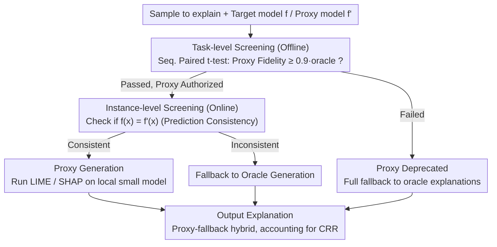

# Revitalizing Black-Box Interpretability: Actionable Interpretability for LLMs via Proxy Models

**Conference**: ACL 2026  
**arXiv**: [2505.12509](https://arxiv.org/abs/2505.12509)  
**Code**: [https://github.com/outerform/Large-Model-Explanation-Benchmark](https://github.com/outerform/Large-Model-Explanation-Benchmark)  
**Area**: Interpretability / LLM Optimization  
**Keywords**: Model-agnostic explanation, Proxy models, Black-box interpretability, Prompt compression, Feature attribution

## TL;DR

This paper proposes a proxy-model-based framework for black-box interpretability. It utilizes inexpensive small models to approximate the local decision boundaries of costly large models to generate LIME/SHAP explanations. Reliability is ensured through a "screen-and-apply" mechanism. Proxy explanations reduce costs by 88.2% while maintaining over 90% fidelity, and are successfully applied to downstream optimization tasks such as prompt compression and poisoned sample removal.

## Background & Motivation

**Background**: Post-hoc explanations serve not only as transparency tools but also as drivers for model optimization (e.g., prompt debugging and data cleaning). However, closed-source models (e.g., GPT-4o, Google Gemini) block access to internal representations, making model-agnostic methods (e.g., LIME, SHAP) the only option. These methods rely on extensive perturbation sampling—generating a single LIME explanation typically requires 1,000 queries, and generating explanations for a validation set of 50 samples requires 50,000 queries, costing over \$100.

**Limitations of Prior Work**: (1) Cost-utility dilemma: The upfront cost of generating explanations exceeds the potential benefits of the optimization task itself, making these powerful tools impractical; (2) Existing acceleration methods (e.g., amortized explainers, feature reduction) are orthogonal to this work but do not exploit the homogeneity between LLMs; (3) White-box interpretability methods require access to internal representations, which is inapplicable to closed-source models.

**Key Challenge**: While model-agnostic explanations can theoretically guide LLM optimization, their requirement for massive queries to expensive models makes them unusable in practice—posing a fundamental utility dilemma where "explanation costs more than optimization gains."

**Goal**: (1) Propose an economically viable proxy explanation framework using inexpensive models as substitutes for expensive models; (2) Ensure the reliability of proxy explanations via a statistical verification mechanism; (3) Demonstrate the actual utility of proxy explanations in downstream optimization tasks.

**Key Insight**: Based on the homogeneity among LLMs—different LLMs tend to exhibit similar behaviors on similar inputs—meaning small models can locally approximate the decision boundaries of large models ("inferring the large from the small").

**Core Idea**: Use inexpensive local/open-source models as proxies to generate perturbation-based explanations. Reliability is ensured through two layers of statistical screening (task-level + instance-level), deploying the proxy only when reliable and falling back to the expensive model otherwise.

## Method

### Overall Architecture

The framework addresses the dilemma where "generating explanations is more expensive than optimization gains." Explaining a closed-source LLM via LIME can cost hundreds of dollars for a few dozen samples due to thousands of queries. The approach uses a cheap small model as a proxy to approximate the local decision boundaries of the expensive oracle model. The framework follows a "screen-and-apply" workflow: first, statistically verify if the proxy explanation is sufficiently faithful before deployment; then, use the proxy for verified instances and fallback to the expensive oracle for others. Screening is divided into offline task-level and online instance-level layers. The input is the sample to be explained, and the output is a set of explanations with statistical reliability guarantees at a significantly reduced cost.

### Key Designs

**1. Task-level Screening: Granting "Access" to Entires Datasets via Sequential Hypothesis Testing**

Blindly applying small models carries risks of systematic misalignment. Before using a proxy, the framework performs a one-time evaluation of whether the proxy model $f'$ can provide sufficiently faithful explanations for the target model $f$ across the entire task $\mathbb{D}$. Specifically, a sequential one-sided paired $t$-test is used. For each sample, the paired difference is calculated as $d_i = q_{\text{proxy}}(\mathbf{x}_i) - \tau \cdot q_{\text{oracle}}(\mathbf{x}_i)$, testing if the proxy fidelity reaches $\tau=0.9$ times the oracle fidelity. The decision is made between $H_0: \mu_d < 0$ and $H_1: \mu_d \geq 0$ with a confidence level of $1-\delta=0.99$. If the calculated confidence interval is entirely above zero, $H_1$ is accepted and the proxy is deployed; otherwise, sampling continues up to a maximum $N=50$. This offline safety valve ensures only sufficiently faithful proxies on average are deployed.

**2. Instance-level Screening: Online Safety Valve via Prediction Consistency**

Passing task-level screening does not guarantee safety for every sample. Thus, a per-instance check is added during runtime: $s_{\text{inst}}(\mathbf{x}; f, f') = \mathbf{1}[f(\mathbf{x}) = f'(\mathbf{x})]$. Proxy explanations are only adopted when the proxy and target models yield consistent predictions for the current input. This is justified by two reasons: first, local explanations are designed for the model's current prediction, and inconsistent predictions mean explanations cannot correspond; second, prediction divergence suggests different local decision behaviors around $\mathbf{x}$, increasing the likelihood of proxy distortion. Any inconsistency triggers a fallback to the oracle to maintain fidelity.

**3. Proxy-Fallback Hybrid and Cost Accounting: Quantifying Savings**

To measure cost benefits, the framework uses the Cost Reduction Ratio $\text{CRR} = \frac{C_{\text{oracle}}}{C_{\text{proxy}} + C_{\text{fallback}} + C_{\text{screen}}}$. The denominator includes the cost of proxy explanations for consistent instances $C_{\text{proxy}}$, the fallback cost for inconsistent instances $C_{\text{fallback}}$, and the screening cost $C_{\text{screen}}$. Since proxies can be local open-source models, $C_{\text{proxy}}$ can be reduced to near zero. Consequently, the "proxy-primary, fallback-secondary" hybrid strategy maximizes cost savings while preserving fidelity.

### Experimental Thoroughness

No model training was involved. Explanations were generated using standard LIME and Kernel SHAP with 1,000 perturbation samples each and default hyperparameters. Evaluation spanned 12 LLMs, including the GPT-4o series, DeepSeek V3, seven Qwen 2.5 models, and two Llama 3.1 models.

## Key Experimental Results

### Main Results

**Cost Reduction Ratio (CRR) — Using Proxy Models to Explain Expensive LLMs**

| Target Model | CRR Type | SST | MMLU | NQ |
|---------|---------|-----|------|-----|
| GPT-4o | CRR_max (API) | 10.33 | 4.84 | 7.41 |
| GPT-4o | CRR_local | 14.17 | 5.62 | 10.53 |
| DeepSeek V3 | CRR_local | 13.31 | 5.32 | 8.33 |
| Qwen 2.5 72B | CRR_local | 16.25 | 6.07 | 9.09 |

**Reliability of Screening Steps**

| Metric | LIME (SST/MMLU/NQ) | Kernel SHAP (SST/MMLU/NQ) |
|------|-------------------|--------------------------|
| Precision | 100.0 / 99.4 / 94.1 | 100.0 / 100.0 / 100.0 |
| Recall | 80.2 / 77.6 / 76.1 | 96.3 / 97.2 / 96.2 |
| F1 | 89.0 / 87.2 / 84.2 | 98.1 / 98.5 / 98.0 |

### Ablation Study

**Comparison of Prompt Compression (Compression Rate % on GPT-4o)**

| Method | MMLU-Chem | MMLU-CS | HellaSwag | GSM8K | PIQA |
|------|-----------|---------|-----------|-------|------|
| Random | 29.0 | 35.6 | 58.8 | 25.3 | 54.3 |
| AttnComp | 34.5 | 39.1 | 64.3 | 30.2 | 60.2 |
| LLMLingua | 38.7 | 38.3 | 62.7 | 28.9 | 58.7 |
| Proxy Exp. | 41.0 | 43.0 | 70.1 | 35.5 | 64.5 |
| Oracle Exp. | 49.2 | 50.2 | 75.5 | 37.2 | 69.2 |

**Poisoned Sample Removal (GPT-4o Accuracy %)**

| Task | Oracle Exp. | Proxy Exp. | Random deletion |
|------|------------|-----------|-----------------|
| SST | 94.2 | 94.0 | 87.1 |
| HellaSwag | 93.7 | 93.5 | 88.4 |
| PIQA | 91.5 | 90.7 | 79.6 |

### Key Findings

- For the most expensive GPT-4o, proxy explanations can save up to 88% in costs (CRR_max reaches 14.17) while maintaining over 90% fidelity.
- The screening steps achieve an average precision of 98.9%, rarely marking unfaithful proxies as usable; even in rare false positives, actual proxy fidelity remains above 89%.
- Proxy explanations achieve 91.7% of the performance of the oracle in prompt compression, significantly outperforming random deletion and SOTA methods like LLMLingua/AttnComp.
- Proxy explanations accurately identify and remove poisoned samples, restoring GPT-4o accuracy from <80% to 94%, nearly matching oracle performance.
- Cross-model explanation transferability remains consistent across different tasks and datasets; Qwen 7B/14B proxies achieve over 90% fidelity for GPT-4o.

## Highlights & Insights

- Transforms LLM homogeneity from a passive observation into an active utility tool—the similarity in local decision boundaries between different LLMs becomes the basis for cost savings in interpretability.
- The dual-layer "screen-and-apply" mechanism balances safety and cost efficiency: task-level screening filters unqualified proxies at once, while instance-level screening provides a per-sample safety valve.
- Shifts interpretability from a passive observation tool to an active optimization primitive (prompt compression, data cleaning), expanding the application boundaries of explanation methods.

## Limitations & Future Work

- Focuses on perturbation-based feature attribution methods (LIME, SHAP); the applicability to other explanation techniques remains unexplored.
- In scenarios requiring extreme reasoning capabilities (e.g., complex symbolic logic), the alignment between small proxies and large oracles may weaken, causing the framework to fall back to the oracle and reducing cost savings.
- The direction of using lightweight fine-tuning to align proxy models with oracles was not explored.
- Dual-use risks of explanations—the same tools could potentially be used for adversarial attacks or generating misleading explanations.

## Related Work & Insights

- **vs LLMLingua/AttnComp**: These are specialized prompt compression methods; proxy explanations significantly outperform them under similar compression rates, suggesting that explanation-guided optimization is more effective than specialized heuristics.
- **vs Amortized Explanations**: Amortized methods train a unified explainer to approximate the explanation distribution; this is orthogonal to the proxy approach in this paper and could be combined to further reduce costs.
- **vs White-Box Interpretability**: White-box methods require internal representation access and are inapplicable to closed-source models; this work achieves similar effects for black-box models using proxy-based model-agnostic methods.

## Rating

- Novelty: ⭐⭐⭐⭐ Utilizing LLM homogeneity to build a proxy explanation framework is a novel perspective with a rigorous statistical screening design.
- Experimental Thoroughness: ⭐⭐⭐⭐⭐ Comprehensive coverage across 12 LLMs, 7 datasets, 2 explanation methods, and 2 downstream tasks.
- Writing Quality: ⭐⭐⭐⭐⭐ Clear motivation, rigorous statistical framework, and well-organized experiments.
- Value: ⭐⭐⭐⭐⭐ Moves black-box interpretability from "theoretically feasible but practically unusable" to "economically viable and practically useful"; the open-source benchmark dataset holds long-term value.

<!-- RELATED:START -->

## Related Papers

- [\[ICML 2026\] Interpretability Can Be Actionable](../../ICML2026/interpretability/interpretability_can_be_actionable.md)
- [\[ACL 2026\] Mechanistic Interpretability of Large-Scale Counting in LLMs through a System-2 Strategy](mechanistic_interpretability_of_large-scale_counting_in_llms_through_a_system-2_.md)
- [\[ACL 2026\] Towards Intrinsic Interpretability of Large Language Models: A Survey of Design Principles and Architectures](towards_intrinsic_interpretability_of_large_language_modelsa_survey_of_design_pr.md)
- [\[NeurIPS 2025\] OrdShap: Feature Position Importance for Sequential Black-Box Models](../../NeurIPS2025/interpretability/ordshap_feature_position_importance_for_sequential_black-box_models.md)
- [\[ACL 2026\] Interpretability from the Ground Up](interpretability_from_the_ground_up_stakeholder-centric_design_of_automated_scor.md)

<!-- RELATED:END -->
