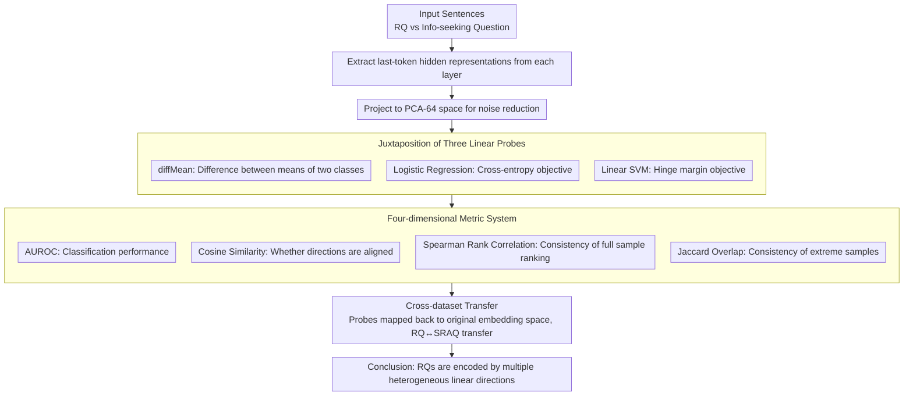

# Rhetorical Questions in LLM Representations: A Linear Probing Study

**Conference**: ACL 2026  
**arXiv**: [2604.14128](https://arxiv.org/abs/2604.14128)  
**Code**: [GitHub](https://github.com/ruyi101/rq-representation-probing)  
**Area**: Interpretability  
**Keywords**: Rhetorical questions, linear probing, LLM representations, cross-dataset transfer, rhetorical analysis

## TL;DR
Through linear probing analysis of how LLMs internally represent rhetorical questions, it is discovered that rhetorical questions are linearly separable in the representation space and transferable across datasets. However, the probe directions learned from different datasets are inconsistent—rhetorical questions are encoded by multiple heterogeneous linear directions rather than a single unified dimension.

## Background & Motivation

**Background**: Rhetorical questions (RQs) are common rhetorical forms in daily communication, used by speakers to express stances, challenge, or persuade rather than seek information. Computational linguistics research on RQs has primarily focused on classification/detection tasks using classifiers trained with explicit labels.

**Limitations of Prior Work**: Although LLMs frequently generate and understand RQs in practice, there is almost no research on how models "internally represent rhetorical intent." Existing work focuses on predictive accuracy while ignoring understanding at the representation level.

**Key Challenge**: A natural hypothesis is that if RQs can be detected by linear probes, then a "rhetorical question direction" should exist within the model. However, if RQs in different contexts serve different rhetorical functions (e.g., discourse-level stance expression vs. syntactic-level question markers), the single-direction hypothesis might be oversimplified.

**Goal**: Systematically answer three questions: (1) At which layers do RQ signals emerge? (2) Are different probing methods consistent? (3) Are probe directions aligned during cross-dataset transfer?

**Key Insight**: Analyze the internal representations of Qwen3-32B and Llama-3.3-70B using multiple linear probes (diffMean, Logistic Regression, SVM) on two social media datasets. The focus is not only on classification accuracy but also on directional consistency and ranking consistency between probes.

**Core Idea**: Rhetorical questions are "heterogeneously encoded" in LLM representations—captured by multiple unaligned linear directions representing different rhetorical phenomena, rather than a single shared dimension.

## Method

### Overall Architecture

This paper does not train new models but treats pre-trained LLMs as subjects for dissection: given a sentence, last-token hidden representations are extracted from each layer, projected into a 64-dimensional PCA space for noise reduction, and then classified as RQs or information-seeking questions using three linear probes. The focus is not on whether the probes can classify correctly, but on whether the directions point to the same location when feeding the same representation to different probes or moving learned directions across datasets. Thus, the output of the pipeline is a comparison of four metric sets: AUROC, Cosine Similarity, Spearman Rank Correlation, and Jaccard Overlap.

### Key Designs

**1. Juxtaposition of Three Linear Probes: Decoupling "Separability" from "Uniqueness of Direction"**

If RQs truly had a unified representation dimension, then the directions found should be similar regardless of the method used. To verify this, three probes are applied simultaneously: diffMean requires no training and takes the difference between class means $w_{\text{DM}} = \mu_+ - \mu_-$; Logistic Regression optimizes cross-entropy; and Linear SVM optimizes the hinge loss margin. All three ultimately provide a linear score in the form $w^\top h(x)$, differing only in optimization objectives. This design is straightforward—if their AUROCs are close but they learn different $w$, it indicates that "linear separability" does not imply "uniqueness of direction," which is the central hypothesis this paper challenges.

**2. Four-dimensional Metric System: Distinguishing "Classification Consistency" from "Representational Consistency"**

Traditional probing research often focuses solely on AUROC, assuming that if classification performance is similar, the probes are doing the same thing. This paper breaks this assumption by splitting evaluation into four layers: AUROC measures classification performance, Cosine Similarity measures whether two $w$ directions are aligned, Spearman Rank Correlation measures consistency in ranking all samples, and Jaccard Overlap focuses on extreme samples—checking if the top-20% and bottom-20% identified by two probes overlap. The latter three metrics are specifically designed to expose scenarios where "AUROC is high, but directions are diametrically opposed," which is invisible when looking at accuracy alone.

**3. Cross-dataset Transfer: Testing for a Universal "Rhetorical Question Direction"**

If the RQ direction is a stable internal concept of the model, probes learned on the RQ dataset should remain aligned and maintain ranking consistency when moved to SRAQ (and vice versa). The difficulty lies in the fact that both datasets use their own PCA, making coordinate systems non-universal; thus, probe directions must be mapped back to the original embedding space before comparison. If the directions are found to be nearly orthogonal and extreme samples show almost no overlap after transfer, the conclusion must be that RQ encoding is context-dependent and varies with data distribution.

### Loss & Training

diffMean requires no training; Logistic Regression and hinge loss are optimized on training sets, models are selected via validation sets, and results are reported on test sets. All representations are projected into a PCA-64 space for noise reduction.

## Key Experimental Results

### Main Results

| Model | Dataset | Probe | AUROC (Deep Layers) | Representation Choice |
|------|--------|------|-------------|----------|
| Llama-3.3-70B | RQ | Hinge/Logistic | ~0.85-0.90 | last-token |
| Llama-3.3-70B | SRAQ | Hinge/Logistic | ~0.80-0.85 | last-token |
| Qwen3-32B | RQ | diffMean | ~0.80 | last-token |
| Qwen3-32B | SRAQ | diffMean | ~0.75 | last-token |
| Both Models | RQ→SRAQ Transfer | All | ~0.70-0.80 | last-token |

### Cross-dataset Directional Consistency

| Analysis Dimension | Intra-RQ Probes | Intra-SRAQ Probes | RQ↔SRAQ Cross-dataset |
|----------|-------------|---------------|-----------------|
| Cosine Similarity (Hinge vs Logistic) | ~1.0 | ~1.0 | ~0.2-0.4 |
| Cosine Similarity (diffMean vs Trained) | ~0.5-0.7 | ~0.3-0.5 | ~0.2-0.4 |
| Top-20% Jaccard | ~0.25 | ~0.25 | <0.20 |
| Bottom-20% Jaccard | ~0.50 | ~0.50 | ~0.30-0.40 |

### Key Findings
- **last-token outperforms mean pooling**: last-token representations consistently outperform mean pooling in deep layers, indicating that RQ signals are concentrated at the end of the sequence.
- **Trained probes and diffMean directions are inconsistent**: Despite similar AUROCs (on SRAQ) or small gaps (on RQ), the cosine similarity of directions learned by the three probes is only between 0.3-0.7.
- **Extreme ranking inconsistency across datasets**: Jaccard overlap for top-20% samples is often below 0.2, meaning the samples considered "most rhetorical" by two probes hardly overlap.
- **Qualitative analysis reveals fundamental differences**: The SRAQ direction prefers discourse-level rhetoric in long arguments (RQs driving an argument), while the RQ direction prefers short, syntax-driven local interrogative forms.

## Highlights & Insights
- **Insights on "High AUROC ≠ Shared Direction"**: This serves as a significant reminder for the entire probing methodology—linear separability does not imply a single separable direction. This can be generalized to probe studies of other linguistic properties.
- **Heterogeneity of Rhetorical Questions**: RQs are not a single attribute but span a spectrum from local syntactic markers to global rhetorical strategies, consistent with linguistic theory.
- **Asymmetry of Top vs. Bottom**: Ranking consistency is higher for info-seeking questions and lower for RQs—suggesting that "non-rhetorical" is relatively homogeneous, whereas "rhetorical" is heterogeneous.

## Limitations & Future Work
- Experiments were conducted only on two social media datasets, excluding formal styles (e.g., academic papers, news).
- Only linear probes were used; non-linear representational structures were excluded.
- No systematic causal intervention experiments were performed—linear separability does not equal linear controllability.
- Future work should combine Sparse Autoencoders (SAE) or causal intervention methods to verify the causal efficacy of the RQ direction.

## Related Work & Insights
- **vs. Ikumariegbe et al. 2025**: They studied RQs within a QA classification framework, focusing on predictive accuracy; this paper delves into the representation level to reveal the directional heterogeneity behind accuracy.
- **vs. Marks & Tegmark 2024 (diffMean)**: This paper uses their diffMean method as one of the baselines but finds that diffMean and trained probe directions are inconsistent, suggesting that while diffMean is simple, it may miss some signals.
- **vs. Sparse Autoencoder methods**: SAE can decompose activations into interpretable feature directions, which could be used in the future to validate the multi-direction hypothesis found in this study.

## Rating
- Novelty: ⭐⭐⭐⭐ First systematic analysis of rhetorical question encoding in LLM representations.
- Experimental Thoroughness: ⭐⭐⭐⭐ Comprehensive analysis across multiple probes, models, and metrics.
- Writing Quality: ⭐⭐⭐⭐⭐ Clear logical chain, progressing from phenomena to analysis and qualitative validation.
- Value: ⭐⭐⭐⭐ Insightful for both probing methodology and rhetorical understanding.

<!-- RELATED:START -->

## Related Papers

- [\[ICLR 2026\] One Language, Two Scripts: Probing Script-Invariance in LLM Concept Representations](../../ICLR2026/interpretability/one_language_two_scripts_probing_script-invariance_in_llm_concept_representation.md)
- [\[ACL 2026\] Crosscoding Through Time: Tracking Emergence & Consolidation Of Linguistic Representations Throughout LLM Pretraining](crosscoding_through_time_tracking_emergence_consolidation_of_linguistic_represen.md)
- [\[ACL 2026\] Linear Probes Detect Task Format, Not Reasoning Mode in Language Model Hidden States](linear_probes_detect_task_format_not_reasoning_mode_in_language_model_hidden_sta.md)
- [\[ICLR 2026\] Dynamic Reflections: Probing Video Representations with Text Alignment](../../ICLR2026/interpretability/dynamic_reflections_probing_video_representations_with_text_alignment.md)
- [\[ACL 2026\] AdaptiveK: Complexity-Driven Sparse Autoencoders for Interpretable Language Model Representations](adaptivek_complexity-driven_sparse_autoencoders_for_interpretable_language_model.md)

<!-- RELATED:END -->
