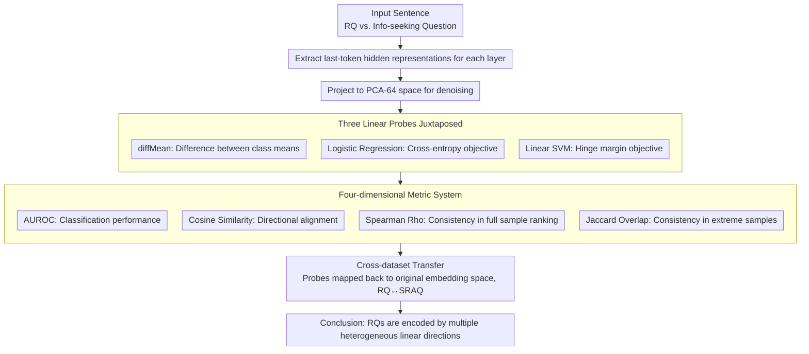

# Rhetorical Questions in LLM Representations: A Linear Probing Study

**Conference**: ACL 2026  
**arXiv**: [2604.14128](https://arxiv.org/abs/2604.14128)  
**Code**: [GitHub](https://github.com/ruyi101/rq-representation-probing)  
**Area**: Interpretability  
**Keywords**: Rhetorical questions, linear probing, LLM representations, cross-dataset transfer, rhetorical analysis

## TL;DR
Through linear probing analysis of internal LLM representations of rhetorical questions, it is discovered that rhetorical questions are linearly separable and transferable across datasets in the representation space. However, the probe directions learned from different datasets are inconsistent—rhetorical questions are encoded by multiple heterogeneous linear directions rather than a single unified dimension.

## Background & Motivation

**Background**: Rhetorical questions (RQ) are common rhetorical forms in daily communication used by speakers to express a stance, query, or persuade rather than truly seek information. Research in computational linguistics has primarily focused on classification/detection tasks using classifiers trained with explicit labels.

**Limitations of Prior Work**: Although LLMs frequently generate and understand rhetorical questions in practice, there is almost no research on how the model "internally represents rhetorical intent." Existing work focuses on prediction accuracy, ignoring understanding at the representation level.

**Key Challenge**: A natural hypothesis is that if rhetorical questions can be detected by linear probes, then a "rhetorical question direction" should exist within the model. However, if rhetorical questions in different contexts serve different rhetorical functions (e.g., discourse-level stance expression vs. syntactic-level question marking), the single-direction hypothesis might be oversimplified.

**Goal**: Systematically answer three questions: (1) In which layers do rhetorical question signals appear? (2) Are different probing methods consistent? (3) Do probe directions align during cross-dataset transfer?

**Key Insight**: Internal representations of Qwen3-32B and Llama-3.3-70B are analyzed on two social media datasets using various linear probes (diffMean, Logistic Regression, SVM). The focus is not only on classification accuracy but also on direction consistency and ranking consistency between probes.

**Core Idea**: Rhetorical questions are "heterogeneously encoded" in LLM representations—captured by multiple misaligned linear directions representing different rhetorical phenomena rather than a single shared dimension.

## Method

### Overall Architecture

This paper does not train new models but treats pre-trained LLMs as objects for dissection: given a sentence, its last-token hidden representations are extracted at each layer, projected into a 64-dimensional PCA space for denoising, and then classified as either a rhetorical question or an information-seeking question using three types of linear probes. The key is not whether the probe classifies correctly, but whether the directions point to the same location when the same representation is fed to different probes or when directions learned from one dataset are moved to another. Thus, the pipeline outputs four sets of comparative metrics: AUROC, cosine similarity of directions, Spearman's rank correlation, and Jaccard overlap.

### Key Designs

**1. Juxtaposition of Three Linear Probes: Separating "Separability" from "Directional Uniqueness"**

If there truly exists a unified representation dimension for rhetorical questions, the directions found should be similar regardless of the method used. To verify this, three probes are applied: diffMean requires no training and takes the difference between class means $w_{\text{DM}} = \mu_+ - \mu_-$; Logistic Regression optimizes cross-entropy; and Linear SVM optimizes the hinge loss margin. All three eventually provide a linear score in the form $w^\top h(x)$. The intention is direct—if their AUROCs are similar but they learn different $w$, it indicates that "linear separability" does not imply "directional uniqueness," which is the hypothesis this paper aims to challenge.

**2. Four-dimensional Metric System: Distinguishing "Classification Consistency" from "Representation Consistency"**

Traditional probing studies focus solely on AUROC, assuming that similar classification performance implies the probes are performing the same task. This paper breaks this assumption by using four metrics: AUROC measures classification performance, cosine similarity measures the alignment of two $w$ directions, Spearman rank correlation measures if probes rank all samples consistently, and Jaccard overlap focuses on extreme samples—checking if the top-20% and bottom-20% identified by two probes belong to the same set of sentences. The latter three metrics are specifically designed to expose cases where "AUROC is high, but directions are diametrically opposed," which remains invisible when looking only at accuracy.

**3. Cross-dataset Transfer: Testing for a Universal "Rhetorical Question Direction"**

If the rhetorical question direction is a stable internal concept of the model, probes learned on the RQ dataset should remain aligned and maintain consistent rankings when moved to SRAQ (and vice versa). The challenge is that both datasets undergo independent PCA, making coordinate systems non-universal. Therefore, probe directions must be mapped back to the original embedding space before comparison. If the transferred directions are nearly orthogonal and extreme samples barely overlap, one can only conclude that rhetorical question encoding is context-dependent and varies with data distribution.

### Loss & Training

diffMean requires no training; Logistic Regression and hinge loss are optimized on the training set, with models selected via the validation set and results reported on the test set. All representations are projected into a PCA-64 space for denoising.

## Key Experimental Results

### Main Results

| Model | Dataset | Probe | AUROC (Deep Layers) | Representation Selection |
|------|--------|------|-------------|----------|
| Llama-3.3-70B | RQ | Hinge/Logistic | ~0.85-0.90 | last-token |
| Llama-3.3-70B | SRAQ | Hinge/Logistic | ~0.80-0.85 | last-token |
| Qwen3-32B | RQ | diffMean | ~0.80 | last-token |
| Qwen3-32B | SRAQ | diffMean | ~0.75 | last-token |
| Both | RQ→SRAQ Transfer | All | ~0.70-0.80 | last-token |

### Cross-dataset Directional Consistency

| Analysis Dimension | Between Probes (Within RQ) | Between Probes (Within SRAQ) | Cross-dataset (RQ↔SRAQ) |
|----------|-------------|---------------|-----------------|
| Cosine Similarity (Hinge vs. Logistic) | ~1.0 | ~1.0 | ~0.2-0.4 |
| Cosine Similarity (diffMean vs. Trained) | ~0.5-0.7 | ~0.3-0.5 | ~0.2-0.4 |
| Top-20% Jaccard | ~0.25 | ~0.25 | <0.20 |
| Bottom-20% Jaccard | ~0.50 | ~0.50 | ~0.30-0.40 |

### Key Findings
- **last-token outperforms mean pooling**: last-token representations consistently outperform mean pooling in deep layers, indicating rhetorical question signals are concentrated at the end of the sequence.
- **Inconsistency between trained probes and diffMean**: Although AUROC differences are small (on SRAQ) or present (on RQ), the cosine similarity between the directions learned by the three probes is only 0.3-0.7.
- **Extreme ranking inconsistency across datasets**: Jaccard overlap for top-20% samples is often below 0.2, meaning the samples considered "most rhetorical" by two probes hardly overlap.
- **Qualitative analysis reveals essential differences**: The SRAQ direction favors discourse-level rhetoric in long arguments (RQs driving the argument), while the RQ direction favors short, syntax-driven local interrogative forms.

## Highlights & Insights
- **Insight on "High AUROC $\neq$ Shared Direction"**: This serves as a significant reminder for the entire probing methodology—linear separability does not imply a single separable direction. This can be generalized to probing studies of other linguistic properties.
- **Heterogeneity of Rhetorical Questions**: Rhetorical questions are not a single attribute but a spectrum covering everything from local syntactic markers to global rhetorical strategies, aligning with linguistic theory.
- **Asymmetry of Top vs. Bottom**: Rankings for information-seeking questions are more consistent, while rankings for rhetorical questions are more inconsistent—indicating that "non-rhetorical" is relatively homogeneous, while "rhetorical" is heterogeneous.

## Limitations & Future Work
- Experiments were restricted to two social media datasets, excluding formal styles (e.g., academic papers, news).
- Only linear probes were used, excluding non-linear representation structures.
- Systematic causal intervention experiments were not conducted—linear separability does not equal linear controllability.
- Future work should combine Sparse Autoencoders (SAE) or causal intervention methods to verify the causal power of the identified rhetorical question directions.

## Related Work & Insights
- **vs. Ikumariegbe et al. 2025**: They studied rhetorical questions within a QA classification framework focusing on prediction accuracy; ours delves into the representation level, revealing directional heterogeneity behind accuracy.
- **vs. Marks & Tegmark 2024 (diffMean)**: This paper uses their diffMean method as one of the baselines but finds that diffMean and trained probe directions are inconsistent, suggesting that while diffMean is concise, it may miss certain signals.
- **vs. Sparse Autoencoder (SAE) Methods**: SAE can decompose activations into interpretable feature directions, which could be used in the future to validate the multi-direction hypothesis discovered in this study.

## Rating
- Novelty: ⭐⭐⭐⭐ First systematic analysis of rhetorical question encoding in LLM representations.
- Experimental Thoroughness: ⭐⭐⭐⭐ Comprehensive analysis with multiple probes, models, and metrics.
- Writing Quality: ⭐⭐⭐⭐⭐ Clear logical chain, progressing from phenomena to analysis to qualitative validation.
- Value: ⭐⭐⭐⭐ Insightful for both probing methodology and rhetorical understanding.

<!-- RELATED:START -->

## Related Papers

- [\[ICLR 2026\] One Language, Two Scripts: Probing Script-Invariance in LLM Concept Representations](../../ICLR2026/interpretability/one_language_two_scripts_probing_script-invariance_in_llm_concept_representation.md)
- [\[ACL 2026\] Crosscoding Through Time: Tracking Emergence & Consolidation Of Linguistic Representations Throughout LLM Pretraining](crosscoding_through_time_tracking_emergence_consolidation_of_linguistic_represen.md)
- [\[ICLR 2026\] Dynamic Reflections: Probing Video Representations with Text Alignment](../../ICLR2026/interpretability/dynamic_reflections_probing_video_representations_with_text_alignment.md)
- [\[ACL 2026\] Linear Probes Detect Task Format, Not Reasoning Mode in Language Model Hidden States](linear_probes_detect_task_format_not_reasoning_mode_in_language_model_hidden_sta.md)
- [\[ACL 2026\] AdaptiveK: Complexity-Driven Sparse Autoencoders for Interpretable Language Model Representations](adaptivek_complexity-driven_sparse_autoencoders_for_interpretable_language_model.md)

<!-- RELATED:END -->
