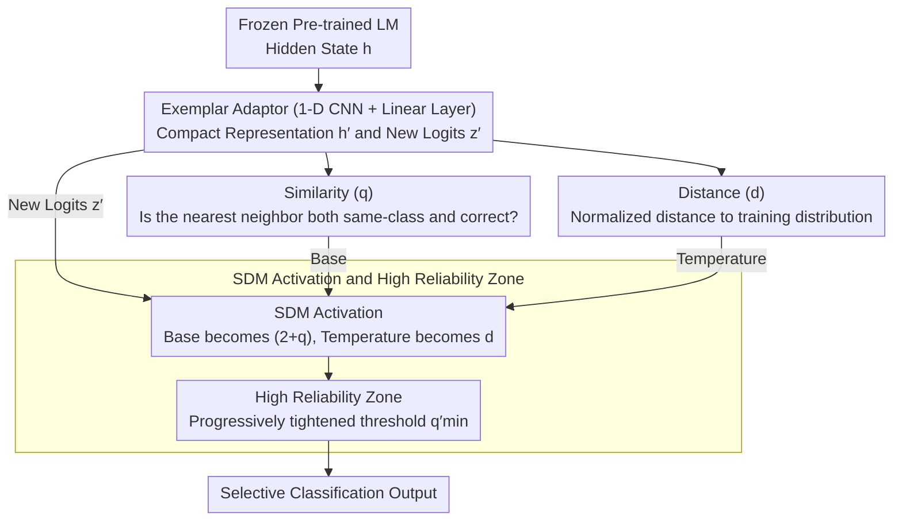

# Similarity-Distance-Magnitude Activations

**Conference**: ACL 2026 Findings  
**arXiv**: [2509.12760](https://arxiv.org/abs/2509.12760)  
**Code**: None  
**Area**: Interpretability / Uncertainty Estimation  
**Keywords**: Activation functions, softmax alternative, selective classification, OOD detection, predictive uncertainty

## TL;DR

This paper proposes the SDM (Similarity-Distance-Magnitude) activation function as a more robust alternative to softmax. It decouples and integrates three epistemic dimensions: the deep matching of correct predictions (Similarity), the distance to the training distribution (Distance), and the decision boundary distance (Magnitude), into a new activation: $\text{sdm}(\mathbf{z}')_i = (2+q)^{d \cdot z'_i} / \sum_c (2+q)^{d \cdot z'_c}$. Based on this, an SDM estimator is constructed for selective classification, proving more robust than existing calibration methods under covariate shift and out-of-distribution inputs.

## Background & Motivation

**Background**: The parameter non-identifiability of neural language models (where multiple sets of parameters can yield the same output distribution) makes direct parameter interpretation extremely difficult. Softmax is the most common activation function for the final output layer, transforming logits into probability distributions. Existing uncertainty quantification methods cover Bayesian (e.g., variational inference), frequentist (e.g., conformal prediction), and empirical approaches (e.g., temperature scaling). However, the prevalence of high-confidence errors and hallucinations in LLMs suggests fundamental deficiencies in these methods.

**Limitations of Prior Work**: Softmax only captures information from one dimension, Magnitude (decision boundary distance), reflecting classification confidence through the relative scale of logits. It ignores two critical epistemic signals: (1) whether the model prediction matches correct prediction patterns in the training set (Similarity); (2) whether the input is within the coverage of the training distribution (Distance). This leads to models outputting high-confidence predictions even when facing out-of-distribution (OOD) inputs.

**Key Challenge**: Effective predictive uncertainty requires decomposing sources of epistemic uncertainty, but the single temperature parameter $\tau$ in softmax cannot achieve instance-level multidimensional uncertainty representation—$\tau$ is a global hyperparameter, and differences between instances are determined solely by logit magnitude.

**Goal**: To design a new activation function that explicitly decomposes and integrates epistemic uncertainty signals from Similarity, Distance, and Magnitude dimensions, providing a more reliable foundation for selective classification.

**Key Insight**: Leveraging the ability of neural networks to act as implicit instance-based metric learners, a compact representation space is constructed using an exemplar adaptor (1-D CNN adaptor) on top of frozen pre-trained LM hidden states to extract Similarity and Distance signals.

**Core Idea**: Replace the fixed base $e$ of softmax with a data-driven base $(2+q)$ (dependent on Similarity) and replace the fixed temperature $\tau$ with an instance-level Distance $d$—allowing the activation function's output to directly encode three dimensions of epistemic uncertainty.

## Method

### Overall Architecture

The SDM system consists of three layers: (1) a frozen pre-trained LM provides hidden states $\mathbf{h}$; (2) an exemplar adaptor (1-D CNN + linear layer) maps $\mathbf{h}$ to a compact representation $\mathbf{h}'$ and new logits $\mathbf{z}'$; (3) the SDM activation layer utilizes $\mathbf{h}'$ to calculate Similarity $q$ and Distance $d$, combining them with $\mathbf{z}'$ to output a calibrated probability distribution. On top of this, the SDM estimator constructs a high-reliability region using data-driven empirical CDF partitioning for selective classification.

### Key Designs

**1. Similarity ($q$): Measuring reliability by whether nearest neighbors are "same-class and correctly predicted"**

High confidence in softmax cannot distinguish between "the model has truly seen similar samples" and "the model is merely extrapolating confidently." Similarity addresses this gap. In the representation space $\mathbf{h}'$ of the exemplar adaptor, the training set is sorted by $L^2$ distance. Starting from the nearest neighbor, the number of consecutive matches satisfying three conditions is accumulated: (a) the training sample prediction matches the current instance $\hat{y} = \hat{y}^{tr}_{(i)}$, (b) the training sample was predicted correctly $\hat{y}^{tr}_{(i)} = y^{tr}_{(i)}$, and (c) the matching chain must not be broken. The result $q \in \{0, \ldots, |D_{tr}|\}$. If the nearest neighbor violates the conditions, $q=0$, providing an immediate OOD signal. Its difference from standard KNN is the simultaneous invocation of ground-truth labels and model predictions—the model is considered reliable in a local region only if the closest neighbors share the same label and were correctly classified by the model.

**2. Distance ($d$): Normalizing distance to training distribution into conservative uncertainty**

While Similarity asks "how similar are the neighbors," Distance asks "is the input still within the distribution." First, compute the $L^2$ distance $d_{\text{nearest}}$ from the test point to the nearest training neighbor. Then, normalize it using the empirical CDF of each category in the calibration set $D_{ca}$: $d = \min[1 - \text{eCDF}^{y_1}_{ca}(d_{\text{nearest}}), \ldots, 1 - \text{eCDF}^{y_C}_{ca}(d_{\text{nearest}})]$. Taking the minimum of the CDFs across all categories is intentionally conservative—as long as the distance is considered anomalous relative to any single category, high uncertainty is triggered. When $d_{\text{nearest}}$ exceeds the maximum distance seen in the labeled data, $d=0$, and SDM degrades into a uniform distribution, expressing complete uncertainty.

**3. SDM Activation and High Reliability (HR) Zone: Encoding 3D signals into probability and slicing credible subsets**

The three dimensions converge in the activation function: $\text{sdm}(\mathbf{z}')_i = (2+q)^{d \cdot z'_i} / \sum_c (2+q)^{d \cdot z'_c}$. This effectively replaces the fixed base $e$ of softmax with a data-driven $(2+q)$ and the fixed temperature with an instance-level $d$; the corresponding loss uses the change-of-base formula $\log_{(2+q)}$. When $q=e-2$ and $d=1$, it degrades precisely to standard softmax. Above this, a credible region is automatically defined: first, calculate a rescaled value $q' = \min(q, (2+q)^{\text{sdm}(\mathbf{z}')_{\hat{y}}})$, then gradually raise the threshold $q'_{\min}$ on the subset where $q' > 0$ until the conformal threshold $\psi_c$ for all categories reaches the target confidence level $\alpha$ (e.g., 0.95). Only predictions satisfying $q' \geq q'_{\min}$ and $\text{sdm}(\mathbf{z}')_{\hat{y}} \geq \psi_{\hat{y}}$ enter the high-reliability region. Progressive tightening brings theoretically guaranteed selective classification, and if no finite $q'_{\min}$ is found, this $\infty$ itself serves as a clear warning that "the model or data is insufficient to support a reliable estimate."

### Loss & Training

The exemplar adaptor (1-D CNN + linear layer) is trained using the SDM loss while freezing the underlying LM parameters. The first round of training is initialized with standard softmax ($q=e-2, d=1$), with $q$ and $d$ recalculated in subsequent rounds. The stopping criterion is the lowest class-balanced loss on the calibration set. Random partitioning and parameter initialization are repeated $J=10$ times to select the global optimum. The CNN uses $M=1000$ filters and is trained for 200 epochs per round.

## Key Experimental Results

### Main Results

**Selective Classification Performance on Sentiment Analysis (In-Distribution, $\alpha=0.95$)**

| Model + Estimator | Class-cond. $y=0$ | $y=1$ | Pred-cond. $\hat{y}=0$ | $\hat{y}=1$ | Admission Rate |
|-----------|---------|-----|------------|------------|---------|
| phi3.5 softmax | 0.98 | 0.86 (<α) | 0.88 (<α) | 0.98 | 0.98 |
| phi3.5 tempScaling | 0.99 | 0.91 (<α) | 0.93 (<α) | 0.99 | 0.90 |
| phi3.5+sdm sdmHR | **1.00** | **0.99** | **0.99** | **1.00** | 0.68 |
| Mixtral8x7B softmax | 0.98 | 0.88 (<α) | 0.89 (<α) | 0.98 | 1.00 |
| Mixtral8x7B+sdm sdmHR | **0.99** | **0.98** | **0.99** | **0.98** | 0.74 |

**Sentiment Analysis OOD (Out-of-Distribution)**

| Model + Estimator | Class-cond. $y=0$ | $y=1$ | Admission Rate | Description |
|-----------|---------|-----|---------|------|
| phi3.5 softmax | 1.00 | 0.54 (<α) | 0.96 | Overconfident, high error |
| phi3.5 APS | 1.00 | 0.59 (<α) | 0.77 | Still fails to meet target |
| phi3.5+sdm sdmHR | **1.00** | **1.00** | **0.01** | Rejects almost all OOD |

### Ablation Study

| Component | Effect | Description |
|------|------|------|
| Softmax (No Adaptor) | Performance fails to meet class-cond. target | Lacks Similarity and Distance |
| Softmax (With Adaptor) | ID pass but OOD fail | Better representation but no distance awareness |
| Softmax($d \cdot \mathbf{z}'$) | Excessive conservatism (Low ID admission) | Uses Distance as temperature only, lacks Similarity |
| sdm$_\alpha$ (Simple Threshold) | Pred-cond. pass but class-cond. not guaranteed | Lacks HR zone constraints |
| **sdmHR (Full Estimator)** | **Both condition types meet target** | 3D synergy: Similarity+Distance+Magnitude |

### Key Findings

- On in-distribution data, softmax/tempScaling/APS/RAPS estimators without adaptors generally exhibit overconfidence, with class-conditional accuracy falling below the target $\alpha=0.95$.
- On out-of-distribution data, the difference is even more dramatic—the sdmHR estimator for phi3.5+sdm reduces the admission rate for SentimentOOD to approximately 1% (rejecting nearly all), while softmax still admits 96% of OOD data with only 0.54 accuracy for the y=1 class.
- When Algorithm 1 returns $q'_{\min} = \infty$, it provides a practical indicator that the model or data is insufficient to support a reliable estimate.
- On the Factcheck task, softmax and APS fail significantly in class-conditional accuracy on the covariate-shift test set, while sdmHR maintains reliability by appropriately tightening the admission range.

## Highlights & Insights

- The definition of Similarity is clever—it requires not only that nearest neighbors share labels but also that the model's predictions for these neighbors are correct and consecutive. This adds a "reliability of the model in that region" dimension beyond traditional KNN.
- The mathematical form of SDM is elegant—generalizing the base and temperature of softmax from fixed constants to data-driven, instance-level variables. It gracefully degrades to standard softmax when $q=e-2, d=1$.
- The concept of the High Reliability Zone has direct value for multi-stage LLM pipelines—automatically routing predictions in the HR zone while triaging others to more expensive tools or human review.

## Limitations & Future Work

- The exemplar adaptor requires maintaining the full training set for Similarity and Distance calculations, posing storage and retrieval efficiency challenges for large-scale datasets.
- Validation is limited to binary classification tasks (sentiment analysis, fact checking); further testing on multi-class and more complex NLP tasks is needed.
- Calculating $q$ requires traversing the training set for distance-based sorting, necessitating optimization of real-time inference latency (potentially through approximate nearest neighbor search).
- It assumes that the exemplar adaptor can effectively learn discriminative representations on top of a frozen LM; this assumption may not hold for all tasks.

## Related Work & Insights

- **vs Temperature Scaling**: While temperature scaling is a single-parameter global calibration, SDM provides instance-level multi-dimensional calibration, showing significant advantages in OOD scenarios.
- **vs Conformal Prediction (APS/RAPS)**: Marginal coverage guarantees of conformal methods are not directly applicable to selective classification (where set size = 1 is required). SDM provides class-conditional coverage through the special construction of the HR zone.
- **vs VBLL**: Variational Bayesian last layers outperform softmax/tempScaling on OOD data but are still less robust than SDM in extreme OOD scenarios.
- **vs Exemplar-based Methods**: SDM elevates exemplar matching from a post-hoc explanatory tool to a core component of the activation function.

## Rating

- Novelty: ⭐⭐⭐⭐⭐ Generalizing softmax parameters into data-driven variables is a pioneering approach to 3D epistemic uncertainty decomposition.
- Experimental Thoroughness: ⭐⭐⭐⭐ Systematic comparison of ID/OOD/Far-OOD and ablation of multiple estimators, though the task range is narrow (binary classification only).
- Writing Quality: ⭐⭐⭐⭐⭐ Rigorous mathematical derivation with a clear path from softmax to SDM and a consistent notation system.
- Value: ⭐⭐⭐⭐ Provides a theoretically grounded solution for uncertainty quantification in LLM deployment, with broad potential for the HR zone concept.

<!-- RELATED:START -->

## Related Papers

- [\[ICLR 2026\] Conjuring Semantic Similarity](../../ICLR2026/interpretability/conjuring_semantic_similarity.md)
- [\[ACL 2026\] From Weights to Activations: Is Steering the Next Frontier of Adaptation?](from_weights_to_activations_is_steering_the_next_frontier_of_adaptation.md)
- [\[ICLR 2026\] Partial Soft-Matching Distance for Neural Representational Comparison with Partial Unit Correspondence](../../ICLR2026/interpretability/partial_soft-matching_distance_for_neural_representational_comparison_with_parti.md)
- [\[ICLR 2026\] Circuit Insights: Towards Interpretability Beyond Activations](../../ICLR2026/interpretability/circuit_insights_towards_interpretability_beyond_activations.md)
- [\[ICLR 2026\] Negative Pre-activations Differentiate Syntax](../../ICLR2026/interpretability/negative_pre-activations_differentiate_syntax.md)

<!-- RELATED:END -->
