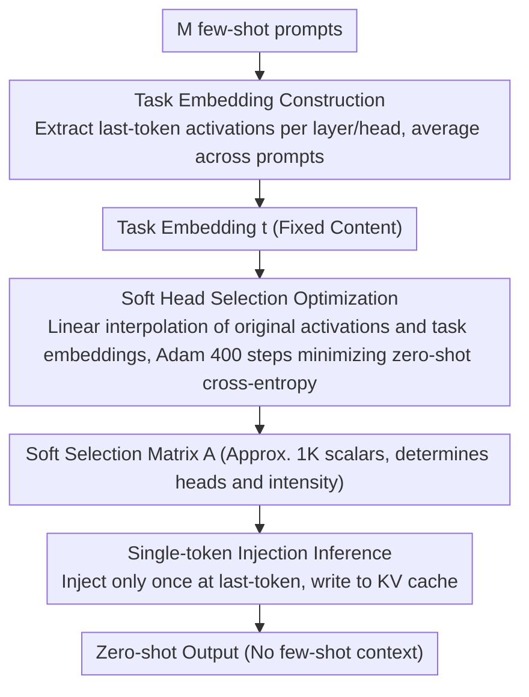

# SITE: Soft Head Selection for Injecting ICL-Derived Task Embeddings

**Conference**: ACL 2026 Findings  
**arXiv**: [2507.20906](https://arxiv.org/abs/2507.20906)  
**Code**: [https://github.com/SNU-DRL/Soft_Injection](https://github.com/SNU-DRL/Soft_Injection)  
**Area**: Interpretability / Parameter-Efficient Adaptation  
**Keywords**: Attention Head Selection, Task Embedding, In-Context Learning, Activation Patching, Parameter-Efficient

## TL;DR

SITE proposes a gradient-optimized soft attention head selection method that identifies task-relevant heads to effectively inject ICL-derived task embeddings. It significantly outperforms ICL and existing embedding methods across 12 LLMs (4B-70B) while achieving performance comparable to PEFT with far fewer trainable parameters.

## Background & Motivation

**Background**: Task adaptation for LLMs primarily follows three paradigms: Parameter-Efficient Fine-Tuning (PEFT, e.g., LoRA) which performs well but requires training; In-Context Learning (ICL) which requires no training but increases inference costs; and embedding injection methods that extract task embeddings from ICL activations and inject them during inference.

**Limitations of Prior Work**: ICL-driven embedding injection methods are conceptually attractive but have failed to demonstrate consistent advantages over PEFT or ICL in practice. Existing methods (e.g., FV, TV, MTV, I2CL) rely on heuristic rules or restricted search spaces to determine extraction and injection locations, and most are evaluated only on simple classification tasks.

**Key Challenge**: Task-relevant information is distributed non-uniformly across attention heads and varies by task—randomly selecting heads for patching leads to severe performance fluctuations, yet existing methods lack efficient head selection mechanisms.

**Goal**: To develop an ICL-driven embedding injection method that achieves performance close to PEFT with fewer parameters while significantly outperforming ICL.

**Key Insight**: Formalize attention head selection as a continuous optimization problem. Use gradient descent to learn importance parameters for each head (soft selection) to efficiently identify injection locations for task embeddings.

**Core Idea**: Use learnable soft selection parameters for linear interpolation between original activations and task embeddings. By optimizing only $L \times H$ scalar parameters (approx. 1K), precise identification and efficient injection of task-relevant heads are achieved.

## Method

### Overall Architecture

SITE decomposes "task adaptation" into two components: content and location, arguing that location is critical. Given a task, it first compresses ICL activations from several few-shot prompts into a fixed task embedding (content). It then learns a set of soft selection parameters to decide which attention heads to inject and to what degree (location). During inference, injection occurs only at the last token of the input; once written to the KV cache, autoregressive decoding proceeds normally. The LLM remains frozen, with only ~1K scalars optimized. The output is a zero-shot model that carries task information without requiring a few-shot context.

### Key Designs

**1. Task Embedding Construction: Averaging few-shot activations into a task-level representation**

To solidify "what the task is" from ICL, the method extracts last-token activations $\mathbf{t}_m^{(l,h)}$ per layer and head for $M$ few-shot prompts (each containing $N$ input-output examples). These are averaged across $M$ prompts to obtain the task embedding $\mathbf{t}^{(l,h)} = \frac{1}{M}\sum_m \mathbf{t}_m^{(l,h)}[-1,:]$. This averaging removes instance-specific noise from individual prompts, leaving stable task-level signals. Experiments show minimal performance degradation even with $M=1$, indicating low sensitivity to the number of samples.

**2. Soft Selection Optimization: Turning discrete selection into a differentiable problem using continuous interpolation**

Task information is unevenly distributed and shifts across tasks. Since random head patching causes unstable performance, the core challenge is identifying which heads to patch. SITE introduces a learnable matrix $\mathbf{A} \in [0,1]^{L \times H}$. Each $\alpha^{(l,h)}$ (parameterized via sigmoid to [0,1]) controls the injection intensity for its corresponding head. During zero-shot inference, the last-token activation of a head is replaced by a linear interpolation: $\mathbf{o}^{(l,h)} \leftarrow (1-\alpha^{(l,h)}) \cdot \mathbf{o}^{(l,h)} + \alpha^{(l,h)} \cdot \mathbf{t}^{(l,h)}$. This relaxes the "which heads to select" problem into continuous optimization solvable by 400 steps of Adam gradient descent. Crucially, it only optimizes injection locations without modifying embedding content, requiring only 1.02K parameters—three orders of magnitude fewer than LoRA's 3407K.

**3. Single-token Injection Inference: Minimizing disturbance to generation**

Excessive injection can interfere with autoregressive generation. SITE limits intervention to a single instance: injection happens only at the last-token position of the initial prompt. The information is written into the KV cache, and subsequent token decoding proceeds without further intervention. This single-point intervention reduces implementation complexity and avoids cumulative damage to generation quality.

### Loss & Training

The optimization objective is the cross-entropy loss under zero-shot inference. Checkpoints are selected using a validation set every 50 steps. No regularization or model-specific hyperparameter tuning is required.

## Key Experimental Results

### Main Results

**Llama-3.1-8B Average across Four Benchmarks**

| Method | Type | Trainable Params | FV (57 tasks) | ANLI | MMLU-Pro | BBH | Avg |
|------|------|-----------|---------------|------|---------|-----|-----|
| LoRA | PEFT | 3407K | 86.76 | 45.82 | 41.04 | 60.39 | 58.50 |
| 10-shot ICL | ICL | 0 | 76.76 | 43.96 | 36.47 | 47.17 | 51.09 |
| I2CL | Emb | 0.13K | 79.89 | 28.01 | 27.14 | 50.60 | 46.41 |
| **Ours (M=50)** | Emb | **1.02K** | **90.02** | **47.31** | **38.78** | **58.04** | **58.54** |

### Ablation Study

| Configuration | Key Metrics | Description |
|------|---------|------|
| SITE M=50 | 58.54 avg | Optimal |
| SITE M=1 | 57.50 avg | Slight drop, insensitive to M |
| Random Head Patching | Unstable | Performance highly dependent on selected heads |
| Low-$\alpha$ Head Patching | 6.2 avg | Performance collapse, validates selection effectiveness |
| High-$\alpha$ Head Patching | 57.3 avg | Close to SITE |

### Key Findings

- SITE outperforms LoRA on the FV (90.02 vs 86.76) and ANLI benchmarks, achieving PEFT-level performance with 0.03% of the parameters.
- Consistently outperforms 10-shot ICL by 10.2-14.3 percentage points across 12 LLMs (4B-70B).
- Optimized soft selection parameters show a near-binary distribution, suggesting task-relevance of attention heads is largely "all-or-nothing."
- Cross-task activation patching analysis reveals that similar tasks share important attention heads, while dissimilar tasks have non-overlapping important heads, indicating strong task specificity.
- A gap persists compared to PEFT on MMLU-Pro and BBH, suggesting that ICL-derived task embeddings have limited expressive power for complex reasoning.

## Highlights & Insights

- Achieving the performance of 3.4M parameters with only 1K parameters is remarkable—the core insight is that "injection location is more important than injection content."
- The near-binary selection parameters and cross-task head sharing analysis provide new mechanistic interpretability insights, confirming that attention heads perform task-specific functions.
- The minimalist design (no regularization, no model-specific tuning, 400-step training) makes the method highly reproducible and easy to deploy.

## Limitations & Future Work

- Gaps remain compared to LoRA on benchmarks requiring complex reasoning (MMLU-Pro, BBH).
- Each task requires an independently optimized set of selection parameters; scalability in multi-task scenarios remains to be verified.
- Injection is limited to the last-token position, which may restrict the representational capacity of task information.
- Task embeddings are fixed and cannot adapt to intra-task variations (e.g., samples of varying difficulty).

## Related Work & Insights

- **vs FV/TV**: These methods use heuristic search or activation patching to determine injection locations; SITE uses more efficient gradient optimization.
- **vs LoRA**: LoRA modifies model weights, while SITE only modifies activations of specific heads. The parameter count differs by 3000x, yet performance is comparable.

## Rating

- Novelty: ⭐⭐⭐⭐⭐ The formalization of soft head selection and the "location over content" insight are highly novel.
- Experimental Thoroughness: ⭐⭐⭐⭐⭐ 12 models, four benchmarks, comprehensive activation patching analysis, and cross-task analysis.
- Writing Quality: ⭐⭐⭐⭐⭐ Clear methodology and rigorous experimental logic.
- Value: ⭐⭐⭐⭐⭐ Provides an extreme parameter-efficient adaptation solution and new understanding of attention head functionality.

<!-- RELATED:START -->

## Related Papers

- [\[ACL 2026\] Style over Story: Measuring LLM Narrative Preferences via Structured Selection](style_over_story_measuring_llm_narrative_preferences_via_structured_selection.md)
- [\[ICLR 2026\] Bridging Explainability and Embeddings: BEE Aware of Spuriousness](../../ICLR2026/interpretability/bridging_explainability_and_embeddings_bee_aware_of_spuriousness.md)
- [\[ICLR 2026\] Cross-Modal Redundancy and the Geometry of Vision-Language Embeddings](../../ICLR2026/interpretability/cross-modal_redundancy_and_the_geometry_of_vision-language_embeddings.md)
- [\[AAAI 2026\] Unsupervised Feature Selection Through Group Discovery](../../AAAI2026/interpretability/unsupervised_feature_selection_through_group_discovery.md)
- [\[ACL 2026\] Learning What Matters: Dynamic Dimension Selection and Aggregation for Interpretable Vision-Language Reward Modeling](learning_what_matters_dynamic_dimension_selection_and_aggregation_for_interpreta.md)

<!-- RELATED:END -->
