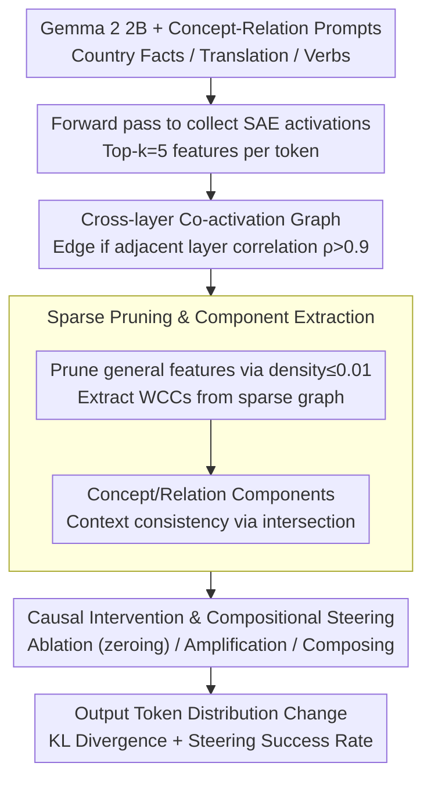

# Sparse Feature Coactivation Reveals Causal Semantic Modules in Large Language Models

**Conference**: ACL2026  
**arXiv**: [2506.18141](https://arxiv.org/abs/2506.18141)  
**Code**: https://github.com/shanestorks/SAE-Semantic-Modules  
**Area**: LLM Interpretability / Mechanistic Interpretability / Knowledge Representation  
**Keywords**: Sparse Autoencoders, Feature Co-activation, Semantic Modules, Causal Interventions, Model Control

## TL;DR
This paper automatically discovers semantic modules representing concepts and relations in LLMs via cross-layer co-activation graphs of SAE features from few prompts. It demonstrates that ablating or amplifying these modules allows for predictable manipulation of relational reasoning in Gemma 2 2B, achieving success rates up to 98% in single concept/relation scenarios and 90% in compositional scenarios.

## Background & Motivation
**Background**: Mechanistic interpretability recently utilizes sparse autoencoders (SAEs) to extract interpretable features from LLM activations. SAEs decompose dense activations into sparse, monosemantic feature directions, enabling researchers to analyze how specific concepts, entities, or behaviors are activated within the model.

**Limitations of Prior Work**: Individual SAE features are often still polysemantic or unstable. While cross-layer transcoders and circuit tracing can map information flow, the resulting graphs often contain hundreds of nodes and dense connections, requiring heavy manual effort for interpretation. Furthermore, relational reasoning (e.g., "The capital of China is Beijing") involves the composition of concepts (China) and relations (capital city), which is difficult to explain via a single-layer linear direction or a standalone feature.

**Key Challenge**: Knowledge in LLMs is likely distributed across multiple features and layers. Functional modules co-activated across layers, rather than isolated features, drive model behavior. Interpretability methods must be fine-grained yet automated and amenable to intervention.

**Goal**: The authors aim to construct inter-layer feature networks from SAE activations of minimal prompts to automatically extract components that are semantically and contextually consistent, causally relevant to the output, and capable of compositional steering.

**Key Insight**: If multiple SAE features are highly correlated and activated across adjacent layers on the same prompt token sequences, they likely belong to the same computational module. By filtering out high-density universal features, sparse and interpretable weakly connected components (WCCs) can be identified.

**Core Idea**: Treat SAE features as graph nodes and establish edges based on cross-layer co-activation correlation. Use connected components as concept or relation modules and validate their causal functions through ablation and amplification.

## Method

### Overall Architecture

The method addresses the problem that knowledge in LLMs is typically represented by a group of features co-activated across layers rather than an isolated SAE feature. The pipeline starts with concept-relation prediction prompts (country facts, word translation, verb transformation) for Gemma 2 2B. First, SAE activations for each layer are collected during forward passes, taking the top features per token. Nodes are connected into a graph based on cross-layer co-activation correlations. After pruning high-density general-purpose features, components are extracted using weakly connected components. Finally, causal functionality is verified by performing ablation, amplification, and compositional interventions on these components, observing whether the output token distribution changes as predicted.

### Key Designs

**1. Cross-layer Feature Co-activation Graph: Defining Modules by Co-occurrence**

Automated descriptions of single SAE features are often unreliable—for instance, the description for a "Spain" component might not contain the word "Spain," and a translation language component might even be mislabeled as "programming." Instead of relying on text, the method utilizes internal dynamics: features $(\ell,i)$ are linked if their activation correlation $\rho > 0.9$ across adjacent layers. This graph captures "features working together in the same context," organizing discrete features into an interpretable cross-layer network.

**2. Sparse Pruning and Component Extraction: Filtering General Computation**

High-density features often carry syntax or general computation, making components uninterpretable. Using activation density from Neuronpedia, only sparse features with $d_{\ell,i} \leq 0.01$ are retained, and isolated points are removed. To ensure context consistency, a "concept component" is defined as the intersection of components obtained for the same concept across multiple relations, while a "relation component" is the intersection for the same relation across multiple concepts. This ensures the "China" component remains stable across prompts for capital, currency, or language.

**3. Causal Intervention and Compositional Steering: Defining Causal Modules via Control**

Task relevance alone is insufficient; components must exercise causal control over the output. The method performs ablation (zeroing SAE activations and reconstructing via the decoder) for in-prompt components and amplification (scaling activations relative to observed maximums) for target components. Success is measured by the output shift toward the target concept, relation, or their combination. Compositional steering tests whether concepts and relations can be manipulated independently (e.g., changing "Capital of China" to "Currency of Nigeria").

### Loss & Training

The paper does not train new models, utilizing Gemma 2 2B and pre-trained Gemma Scope JumpReLU SAEs. Core hyperparameters include selecting top-$k=5$ activated features per layer/token, a cross-layer correlation threshold $\tau_{corr}=0.9$, and a feature density threshold $\tau_{density}=0.01$. Interventions are implemented using TransformerLens. Success rates are evaluated on zero-shot templates different from those used to gather activations to test contextual generalization.

## Key Experimental Results

### Main Results

| Task | # Concepts / # Relations | Base Model Accuracy | Concept Steering Avg SR | Relation Steering Avg SR | Compositional Steering Avg SR |
| :--- | :--- | :--- | :--- | :--- | :--- |
| Country facts | 10 countries / 3 facts | 100% | 96% | 93% | 90% |
| Word translation | 11 words / 3 languages | 100% | 75% | 98% | 64% |
| Verb transformation | 8 verbs / 5 relations | 100% | 48% | 23% | 19% |
| Max Single Case | Selected relations | 100% | up to 98% | up to 100% | up to 100% |
| Overall Conclusion | Three task types | 100% | up to 98% | up to 98% | up to 90% |

### Ablation Study

| Configuration | Key Metrics | Description |
| :--- | :--- | :--- |
| Full component, country facts | Concept/Rel/Comp SR = 96% / 93% / 90% | Manipulating the full semantic module |
| Single most causal feature baseline | Concept/Rel/Comp SR = 83% / 83% / 75% | Smallest intervention on feature with max KL |
| Ablate country-fact components | Other country facts acc 1.00, trans 0.93, verb 1.00 | Modules are mostly task-specific |
| Ablate word-translation components | country facts 1.00, trans 0.83, verb 1.00 | Slight overlap between same-task relations |
| Ablate verb-transformation components | country facts 0.73, trans 0.64, verb 0.63 | Verb modules are less specific, yielding lower SR |
| Transcoder proof-of-concept | ~27% steering success | Method is transferable but significantly weaker than SAE |

### Key Findings
- 2-3 components typically have a significantly higher causal effect on output distribution, indicating task-related computation is not uniformly distributed across all activations.
- Concept components appear earlier: 8/10 country components start from Layer 1, as do word/verb components. Relation components are concentrated in later layers, often spanning the final 1/4 to 1/2 of the model.
- Components for country facts and translation show strong compositionality, enabling counterfactual steering (e.g., from "Capital of China" to "Currency of Nigeria"). Verb transformations (synonyms, antonyms) are harder to steer as they depend more on lexical semantics and context.
- Full components significantly outperform single features, supporting the view that concepts are distributed functional directions rather than single features.

## Highlights & Insights
- The transition from "finding features" to "finding feature modules" aligns better with the intuition of distributed representations and provides more stable steering.
- The co-activation graph is a lightweight yet effective intermediate representation. It avoids the complexity of full circuit tracing and the need to train probing models.
- The discovery of early concepts and late relations suggests entity information is established early, while abstract relations or operations are composed in later layers.
- Compositional steering is valuable for knowledge editing and safety. Independent control over concepts and relations enables fine-grained fact correction or behavioral constraints.

## Limitations & Future Work
- Experiments are limited to 3 small-scale multi-relation tasks where the base model has 100% accuracy. Generalization to open QA, multi-hop facts, or subjective relations is unknown.
- Component selection relies on manual heuristics. While WCC extraction is automated, deciding which components represent a concept and whether to use intersections/unions depends on task knowledge.
- The study primarily uses Gemma 2 2B. Stability across different architectures, scales, and SAE qualities requires further validation.
- Filtering high-density features excludes critical general computation. Ablating these features causes structural collapse, indicating they likely perform essential but unexplained functions.
- Transcoder migration only achieved ~27% success, suggesting co-activation components are not yet a "plug-and-play" solution for all dictionary or circuit tools.

## Related Work & Insights
- **vs. Single Feature SAE Analysis**: Single features are easier to interpret but incomplete. This paper emphasizes cross-layer groups to capture concepts more holistically.
- **vs. Circuit Tracing / Transcoders**: Circuit tracing is more granular but produces complex, high-cost graphs. Co-activation provides a lightweight module-level explanation.
- **vs. Knowledge Neurons / Causal Tracing**: While knowledge neurons focus on specific layers or neurons, this work focuses on SAE feature components and enables compositional counterfactual steering.
- **vs. Function/Relation Vectors**: Unlike relation vectors that treat relations as linear directions or attention functions, this provides a feature-level modular view, explaining why certain relations like synonyms/antonyms are harder to modularize.

## Rating
- Novelty: ⭐⭐⭐⭐⭐ Automated extraction of causal semantic modules from SAE co-activation is highly innovative.
- Experimental Thoroughness: ⭐⭐⭐⭐ Extensive analysis of intervention, composition, specificity, and layer distribution, though tasks and model size are limited.
- Writing Quality: ⭐⭐⭐⭐ Clear methodology and comprehensive tables, though heuristic selection could be more systematic.
- Value: ⭐⭐⭐⭐⭐ Highly insightful for mechanistic interpretability, model editing, and controlled generation; code release adds significant reproducibility value.

<!-- RELATED:START -->

## Related Papers

- [\[ACL 2026\] METER: Evaluating Multi-Level Contextual Causal Reasoning in Large Language Models](meter_evaluating_multi-level_contextual_causal_reasoning_in_large_language_model.md)
- [\[ACL 2026\] Preference Heads in Large Language Models: A Mechanistic Framework for Interpretable Personalization](preference_heads_in_large_language_models_a_mechanistic_framework_for_interpreta.md)
- [\[ICML 2026\] Towards Atoms of Large Language Models](../../ICML2026/interpretability/towards_atoms_of_large_language_models.md)
- [\[ACL 2026\] Tracing Relational Knowledge Recall in Large Language Models](tracing_relational_knowledge_recall_in_large_language_models.md)
- [\[ACL 2026\] Knowledge Vector of Logical Reasoning in Large Language Models](knowledge_vector_of_logical_reasoning_in_large_language_models.md)

<!-- RELATED:END -->
