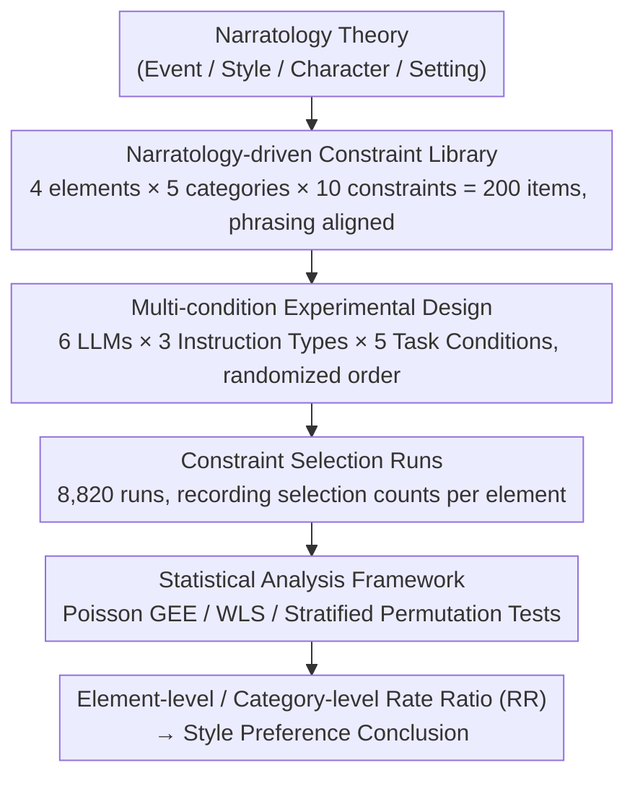

# Style over Story: Measuring LLM Narrative Preferences via Structured Selection

**Conference**: ACL 2026 Findings  
**arXiv**: [2510.02025](https://arxiv.org/abs/2510.02025)  
**Code**: None  
**Area**: Interpretability / Text Generation  
**Keywords**: Narrative Preferences, LLM Bias, Constrained Selection, Narratology, Style Preference

## TL;DR

This work designs an experimental paradigm based on constrained selection to measure the narrative preferences of LLMs. Using a library of 200 constraints constructed from narratology theory, 6 LLMs were evaluated across different instruction types. The study found that models systematically prioritize "Style" over content elements such as "Event," "Character," and "Setting."

## Background & Motivation

**Background**: Novelists have begun exploring LLMs for writing assistance, but research suggests that LLM usage may reduce narrative plot diversity, collective creativity, and individual writing style. Existing LLM preference studies have identified political biases and personality traits, but narrative preferences remain unexplored.

**Limitations of Prior Work**: (1) Existing narrative studies focus on analyzing generated outputs (e.g., plot coherence, linguistic complexity), which cannot directly characterize latent narrative preferences; (2) Output analysis conflates preference with capability—a model might not generate a certain narrative because it lacks the capability, not necessarily the preference; (3) LLM-generated texts exhibit significant stylistic uniformity, yet the underlying preference structure is poorly understood.

**Key Challenge**: Without understanding the latent narrative preferences of LLMs, it is impossible to distinguish "deliberate creative choices" from "systemic biases," which has significant implications for the practice of AI-assisted writing.

**Goal**: To design a measurement method that isolates "preference" from "capability" and quantitatively characterizes the narrative preference structure of LLMs.

**Key Insight**: Asking models to select rather than generate—isolating preferences through structured selection tasks and using narratology theory to construct an interpretable constraint library.

**Core Idea**: A constrained selection paradigm—providing a candidate set of constraints driven by narratology theory and allowing the model to choose which constraints to use, treating selection behavior as a proxy for latent preference.

## Method

### Overall Architecture

The Mechanism aims to decouple "preference" from "capability": directly analyzing generated text cannot determine if the absence of a narrative type is due to lack of preference or lack of skill. The approach shifts from generation to selection—first building a library of 200 narrative constraints based on narratology, then having 6 commercial LLMs select constraints to be used under various instructions and task conditions. Selection frequency serves as a proxy for latent preference. The input is a structured set of constraint candidates; the process involves 8,820 randomized selection runs; the output is estimated via statistical models as element-level selection rate ratios (RR).

### Key Designs

**1. Narratology-driven Constraint Library: Using theory to anchor candidates for interpretability**

If candidate constraints lack theoretical structure, selection behavior cannot be meaningfully analyzed. Thus, the library is strictly built following classical and contemporary narratology, decomposing narrative into four core elements: Event (plot dynamics), Style (voice/tone/narration), Character (agency), and Setting (space/context). Each element has 5 categories with 10 constraints each (200 total), annotated with 1-3 axial attributes. To minimize surface-level selection bias, all constraints are normalized to 15-20 words with parallel syntax and matched conceptual granularity, ensuring choices reflect narrative preferences rather than phrasing differences.

**2. Multi-condition Experimental Design: Using condition comparisons to separate preferences from task artifacts**

Selection under a single task setting might be biased by budget or label structures. Therefore, 5 task conditions were designed—intra-element free budget (1-1), intra-element fixed budget (1-2), pooled unlabeled free (2-1), pooled unlabeled fixed (2-2), and element-blocked quota (3)—overlaid with 3 instruction types: Basic, Quality, and Creative. The pooled unlabeled fixed budget (2-2) serves as the baseline, as it most closely reflects the model's native preference structure without external constraints. A preference is considered genuine only if it remains stable across multiple conditions.

**3. Statistical Analysis Framework: Selecting appropriate models for clustered count data**

Selection data consists of counts clustered by run. Therefore, Poisson GEE (with the run as the clustering unit) is used to estimate element-level and category-level Rate Ratios (RR). K-weighted WLS is used for comparisons across conditions, and stratified permutation tests assess the significance of axial richness. This combination respects the count nature of the data while providing reliable intervals and significance levels despite correlations from repeated runs.

### Loss & Training

A pure inference experiment involving no training. This work evaluates 6 commercial LLMs, including GPT-4.1, GPT-5, o4-mini, Claude, Gemini, and Qwen.

## Key Experimental Results

### Main Results

**Element-level Rate Ratios (vs. Event baseline, Poisson GEE)**

| Element | RR [95% CI] | p |
|---------|-------------|---|
| Event (Baseline) | 1.00 | — |
| **Style** | **1.78** [1.74, 1.82] | <.001 |
| Character | 0.98 [0.96, 1.01] | .160 |
| Setting | 1.28 [1.25, 1.31] | <.001 |

### Ablation Study

**Cross-model Stability**

| Finding | Description |
|---------|-------------|
| Style Preference | Consistently highest across all 6 models. |
| GPT-4.1 Specificity | Strongest Style preference; lowest for all other elements. |
| Instruction Sensitivity | Style remains stable across instructions; content elements are influenced by creative instructions. |

### Key Findings

- All LLMs systematically prioritize Style constraints, with a selection rate 78% higher than Event.
- Style preference is highly stable across models and instruction types, while content elements (Event/Character/Setting) show greater cross-model variance and instruction sensitivity.
- GPT-4.1 acts as a "Style preference amplifier," appearing at the extreme in all comparisons.
- Creative-oriented instructions alter the axial distribution but do not change the element-level ranking—Style always ranks first.
- Selection behavior is consistent with the stylistic uniformity found in output analysis studies—LLMs indeed possess systematic preferences for style.

## Highlights & Insights

- **Paradigm Innovation**: The "selection instead of generation" approach effectively isolates preference from capability, filling a gap that output analysis cannot reach.
- **Style over Story**: The finding provides a practical warning for AI-assisted writing—if LLMs systematically prefer style, AI-assisted literature may trend toward surface-level sophistication while remaining narratively monotonous.
- **Reusable Tool**: The constraint library itself serves as a research tool for future narrative preference evaluations of any LLM.

## Limitations & Future Work

- The relationship between selection preference and actual generation behavior has not been directly validated.
- The evaluation is limited to commercial LLMs and does not include open-source models or comparisons across different model scales.
- Although theory-driven, the constraint library remains a subjective design; different narratological frameworks might yield different classifications.
- The source of the preference—whether it stems from training data bias or architectural characteristics—has not been explored.

## Related Work & Insights

- **vs. LLM Preference Measurement (Rozado 2024, Political Bias)**: While the latter focuses on the political domain, this work expands measurement to the narrative domain for the first time.
- **vs. Output Analysis (Chakrabarty et al., 2024)**: While the latter analyzes the quality of generated text, this work directly measures preference through choice—offering a complementary rather than alternative approach.

## Rating

- Novelty: ⭐⭐⭐⭐⭐ First systematic measurement of LLM narrative preference; both paradigm and findings are original.
- Experimental Thoroughness: ⭐⭐⭐⭐⭐ 6 models × 3 instructions × 5 conditions × 8,820 runs + rigorous statistics.
- Writing Quality: ⭐⭐⭐⭐⭐ Elegant integration of narratology theory and computational experiments.
- Value: ⭐⭐⭐⭐ Significant implications for AI-assisted creation and LLM bias research.

<!-- RELATED:START -->

## Related Papers

- [\[ACL 2026\] Interpreting Style Representations via Style-Eliciting Prompts](interpreting_style_representations_via_style-eliciting_prompts.md)
- [\[NeurIPS 2025\] Deep Value Benchmark: Measuring Whether Models Generalize Deep Values or Shallow Preferences](../../NeurIPS2025/interpretability/deep_value_benchmark_measuring_whether_models_generalize_deep_values_or_shallow_.md)
- [\[ICLR 2026\] Semantic Regexes: Auto-Interpreting LLM Features with a Structured Language](../../ICLR2026/interpretability/semantic_regexes_auto-interpreting_llm_features_with_a_structured_language_of_re.md)
- [\[ACL 2026\] SITE: Soft Head Selection for Injecting ICL-Derived Task Embeddings](soft_head_selection_for_injecting_icl-derived_task_embeddings.md)
- [\[ACL 2026\] A Structured Clustering Approach for Inducing Media Narratives](a_structured_clustering_approach_for_inducing_media_narratives.md)

<!-- RELATED:END -->
