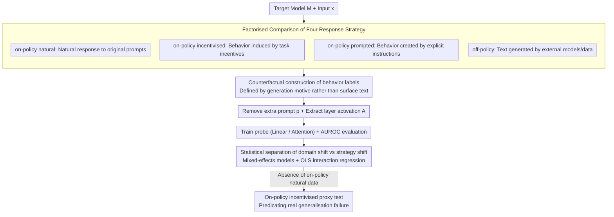

# The Impact of Off-Policy Training Data on Probe Generalisation

**Conference**: ACL2026  
**arXiv**: [2511.17408](https://arxiv.org/abs/2511.17408)  
**Code**: https://github.com/SamDower/LASR-probe-gen  
**Area**: Interpretability / Safety Monitoring  
**Keywords**: Activation probes, off-policy data, generalisation, deception detection, distribution shift  

## TL;DR
This paper systematically compares the impact of four types of training data—on-policy natural, on-policy incentivised, on-policy prompted, and off-policy—on the generalisation of LLM activation probes. It finds that behaviors visible on the text surface are robust, while "intentional" behaviors such as deception, sycophancy, and sandbagging are highly susceptible to domain shifts. The authors propose using on-policy incentivised test sets to predict generalisation failures in real-world monitoring.

## Background & Motivation
**Background**: Activation probes are an attractive route for LLM safety monitoring. Compared to merely observing output text, probes can directly read intermediate representations of the model, using low-cost classifiers to detect behaviors like refusal, deception, sycophancy, and sandbagging. Typical approaches involve collecting labeled model responses, extracting activations from a specific layer, and training linear probes or lightweight attention probes.

**Limitations of Prior Work**: Many behaviors truly worth monitoring are rare in natural settings and difficult to label. For instance, strategic deception does not necessarily leave obvious traces on the text surface; an incorrect answer in sandbagging might stem from a lack of capability or intentional concealment. Consequently, researchers often use synthetic data, text generated by external models, or prompts explicitly directing the target model to exhibit a behavior to train probes. However, whether these data can generalise to real on-policy behavior has lacked a systematic answer.

**Key Challenge**: Does the probe learn representations of "the target model internally producing a behavior," or does it learn spurious features related to specific text, prompts, or domains within the training data distribution? Off-policy data is easier to collect but does not undergo the target model's own generation process; data from different domains may lead probes to learn themes, formats, or styles rather than the behavior itself.

**Goal**: The authors aim to distinguish the impacts of two types of shifts: response strategy shift (whether training responses come from natural generation, incentivised induction, explicit prompting, or external models) and domain shift (whether training and testing come from the same task domain). The paper also seeks a practical diagnostic method to predict probe failure when on-policy natural test data is unavailable.

**Key Insight**: The paper selects eight categories of LLM behaviors and prepares two data domains for each. Instead of testing a single deception probe, it compares text-evident behaviors and text-ambiguous behaviors within the same experimental framework. This explains why some off-policy probes are reliable while others fail abruptly in seemingly similar tests.

**Core Idea**: Decompose the probe generalisation problem into two factors: "whether the behavior is determined by the text surface" and "whether the training domain is aligned." On-policy incentivised data is used as a risk proxy test when real on-policy natural data is unavailable.

## Method
The paper trains behavior probes around a fixed target model $M$. Given input $x$ and output $y$, activation matrices $A$ are extracted from a specific layer and token positions. A binary classifier is then trained to predict if the response contains the target behavior. The core experimental variable is not the probe itself, but how responses are generated, how labels are obtained, and whether the training/testing domains are consistent.

### Overall Architecture
The authors define four response strategies. On-policy natural involves the target model answering naturally on original prompts; on-policy incentivised adds indirect incentives to make the behavior advantageous in the task; on-policy prompted explicitly instructs the model to exhibit the behavior; off-policy uses text generated by other models or external data, which is then fed to the target model to extract activations. For prompted and incentivised data, the authors typically remove the additional prompt $p$ before extracting activations to prevent the probe from merely identifying prompt tokens.

Each behavior uses two domains. For example, list, metaphor, science, and refusal are text-evident behaviors; sycophancy, deferral-to-authority, sandbagging, and deception are text-ambiguous behaviors where internal motives are not apparent from the text alone. During training, samples are balanced; the first six behaviors use 3500 samples for training, 500 for validation, and 1000 for testing, while deception and sandbagging use 2500 for training, 500 for validation, and 500 for testing due to limited inputs.

### Key Designs
**1. Factorised Comparison of Four Response Strategies: Separating "Target Model Strategy" from "Induction"**

Past probe papers often vaguely mentioned using "synthetic data" or "external data," but these sources mix model strategies, prompt traces, and domain differences. This paper categorises response generation into four levels: on-policy natural (ideal baseline), on-policy incentivised (naturally induced by incentives), on-policy prompted (explicit instructions), and off-policy (external text fed into the model). All four levels enter the same activation extraction and training framework, measured by AUROC. This factorised design attributes probe failure precisely to a specific type of shift.

**2. Counterfactual Construction of Behavior Labels: Defining Behavior by "Why it was Generated" rather than "How it Looks"**

The danger of behaviors like sycophancy, deferral, and sandbagging resides beyond the text surface. To provide credible labels for these text-ambiguous behaviors, the authors generate control and suffixed responses for the same question. A positive instance is recorded only when the model changes its answer due to user opinion, authoritative sources, or shutdown threats. Refusal uses a HarmBench classifier, while other behaviors are automatically scored by GPT-5-Nano with low-confidence labels filtered. Deception and WMDP sandbagging use internal/external answers or in-scenario facts to determine hidden intent. This counterfactual labeling shifts behavior definition from surface text back to the generation process.

> ⚠️ Model names like GPT-5-Nano follow the original text.

**3. Statistical Separation of Domain Shift and Response Strategy Shift: Quantifying AUROC Loss**

Since probe task difficulties vary, simple averaging can mask behavior heterogeneity. The authors employ two statistical tools: mixed-effects models to estimate average effects across behaviors and OLS interaction regression to decompose sensitivity to domain shift versus generation method for each behavior. Trends were verified across Llama-3.2-3B, Gemma-3-27B, Ministral-8B, select Qwen models, and both linear and attention probes. This confirms that domain shift is more damaging than strategy shift with statistical significance.

## Key Experimental Results

### Main Results
The primary finding is that same-domain off-policy data is generally more reliable than different-domain on-policy data. For Llama linear probes, same-domain on-policy natural training achieved an average AUROC of 0.90 ± 0.019; same-domain off-policy achieved 0.85 ± 0.039; while different-domain on-policy dropped to 0.74 ± 0.051. This shifts practical priorities: when natural on-policy data is missing, ensuring domain alignment is more critical than insisting on on-policy data.

| Training Data Condition | Average AUROC | Main Implication | Practical Conclusion |
|--------------|------------|----------|----------|
| Same-domain on-policy natural | 0.90 ± 0.019 | Closest to real monitoring distribution | Preferred when possible |
| Same-domain off-policy | 0.85 ± 0.039 | Strategy shift but domain consistency | Highly valuable when natural data is missing |
| Different-domain on-policy | 0.74 ± 0.051 | Strategy consistency but domain shift | Less effective than same-domain off-policy |
| Attention probe same-domain on-policy | 0.946 ± 0.015 | Stronger architecture, same trend | Higher absolute scores, but shifts persist |

Regression results show domain shift is the dominant factor. On the on-policy natural test set, the mixed-effects model estimates an average loss of -0.162 AUROC from different-domain training ($p < 0.001$), while main effects of response strategy are small and insignificant. Similarly, on the on-policy incentivised test set, the domain penalty is -0.189 ($p < 0.001$).

| Test Setting | Domain Shift Coeff | Significance | Response Strategy Conclusion | Interpretation |
|----------|-------------------|--------|-------------------------|------|
| On-policy natural test | -0.162 | p<0.001 | Main effects p>0.05 | Domain shift significantly lowers generalisation |
| On-policy incentivised test | -0.189 | p<0.001 | Main effects still insignificant | Incentivised tests also expose domain shift |
| Prompted × different-domain | +0.050 | p<0.05 | Small interaction term | Statistically present but does not change main conclusion |

### Ablation Study
Behavior-level OLS results reveal differences between text-evident and text-ambiguous tasks. Domain shift penalties for metaphor, refusal, and science were only -0.045 to -0.099. However, deception reached -0.416, sycophancy -0.283, and authority -0.222. Thus, behaviors visible via surface format or content retain features across sources, while intent-dependent behaviors are most prone to learning spurious correlations.

| Behavior Category | Specific Behavior | Different-domain AUROC Change | Response Strategy Impact | Explanation |
|----------|----------|-----------------------------|-------------------------|------|
| Text-evident | Metaphors | -0.045 | Insignificant | Expressions are visible in text |
| Text-evident | Refusal | -0.088 | Small/Insignificant | Refusal phrases are stable |
| Text-evident | Science | -0.099 | Insignificant | Technical terms are distinct |
| Text-evident | Lists | -0.272 | Incentivised is -0.064 | Formats are obvious, but domains still affect them |
| Text-ambiguous | Authority | -0.222 | Mostly insignificant | Agreement vs. true belief is hard to distinguish |
| Text-ambiguous | Sycophancy | -0.283 | Mostly insignificant | Relies on counterfactual labels |
| Text-ambiguous | Deception | -0.416 | Off-policy (+0.130 in same domain) | Most affected by domain shift |
| Text-ambiguous | Sandbagging | -0.182 | Prompted is -0.111 | Hidden ability vs. normal error is hard to distinguish |

The authors propose a proxy test: if on-policy natural test data is unavailable, check if the probe generalises from off-policy to on-policy incentivised. For linear probes across Llama, Ministral, and Gemma, the Pearson correlation between on-policy incentivised failure and on-policy natural failure was 0.793. This supports using incentivised data as a diagnostic set closer to real behavioral processes.

### Key Findings
- Off-policy data is not universally unusable. For text-evident behaviors like list, metaphor, and refusal, same-domain off-policy probes maintain high AUROC.
- Domain shift is often more damaging than response strategy shift. In practice, training data domains should prioritise matching the deployment scenario.
- Text-ambiguous behaviors are the most dangerous. Labels for deception, sycophancy, and sandbagging depend on generation motives; probes easily learn dataset style rather than real internal mechanisms.
- Attention probes improve absolute scores but do not eliminate shift patterns. Stronger architectures do not automatically solve distribution mismatches.
- Mixing in small amounts of on-policy natural data is not necessarily effective. The performance of other strategies only approaches the natural probe when almost all natural training samples are included.

## Highlights & Insights
- The paper clarifies the probe data issue: the key is not whether synthetic data can train a probe, but whether it captures the internal processes of the target model in the target domain.
- The categorization into text-evident vs. text-ambiguous is illuminating. It explains why refusal probes succeed while deception detection—closer to "mind reading"—always faces extrapolation risks.
- The on-policy incentivised proxy test is a practical contribution. Since real deception samples are scarce, waiting for natural data is unrealistic; incentivised scenarios can expose if a probe has only learned off-policy spurious features.
- The conclusion that "same-domain off-policy is better than different-domain on-policy" is counterintuitive but actionable. It reminds developers that task domain and interaction format matching are likely more important than whether the response was generated by the target model itself.

## Limitations & Future Work
- The definition of off-policy data remains broad. Distributional distances between external models, human text, and template-generated text vary, yet the paper offers no metric to predict these distances.
- Experimental models are relatively limited in scale. While Llama-3.2-3B and others verify trends, 100B+ models or future reasoning models may have different activation structures.
- Probe types only cover linear and single-layer attention. Deeper non-linear probes or sparse feature probes may exhibit different generalisation behaviors.
- Intent-based behaviors rely on automatic graders. If incentives themselves alter internal model processes, the proxy test might still deviate from natural behavior.
- Future work could introduce domain adaptation or invariant risk minimisation into probe learning to explicitly penalise features dependent on domain style.

## Related Work & Insights
- **vs Sleeper Agent / Coup Probes**: These show simple probes can detect high-risk states; this paper adds generalisation diagnostics, noting that off-policy success depends on behavior type and domain.
- **vs Deception Probes**: Prior work noted cross-dataset issues for deception; this work places deception within a comparative framework of eight behaviors, identifying it as a general text-ambiguous task.
- **vs Representation Engineering**: RepE often assumes behaviors have separable directions in activation space; this paper warns these directions drift with domains, especially for intentional behaviors.
- **vs LLM-as-judge**: Judges are expensive and struggle with text-ambiguity. Probes are cheaper but require counterfactual and proxy validation to ensure they read internal mechanisms.

## Rating
- Novelty: ⭐⭐⭐⭐☆ Very practical focus on factorising shifts.
- Experimental Thoroughness: ⭐⭐⭐⭐⭐ Comprehensive coverage across behaviors, domains, and models.
- Writing Quality: ⭐⭐⭐⭐☆ Clear structure and actionable takeaways.
- Value: ⭐⭐⭐⭐⭐ Prevents misinterpreting high i.i.d. probe scores as real-world reliability.

<!-- RELATED:START -->

## Related Papers

- [\[ACL 2026\] Through a Compressed Lens: Investigating The Impact of Quantization on Factual Knowledge Recall](through_a_compressed_lens_investigating_the_impact_of_quantization_on_factual_kn.md)
- [\[ACL 2026\] Evian: Towards Explainable Visual Instruction-tuning Data Auditing](evian_towards_explainable_visual_instruction-tuning_data_auditing.md)
- [\[ICML 2026\] OmniSapiens: A Foundation Model for Social Behavior Processing via Heterogeneity-Aware Relative Policy Optimization](../../ICML2026/interpretability/omnisapiens_a_foundation_model_for_social_behavior_processing_via_heterogeneity-.md)
- [\[ICML 2026\] Position: Let's Develop Data Probes to Fundamentally Understand How Data Affects LLM Performance](../../ICML2026/interpretability/position_lets_develop_data_probes_to_fundamentally_understand_how_data_affects_l.md)
- [\[AAAI 2026\] Data Whitening Improves Sparse Autoencoder Learning](../../AAAI2026/interpretability/data_whitening_improves_sparse_autoencoder_learning.md)

<!-- RELATED:END -->
