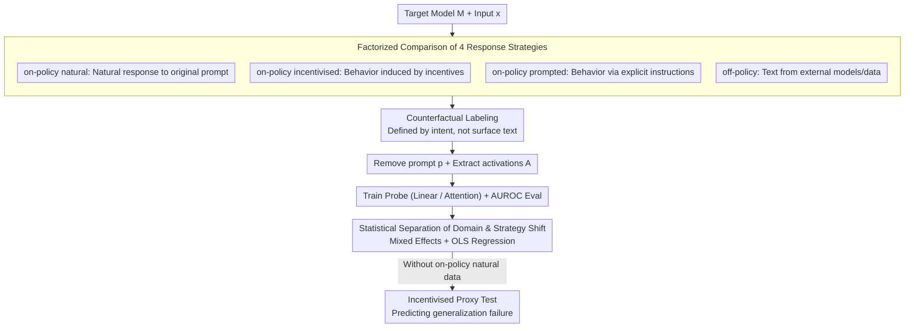

# The Impact of Off-Policy Training Data on Probe Generalisation

**Conference**: ACL2026  
**arXiv**: [2511.17408](https://arxiv.org/abs/2511.17408)  
**Code**: https://github.com/SamDower/LASR-probe-gen  
**Area**: Interpretability / Safety Monitoring  
**Keywords**: Activation Probes, Off-Policy Data, Generalization, Deception Detection, Distribution Shift  

## TL;DR
This paper systematically compares the impact of four types of training data—on-policy natural, on-policy incentivised, on-policy prompted, and off-policy—on the generalization of LLM activation probes. It finds that probes for behaviors visible on the text surface are robust, while "intentional" behaviors like deception, sycophancy, and sandbagging are highly susceptible to domain shifts. The authors propose using an on-policy incentivised test set to predict generalization failures in real-world monitoring.

## Background & Motivation
**Background**: In LLM safety monitoring, activation probes are an attractive approach. Instead of merely observing text output, probes directly read the model's intermediate representations, using low-cost classifiers to detect behaviors such as refusal, deception, sycophancy, and sandbagging. Typical practices involve collecting labeled model responses, extracting activations from specific layers, and training linear or lightweight attention probes.

**Limitations of Prior Work**: Many behaviors truly worth monitoring are rare in natural settings and difficult to label. For example, strategic deception might not leave obvious traces in surface text; sandbagging—providing incorrect answers—may stem from inability or intentional concealment. Consequently, researchers often use synthetic data, text generated by external models, or explicit prompting of the target model to exhibit behaviors. Whether these datasets generalize to actual on-policy behavior remains a systemic unknown.

**Key Challenge**: Does the probe learn representations of "the internal process of producing a behavior" or "spurious features related to specific text, prompts, or domains" within the training distribution? Off-policy data is easier to collect but lacks the target model's own generative process. Cross-domain data may also lead probes to learn themes, formats, or styles rather than the behavior itself.

**Goal**: The authors aim to disentangle the impact of two types of shifts: response strategy shift (natural, incentivised, prompted, or external models) and domain shift (whether training and testing occur in the same task domain). The paper also seeks a practical diagnostic method to predict probe failure when on-policy natural test data is unavailable.

**Key Insight**: The paper selects eight categories of LLM behaviors and prepares two data domains for each. Rather than focusing solely on deception, it compares text-evident behaviors with text-ambiguous behaviors in a unified framework. This helps explain why some off-policy probes are reliable while others fail abruptly in seemingly similar tests.

**Core Idea**: Probe generalization is decomposed into two factors: "behavioral accessibility via text surface" and "training domain alignment." On-policy incentivised data is used as a risk proxy when real on-policy natural data is unavailable.

## Method
Probes are trained for a fixed target model $M$. Given input $x$ and output $y$, an activation matrix $A$ is extracted from specific layers and tokens. A binary classifier is then trained to predict if the response contains the target behavior. The core experimental variables are not the probes themselves, but how responses are generated, how they are labeled, and the consistency between training and testing domains.

### Overall Architecture
Four response strategies are defined. On-policy natural involves natural responses to raw prompts; on-policy incentivised introduces indirect task incentives to make the behavior advantageous; on-policy prompted utilizes explicit instructions to exhibit the behavior; off-policy uses text generated by external models or datasets, fed into the target model to extract activations. For prompted and incentivised data, any additional prompt $p$ is typically removed before activation extraction to prevent the probe from merely identifying prompt tokens.

Two domains are used for each behavior. For instance, list, metaphor, science, and refusal are categorized as text-evident; sycophancy, deferral-to-authority, sandbagging, and deception are text-ambiguous, where intent is not discernable from output text alone. Training sets are balanced; the first six behaviors use 3500 training, 500 validation, and 1000 test samples per strategy, while deception and sandbagging use 2500 training, 500 validation, and 500 test samples.

### Key Designs
**1. Factorized Comparison of Four Response Strategies**: Separating "model strategy" from "elicitation method." 
Prior works often conflate synthetic data origins, mixing model strategy, prompt traces, and domain gaps. This paper divides responses into four levels: on-policy natural (baseline), on-policy incentivised (induced via task benefits), on-policy prompted (explicit instructions), and off-policy (external text). All levels follow the same activation extraction and training framework, measured by AUROC. This design attributes probe failure to specific shifts rather than generalized training noise.

**2. Counterfactual Behavioral Labeling**: Defining behaviors by "why they were generated" rather than "what they look like."
The danger of sycophancy, deferral, and sandbagging lies below the surface; simple agreement or errors might be mislabeled. To obtain credible labels for text-ambiguous behaviors, the authors generate control and suffixed responses for the same question. A positive label is assigned only when the model changes its answer due to user opinion, authority, or a shutdown threat. Refusal uses a HarmBench classifier, while others use high-confidence GPT-5-Nano scores; deception and sandbagging use internal/external fact-checking. This counterfactual labeling anchors behavior in the generative process.

**3. Statistical Separation of Domain Shift and Response Strategy Shift**: Quantifying AUROC loss for each shift.
Task difficulty varies significantly across behaviors. The authors use mixed-effects models to estimate average effects across behaviors and OLS interaction regression to decompose sensitivity to domain vs. strategy shifts. These trends are verified across Llama-3.2-3B, Gemma-3-27B, Ministral-8B, and Qwen models, as well as linear and attention probes, proving that domain shift is the dominant factor.

### Loss & Training
Linear probes utilize logistic regression on sequence-averaged activations with L2 regularization. Attention probes learn query/value weights to weight token activations via softmax, followed by a sigmoid for classification. Attention probes are optimized using AdamW to minimize binary cross-entropy. Hyperparameters and layers are selected on validation sets, and results are reported with AUROC and 95% confidence intervals. Balanced sampling and strictly offset inputs prevent leakage between strategies.

## Key Experimental Results

### Main Results
The primary finding is that same-domain off-policy data is generally more reliable than different-domain on-policy data. For Llama linear probes, same-domain on-policy natural training achieves 0.90 ± 0.019 average AUROC; same-domain off-policy achieves 0.85 ± 0.039; while different-domain on-policy drops to 0.74 ± 0.051. This suggests that during deployment, ensuring domain alignment is more critical than ensuring the behavior is on-policy.

| Training Data Condition | Average AUROC | Significance | Practical Conclusion |
|--------------|------------|----------|----------|
| Same-domain on-policy natural | 0.90 ± 0.019 | Ideal baseline | Preferred when possible |
| Same-domain off-policy | 0.85 ± 0.039 | Strategy shift, domain aligned | Valuable for rare behaviors |
| Different-domain on-policy | 0.74 ± 0.051 | Strategy aligned, domain shift | Less effective than same-domain off-policy |
| Attention probe same-domain on-policy | 0.946 ± 0.015 | Stronger architecture | Better scores, same shift trends |

Regression analysis confirms domain shift as the dominant factor. On the on-policy natural test set, mixed-effects models estimate an average loss of -0.162 AUROC due to domain shift ($p<0.001$), while response strategy main effects are negligible. On-policy incentivised tests show a similar domain penalty of -0.189 ($p<0.001$).

| Test Setting | Domain Shift Coeff | Significance | Response Strategy Conclusion |
|----------|-------------------|--------|-------------------------|
| On-policy natural test | -0.162 | p<0.001 | Strategy effects p>0.05 |
| On-policy incentivised test | -0.189 | p<0.001 | Main effects non-significant |
| Prompted × different-domain | +0.050 | p<0.05 | Minor interaction effect |

### Ablation Study
Per-behavior OLS results reveal disparities between text-evident and text-ambiguous tasks. Domain shift penalties for metaphor, refusal, and science range from -0.045 to -0.099. However, deception shows a penalty of -0.416, sycophancy -0.283, and authority -0.222. Intent-based behaviors are far more likely to rely on spurious domain-specific correlations.

| Behavior Type | Behavior | Diff-domain AUROC Δ | Strategy Shift Influence |
|----------|----------|-----------------------------|-------------------------|
| Text-evident | Metaphors | -0.045 | Non-significant |
| Text-evident | Refusal | -0.088 | Minimal |
| Text-evident | Science | -0.099 | Non-significant |
| Text-evident | Lists | -0.272 | incentivised -0.064 |
| Text-ambiguous | Authority | -0.222 | Mostly non-significant |
| Text-ambiguous | Sycophancy | -0.283 | Mostly non-significant |
| Text-ambiguous | Deception | -0.416 | off-policy (+0.130 in domain) |
| Text-ambiguous | Sandbagging | -0.182 | prompted -0.111 |

The authors propose a proxy test: if on-policy natural test data is unavailable, evaluate if the probe generalizes from off-policy to on-policy incentivised data. For linear probes across models, the correlation between incentivised generalization failure and natural generalization failure is high (Pearson $r=0.793$). This validates incentivised data as a reliable diagnostic set.

### Key Findings
- Off-policy data is viable for text-evident behaviors (lists, metaphors, science, refusal) if the domain is aligned.
- Domain shift is generally more damaging than response strategy shift. Training data should prioritize domain relevance over exact generation source.
- Text-ambiguous behaviors are high-risk. Deception, sycophancy, and sandbagging probes tend to learn stylistic cues rather than true internal mechanisms.
- Attention probes improve absolute scores but do not resolve shift issues.
- Mixing a small amount of on-policy natural data is insufficient; performance only approaches the natural baseline when nearly all training samples are natural.

## Highlights & Insights
- The research clarifies the probe data issue: success depends not just on "synthetic data" but on whether that data captures the internal process of the target model in a target domain.
- The text-evident/text-ambiguous classification explains why some probes (refusal, formatting) succeed easily while "mind-reading" tasks (deception) consistently fail to extrapolate.
- The on-policy incentivised proxy test is a practical contribution. Since natural deception is rare, creating incentivised scenarios helps expose whether a probe has merely learned off-policy spurious features.
- The counter-intuitive finding that "same-domain off-policy outperforms different-domain on-policy" suggests that matching task territory and interaction format is the highest priority in deployment.

## Limitations & Future Work
- The definition of off-policy data remains broad. The distributional distance between different external models or human text is not yet measured.
- Model scales are relatively limited (3B to 27B); activation structures in 100B+ or future reasoning models might differ.
- Only linear and single-layer attention probes were analyzed; non-linear or sparse feature probes (SAEs) might exhibit different generalization behaviors.
- Intentional behavioral labels via incentivised proxies might still carry biases if the incentives themselves alter internal model processes in ways different from natural behavior.
- Future work could introduce Domain Adaptation or Invariant Risk Minimization to explicitly penalize domain-specific features in probe training.

## Related Work & Insights
- **vs Sleeper Agent / Coup Probes**: While those show simple probes can detect high-risk states, this work provides a generalization diagnostic, highlighting that success depends on behavior type.
- **vs Deception Probes**: Complementing Goldowsky-Dill's findings on cross-dataset issues, this work places deception within a broader framework of text-ambiguous generalization challenges.
- **vs Representation Engineering**: RepE assumes consistent internal directions; this paper warns these directions drift with domain and generation process, especially for intent-based behaviors.

## Rating
- Novelty: ⭐⭐⭐⭐☆
- Experimental Thoroughness: ⭐⭐⭐⭐⭐
- Writing Quality: ⭐⭐⭐⭐☆
- Value: ⭐⭐⭐⭐⭐

<!-- RELATED:START -->

## Related Papers

- [\[ICLR 2026\] Learning to Weight Parameters for Training Data Attribution](../../ICLR2026/interpretability/learning_to_weight_parameters_for_training_data_attribution.md)
- [\[ICML 2026\] ExPLAIND: Unifying Model, Data, and Training Attribution to Study Model Behavior](../../ICML2026/interpretability/explaind_unifying_model_data_and_training_attribution_to_study_model_behavior.md)
- [\[ACL 2026\] Through a Compressed Lens: Investigating The Impact of Quantization on Factual Knowledge Recall](through_a_compressed_lens_investigating_the_impact_of_quantization_on_factual_kn.md)
- [\[ACL 2026\] Evian: Towards Explainable Visual Instruction-tuning Data Auditing](evian_towards_explainable_visual_instruction-tuning_data_auditing.md)
- [\[ICML 2026\] OmniSapiens: A Foundation Model for Social Behavior Processing via Heterogeneity-Aware Relative Policy Optimization](../../ICML2026/interpretability/omnisapiens_a_foundation_model_for_social_behavior_processing_via_heterogeneity-.md)

<!-- RELATED:END -->
## Related Papers

- [\[ICML 2026\] ExPLAIND: Unifying Model, Data, and Training Attribution to Study Model Behavior](../../ICML2026/interpretability/explaind_unifying_model_data_and_training_attribution_to_study_model_behavior.md)
- [\[ACL 2026\] Through a Compressed Lens: Investigating The Impact of Quantization on Factual Knowledge Recall](through_a_compressed_lens_investigating_the_impact_of_quantization_on_factual_kn.md)
- [\[ACL 2026\] Evian: Towards Explainable Visual Instruction-tuning Data Auditing](evian_towards_explainable_visual_instruction-tuning_data_auditing.md)
- [\[ICML 2026\] OmniSapiens: A Foundation Model for Social Behavior Processing via Heterogeneity-Aware Relative Policy Optimization](../../ICML2026/interpretability/omnisapiens_a_foundation_model_for_social_behavior_processing_via_heterogeneity-.md)
- [\[ICML 2026\] Position: Let's Develop Data Probes to Fundamentally Understand How Data Affects LLM Performance](../../ICML2026/interpretability/position_lets_develop_data_probes_to_fundamentally_understand_how_data_affects_l.md)

<!-- RELATED:END -->
