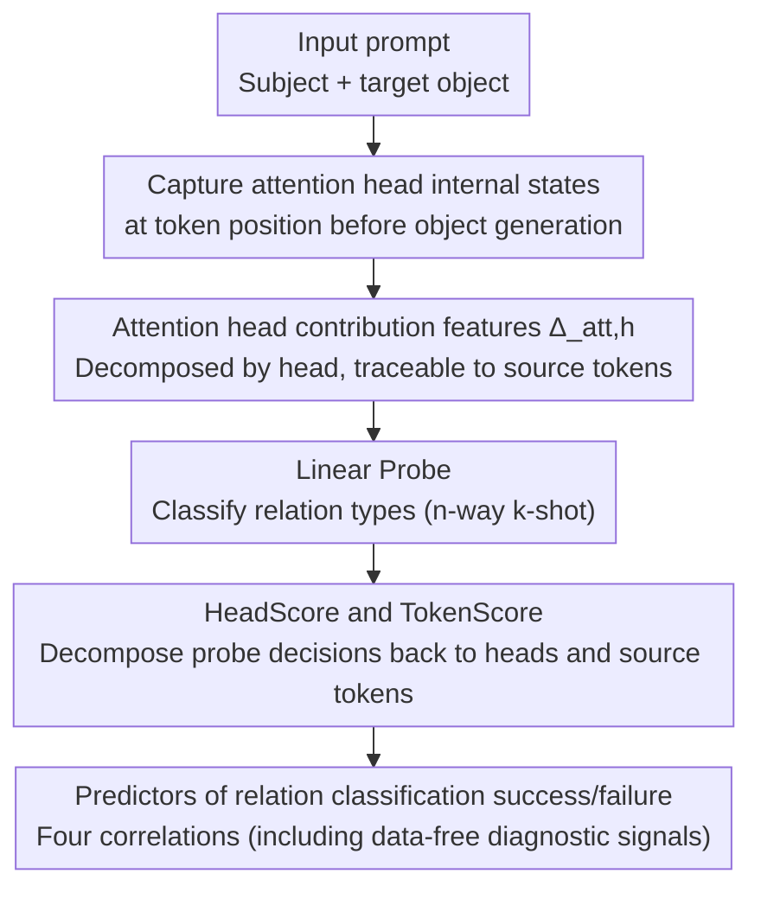

# Tracing Relational Knowledge Recall in Large Language Models

**Conference**: ACL 2026 Findings  
**arXiv**: [2604.19934](https://arxiv.org/abs/2604.19934)  
**Code**: [nicpopovic.com/publications/tracing](https://nicpopovic.com/publications/tracing)  
**Area**: Interpretability / Knowledge Representation  
**Keywords**: Relational Knowledge, Attention Head Attribution, Linear Probing, Knowledge Recall Mechanism, Feature Attribution

## TL;DR
This paper systematically investigates the internal mechanisms of LLMs in recalling relational knowledge during text generation. It finds that the head-wise contribution of attention heads to the residual stream ($\Delta_{att,h}$) is the strongest feature for linear relation classification (reaching 91% accuracy). It proposes two probe attribution methods, HeadScore and TokenScore, to decompose predictions to the level of attention heads and source tokens, revealing clear correlations between probe accuracy and relational specificity, entity connectivity, and the concentration of probe signals.

## Background & Motivation

**Background**: How LLMs store and recall relational knowledge is a core question in interpretability research. Existing studies have revealed a typical picture of knowledge recall: (1) Subject entity information accumulates at the last token of the subject span in middle-to-late layers; (2) Predicate/relation information accumulates via attention heads at the token position preceding object generation; (3) Object entities are retrieved from MLP sublayers through attention. This process can sometimes be approximated by linear transformations and traced back to relation-specific neurons.

**Limitations of Prior Work**: Regarding entity representations, research has shown that probes can reliably perform named entity recognition and disambiguation. However, for relation-type features, it remains unclear which internal representations support faithful linear relation classification, or why certain relation types are more easily captured linearly than others. Existing analyses fail to trace relation predictions simultaneously back to specific attention heads and source tokens.

**Key Challenge**: While it is known that attention heads and MLPs play roles in knowledge recall, there is a lack of a probing method that can simultaneously perform attribution at the attention head and token levels to systematically understand the factors behind the success and failure of relation classification.

**Goal**: (1) Identify the internal LLM representations best suited for linear relation classification; (2) Determine what factors predict the success or failure of probes in relation classification.

**Key Insight**: Focus on the head-wise contribution of attention heads to the residual stream, as these features can be naturally decomposed to the source token level, making attribution analysis feasible.

**Core Idea**: Use the head-wise contribution of attention heads $\Delta_{att,h}$ as the linear probe feature for relation classification, and decompose probe decisions via two methods: HeadScore (head-level attribution) and TokenScore (source token-level attribution).

## Method

### Overall Architecture
This paper frames "relational knowledge recall" as a controlled cloze-style generation scenario: given a prompt containing a subject and a target object to be predicted, internal model states are captured at the token position before object generation. A linear probe is then trained to determine the relation type expressed in the sentence. The key lies in using the head-wise contribution of attention heads $\Delta_{att,h}$ as the probe feature—it serves as the strongest relational signal while being naturally decomposable into individual attention heads and source tokens, thereby supporting the HeadScore and TokenScore attribution analyses. The entire pipeline is systematically evaluated on LLaMA-3.2 1B/3B, LLaMA-3.1 8B, and Qwen3 4B instruction-tuned models using the FewRel validation set.

### Key Designs

**1. Attention Head Contribution Feature $\Delta_{att,h}$: The Strongest Traceable Relational Signal**

While full attention or MLP states are information-rich, they cannot clearly attribute a particular classification to a specific head or token, making them inherently non-attributable. This paper instead uses the head-wise contribution of attention heads to the residual stream: at target position $t$ (before object generation), the contribution of head $h$ is $\Delta_{att,h}(t) = W_{O,h}(\sum_j \text{Attn}_h(t,j) V_h(j))$, representing the result of attention-weighted aggregation passed through the output projection matrix. This can be further decomposed into contributions from individual source tokens $j$, where $\Delta_{att,h}(t,j) = W_{O,h}(\text{Attn}_h(t,j) V_h(j))$. Counter-intuitively, these decomposed features are not only traceable but also yield higher classification accuracy than the full states (>90% vs. ~83–87% for full attention)—the decomposition eliminates interference between different heads, improving linear separability and paving the way for HeadScore and TokenScore attribution.

**2. HeadScore and TokenScore: Decomposing Probe Decisions into Heads and Tokens**

To explain why a probe makes a certain prediction, its linear weights must be projected back onto specific heads and source tokens. Given a probe weight matrix $W$ and a predicted class $\hat{c}$, a contrastive direction is constructed: $\Delta W = W_{\hat{c}} - \sum_{c \neq \hat{c}} \pi_c W_c$, where the weights of competing classes are subtracted using softmax weights $\pi_c$ to highlight the discriminative direction of $\hat{c}$ relative to other classes. HeadScore aggregates the contribution of each feature dimension $\Delta W_m x_m$ by its respective head, $\text{HeadScore}_{\ell,h} = \sum_{m:\ell_m=\ell, h_m=h} \Delta W_m x_m$, revealing which heads drive the classification. TokenScore utilizes the token decomposition of head contributions to refine attribution to the source token level, $\text{TokenScore}_\ell(j) = \sum_{m:\ell_m=\ell} \Delta W_m \cdot [\Delta_{att,h_m}(t,j)]_{d_m}$, allowing one to see which words in the input provide the decision signal, thus enabling error analysis and lexical shortcut detection.

**3. Predictors of Relation Classification Performance: Four Correlations**

To explain "why some relation types are easy to probe while others are extremely difficult," this paper systematically analyzes the correlation between probe accuracy and four factors in a 16-way-5-shot setting. The first three characterize the difficulty of the input data: Wikidata output range (the number of different objects associated with a relation) is negatively correlated with accuracy; average entity connectivity between subject-object pairs (the number of shared Wikidata properties) is also negatively correlated, as denser connectivity leads to more easily confused relations; and TF-IDF lexical similarity between examples is positively correlated, as surface-level similarity aids classification. The fourth factor comes from the probe itself—the number of heads required to reach 95% cumulative HeadScore contribution is negatively correlated with accuracy: the more the signal is concentrated in a few heads, the more accurate the classification. Since this metric does not rely on annotated data, it can serve as a diagnostic signal to predict probe reliability for new relation types.

### Loss & Training
The linear probes are trained using Cross-Entropy loss and the Adam optimizer for 200 epochs. RelSpec expert feature selection is applied, selecting the top 3000 features for each relation type. Evaluation follows an n-way k-shot setup on the FewRel validation set, with results averaged over 5 random seeds $\times$ 500 episodes.

## Key Experimental Results

### Main Results (5-way-5-shot Relation Classification Accuracy, %)

| Feature Type | LLaMA-3.2 1B | LLaMA-3.2 3B | LLaMA-3.1 8B | Qwen3 4B |
| :--- | :--- | :--- | :--- | :--- |
| Attention (Full) | 83.65 | 86.61 | 86.79 | 75.06 |
| $\Delta_{att,h}$ (Head-wise) | **90.26** | **91.06** | **91.09** | **89.66** |
| MLP (Full) | 85.79 | 86.40 | 85.90 | 80.37 |
| $\Delta_{MLP,h}$ (Head-wise) | 89.96 | 90.90 | 89.99 | 88.43 |
| $\Delta_{att,e_1}$ (Entity) | 59.64 | 60.16 | 59.85 | 59.58 |

### Ablation Study (Lexical Shortcut Analysis)

| Model | Spearman ρ | Mass | StrongAlign× (%) |
| :--- | :--- | :--- | :--- |
| LLaMA-3.2 1B | 0.115 | 0.491 | 7.7 |
| LLaMA-3.1 8B | 0.095 | 0.475 | 5.3 |
| Qwen3 4B | 0.099 | 0.490 | 5.9 |

### Key Findings
- $\Delta_{att,h}$ is the strongest relation classification feature across all models, consistently outperforming full attention/MLP states and other variants, with accuracy exceeding 90%.
- Observing only the contribution of source entity tokens ($\Delta_{att,e_1}$) is insufficient for relation classification (~59-60%), suggesting that relation signals are not encoded solely on entity tokens.
- Probe accuracy varies significantly across relation types (e.g., F1 of 39.76% for "part of" vs. 99.24% for "constellation"), negatively correlating with output range and entity connectivity.
- Relation types where HeadScore signals are concentrated in fewer attention heads yield higher probe accuracy—this may be related to feature superposition.
- Only 5.3%-7.7% of errors align with lexical shortcuts, indicating that linear relation probe decisions are not primarily driven by lexical cues.

## Highlights & Insights
- **Head-wise contributions outperform full states**: Counter-intuitively, decomposed head-wise features are more suitable for linear classification than the more information-rich full states. This likely occurs because decomposition removes interference between different heads, facilitating linear separation. This finding provides guidance for other LLM probing research.
- **HeadScore concentration as a data-free diagnostic**: The concentration of probe signals (number of heads required for 95% contribution) is an intrinsic property of the probe that does not depend on annotated data and can predict probe performance on new relation types—providing a practical tool for reliability assessment.
- **TokenScore reveals probe behavior**: By refining attribution to the token level, one can check if a probe relies on semantically relevant tokens (e.g., "crosses") or co-occurring tokens (e.g., "bridge"), offering a granular tool for diagnosing probe behavior.

## Limitations & Future Work
- Evaluation is limited to the FewRel validation set with relatively few relation types (16 classes).
- All findings are correlational rather than causal—the specific mechanisms by which factors like output range and connectivity influence probes require further causal experimentation.
- The scale of evaluated models ranges from 1B to 8B; larger models have not been tested.
- Probing methods explain the decisions of the probe rather than the LLM's internal computation; the relationship between the two needs further clarification.
- Non-linear probes have not been explored to see if they capture more relational information.

## Related Work & Insights
- **vs. Meng et al. (2022) / ROME**: This work focuses on feature selection and attribution in relation classification, whereas ROME focuses on factual localization for knowledge editing.
- **vs. Hernandez et al. (2024)**: While they showed that some relations can be linearly approximated, they did not explain why certain relations are easier. Ours provides explanations via output range and connectivity.
- **vs. Liu et al. (2025)**: While they isolate relation information at the neuron level (primarily in MLP layers), ours provides a traceable probing method at the attention head level.
- **vs. Chughtai et al. (2024)**: While they use direct logit attribution to analyze model behavior, our TokenScore analyzes the decisions of task-specific probes.

## Rating
- Novelty: ⭐⭐⭐⭐ The HeadScore/TokenScore attribution methods and performance predictor analysis are valuable contributions.
- Experimental Thoroughness: ⭐⭐⭐⭐ 4 models, multiple feature variants, complete correlation analysis, and lexical shortcut detection.
- Writing Quality: ⭐⭐⭐⭐⭐ Formally rigorous, incremental experimental design, and very clear writing.
- Value: ⭐⭐⭐⭐ Provides a systematic methodology and practical tools for probing relational knowledge in LLMs.

<!-- RELATED:START -->

## Related Papers

- [\[ACL 2026\] Knowledge Vector of Logical Reasoning in Large Language Models](knowledge_vector_of_logical_reasoning_in_large_language_models.md)
- [\[ACL 2026\] Through a Compressed Lens: Investigating The Impact of Quantization on Factual Knowledge Recall](through_a_compressed_lens_investigating_the_impact_of_quantization_on_factual_kn.md)
- [\[ACL 2026\] MINED: Probing and Updating with Multimodal Time-Sensitive Knowledge for Large Multimodal Models](mined_probing_and_updating_with_multimodal_time-sensitive_knowledge_for_large_mu.md)
- [\[ACL 2025\] Cracking Factual Knowledge: A Comprehensive Analysis of Degenerate Knowledge Neurons in Large Language Models](../../ACL2025/interpretability/degenerate_knowledge_neurons.md)
- [\[ACL 2026\] Compositional Steering of Large Language Models with Steering Tokens](compositional_steering_of_large_language_models_with_steering_tokens.md)

<!-- RELATED:END -->
