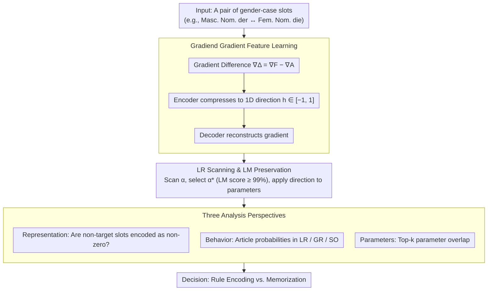

# Understanding or Memorizing? A Case Study of German Definite Articles in Language Models

**Conference**: ACL 2026  
**arXiv**: [2601.09313](https://arxiv.org/abs/2601.09313)  
**Code**: None  
**Area**: Interpretability  
**Keywords**: Syntactic encoding, memory vs. generalization, German articles, gradient interpretability, Gradiend

## TL;DR

This study employs the Gradiend gradient interpretability method to investigate whether language models rely on abstract syntactic rules or surface-level memorization when predicting German definite articles (der/die/das/den/dem/des). The findings indicate that models rely at least partially on memorized associations rather than strict rule-based encoding.

## Background & Motivation

**Background**: Modern language models exhibit nearly perfect performance in syntactic consistency tasks. However, whether their internal mechanisms encode abstract syntactic rules (systematic relations of gender, number, and case) or merely memorize high-frequency token-context associations remains a central question in interpretability research.

**Limitations of Prior Work**: Existing probing studies only demonstrate that syntactic features are "recoverable from model representations," but fail to prove that these features "causally drive" model predictions. Consequently, high probing accuracy does not equate to the model truly understanding syntactic rules.

**Key Challenge**: The German definite article system provides an ideal testbed. A single article can correspond to multiple gender-case combinations (e.g., "der" can be masculine nominative, feminine dative, or feminine genitive). This syncretism allows researchers to distinguish: if a model is rule-based, interventions on a specific gender-case transition should only affect that syntactic dimension; if memory-based, interventions will spill over to irrelevant syntactic settings shared by the same surface article.

**Goal**: To verify whether German definite article prediction is rule-driven or memory-driven through gradient intervention experiments.

**Key Insight**: Utilize the Gradiend method—a gradient-based encoder-decoder interpretability framework—to learn parameter update directions for specific gender-case article transitions, and then test whether these directions generalize to irrelevant syntactic settings.

**Core Idea**: If an update direction learned for "masculine nominative der → feminine nominative die" also affects irrelevant settings like "feminine dative der → feminine dative die," it indicates that the model relies on surface memory rather than abstract rules at these positions.

## Method

### Overall Architecture

The study treats the German definite article system as a controlled "syntactic testbed": 12 slots (3 genders × 4 cases) mapped to only 6 surface articles (der/die/das/den/dem/des), leading to frequent syncretism. Given a pair of gender-case slots for an article transition (e.g., masc. nom. der → fem. nom. die), the method first learns a 1D parameter update direction from gradients using Gradiend. This direction is then applied back to the model via learning rate scanning (ensuring language modeling capability is preserved). Finally, the nature of the encoding—abstract rules vs. memorization—is determined through three complementary perspectives: encoder value distribution, post-intervention article probability changes, and parameter space overlap.

### Key Designs

**1. Gradiend Gradient Feature Learning: Compressing a transition into a 1D direction**

To isolate a specific gender-case transition, the method collects factual target gradients $\nabla^F$ and alternative target gradients $\nabla^A$ for a pair of slots $z_1, z_2$. The difference $\nabla^\Delta = \nabla^F - \nabla^A$ serves as the "signal." An encoder compresses $\nabla^\Delta$ into a scalar $h \in [-1, 1]$, and a decoder reconstructs the gradient from $h$. The 1D bottleneck forces the model to retain only the primary update direction, avoiding global perturbations. Crucially, non-target slots are constrained to $h \approx 0$. Any activation of non-target slots during intervention serves as direct evidence of memorization.

**2. Learning Rate Scanning and LM Preservation: Excluding "Model Degradation" signals**

Substantial parameter updates can change predictions by simply damaging language modeling capabilities. To prevent this, the method scans multiple learning rates $\alpha$ and retains only those that maintain >99% of the language modeling score on a neutral dataset. The optimal $\alpha^*$ is chosen to maximize the target article probability. SuperGLEBer scores are monitored to ensure the overall capability remains intact, guaranteeing that observed probability changes reflect true syntactic mechanisms.

**3. Three Analysis Perspectives: Cross-verification via representation, behavior, and parameters**

The representation layer (encoder) checks if gradients for non-target slots are encoded as non-zero. The behavioral layer (probability intervention) observes whether probability changes stay within the target slot (LR), extend systematically to the same gender/case (GR), or spill over to irrelevant slots sharing the surface article (SO)—the latter being a hallmark of memory. The parameter layer compares Top-$k$ overlaps to see if different transitions share the same parameter subsets.

### Loss & Training

Gradiend is trained with an MSE reconstruction loss $\|\text{dec}(\text{enc}(\nabla^A W_m)) - \nabla^\Delta W_m\|_2^2$. The alternative target gradient $\nabla^A$ is used as input because factual gradients are often near zero and lack sufficient information for the encoder to learn discriminative directions.

## Key Experimental Results

### Main Results

19 Gradiend variants were trained across 6 models (GermanBERT, GBERT, ModernGBERT, EuroBERT, GermanGPT-2, LLaMA).

| Model | Encoder Correlation | Spillover Phenomenon |
| :--- | :--- | :--- |
| GermanBERT | 90-98% | Significant: der→die intervention affects fem. dat./gen. |
| GBERT | 95-99% | Significant: Similar patterns |
| ModernGBERT | 81-95% | Moderate spillover |
| EuroBERT | 50-73% | Weak but still significant |
| GermanGPT-2 | 51-71% | Inconsistent patterns |
| LLaMA | 50-67% | Minimal spillover, reflecting trends in larger models |

### Ablation Study

| Analysis | Key Findings | Description |
| :--- | :--- | :--- |
| Probability Intervention | Frequent SO patterns | der→die intervention increases "die" probability for fem. dat. (which uses der). |
| Top-1000 Parameter Overlap | 40-60% overlap within groups | Different transitions share many parameters, exceeding random baselines. |
| Cross-article Group Overlap | 20-30% | Notable overlap even between different article transitions. |
| Control Group | Baseline level overlap | Gradiend trained on shuffled data shows only baseline overlap. |

### Key Findings

- **Widespread Spillover**: Parameter update directions learned for specific gender-case transitions significantly impact irrelevant slots sharing the same surface article, contradicting the pure rule-based encoding hypothesis.
- **High Parameter Overlap**: The most important parameters for different article transitions overlap significantly (40-60%), suggesting the model does not allocate independent parameter subsets for each syntactic relation.
- **Encoder Models are more "Memory-based"**: GermanBERT and GBERT show the strongest spillover, possibly because bidirectional attention allows easier exploitation of surface co-occurrences.
- **Larger Models may Memorize Less**: LLaMA (3.2B) was the only model not showing spillover in certain key slots, suggesting a shift toward more abstract encoding in larger scales.
- **Undamaged LM Capability**: SuperGLEBer scores remained stable (70.7 → 70.1-70.2), confirming effects were not caused by model degradation.

## Highlights & Insights

- **Sophisticated Experimental Design**: Leverages syncretism in German articles (where "der" can serve different grammatical roles) to create a natural control experiment. This setup is replicable in other morphologically rich languages.
- **Causal Evidence**: Moves beyond the "correlation" evidence of traditional probing by providing "causal" evidence via parameter intervention.
- **Triangulated Analysis**: Consistency across encoder analysis, probability intervention, and parameter overlap strengthens the validity of the conclusions.

## Limitations & Future Work

- Restricted to German definite articles; generalizability to other syntactic systems in morphologically rich languages remains to be verified.
- Decoder models (GPT-2, LLaMA) require custom MLM heads, which may introduce noise.
- The 1D bottleneck in Gradiend might oversimplify actual multi-dimensional syntactic encoding.
- Impact of article-noun co-occurrence frequencies in training data on the degree of memorization vs. generalization was not explored.

## Related Work & Insights

- **vs. Linear Probing**: While probing shows information exists in representations, Gradiend intervention proves that information causally drives predictions.
- **vs. Finlayson et al. (2021)**: They modify internal representations to study subject-verb agreement; this study modifies parameters to study article prediction, providing a complementary perspective at the parameter space level.

## Rating

- Novelty: ⭐⭐⭐⭐ The use of syncretism for experimental control is highly clever.
- Experimental Thoroughness: ⭐⭐⭐⭐⭐ Comprehensive analysis across 6 models and 19 variants with rigorous statistical testing.
- Writing Quality: ⭐⭐⭐⭐ Clear, though requires some linguistic background in German.
- Value: ⭐⭐⭐⭐ Provides significant causal evidence for the memory vs. rule debate in LM syntactic encoding.

<!-- RELATED:START -->

## Related Papers

- [\[ACL 2026\] Interpretable Semantic Gradients in SSD: A PCA Sweep Approach and a Case Study on AI Discourse](interpretable_semantic_gradients_in_ssd_a_pca_sweep_approach_and_a_case_study_on.md)
- [\[ICML 2025\] Do Sparse Autoencoders Generalize? A Case Study of Answerability](../../ICML2025/interpretability/do_sparse_autoencoders_generalize_a_case_study_of_answerability.md)
- [\[ACL 2026\] Rhetorical Questions in LLM Representations: A Linear Probing Study](rhetorical_questions_in_llm_representations_a_linear_probing_study.md)
- [\[ACL 2026\] Knowledge Vector of Logical Reasoning in Large Language Models](knowledge_vector_of_logical_reasoning_in_large_language_models.md)
- [\[ACL 2026\] Compositional Steering of Large Language Models with Steering Tokens](compositional_steering_of_large_language_models_with_steering_tokens.md)

<!-- RELATED:END -->
