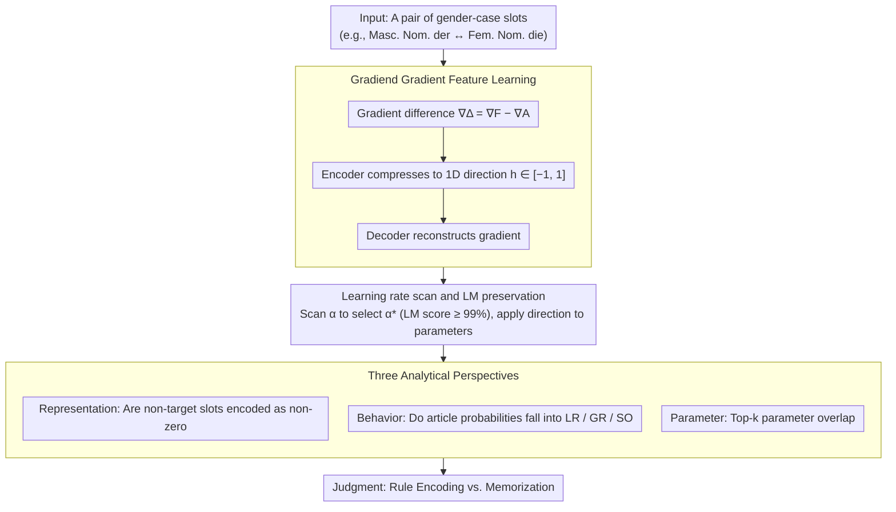

# Understanding or Memorizing? A Case Study of German Definite Articles in Language Models

**Conference**: ACL 2026  
**arXiv**: [2601.09313](https://arxiv.org/abs/2601.09313)  
**Code**: None  
**Area**: Interpretability  
**Keywords**: Syntax encoding, Memorization vs. Generalization, German articles, Gradient interpretability, Gradiend

## TL;DR

This paper utilizes the Gradiend gradient interpretability method to investigate whether language models predict German definite articles (der/die/das/den/dem/des) based on abstract syntactic rules or surface-level memorization. It finds that models rely, at least partially, on memorized associations rather than strict rule encoding.

## Background & Motivation

**Background**: Modern language models perform nearly perfectly on syntactic consistency tasks. However, whether their internal mechanisms encode abstract syntactic rules (such as systematic relationships of gender, number, and case) or merely memorize high-frequency token-context associations remains a central question in interpretability research.

**Limitations of Prior Work**: Existing probing studies only demonstrate that syntactic features are "recoverable from model representations," but fail to prove that these features "causally drive" model predictions. Thus, high probing accuracy does not equate to a true understanding of syntactic rules by the model.

**Key Challenge**: The German definite article system provides an ideal testbed—the same article can correspond to multiple gender-case combinations (e.g., "der" can be masculine nominative, feminine dative, or feminine genitive). This syncretism allows researchers to distinguish: if a model is rule-based, interventions on a specific gender-case transition should only affect that syntactic dimension; if based on memorization, interventions will spill over to unrelated syntactic settings sharing the same surface article.

**Goal**: To verify whether German definite article prediction is rule-driven or memory-driven through gradient intervention experiments.

**Key Insight**: Using the Gradiend method—a gradient-based encoder-decoder interpretability framework—to learn parameter update directions for specific gender-case article transitions, and then testing whether these directions generalize to unrelated syntactic settings.

**Core Idea**: If the update direction learned for "Masc. Nom. der $\to$ Fem. Nom. die" also affects unrelated settings like "Fem. Dat. der $\to$ Fem. Dat. die," it indicates that the model relies on surface-level memorization rather than abstract rules at these positions.

## Method

### Overall Architecture

The study treats the German definite article system as a controlled "syntactic testbed": 3 genders × 4 cases = 12 slots, yet represented by only 6 surface articles (der/die/das/den/dem/des). Consequently, a single article often corresponds to multiple gender-case combinations. Given an article transition between two slots (e.g., Masc. Nom. der $\to$ Fem. Nom. die), the method first uses Gradiend to learn a 1D parameter update direction from gradients. It then applies this direction back to the model via a learning rate scan (while preserving language modeling capability). Finally, it determines whether the model encodes the transition via abstract rules or surface memorization from three complementary perspectives: encoder value distributions, post-intervention article probability changes, and parameter space overlap.

### Key Designs

**1. Gradiend Gradient Feature Learning: Compressing a transition into a 1D direction**

To determine "rules vs. memory," specific gender-case transitions must be isolated from the model. For a pair of slots $z_1, z_2$ (e.g., Masc. Nom. der $\leftrightarrow$ Fem. Nom. die), the method collects the factual target gradient $\nabla^F$ and the alternative target gradient $\nabla^A$, taking the difference $\nabla^\Delta = \nabla^F - \nabla^A$ as the "signal" for this transition. An encoder compresses $\nabla^\Delta$ into a scalar $h \in [-1, 1]$ (where +1 and -1 correspond to the two directions of the transition), and a decoder reconstructs the gradient from $h$. The 1D bottleneck forces the model to retain only the primary update direction, preventing it from learning global perturbations.

Critically, this direction is constrained to be "exclusive" to the target transition: training samples for all non-target slots are set as identity pairs (factual = alternative), forcing their $h \approx 0$. Thus, if an intervention activates a non-target slot that should be zero, it provides direct evidence of memorization rather than rule-based encoding.

**2. Learning Rate Scan and LM Preservation: Eliminating "model degradation" as a false signal**

Once the direction is learned and applied, large parameter updates might change predictions simply by damaging the language modeling capability, making any observed "spillover" an artifact. During intervention, multiple learning rates $\alpha$ are scanned. Only candidates that maintain a language modeling score of at least 99% on neutral datasets are retained, from which $\alpha^*$ is chosen to maximize the target article probability. Reporting SuperGLEBer benchmark scores ensures the overall model capability remains intact, guaranteeing that observed probability changes reflect actual syntactic mechanisms.

**3. Three Analytical Perspectives: Cross-verification from representation, behavior, and parameters**

Since single perspectives can have confounding factors, the method performs three parallel analyses. The representation layer examines the encoder to check if gradients of non-target slots are encoded as non-zero (which should be zero under pure rules). The behavior layer performs probability interventions—after applying the $\alpha^*$ direction, it observes whether probability changes stay within the target slot (LR), extend systematically to the same gender/case (GR), or spill over to unrelated slots sharing the surface article (SO). SO is a definitive marker of memorization. The parameter layer compares Top-$k$ overlap; if the most important parameters for different transitions overlap significantly, it suggests the model does not allocate independent parameter subsets to distinct syntactic relationships.

### Loss & Training

Gradiend is trained using an MSE reconstruction loss $\|\text{dec}(\text{enc}(\nabla^A W_m)) - \nabla^\Delta W_m\|_2^2$. The alternative target gradient $\nabla^A$ is used as the encoder input because factual target gradients are often too close to zero to be informative, whereas $\nabla^A$ allows the encoder to learn discriminative directions.

## Key Experimental Results

### Main Results

The experiments trained 19 Gradiend variants across 6 models (GermanBERT, GBERT, ModernGBERT, EuroBERT, GermanGPT-2, LLaMA).

| Model | Encoder Correlation | Spillover Phenomenon |
|--------|------|------|
| GermanBERT | 90-98% | Significant: Intervention on der→die also affects Fem. Dat./Gen. |
| GBERT | 95-99% | Significant: Similar patterns |
| ModernGBERT | 81-95% | Moderate spillover |
| EuroBERT | 50-73% | Weak but still significant |
| GermanGPT-2 | 51-71% | Inconsistent patterns |
| LLaMA | 50-67% | Minimal spillover, potentially reflecting trends in larger models |

### Ablation Study

| Analysis | Key Findings | Description |
|------|---------|------|
| Probability Intervention | Spillover patterns (SO) frequent | der→die intervention increases die probability for Fem. Dat./Gen. (which also use der) |
| Top-1000 Parameter Overlap | 40-60% overlap within article groups | Different transitions share many parameters, exceeding random baselines |
| Cross-group Overlap | 20-30% | Notable overlap even across transitions of different articles |
| Control Group | Baseline-level overlap | Gradiend trained on shuffled data shows only baseline overlap |

### Key Findings

- **Widespread Spillover**: Parameter update directions learned for specific gender-case transitions significantly impact unrelated slots sharing the same surface article, contradicting the pure rule-encoding hypothesis.
- **High Parameter Overlap**: The most important parameters for different article transitions overlap significantly (40-60%), far exceeding random baselines, suggesting that models do not allocate independent parameter subsets for each syntactic relationship.
- **Encoder Models are More "Memetic"**: Encoder models like GermanBERT and GBERT show the strongest spillover, likely because bidirectional attention allows the model to exploit surface co-occurrence associations more easily.
- **Larger Models May Memorize Less**: LLaMA (3.2B) is the only model that did not exhibit spillover in certain key slots, suggesting that larger models may tend toward more abstract encoding.
- **Language Modeling Capability Unaffected**: SuperGLEBer scores remained largely stable before and after intervention (70.7 $\to$ 70.1-70.2), confirming that the effects are not caused by model degradation.

## Highlights & Insights

- **Elegant Experimental Design**: Leveraging the syncretism of German articles (where "der" can be Masc. Nom. or Fem. Dat./Gen.) creates a natural control experiment. This setup of "identical surface form, different deep syntactic function" is replicable in other languages.
- **Causal Evidence**: This study moves beyond the "correlational" evidence of traditional probing by providing "causal" evidence through parameter intervention—the patterns of change in model predictions directly reveal the internal encoding mechanisms.
- **Comprehensive Three-Perspective Analysis**: Consistent conclusions from encoder analysis, probability intervention, and parameter overlap significantly strengthen the findings.

## Limitations & Future Work

- The study is limited to the German definite article system; whether these conclusions generalize to other morphologically rich languages remains to be verified.
- Decoder models (GPT-2, LLaMA) require custom MLM prediction heads, which may introduce noise into the results.
- The 1D bottleneck in Gradiend may oversimplify what is actually a multidimensional syntactic encoding.
- The impact of article-noun co-occurrence frequency in training data on the degree of memorization versus generalization was not explored.

## Related Work & Insights

- **vs. Linear Probing**: Probing only proves information "exists" in representations; Gradiend intervention proves that information "causally drives" predictions, providing stronger evidence.
- **vs. Finlayson et al. (2021)**: While they modified internal representations to study subject-verb agreement, this work modifies model parameters to study article prediction. The methodologies are complementary but operate at different levels (representation space vs. parameter space).

## Rating

- Novelty: ⭐⭐⭐⭐ The experimental design utilizing German article syncretism is very clever.
- Experimental Thoroughness: ⭐⭐⭐⭐⭐ 19 variants across 6 models with three-perspective analysis and rigorous statistical testing.
- Writing Quality: ⭐⭐⭐⭐ Clear, though it assumes some familiarity with German grammar.
- Value: ⭐⭐⭐⭐ Provides important causal evidence for the memorization vs. rule debate in LM syntactic encoding.

## Related Papers

- [\[ACL 2026\] Interpretable Semantic Gradients in SSD: A PCA Sweep Approach and a Case Study on AI Discourse](interpretable_semantic_gradients_in_ssd_a_pca_sweep_approach_and_a_case_study_on.md)
- [\[ICML 2025\] Do Sparse Autoencoders Generalize? A Case Study of Answerability](../../ICML2025/interpretability/do_sparse_autoencoders_generalize_a_case_study_of_answerability.md)
- [\[CVPR 2026\] Understanding Counting Mechanisms in Large Language and Vision-Language Models](../../CVPR2026/interpretability/understanding_counting_mechanisms_in_large_language_and_vision-language_models.md)
- [\[ACL 2026\] Rhetorical Questions in LLM Representations: A Linear Probing Study](rhetorical_questions_in_llm_representations_a_linear_probing_study.md)
- [\[ACL 2026\] Knowledge Vector of Logical Reasoning in Large Language Models](knowledge_vector_of_logical_reasoning_in_large_language_models.md)

<!-- RELATED:END -->

<!-- RELATED:START -->

## Related Papers

- [\[ACL 2026\] Interpretable Semantic Gradients in SSD: A PCA Sweep Approach and a Case Study on AI Discourse](interpretable_semantic_gradients_in_ssd_a_pca_sweep_approach_and_a_case_study_on.md)
- [\[ACL 2026\] Rhetorical Questions in LLM Representations: A Linear Probing Study](rhetorical_questions_in_llm_representations_a_linear_probing_study.md)
- [\[ACL 2026\] Tracing Relational Knowledge Recall in Large Language Models](tracing_relational_knowledge_recall_in_large_language_models.md)
- [\[ACL 2026\] Knowledge Vector of Logical Reasoning in Large Language Models](knowledge_vector_of_logical_reasoning_in_large_language_models.md)
- [\[ACL 2026\] Compositional Steering of Large Language Models with Steering Tokens](compositional_steering_of_large_language_models_with_steering_tokens.md)

<!-- RELATED:END -->
